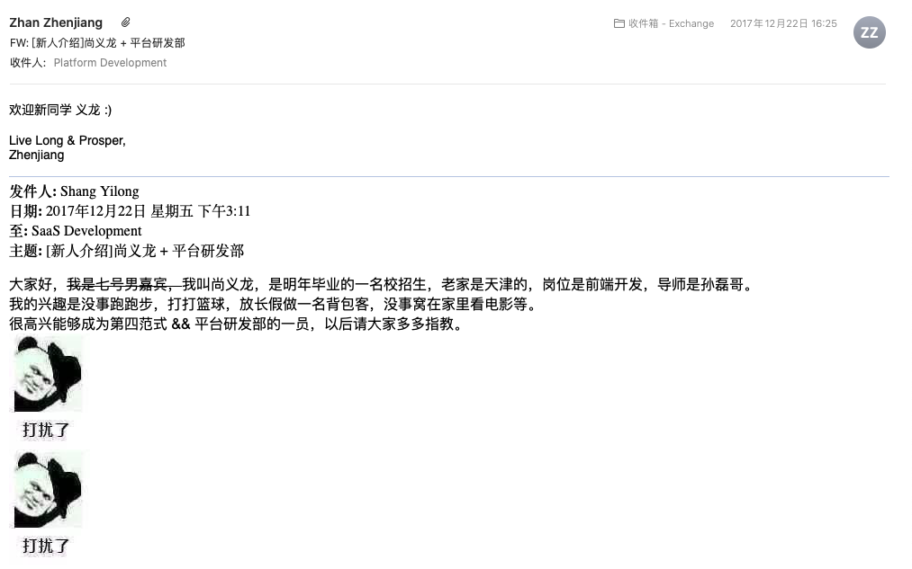

## 在公司两年多的感受

在这个公司两年多遇到最多的事情就是变化，出现频率最多的感受就是乱。

对于变化来说，就是频繁的架构调整。最大的乱就是公司管理的混乱，从上到下的混乱。

### 第一阶段：实习（2017/12/22 ～ 2018/03/23）

找到了实习来的自我介绍

实习的时候四百块钱一天，但是因为在百度和360实习欠下了一屁股债了。工作还是很开心的，每天工作就是吃吃喝喝，工作日六点下班去锻炼，周末跟着同事来加班，混加班费还债。我当时简单统计了一下，在我待的这两个多月，团建了五六回，能想起来的吃日料就吃了三回。我以前认为团建就是公费吃喝就完了，原来无论是团队团建还是中午一起吃饭都会增加团队的凝聚力。

回想了一下这一段时间学到的东西就是“用心做好简单的事情，等待机会的到来”。这个感受来自于我和mentor的对话：
- 我： L哥，天天搞这些感觉没用什么高深的技术呀
- L哥：你觉得什么是高深的技术
- C同事插话：对于刚毕业的一半都是喜欢钻研技术，但是不能落实
- X同事插话：我以前也是特别喜欢搞技术，现在觉得越写业务越爽
- L哥：对，你得先把小事情做好，就比如我让你改的这个bug或者小需求，能不能让别人一点问题都没有咯
- 我：👌

虽然我现在一直懂得这个道理，但是还行践行的不好。有的不喜欢的东西能糊弄就糊弄。就一心想着搞大事情，但是就不知道大事情是啥。为啥高中就学过的经济基础决定上层建筑这个道理就是不能践行呢

在2018年三月初的时候，当时的leader要自己去创业了，就跑路了。把剩下的工作交给一个对工作特别认真负责的同事的，在我校招入职的时候，这个组已经二十多人了。

如果非要给实习这两个月一个关键词那就是“混日子”，在“混”的过程中虽然技术上没有啥长进，但是在做事上有两点收获：
- 团队是一根绳很重要，团建是个好办法
- 眼望星空的时候，一定要脚踏实地，简单事情用心做

### 第二阶段：暴风雨前的宁静（2018/07/03～2018/07/19）

2018/07/03当天开心的入职，我也忘记当时是什么感受了。现在就有点记忆的是和L哥说，要提前学点什么东西么，他说不用，进来再学就行。果真是进来再学呀。到组织架构调整之前根本是什么事情都没有。我想做点什么事情主动去要，然后去各种问。具体的就是下面这几个场景：
- 我：L哥你给我介绍一下咱们的代码吧
- 我：L哥你给我介绍一下咱们的业务吧
- 还有个产品经理想给我整个需求，我当时对产品还不了解，当时听着一脸懵逼，我还挺上心，问了Y同事、L同事以及当时的leader他们完全不上心，然后我又去找那个产品经理，他给我叨叨一顿，我也没听懂，最后这个事情也是无疾而终了，后来这个产品经理还想和公司高层有矛盾了，就自己走了。

这次入职的时候还是在实习时候的那个组，混了两周多之后经历了第一次组织架构调整，但是认为也是比较大的架构调整，和员工没有沟通就调整了，也引起了员工很大的不满。当时我就毅然被带我的那个人，划分到了一个和他没关的组，当时这个组一共有十个人，一个产品经理，一个前端剩下的都是后端。当时他给的原因是，我的主动性比较强，他怕把别人去了搞不赢，但是我还是个校招生呀，他没考虑到我的成长呀。

### 第三阶段：自寻出路（2018/07/19 ～ 2019/02/28）

当时这个组一共有九个研发，好像大多数人每天基本没有啥事情。

现在回忆来看可能是因为架构调整或者是新的总监上任需要时间去磨合，这一段时间的定位就是服务员，就是有事了去做一下事情，如果没事了也没人管。当时组里人的作息差不多是：早晨十一点多到，呆一会吃个午饭，下午两点开始工作，六点去吃饭，回来搞一会儿下班。后来听说一个同时，上班带薪刷题去面试。

在这七个多月，就是薅公司羊毛，真的太闲了，而且我对公司的业务也不感兴趣，而且和大家都不是一个方向。记得有一次公司想听基层同时的声音，就搞了和领导一对一面谈的机会，我还约了一个时间，问为什么不把前端作为一个资源部门去调度，却按照项目方向去调度，这样很可能空转或者过载的。领导也是接受我的建议，说有计划把前端和QA一样作为一个资源部门，有需求去要人。后来也无疾而终了。

多次问以前带我的那个人，他也是没啥规划。我感觉对外向公司求助成长是没戏了，我开始向内从自己出发。我在想虽然没有项目可以做，但是我可以学习新东西，深入react源码，了解一些设计。我开始借鉴开源的设计重构我负责的那部分代码，因为我当初觉得那代码简直太烂了，我把自己的重构心得写了一篇文章[Typescript配合React实践](https://github.com/helios741/myblog/blob/1.1/src/2018/1015/Typescript%E9%85%8D%E5%90%88React%E5%AE%9E%E8%B7%B5.md)发表了出来，还出现在了第二天的知乎热榜还被同事发现了。这篇文章也给自己的github也增添许多star，在知乎收获了147个赞和32个评论以及有公众号作者问我能不能进行转载。也翻译了一篇比较好的文章[翻译： typescript 2.7中interface和type(Interface vs Type alias in TypeScript 2.7)](https://github.com/helios741/myblog/blob/1.1/src/2018/1215/%E7%BF%BB%E8%AF%91%EF%BC%9A%20typescript%202.7%E4%B8%ADinterface%E5%92%8Ctype(Interface%20vs%20Type%20alias%20in%20TypeScript%202.7).md)，当然还有其他一些文章。除了写文章之外还开始看开源社区的源码，但是觉得react代码太多了，我先从react-router开始看吧，原来react-router就是history的一层壳，我还通过看代码发现了他的一个比较重要的问题，因为他会以来浏览器的一个特性导致的bug，我也向社区提交了issue（[may be a bug: about revertPop/go method in createHashHistory](https://github.com/ReactTraining/history/issues/655)）后来作者说，这个功能从来没好工作过（[Remove history.block](https://github.com/ReactTraining/history/issues/690)），准备在重构把这个功能干掉，这个也迫使react自身没发生break change升级了一次大版本。在这期间发现代码有不合理的地方，在2019年一月给社区贡献了代码，这也是我第一次给开源社区贡献代码[Fix/all paths key redundant](https://github.com/ReactTraining/history/pull/693)，在同年的八月份被merge进去了。但是适用公司账号搞的，没有变为contributer，好桑心，但是后续也学乖了，提交之前先改用户。

除了写文章和参与开源社区，还看一些技术书籍，比如《JavaScript高级程序设计》，《你不知道的javascript（上）》，你不知道的javascript（中）》等，在准备看《CSS世界》的时候，就经历了下一次组织架构调整。这段时间的作息是：
- 九点多到公司（有的时候在住地地方），看书看到十一点
- 如果没有工作，就开始重构代码，或者继续学习。有一段时间也是如坐针毡呀，天天不干活怕被开除
- 二四的晚上去锻炼，一三五就看源码或者写文章
- 十点左右到住的地方，忘记是滑水还是学习了，应该是滑水居多
当时是比较心浮气躁也是眼高手低，甚至觉得自己在前端已经到了天花板了，想学习搞一下区块链了，但是遇到问题还是被教做人了。

年后的时候公司要有自己的前端组件库了，我意识到这可能是我的一个机会，所以我就把这件事情揽了下来，在这期间对typescript更深入了一下，也给基于的antdesign提了[许多issue](https://github.com/ant-design/ant-design/issues?q=is%3Aissue+author%3Ahelios741+is%3Aclosed)，当时给设计团队验收的时候，他们是真的细心，那不仅仅是八倍镜了，可能得有二十倍了，把我折磨的够呛了，但是主要还是自己不认真，有一些自己搞不定的东西，让L哥搞，他也懂搞定，也知道了自己的局限性。这个期间当我专心准备搞前端的时候，又一次组织架构调整开始了。

在这七个多月的时间中，可能实际工作到时间不到三个月，在这段时间中我学到了：
1. 自己要对自己的成长负责，社区是个好地方
2. 要让别人挑不出错，要足够的细心和耐心，遇到问题及时请教
其实从现在看来我的问题还很多，我过于着急了，没有静下心来去熟悉业务，没有想着用学到的技术去创造业务价值。

### 第四阶段：混沌（2019/02/28 ～ 2019/08/06）

2019年初的时候公司开始推行OKR，也在这个时候又被调整到了CH团队下面的devops方向，这一段时间基本没怎么编程了。

这个公司事情不多就是杂，现在的这个小leader H同事，给我的感受就是一两年的工作经验用了十年的人，但是人比较好，比较热情。但是这种工作中十分热情的人，会导致什么事情都找你，如果无脑接并没有整理总结思考，一成不变的话就容易变为另一个职业“客服”。而且没有管理经验，事情主要靠的是在其他组的X同事扛着，但是这段事情，基本事情没有进步，只是原地踏步，对于我来说熟悉了一些业务，并且学了相关的技术（[再见前端，你好kubernetes](https://github.com/helios741/myblog/tree/new/learn_go/2020_resign/1_levave_FE)），因为刚开始搞，还把别人测试机器上的hadoop数据给格了。

当时没有什么感觉，现在看来这段时间对于我来说是有点黑暗了。因为一下几点：
1. 没人带：所有的东西都要自己看，自己问。这是时候听到最多的一句话就是“这你都不知道，这不是你们组的么”
2. 技术不通：我基本不会任何linux以及后端相关的东西，都要现学
3. 业务不熟：什么都要先看，本来以为是和k8s。docker更加技术性相关的，但是确实打杂
4. 一眼看的见头：团队一点规划都没有，通俗的说就是没有饼，让人没有希望

在七月初的时候来了一个新同事，后来听说是招来干活的结果后续变为leader了。

这将近半年的时候，也是我学习东西最多的一段时间了，从工作中学到的东西比较少，就是天天听到H同事抱怨，抱怨没有人，当被别人问要人干啥时候，却给不出具体规划；天天说自己做的事情怎么怎么多，但是我们却看不到啥东西；

### 第五阶段：渐隐渐显的希望(2019/08/06 ~ 2020/05/22)

上面说的那个新来的同事变为了leader，虽然来了几个周，但是也算空降leader。本以为领导会让他作出一些事情再让他带一个团队，这样可以有点信服力，领导交给他daily build，这个也是领导比较在意的，后来他觉得没有意义就不搞了。刚开始对他的期待真的特别大，感觉终于来了个经验丰富的了，但是还是有点青铜了。

我感觉这个leader在大公司呆了这么多年，肯定会有一些比较成熟的经验。结果让我比失望，主要是下面几点：
- 每天六点多就下班了，可能一晚上就联系不上人了
- X同学的交接工作，分享到了七点左右他在群里说“感谢X同事分享，我有事先撤了”，给你特别不重视的感觉
- 技术比较差，对于一些东西总是不懂装懂，比如k8s相关的东西
- 做事比较糊，一个函数能传六个参数，结果他就判断了五个，还说没事；自己写了个文件都不调用，就让别人测
- 容易自以为是，通过各种言论让给你认为你只错，他是对的
- 画饼，我比较喜欢k8s的东西，给我花了个一张大饼却一个没安排
- 容易负载均衡，好多事情，自己连看都不看就代理我和一个其他同事
- 做事不认真，自己写的代码不测试
- 自己说的东西自己做不到，对文档要求高自己却写的也就那样，提的意见挺好自己做事就那样

还有很多值得学习，比如
- 比较关心下属感受
- 比上个小leader懂得规划

后续他做事还是有点起色，但是公司的所有人对我们组的都是差评了，很难挽回了，有一次还想把我们直接交给QA组，这次就兼并到其他组了。

换了两个大领导，这两个领导都对daily build比较在乎，两个大领导的出发点不同：
- 第一个大领导是关心研发效率，提升质量
- 第二个大领导是因为研发的质量太差了，经常有各方的人找他这个事情，所有不得不搞

无论出于什么原因，但是leader都没有在意，竟做那些领导看起来没用的。而且这一年多对团队的定位也没有明确，就这么几个人啥活都接，大领导不重视也一个问题。但话说回来，没有拿出让大领导信任东西来呀，另一个组的leader就感觉特别能说会道，实力当然也强悍咯。

学到的东西：
- 做的东西要让上面看见
- 对于事情分清，做好事情不要给别人甩锅的机会，比如进超市测体温这件事，如果你不偷懒每个人都测了，别人甩也甩不你身上，如果你有一个没测，出了问题可能就到你身上了

### 第六阶段：风雨同舟（2020/05/22 ～ 2020/08/22）

觉得leader就是给我画的大饼有点多，也吃饱了。然后和一个新来的高手同时交流了一下，发现他做的事情是我比较心仪的事情，和他交流了几个，也就是他忽悠了我几次我觉得s不错。后来就是因为我要离职了，就这么散了。

但是还是学到了让我继续前进的东西：
- 别人帮不到我们的时候，自己就能帮助自己。社区是个好地方
- 公司也能搞成社区化，让大家都来参与

