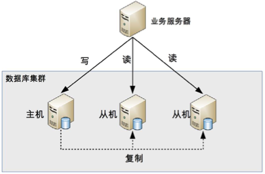
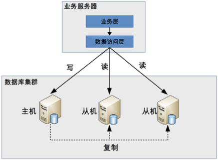
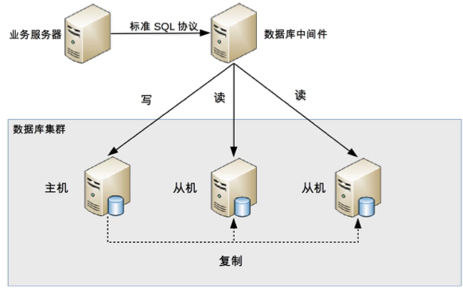

## 思考题： 数据库读写分离一般应用于什么场景？能支撑多大的业务规模？

一般用于：对数据库访问的压力大，分散连接，适用于读多写少的情况

因为数据库对连接有限制，最多也就几万次

## 总结

原理：将数据库的读写操作分散到不同的节点上

读写分离的基本实现：
- 数据库服务器搭建主从集群，一主一从、一主多从都可以
- 数据库主机负责读写操作，从机只负责读操作。
- 数据库主机通过复制将数据同步到从机，每台数据库服务器都存储了所有的业务数据
- 业务服务器将写操作发给数据库主机，将读操作发给数据库从机。

### 复制延时

原理：从机还没来得及复制了，就开始有读请求了

常见解决方法：
- 写操作后的读操作指定发给数据库主服务器
- 读从机失败后再读一次主机
- 关键业务读写操作全部指向主机，非关键业务采用读写分离

### 分配机制

原理：将读写操作区分开来，然后访问不同的数据库服务器

1. 代码封装

- 实现简单，而且可以根据业务做较多定制化的功能
- 每个编程语言都需要自己实现一次，无法通用，如果一个业务包含多个编程语言写的多个子系统，则重复开发的工作量比较大。
- 故障情况下，如果主从发生切换，则可能需要所有系统都修改配置并重启
2. 中间件封装
中间件封装指的是独立一套系统出来，实现读写操作分离和数据库服务器连接的管理。中间件对业务服务器提供 SQL 兼容的协议，业务服务器无须自己进行读写分离

- 能够支持多种编程语言，因为数据库中间件对业务服务器提供的是标准 SQL 接口
- 数据库中间件要支持完整的 SQL 语法和数据库服务器的协议（例如，MySQL 客户端和服务器的连接协议），实现比较复杂，细节特别多，很容易出现 bug，需要较长的时间才能稳定
- 数据库中间件自己不执行真正的读写操作，但所有的数据库操作请求都要经过中间件，中间件的性能要求也很高。
- 数据库主从切换对业务服务器无感知，数据库中间件可以探测数据库服务器的主从状态。例如，向某个测试表写入一条数据，成功的就是主机，失败的就是从机

