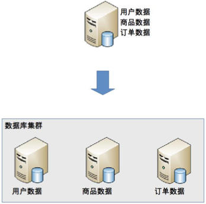
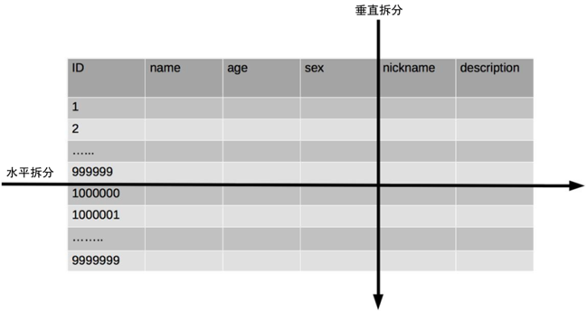

## 思考题： 你认为什么时候引入分库分表是合适的？是数据库性能不够的时候就开始分库分表么？

不是，排查出是什么原因，然后做对应的操作。
1. 做硬件优化，例如从机械硬盘改成使用固态硬盘，当然固态硬盘不适合服务器使用
2. 先做数据库服务器的调优操作，例如增加索引，oracle有很多的参数调整;
3. 如果是读的压力大，可以尝试着加缓存
4. 程序与数据库表优化，重构，例如根据业务逻辑对程序逻辑做优化，减少不必要的查询;
5. 在这些操作都不能大幅度优化性能的情况下，不能满足将来的发展，再考虑分库分表，也要有预估性

## 总结

读写分离是分散的读写压力，当数据量千万的时候，单数据库服务器的存储能力就会变为瓶颈，体现在下面几个方面：
- 数据量太大，读写的性能会下降，即使有索引，索引也会变得很大，性能同样会下降
- 数据文件会变得很大，数据库备份和恢复需要耗费很长时间
- 数据文件越大，极端情况下丢失数据的风险越高（例如，机房火灾导致数据库主备机都发生故障）。

### 业务分库

业务分库指的是按照业务模块将数据分散到不同的数据库服务器

带来的问题：
- join 操作问题
- 事务问题：同一数据库能保证两个操作（减库存和生成订单）要么同时成功要么同时失败，不同数据库就得自己保证了
- 成本问题： 增加机器了

### 分表

- 垂直分表：将表中某些不常用且占了大量空间的列拆分出去
- 水平分表

水平分表实现：
- 范围路由：选取有序的数据列（例如，整形、时间戳等）作为路由的条件，不同分段分散到不同的数据库表中。比如id从1到10000的在表1。。。
    + 复杂度：分段长度的选择，分段太小会增加维护复杂度，分段太大依然会导致单表性能问题
    + 优点：随着数据的增加平滑分扩充新的表
    + 缺点：可能造成分配不均匀，比如一个表一百万个数据剩下一个表十条数据
- Hash 路由： 选取某个列（或者某几个列组合也可以）的值进行 Hash 运算，然后根据 Hash 结果分散到不同的数据库表中。比如根据id对10取模
    + 复杂度：在初始表数量的选取上，表数量太多维护起来比较麻烦，表太少还会造成单表性能问题
    + 优点：表中数据分配均匀
    + 缺点：增加表数量比较麻烦，所有数据要重新分布
- 配置路由：配置路由就是路由表，用一张独立的表来记录路由信息。比如一个表包含user_id 和 table_id 两列，根据 user_id 就可以查询对应的 table_id。
    + 优点：设计简单，使用灵活。尤其是在扩充表的时候，只需要迁移指定的数据，然后修改路由表就可以了。
    + 缺点：必须多一次查询会影响性能，还可能造成表太大的性能问题

水平分表的缺点：
+ join 操作
+ count() 操作
+ order by 操作
