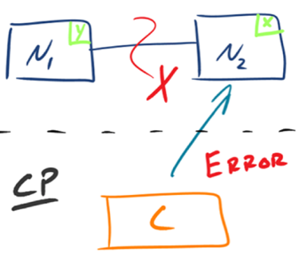
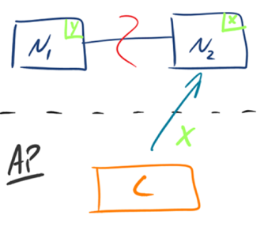

## 思考题：基于 Paxos 算法构建的分布式系统，属于 CAP 架构中的哪一种？谈谈你的分析和理解。

现在还不知道paxos，以后了解一下

## 总结

- C（Consistency）：一致性
- A（Availability）：可用性
- P（Partition Tolerance）：分区容错

因为在分布式的环境中不能舍弃分区容错。
如果保CA的话，当发生P的时候，我们为了保证C就需要禁止写入，当有写请求的时候会返回错误，这个时候又和A冲突了。

保证CP：

保证AP：
