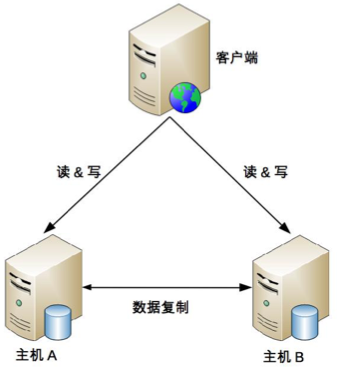

## 思考题：如果你来设计一个政府信息公开网站的信息存储系统，你会采取哪种架构？谈谈你的分析和理由。

这种系统一般是读多写少，采用主从架构。

如果一个机器挂掉了，还不影响另一个机器读的操作

## 总结

### 主备

优点：
- 客户端无需感知备机的存在
- 主备之间只有数据复制，没有状态检测比较简单

缺点：
- 备机资源浪费
- 故障后需要人工干预

内部的管理后台使用主备架构比较多

### 主从

优点：
- 主机挂掉时，从机能提供服务
- 从机也提供服务，增加了机器利用率

缺点：
- 客户端需要感知主从关系
- 复制延迟，可能造成主从机器数据不一致
- 故障时候需要人工干预

一般情况下，写少读多的业务使用主从复制的存储架构比较多。

也可以实现切换，设计时候有下面几个关键点：
- 主备间状态判断
    + 主备间状态判断： 是相互间互相连接，还是第三方仲裁？
    + 状态检测的内容：例如机器是否掉电、进程是否存在、响应是否缓慢等。
- 切换决策
    + 切换时机
    + 切换策略
    + 自动程度
- 数据冲突解决

### 双主

具有特点：
- 都是主机，不存在切换的概念
- 客户端无需区分角色，想发给谁，发给谁

最主要的问题有些数据是不能双向复制的：
- 用户注册后生成的用户 ID，如果按照数字增长，那就不能双向复制，否则就会出现 X 用户在主机 A 注册，分配的用户 ID 是 100，同时 Y 用户在主机 B 注册，分配的用户 ID 也是 100，这就出现了冲突。
- 库存不能双向复制。例如，一件商品库存 100 件，主机 A 上减了 1 件变成 99，主机 B 上减了 2 件变成 98，然后主机 A 将库存 99 复制到主机 B，主机 B 原有的库存 98 被覆盖，变成了 99，而实际上此时真正的库存是 97。类似的还有余额数据。

所以双主模式对数据的设计有严格要求，一般适用于临时性，可丢失，可覆盖的数据场景。
例如：
- 用户登录产生的 session 数据（可以重新登录生成）
- 用户行为的日志数据（可以丢失）
- 论坛的草稿数据（可以丢失）
