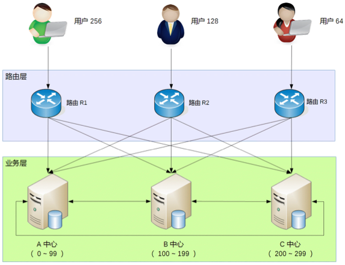

## 思考题：异地多活的 4 大技巧需要结合业务进行分析取舍，这样没法通用，如果底层存储采用 OceanBase 这种分布式强一致性的数据存储系统，是否就可以做到和业务无关的异地多活？

有疑问：
- 它是怎么解决最终一致性的延迟问题的
- 怎么解决分区容错的呢
- 数据存储和复制技术是啥样的呢

来自讨论区：
oceanbase的强一致性数据库可以使业务不需要考虑持久层的跨地域数据同步问题，但有两个代价：
- 单个请求的延时变低
- 可用性也降低

如果代价是可以承受的话，业务端还要解决缓存一致性的问题，流量切换到其他可用区是不是能扛得住。可能还需要部分的业务降级

## 总结

异地多活设计的理念可以总结为一句话：采用多种手段，保证绝大部分用户的核心业务异地多活！

　
异地多活架构设计的四个技巧
1. 保证核心业务的异地多活 
2. 保证核心数据的最终一致性
3. 采用多种手段做数据复制 
4. 只保证绝大部分用户的异地多活

