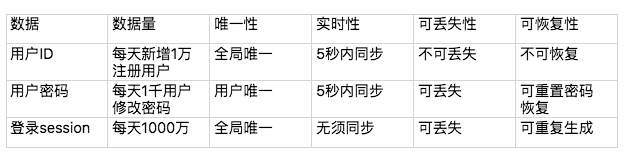
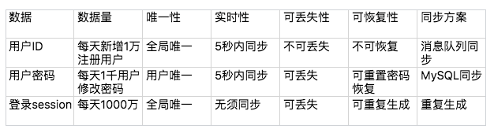
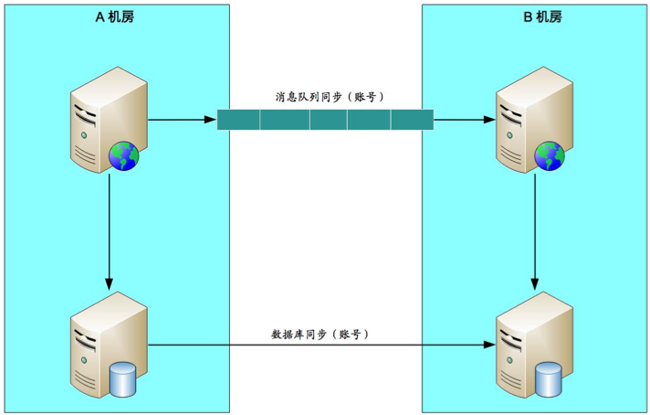
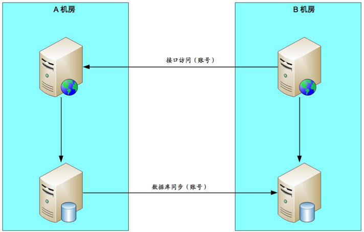

## 思考题：业务分级讨论的时候，产品说 A 也很重要，因为影响用户使用；B 也很重要，因为影响公司收入；C 也很重要，因为会导致客户投诉……这种情况下我们该如何处理业务分级？

根据公司的战略，分清楚当前阶段什么是重要的，再判断哪个优先级高

## 总结

跨城异地多活架构设计四步走：

### 一、业务分级

选出核心业务，只为核心业务异地多活，降低方案的整体复杂度和成本。

常见的分级标准：
1. 访问量大的业务
2. 核心业务
3. 产生大量收入的业务

### 二、数据分类

挑选出核心业务后，需要对核心业务相关的数据进一步分析，目的在于识别所有数据及数据特征，这些特征会影响后面的方案设计

常见的数据特征分析维度：

- 数据量
- 唯一性
- 实时性
- 可丢失性
- 可恢复性

### 三、数据同步

不同的数据有不同的同步方案：
- 存储系统同步
- 消息队列同步
- 重复生成

### 四、异常处理

异常处理的主要目的：
- 问题发生时，避免少量的数据异常导致整体业务的不可用
- 问题恢复后，将异常数据进行修正
- 对用户进行安抚，弥补用户损失

1. 多通道同步  
    + 一般情况下，采取两通道即可，采取更多通道理论上能够降低风险，但付出的成本也会增加很多。
    + 数据库同步通道和消息队列同步通道不能采用相同的网络连接，否则一旦网络故障，两个通道都同时故障；可以一个走公网连接，一个走内网连接。
    + 需要数据是可以重复覆盖的，即无论哪个通道先到哪个通道后到，最终结果是一样的。例如，新建账号数据就符合这个标准，而密码数据则不符合这个标准。
2. 同步和访问结合 
    + 也要采用不同的网络连接
    + 数据有路由规则，可以根据数据来推断应该访问哪个机房的接口来读取数据
    + 由于有同步通道，优先读取本地数据，本地数据无法读取到再通过接口去访问，这样可以大大降低跨机房的异地接口访问数量，适合于实时性要求非常高的数据。
3. 日志记录
4. 用户补偿

