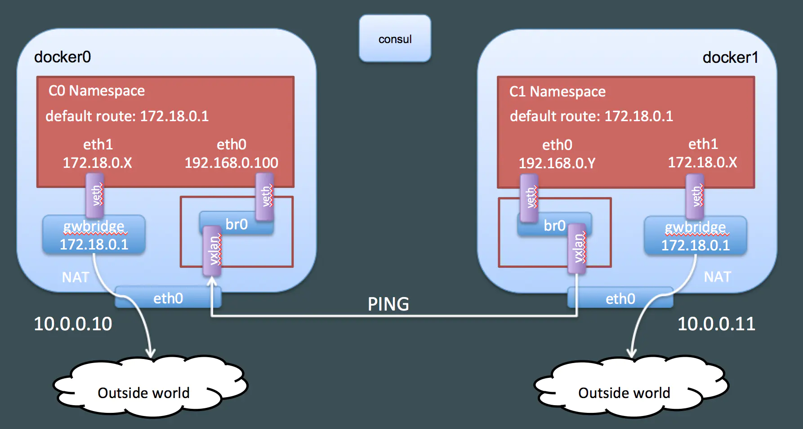

容器网络模型要解决的问题有两个：
1. 为容器分配IP地址
2. 不同容器之间的互通

## 一、docker的网络模型CNM

docker的CNM网络模型中三个部分，分别为：
- sandbox：
    + 容器的网络栈，包括对容器接口、路由表以及DNS配置的管理。
    + 一个sandbox可能包含多个endpoint。
    + 简单来说就是linux的namespace
- endpoint：
    + 一端属于网路一端属于sandbox
    + 简单来说就是veth pair
- network：
    + 一组能够相互通信的endpoint组成
    + 可以通过linux bridge或者vxlan实现

docker 的CNM模型的主要使用为*docker network*这个命令，对于跨主机网络来说本质上是实现的一层overlay的网络。这也是swarm网络的实现方式。

图片来自[DEEP DIVE INTO DOCKER OVERLAY NETWORKS : PART 1](https://blog.d2si.io/2017/04/25/deep-dive-into-docker-overlay-networks-part-1/)，我们可以看出有如下特点：
- 容器的sangbox上至少有两个endpoint
- gwbridge是为了访问外部，br0是为了容器见互通
- 为了跨主机通信还有一个全局的KV数据库（这里用的consul）
- 容器间通信是通过vxlan实现的

如果有深入兴趣的可以读读[ Deep dive into docker overlay networks part](https://blog.d2si.io/2017/04/25/deep-dive-into-docker-overlay-networks-part-1/)系列文章，相信会有很大的收获。

## 二、CNI的来源

## 三、CNI原理

## 四、k8s为什么选择CNI

## 五、k8s中如何使用CNI

## 六、不同CNI插件的选择

## 七、总结

- 搞清楚CNM和CNI的区别
    + CNM：https://github.com/docker/libnetwork/blob/master/docs/design.md
    + CNI：https://github.com/containernetworking/cni/blob/master/CONVENTIONS.md
    + https://kccncna19.sched.com/event/Uaif/introduction-to-cni-the-container-network-interface-project-bryan-boreham-weaveworks-dan-williams-red-hat

- https://cizixs.com/2017/05/23/container-network-cni/
- https://yucs.github.io/2017/12/06/2017-12-6-CNI/
- https://www.cnblogs.com/YaoDD/p/7419383.html
- https://www.cnblogs.com/YaoDD/p/7405725.htm

## 参考
- [浅聊几种主流 Docker 网络的实现原理](https://www.infoq.cn/article/9vfPPfZPrXLM4ssLlxSR)
- https://www.jianshu.com/p/3b9389084701
