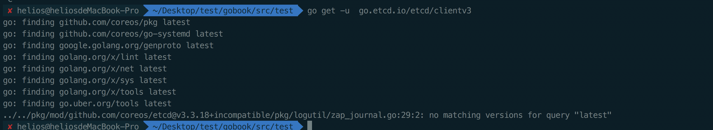

---
[文章首发](https://github.com/helios741/myblog/tree/new/learn_go/src/2020/0308_etcd_go_client)
---
如果您觉得有什么不理解，或者觉得文章有欠缺的地方，请您点击[这里](https://github.com/helios741/myblog/issues/77)提出。我会很感谢您的建议也会解答您的问题。

# ETCD golang ClientV3的基本使用


## 零、搭建单机的ETCD

为了演示，在Linux机器上搭建一个不通过SSL认证的单机ETCD，安装部署步骤如下：
在github上的[relese界面](https://github.com/etcd-io/etcd/releases)找到对应的包，下载到机器上：
```shell
ETCD_VER=v3.4.4

GITHUB_URL=https://github.com/etcd-io/etcd/releases/download
DOWNLOAD_URL=${GITHUB_URL}

rm -f /tmp/etcd-${ETCD_VER}-linux-amd64.tar.gz
rm -rf /tmp/etcd-download-test && mkdir -p /tmp/etcd-download-test

curl -L ${DOWNLOAD_URL}/${ETCD_VER}/etcd-${ETCD_VER}-linux-amd64.tar.gz -o /tmp/etcd-${ETCD_VER}-linux-amd64.tar.gz
tar xzvf /tmp/etcd-${ETCD_VER}-linux-amd64.tar.gz -C /tmp/etcd-download-test --strip-components=1
rm -f /tmp/etcd-${ETCD_VER}-linux-amd64.tar.gz

/tmp/etcd-download-test/etcd --version
/tmp/etcd-download-test/etcdctl version
```
通过后台运行部署起来：
```shell
nohup ./etcd --listen-client-urls http://0.0.0.0:2379 --advertise-client-urls http://0.0.0.0:2379 &
```
不要使用默认的监听地址，因为默认的监听的是localhost，通过外部无法访问。

安装完可以通过`./etcdctl version`查看ETCD的版本。

## 一、etcdctl的基本使用

### 1.1 关于数据的CRUD + Watch
新增一条数据
```shell
./etcdctl put "/school/class/name" "helios"
```
获取一条数据
```shell
[root@dajiahao03 etcd]# ./etcdctl get "/school/class/name"
/school/class/name
helios
```
得到一组数据
```shell
[root@dajiahao03 etcd]# ./etcdctl get "/school/class/" --prefix
/school/class/name
helios1
/school/class/name1
helios
```
得到所有的key
```shell
[root@dajiahao03 etcd]# ./etcdctl --prefix --keys-only=true get /
/school/class/name

/school/class/name1
```
删除一条数据
```shell
[root@dajiahao03 etcd]# ./etcdctl del "/school/class/name2"
1
```
watch的功能，这个功能要开两个终端哟
```shell
# 第一个终端：
./etcdctl watch "/school/class" --prefix
# 第二个终端
[root@dajiahao03 etcd]# ./etcdctl put "/school/class/name2" "helios2"
OK
# 第一个终端的变化
[root@dajiahao03 etcd]# ./etcdctl watch "/school/class" --prefix
PUT
/school/class/name2
helios2
```
### 1.2 关于集群的操作

查看集群状态（如果单机的可以不用指定ENDPOINTS，如果是集群的话，通过分号的形式加到ENDPOINTS后面）
```shell
[root@dajiahao03 etcd]# export ENDPOINTS="172.27.143.50:2379"
[root@dajiahao03 etcd]# ./etcdctl --write-out=table --endpoints=$ENDPOINTS endpoint status
+--------------------+------------------+---------+---------+-----------+------------+-----------+------------+--------------------+--------+
|      ENDPOINT      |        ID        | VERSION | DB SIZE | IS LEADER | IS LEARNER | RAFT TERM | RAFT INDEX | RAFT APPLIED INDEX | ERRORS |
+--------------------+------------------+---------+---------+-----------+------------+-----------+------------+--------------------+--------+
| 172.27.143.50:2379 | 8e9e05c52164694d |   3.4.4 |   20 kB |      true |      false |         3 |         13 |                 13 |        |
+--------------------+------------------+---------+---------+-----------+------------+-----------+------------+--------------------+--------+
```
 查看集群成员
```shell
[root@dajiahao03 etcd]# ./etcdctl --write-out=table --endpoints=$ENDPOINTS member list
+------------------+---------+---------+-----------------------+---------------------+------------+
|        ID        | STATUS  |  NAME   |      PEER ADDRS       |    CLIENT ADDRS     | IS LEARNER |
+------------------+---------+---------+-----------------------+---------------------+------------+
| 8e9e05c52164694d | started | default | http://localhost:2380 | http://0.0.0.0:2379 |      false |
+------------------+---------+---------+-----------------------+---------------------+------------+
```
删除集群成员
```shell
MEMBER_ID=8e9e05c52164694d
etcdctl --endpoints=$ENDPOINTS member remove ${MEMBER_ID}
```

添加成员
```shell
NEW_ETCD_NAME="new_etcd"
NEW_ETCD_HOST="172.27.140.172"
./etcdctl --endpoints=$ENDPOINTS member add ${NEW_ETCD_NAME} --peer-urls=http://${NEW_ETCD_HOST}:2380
```

### 1.3 关于集群的备份和恢复

磁盘碎片整理
```shell
[root@dajiahao03 etcd]# ./etcdctl --endpoints=$ENDPOINTS defrag
Finished defragmenting etcd member[172.27.143.50:2379]
```
备份当前的ETD集群

```shell
[root@dajiahao03 etcd]# ./etcdctl snapshot save snapshot.db
{"level":"info","ts":1583651900.406544,"caller":"snapshot/v3_snapshot.go:110","msg":"created temporary db file","path":"snapshot.db.part"}
{"level":"info","ts":1583651900.4077375,"caller":"snapshot/v3_snapshot.go:121","msg":"fetching snapshot","endpoint":"127.0.0.1:2379"}
{"level":"info","ts":1583651900.4105544,"caller":"snapshot/v3_snapshot.go:134","msg":"fetched snapshot","endpoint":"127.0.0.1:2379","took":0.003921237}
{"level":"info","ts":1583651900.410609,"caller":"snapshot/v3_snapshot.go:143","msg":"saved","path":"snapshot.db"}
Snapshot saved at snapshot.db
[root@dajiahao03 etcd]# ll snapshot.db
-rw------- 1 root root 20512 3月   8 15:18 snapshot.db
```
查看snapshot状态
```shell
[root@dajiahao03 etcd]# ./etcdctl snapshot status snapshot.db
21c0c96e, 8, 11, 20 kB
```

从备份中恢复集群
```shell
[root@dajiahao03 etcd]# ./etcdctl snapshot save snapshot.db
{"level":"info","ts":1583652044.0606484,"caller":"snapshot/v3_snapshot.go:110","msg":"created temporary db file","path":"snapshot.db.part"}
{"level":"info","ts":1583652044.0613058,"caller":"snapshot/v3_snapshot.go:121","msg":"fetching snapshot","endpoint":"127.0.0.1:2379"}
{"level":"info","ts":1583652044.0659368,"caller":"snapshot/v3_snapshot.go:134","msg":"fetched snapshot","endpoint":"127.0.0.1:2379","took":0.005182366}
{"level":"info","ts":1583652044.0660565,"caller":"snapshot/v3_snapshot.go:143","msg":"saved","path":"snapshot.db"}
Snapshot saved at snapshot.db
```

切换leader
```shell
# 先看状态
etcdctl endpoint --cluster=true status  -w table
# move-leader
./etcdctl move-leader d6414a7c7c550d29
```


## 二、使用etcd client可能会出现的问题

通过`go get go.etcd.io/etcd/clientv3`，如果觉得慢活着出现问题，可以手动的把[etcd项目](https://github.com/etcd-io/etcd)手动clone到指定目录先：
```shell
mkfir -p ${GOPATH}/src/go.etcd.io
git clone git@github.com:etcd-io/etcd.git ${GOPATH}/src/go.etcd.io
```

在build的时候出现下图的问题的话，可以参考这个[博客](https://www.jianshu.com/p/5f6415bf25be)，但是我尝试了，好想不管用，如果不管用可以看我后面的终极方法。


经过了上述的还是不行，因为我的go版本是13.X，我就干脆降到12.X，就work了。
步骤如下（国内镜像地址：http://mirrors.ustc.edu.cn/golang/）：
```shell
# 找到匹配的版本的go包（我的是mac的）
wget http://mirrors.ustc.edu.cn/golang/go1.12.4.darwin-amd64.tar.gz
tar -C /usr/local/bin -xzf /home/yourname/Downloads/go1.12.4.linux-amd64.tar.gz
# 修改bashrc重的PATH（我用的是zsh）
vim ~/.zshrc
export PATH=$PATH:/usr/local/bin/go/bin
source ~/.zshrc
```

## 三、etcd ClientV3的使用

### 3.1 连接ETCD

```go

var (
	config clientv3.Config
	client *clientv3.Client
	err error
)
// 客户端配置
config = clientv3.Config{
	Endpoints: []string{"172.27.43.50:2379"},
	DialTimeout: 5 * time.Second,
}
// 建立连接
if client, err = clientv3.New(config); err != nil {
	fmt.Println(err)
	return
}
```

可运行代码请查看[etcd-client.go](./etcd-client.go)


### 3.2 写入数据到ETCD

```go
    // 实例化一个用于操作ETCD的KV
	kv = clientv3.NewKV(client)
	if putResp, err = kv.Put(context.TODO(), "/school/class/students", "helios0", clientv3.WithPrevKV()); err != nil {
		fmt.Println(err)
		return
	}
	fmt.Println(putResp.Header.Revision)
	if putResp.PrevKv != nil {
		fmt.Printf("prev Value: %s \n CreateRevision : %d \n ModRevision: %d \n Version: %d \n",
			string(putResp.PrevKv.Value), putResp.PrevKv.CreateRevision, putResp.PrevKv.ModRevision, putResp.PrevKv.Version)
	}
```
输出为：
```shell
20
prev Value: helios0
 CreateRevision : 9
 ModRevision: 19
 Version: 11
```
可运行代码请查看[etcd-put.go](./etcd-put.go)。

这里注意kv.Put的最后一个参数表示，返回上一次的数据，是个可选参数。在etcd的client中有很多这样的可选参数，更多的参数可以参考这个文档[clientv3 option](https://godoc.org/go.etcd.io/etcd/clientv3#OpOption)

### 3.3 获取ETCD里面的数据

```go
// 实例化一个用于操作ETCD的KV
kv = clientv3.NewKV(client)
if getResp, err = kv.Get(context.TODO(), "/school/class/students"); err != nil {
	fmt.Println(err)
	return
}
// 输出本次的Revision
fmt.Printf("Key is s %s \n Value is %s \n", getResp.Kvs[0].Key, getResp.Kvs[0].Value)
```
输出为：
```shell
Key is s /school/class/students
Value is helios0
```

如果给kv.Get方法加上`clientv3.WithPrefix()`就能查找出以某个为前缀的所有KV。

可运行代码请查看[etcd-get.go](./etcd-get.go)
### 3.4 删除ETCD里面的数据

```shell
kv = clientv3.NewKV(client)
_, err = kv.Put(context.TODO(), "/school/class/students", "helios1")

if delResp, err = kv.Delete(context.TODO(), "/school/class/students", clientv3.WithPrevKV()); err != nil {
	fmt.Println(err)
	return
}
if len(delResp.PrevKvs) != 0 {
	for _, kvpair = range delResp.PrevKvs {
		fmt.Printf("delete key is: %s \n Value: %s \n", string(kvpair.Key), string(kvpair.Value))
	}
}
```

输出为：
```shell
delete key is: /school/class/students
 Value: helios1
```
在Delete中还可以增加下面两个option：
- clientv3.WithFromKey(): 从这个key开始
- clientv3.WithLimit(n): 先知删除n条

可运行代码请查看[etcd-delete.go](./etcd-delete.go)

### 3.4 对租约的操作

#### 3.4.1 申请一个10s的租约，定时查看是否过期

```go
// 申请一个租约
lease = clientv3.NewLease(client)
if leaseGrantResp, err = lease.Grant(context.TODO(), 10); err != nil {
	fmt.Println(err)
	return
}
leaseId = leaseGrantResp.ID

// 获得kv API子集
kv = clientv3.NewKV(client)

if _, err = kv.Put(context.TODO(), "/school/class/students", "h", clientv3.WithLease(leaseId)); err != nil {
	fmt.Println(err)
	return
}

for {
	if getResp, err = kv.Get(context.TODO(), "/school/class/students"); err != nil {
		fmt.Println(err)
		return
	}
	if getResp.Count == 0 {
		fmt.Println("kv过期了")
		break
	}
	fmt.Println("还没过期:", getResp.Kvs)
	time.Sleep(2 * time.Second)
}
```
输出：
```shell
还没过期: [key:"/school/class/students" create_revision:24 mod_revision:24 version:1 value:"h" lease:7587844869553529889 ]
还没过期: [key:"/school/class/students" create_revision:24 mod_revision:24 version:1 value:"h" lease:7587844869553529889 ]
还没过期: [key:"/school/class/students" create_revision:24 mod_revision:24 version:1 value:"h" lease:7587844869553529889 ]
还没过期: [key:"/school/class/students" create_revision:24 mod_revision:24 version:1 value:"h" lease:7587844869553529889 ]
还没过期: [key:"/school/class/students" create_revision:24 mod_revision:24 version:1 value:"h" lease:7587844869553529889 ]
还没过期: [key:"/school/class/students" create_revision:24 mod_revision:24 version:1 value:"h" lease:7587844869553529889 ]
kv过期了
```
可运行代码请查看[3.4.1.go](./3.4.1.go)

#### 3.4.2 自动续租

```go
if keepRespChan, err = lease.KeepAlive(context.TODO(), leaseId); err != nil {
	fmt.Println(err)
	return
}
go func() {
	for {
		select {
		case keepResp = <- keepRespChan:
			if keepRespChan == nil {
				fmt.Println("租约已经失效了")
				goto END
			} else {	// 每秒会续租一次, 所以就会受到一次应答
				fmt.Println("收到自动续租应答:", keepResp.ID)
			}
		}
	}
END:
}()
```

可运行代码请查看[3.4.2.go](./3.4.2.go)


### 3.5 watch功能

对某一个key进行监听5s:
```go
kv = clientv3.NewKV(client)

// 模拟KV的变化
go func() {
	for {
		_ , err = kv.Put(context.TODO(), "/school/class/students", "helios1")
		_, err = kv.Delete(context.TODO(), "/school/class/students")
		time.Sleep(1 * time.Second)
	}
}()

// 先GET到当前的值，并监听后续变化
if getResp, err = kv.Get(context.TODO(), "/school/class/students"); err != nil {
	fmt.Println(err)
	return
}

// 现在key是存在的
if len(getResp.Kvs) != 0 {
	fmt.Println("当前值:", string(getResp.Kvs[0].Value))
}

// 获得当前revision
watchStartRevision = getResp.Header.Revision + 1
// 创建一个watcher
watcher = clientv3.NewWatcher(client)
fmt.Println("从该版本向后监听:", watchStartRevision)

ctx, cancelFunc := context.WithCancel(context.TODO())
time.AfterFunc(5 * time.Second, func() {
	cancelFunc()
})

watchRespChan = watcher.Watch(ctx, "/school/class/students", clientv3.WithRev(watchStartRevision))
// 处理kv变化事件
for watchResp = range watchRespChan {
	for _, event = range watchResp.Events {
		switch event.Type {
		case mvccpb.PUT:
			fmt.Println("修改为:", string(event.Kv.Value), "Revision:", event.Kv.CreateRevision, event.Kv.ModRevision)
		case mvccpb.DELETE:
			fmt.Println("删除了", "Revision:", event.Kv.ModRevision)
		}
	}
}
```

可运行代码请查看[3.5.go](./3.5.go)

### 3.6 通过op方法代替kv.Get/kv.Put/kv.Delete

```go
putOp = clientv3.OpPut("/school/class/students", "helios")

if opResp, err = kv.Do(context.TODO(), putOp); err != nil {
	panic(err)
}
fmt.Println("写入Revision:", opResp.Put().Header.Revision)

getOp = clientv3.OpGet("/school/class/students")

if opResp, err = kv.Do(context.TODO(), getOp); err != nil {
	panic(err)
}
fmt.Println("数据Revision:", opResp.Get().Kvs[0].ModRevision)
fmt.Println("数据value:", string(opResp.Get().Kvs[0].Value))
```
输出为：
```shell
写入Revision: 46
数据Revision: 46
数据value: helios
```
可运行代码请查看[3.6.go](./3.6.go)

### 3.7（选看） 通过txn实现分布式锁

ETCD中的txn通过简单的"If-Then-Else"实现了原子操作。

实现分布式锁主要分为三个步骤：
1. 上锁，包括创建租约、自动续约、在租约时间内去抢一个key
2. 抢到锁后执行业务逻辑，没有抢到退出
3. 释放租约

接下来我们看代码：
```go

// 1. 上锁
// 1.1 创建租约
lease = clientv3.NewLease(client)

if leaseGrantResp, err = lease.Grant(context.TODO(), 5); err != nil {
	panic(err)
}
leaseId = leaseGrantResp.ID

// 1.2 自动续约
// 创建一个可取消的租约，主要是为了退出的时候能够释放
ctx, cancelFunc = context.WithCancel(context.TODO())

// 3. 释放租约
defer cancelFunc()
defer lease.Revoke(context.TODO(), leaseId)

if keepRespChan, err = lease.KeepAlive(ctx, leaseId); err != nil {
	panic(err)
}
// 续约应答
go func() {
	for {
		select {
		case keepResp = <- keepRespChan:
			if keepRespChan == nil {
				fmt.Println("租约已经失效了")
				goto END
			} else {	// 每秒会续租一次, 所以就会受到一次应答
				fmt.Println("收到自动续租应答:", keepResp.ID)
			}
		}
	}
END:
}()

// 1.3 在租约时间内去抢锁（etcd里面的锁就是一个key）
kv = clientv3.NewKV(client)

// 创建事物
txn = kv.Txn(context.TODO())

//if 不存在key， then 设置它, else 抢锁失败
txn.If(clientv3.Compare(clientv3.CreateRevision("lock"), "=", 0)).
	Then(clientv3.OpPut("lock", "g", clientv3.WithLease(leaseId))).
	Else(clientv3.OpGet("lock"))

// 提交事务
if txnResp, err = txn.Commit(); err != nil {
	panic(err)
}

if !txnResp.Succeeded {
	fmt.Println("锁被占用:", string(txnResp.Responses[0].GetResponseRange().Kvs[0].Value))
	return
}

// 2. 抢到锁后执行业务逻辑，没有抢到退出
fmt.Println("处理任务")
time.Sleep(5 * time.Second)

// 3. 释放锁，步骤在上面的defer，当defer租约关掉的时候，对应的key被回收了

```

可运行代码请查看[3.7.go](./3.7.go)


如果您觉得有什么不理解，或者觉得文章有欠缺的地方，请您点击[这里](https://github.com/helios741/myblog/issues/77)提出。我会很感谢您的建议也会解答您的问题。
