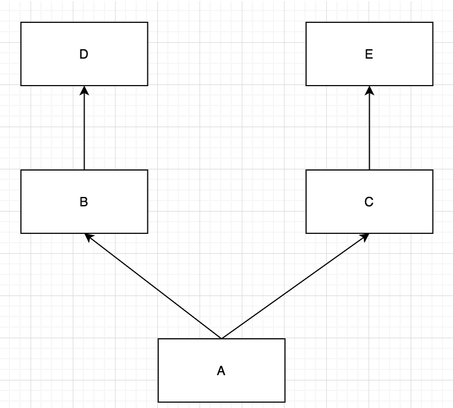
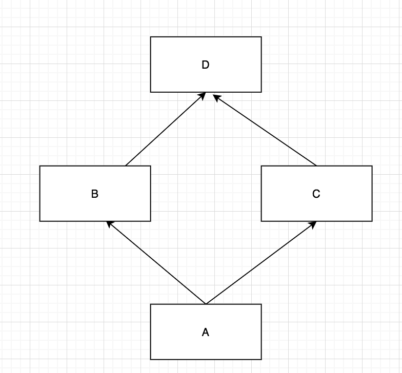

## 零、你要知道的：静态语言和动态语言在类上的差别

我们都知道了在python中一切皆对象，类也是对象。

首先我们要先明白一下什么是鸭子类型，根据[维基百科](https://zh.wikipedia.org/wiki/%E9%B8%AD%E5%AD%90%E7%B1%BB%E5%9E%8B)中定义“当看到一只鸟走起来像鸭子、游泳起来像鸭子、叫起来也像鸭子，那么这只鸟就可以被称为鸭子”。

这句话的含义是，某些动态语言的对象不用和静态语言（比如java）要继承特定的类或者实现指定的接口，而是只是关注其对象本身的行为。

所以当我们定义接受一个“鸭子类型”的变量的时候，只管调用它里面有的方法或者属性就行了，不用关注他继承自什么，实现了什么。

静态类型，比如说java语言，它定义的类就比较严格，当定义一个接受某个类型的函数的时候，如果这个变量是对象类型，就必须要保证这个对象实现了某个接口。这样带来的好处就是，在写代码阶段就解决一部分潜在的错误，也可以自动生成很好的文档。

相比于静态语言，动态语言如果出现传递的参数有错误的话，只能在运行阶段产生，当然动态语言也可以实现静态语言那样的静态类型检查（注意这里不是说的强类型和弱类型哟），比如现在风头正火的Typescript就实现了javascript版本的静态类型检查。

## 一、面向对象套路：封装、继承、多态说起

### 1.1 多态

python中的多态可以说再简单不过了，反正声明类型也不会指定变量类型，可以粗暴的理解为变量都是多态的。

### 1.2 继承
```python
class Base1:
    name = "helios1"

class Base2:
    name = "helios2"

class Child(Base2, Base1):
    age = "12"
    def __init__(self, sex):
        self.sex = "man"

if __name__ == "__main__":
    c = Child("man")
    print("name :{}, age: {}, sex: {}".format(c.name, c.age, c.sex))
```
输出：
在python中是支持多继承的，如果多个父类有相同的属性或者方法就以前面的为准（非多重继承），具体的实例属性的查找过程后面会详细说
```shell
name :helios2, age: 12, sex: man
```

如果子类想要调用父类的方法，可以使用super函数。
```python
class Base:
    def __init__(self, name):
        # 对name进行一些加工
        self.name = name
class Child(Base):
    def __init__(self, sex, name):
        self.sex = sex
        super().__init__(name)
        # super(Child, self).__init__(name)
if __name__ == "__main__":
    c = Child("man", "helios")
    print("name :{}, sex: {}".format(c.name, c.sex))
```


### 1.3 封装
python中没有protected的属性，但是可以通过在属性前面加上双下划线(__)的为其设置私有成员，如下：
```python
class User:
    def __init__(self):
        self.name = "helios"
        self.__age = "22"

if __name__ == "__main__":
    u = User()
    print(u.name)
    # print(u.__age) # AttributeError: 'User' object has no attribute '__age'
```
当然就像java可以通过反射能拿到私有成员一样，在python中更容易拿到一些，通过_Class__attr也是能拿到的，比如下面：
```python
class User:
    def __init__(self):
        self.name = "helios"
        self.__age = "22"

if __name__ == "__main__":
    u = User()
    print(u.name)
    print(u._User__age)
```

## 二、 关于类和实例：属性和方法

### 2.1 多重继承中属性的查找顺序

上一节我们已经介绍了继承，但是还留个一个悬念，就是在多重继承中属性的查找的过程。
我们先看下面这种典型的多重继承：

```python
class E:
    pass
class D:
    pass
class B(D):
    pass
class C(E):
    pass
class A(B, C):
    pass

if __name__ == "__main__":
    print(A.mro())
    print(A.__mro__)
```
输出结果为：
```shell
[<class '__main__.A'>, <class '__main__.B'>, <class '__main__.D'>, <class '__main__.C'>, <class '__main__.E'>, <class 'object'>]
(<class '__main__.A'>, <class '__main__.B'>, <class '__main__.D'>, <class '__main__.C'>, <class '__main__.E'>, <class 'object'>)
```
我们可以看到属性的查找顺序为A -> B -> D -> C -> E

然后看一下菱形继承：

```python
class D:
    pass
class B(D):
    pass
class C(D):
    pass
class A(B, C):
    pass

if __name__ == "__main__":
    print(A.mro())
    print(A.__mro__)
```
输出结果为：
```shell
[<class '__main__.A'>, <class '__main__.B'>, <class '__main__.C'>, <class '__main__.D'>, <class 'object'>]
(<class '__main__.A'>, <class '__main__.B'>, <class '__main__.C'>, <class '__main__.D'>, <class 'object'>)
```
我们可以看到属性的查找顺序为A -> B -> C-> D 

MRO(Method Resolution Order)是在类的层次上查找属性的顺序，在python3中对应的算法是C3算法。

### 2.2 静态方法、类方法和对象方法

直接来看一个例子：
```python
class Date:
    def __init__(self, y, m, d):
        self.y = y
        self.m = m
        self.d = d

    def next_day(self, n):
        # 省略关于日期的处理
        return self.d + n

    @classmethod
    def parse_str_to_date(cls, str):
        y, m, d = tuple(str.split("-"))
        return cls(int(y), int(m), int(d))

    @staticmethod
    def valid_day(d):
        if d > 31:
            return False
        return True

if __name__ == "__main__":
    d = Date(2020, 2, 29)
    print("y:{}, m:{},d:{}".format(d.y, d.m, d.d))
    print(d.parse_str_to_date("2020-03-01"))
    print(Date.parse_str_to_date("2020-03-01"))
    print(d.valid_day(12))
    print(Date.valid_day(12))
```
- 实例方法：next_day，只有把对应的类实例化之后才能使用，能使用对应的self上的属性
- 类方法：parse_str_to_date，既能通过实例化类的对象调用也能直接通过类调用，第一参数(cls)代表这个类，能解决硬编码的问题(通过cls代替Date)
- 静态方法：valid_day，主要用在把类当作一个命令空间，不依赖类，其实拿出去搞个函数也行，这样做主要是为了聚合，Date类能做能多和日期相关的东西


### 2.3 计算属性

```python
class User:
    def __init__(self):
        self._name = None

    @property
    def name(self):
        # 可以有一系列操作
        return self._name

    @name.setter
    def name(self, v):
        self._name = v + "xxxx"

if __name__ == "__main__":
    u = User()
    print(u.name)
    u.name = "helios"
    print(u.name)
```
通过在类中的函数加个@property装饰器，当我们使用这个变量name的时候就会返回里面对应内容，一般里面的内容是通过self上其他属性转变来的，所以叫计算属性

当我们通过@name.setter(即@变量名.setter)的方式就是定义设置变量name时候的操作，当然这里面也能执行许多逻辑。


## 三、 数据描述符：关于属性的查找过程

### 3.1 什么是属性描述符

### 3.2 __getattr__和__getattribute__

### 3.3 属性的查找过程

## 四、 类继承实践：mixin

### 4.1 抽象基类

### 4.2 mixin


小且多的组合。


## 总结


## 参考
- [python __new__文档](https://docs.python.org/3/reference/datamodel.html?highlight=__new__#object.__new__)
