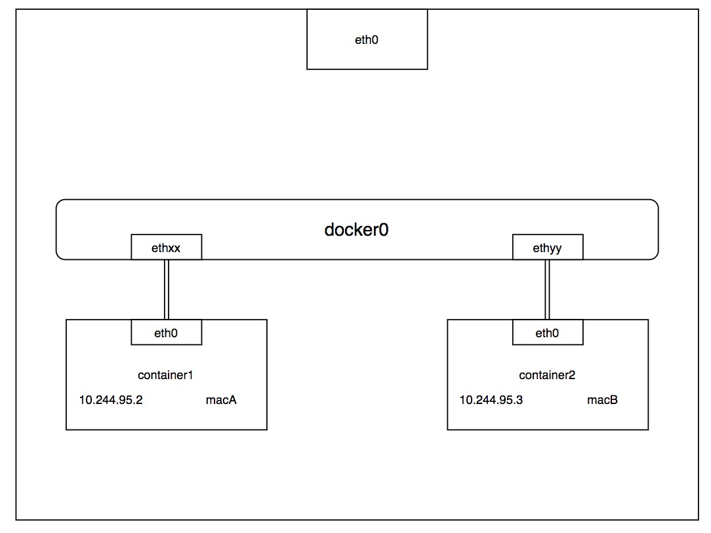
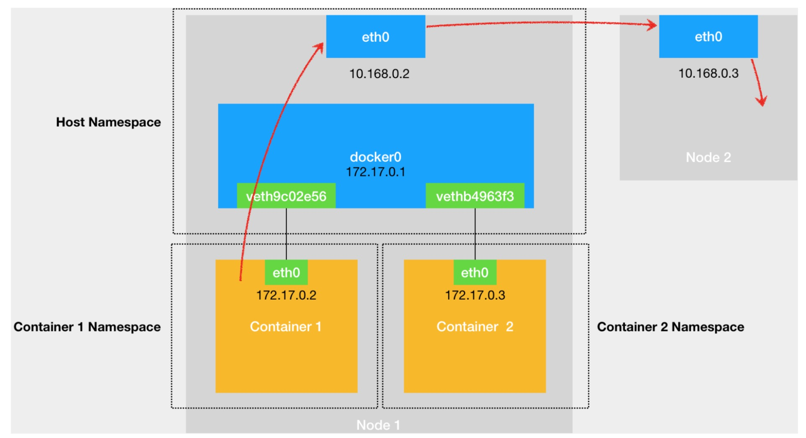

## docker0网桥的作用

linux bridge是工作在二层的设备。主要是通过mac地址学习来将数据包转发到网桥不同端口。

docker0网桥的作用是，将通过network namespace隔离的容器能访问外界环境。：



宿主机路由为：
```shell
# route
Kernel IP routing table
Destination     Gateway         Genmask         Flags Metric Ref    Use Iface
default         gateway         0.0.0.0         UG    300    0        0 bond0
10.15.20.0      0.0.0.0         255.255.255.0   U     0      0        0 cni_bridge0
10.244.95.0     0.0.0.0         255.255.255.0   U     0      0        0 docker0
172.27.128.0    0.0.0.0         255.255.240.0   U     300    0        0 bond0
```

container1的路由为：
```shell
# route
Kernel IP routing table
Destination     Gateway         Genmask         Flags Metric Ref    Use Iface
default         10.244.95.1     0.0.0.0         UG    0      0        0 eth0
10.244.95.0     *               255.255.255.0   U     0      0        0 eth0
```

### 1. container1 访问container2

比如ping container2的ip地址。

0. 目的ip是container2的数据包，会匹配到路由的第二条规则，经过本机的eth0网卡，通过二层网络发到目的主机
1. container1不知道container2的MAC地址，所以发送ARP广播
2. 收到ARP请求之后，docker0网桥会扮演二层交换机的角色，把ARP请求转发给其他连接在docker0上的设备
3. container2收到ARP请求，返回MAC地址
4. container1拿到container的MAC就能和container2通信

### 2. 外部访问container1

0. 根据宿主机的路由规则，访问container1 IP的数据包会经过docker0
1. 宿主机不知道contianer1的MAC，地址发送ARP
2. docker0 收到ARP请求，把ARP请求转发给其他连接在docker0上的设备
3. container1收到ARP请求，返回MAC地址
4. 宿主机拿到container1的MAC地址就能和container1通信

### 3. container1访问外部
0. 数据包通过默认路由，通过eht0到达docker0出现在宿主机上
1. 通过宿主机路由表的直连规则，将对外部IP的请求访问交给宿主机的eth0处理



### docker0怎么知道MAC对应的端口

通过CAM表，是交换机通过MAC地址学习维护的端口和MAC地址的对应

### 为什么有了IP地址还需要MAC地址才能发送请求

1. 目的IP是一直不会变的，MAC地址记录的下一跳地址（NAT除外）
2. 分层实现，MAC地址和IP地址分别代表物理地址和逻辑地址的好处是，让二层和三层的协议更加灵活，即三层未必要IP协议，二层也未必用以太网协议
3. 历史原因：以前的集线器

### 为什么docker0这个二层设备会有IP
不是有IP的就是三层设备，二层和三层的区分是能否进行路由。

比如说交换机，带有IP的交换机被称为网管式交换机，支持划分vlan、访问控制等，一般用于汇聚，那么VLAN虚接口配置IP可以作为网关。


