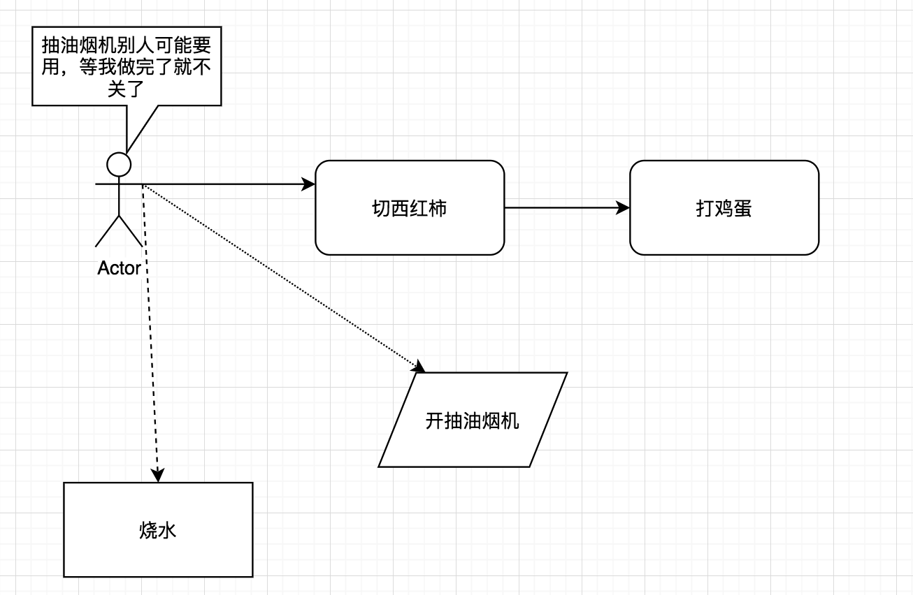

# 进程、进程组以及会话

先说一下做汤的步骤：

我们做一个汤，可能需要这么几个步骤：
1. 烧水
2. 切西红柿
3. 打鸡蛋
4. 开抽油烟机

但是一个人手动只能做一个工作，不能同时切西红柿和打鸡蛋，但是能在烧水的时候切西红柿等。等我们做完汤之后，我们就要收拾一切东西咯，可能有的东西不需要收拾，比如抽油烟机，因为后面的人可能还要继续用。

这里我们要做饭这就是针对厨房的一个*会话*，
烧水、切西红柿、打鸡蛋、开抽油烟机就是不同的进程组，
切西红柿、打鸡蛋就是前台进程
烧水和抽油烟机就是后台进程。

当我们要做完饭的时候，就相当于退出这个会话（发送SIGHUP信号）
抽油烟机在开启的时候忽略了这个信号，就不会关闭
