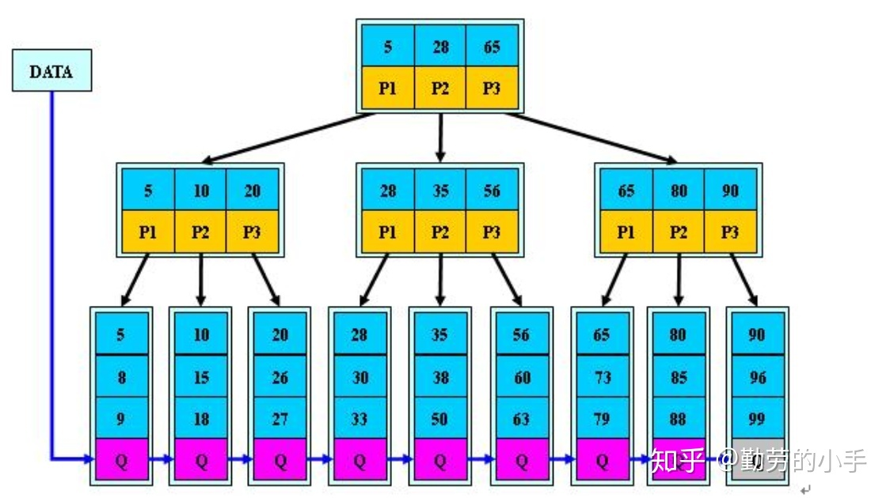

记录索引有多种方式：
1. hashmap： 单个查询是O(1), 区间查询比较麻烦,因为是无序的
2. 有序数组：查询比较友好，但是插入比较麻烦
3. 二叉搜索树：插入比较优化，但是区间查询比较困难，还得中序遍历




B+树中的每个非叶子节点不存储信息，只存储索引。

如上图，当我们要查找8的时候：
1. 8在5-28之间，往左边走
2. 8在5-10之间，往左边走
3. 8属于8-9之间，去中间走
4. 已经是叶子节点，找到

因为这棵树不能存在内存中，要存在硬盘中，如果树的高度太高的话，就会相当慢了。

在mysql中b+树是一个N叉树，N的数量尽量不要超过一页的大小，如果超过了，一次IO就读不过来了。


当每次为数据表的中的一个字段建立索引的时候，mysql都会建立一个B+树，这个B+树是保存的是根据索引得到主键（如果不认为设置主键，mysql会默认加一个）。

建表语句：
```shell

mysql> create table T(
id int primary key,
k int not null,
name varchar(16),
index (k))engine=InnoDB;
```


索引类型分为：
- 主键索引：叶子节点存储的是整行数据，也称为聚簇索引
    + 查询的时候，只需要根据ID所有整个B+树即可
- 非主键索引：叶子结点存储的是主键的信息，也成为二级索引
    + 查询的时候，先根据索引拿到主键，然后根据主键查找整个B+树


设置自增主键不会触发叶子节点的分裂。


