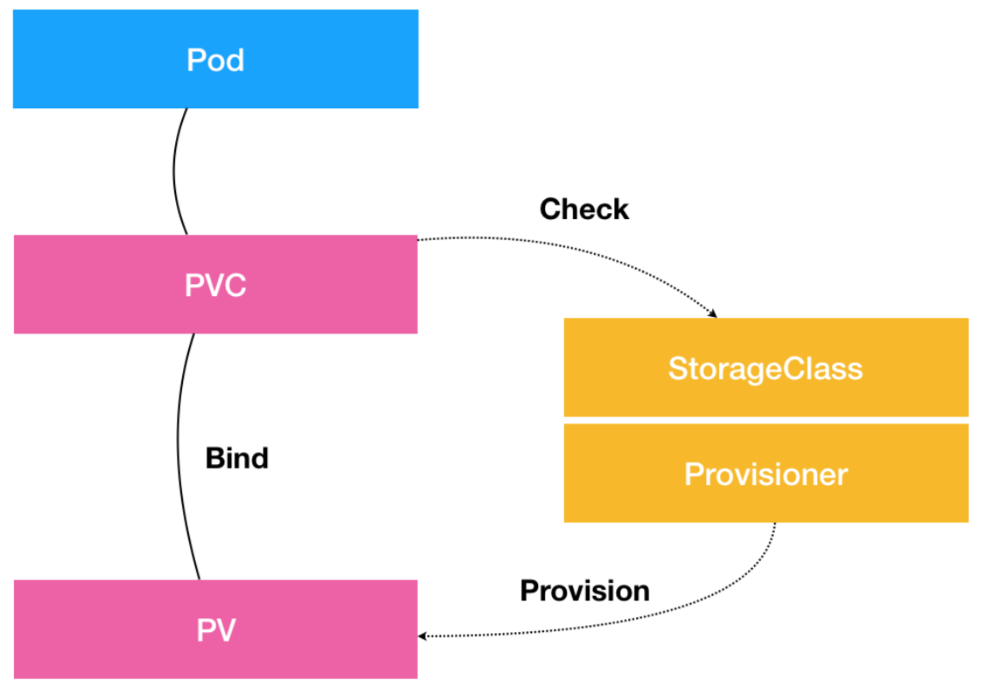
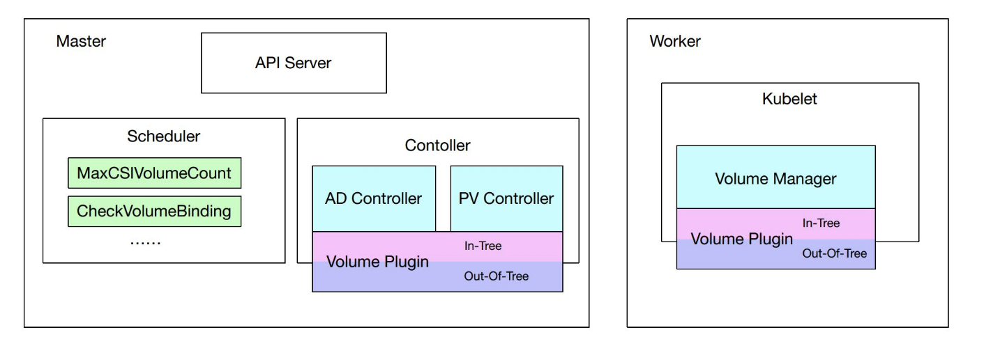
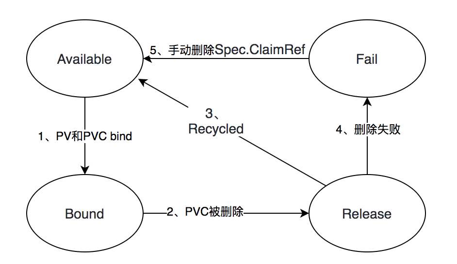
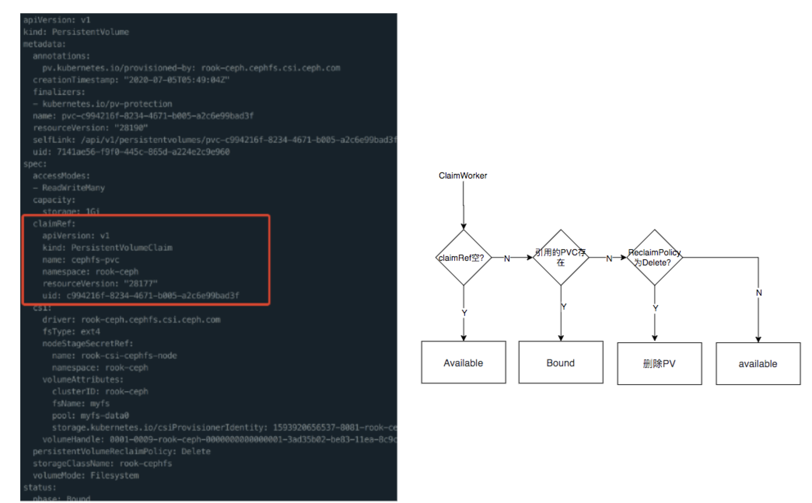
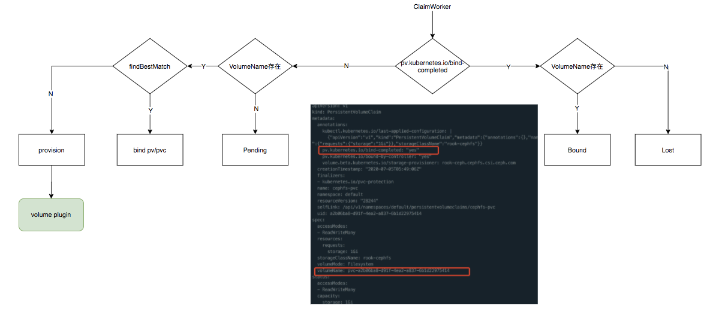
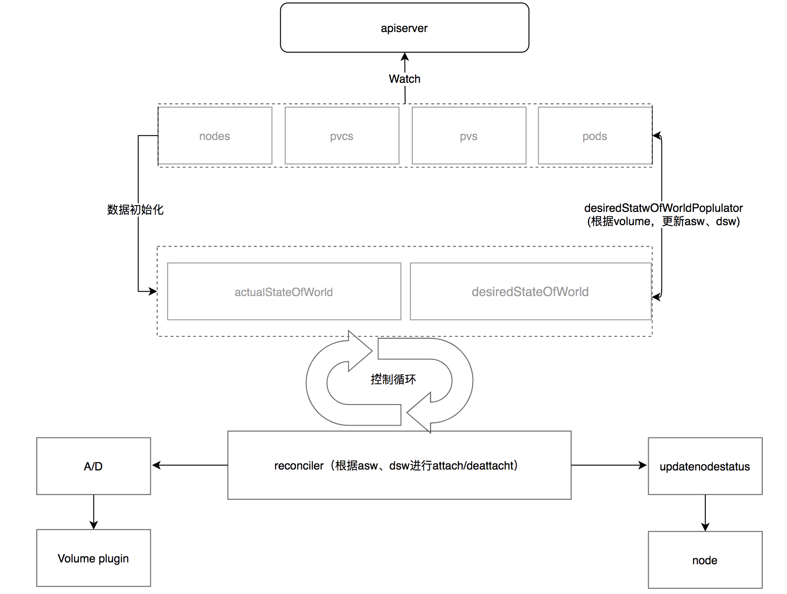
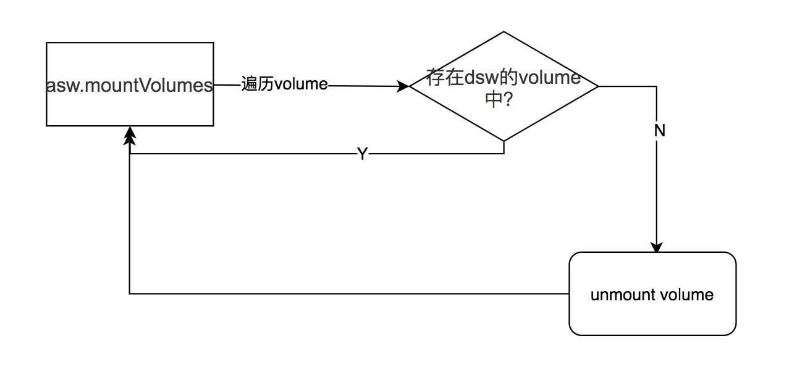
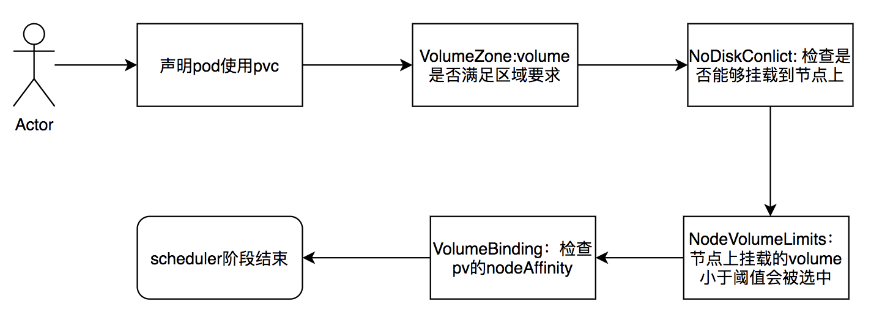

# 浅谈kubernetes存储

## 一、pv、pvc、storageclass是什么

### 1.1 pv/pvc的来源

在没有pv/pvc之前，应用如果想要使用远程存储的话，比如想要使用ceph，就要把声明ceph的信息（比如ceph的地址、用户名等）写在pod的spec中，就像下面这样：
```yaml
apiVersion: v1
kind: Pod
metadata:
  name: rbd
spec:
  containers:
    - image: kubernetes/pause
      name: rbd-rw
      volumeMounts:
      - name: rbdpd
        mountPath: /mnt/rbd
  volumes:
    - name: rbdpd
      rbd:
        monitors:
        - '10.16.154.78:6789'
        - '10.16.154.82:6789'
        - '10.16.154.83:6789'
        pool: kube
        image: foo
        fsType: ext4
        readOnly: true
        user: admin
        keyring: /etc/ceph/keyring
        imageformat: "2"
        imagefeatures: "layering" 
```

这个对一个开发人员是很痛苦的，还要去了解ceph的知识，对于新手来说还大概率写错，如果多种存储的话还要去了解不同的存储（比如除了ceph还有NFS、gluster等）。但是开发人员的目的很单纯，就是想把数据存储某个目录下面，结果却要耗费额外的的时间去搞这些对于开发没有关系的东西。


现在我们来看看两种不同人员的诉求：
- 开发者：我本地数据怎么存，线上怎么存就行
- 运维/集群管理员：把存储的入口掌握在自己手里，做到可控
根据上述诉求，k8s设计了pv/pvc，其中：
- 声明存储：persistentVolume
- 使用存储：persistentVolumeClaim
- 把存储挂在到哪个目录：pod.spec

所以以后应用的开发人员只需要声明存储的大小和[权限](https://kubernetes.io/docs/concepts/storage/persistent-volumes/#access-modes)即可，如下：
```yaml
kind: PersistentVolumeClaim
apiVersion: v1
metadata:
  name: pv-claim
spec:
  accessModes:
  - ReadWriteOnce
  resources:
    requests:
      storage: 1Gi
```

accessModes指的是这个存储的权限，包含下面几种：
- ReadWriteOnce（RWO）：只能被一个节点读写，比如local pv
- ReadOnlyMany（ROX）：能被多个节点读，比如NFS
- ReadWriteMany（RWX）：被多个节点读写，比如cephfs

更多内容可以参考[access-modes](https://kubernetes.io/docs/concepts/storage/persistent-volumes/#access-modes)

然后在POD中使用这个PVC
```yaml
apiVersion: v1
kind: Pod
metadata:
  name: pv-pod
spec:
  containers:
  - name: pv-container
    image: nginx
    ports:
      - containerPort: 80
        name: "http-server"
    volumeMounts:
      - mountPath: "/usr/share/nginx/html"
        name: pv-storage
    volumes:
      - name: pv-storage
        persistentVolumeClaim:
          claimName: pv-claim
```

至此应用开发人员做的工作就结束了。运维/集群管理员关心的是存储本身，所以需要根据声明PVC去创建PV(Persistent Volume)。
```yaml
kind: PersistentVolume
apiVersion: v1
metadata:
  name: pv-volume
  labels:
    type: local
spec:
  capacity:
    storage: 1Gi
  rbd:
    monitors:
    - '10.16.154.78:6789'
    - '10.16.154.82:6789'
    - '10.16.154.83:6789'
    pool: kube
    image: foo
    fsType: ext4
    readOnly: true
    user: admin
    keyring: /etc/ceph/keyring
    imageformat: "2"
    imagefeatures: "layering"
```
### 1.2 StorageClass来源

每次开发者提交新的PVC，运维人员就要手动创建PV，在一般集群中还能接受（比如先知）但是在大规模集群中时时刻刻都有人创建PVC，那对于运维/集群管理员来说又是一场灾难。所以kubernetes提供了动态创建pv的机制（上面的例子叫静态创建pv）即通过声明的PVC自动创建PV，其工作的核心在于StorageClass对象，作用是创建pv模板。


```yaml

apiVersion: storage.k8s.io/v1
kind: StorageClass
metadata:
   name: rook-ceph-block
provisioner: rook-ceph.rbd.csi.ceph.com
parameters:
    clusterID: rook-ceph
    pool: replicapool
    imageFormat: "2"
    imageFeatures: layering
    csi.storage.k8s.io/provisioner-secret-name: rook-csi-rbd-provisioner
    csi.storage.k8s.io/provisioner-secret-namespace: rook-ceph
    csi.storage.k8s.io/controller-expand-secret-name: rook-csi-rbd-provisioner
    csi.storage.k8s.io/controller-expand-secret-namespace: rook-ceph
    csi.storage.k8s.io/node-stage-secret-name: rook-csi-rbd-node
    csi.storage.k8s.io/node-stage-secret-namespace: rook-ceph
    csi.storage.k8s.io/fstype: ext4
allowVolumeExpansion: true
reclaimPolicy: Delete
```
其中
- provisioner指的是使用什么存储插件；
- parameters中的参数会传递给存储插件;
- allowVolumeExpansion 表示是否允许扩缩容;
- reclaimPolicy指的是当pvc被删除的时候，其引用的PV的策略，包括：
    + Retain: 保留PV
    + Recycle：让这个PV变为available状态，相当于把数据都删了
    + Delete：删除这个PV

能够指定存储插件是StorageClass的一个重要的特性，这也就意味着我们能通过StorageClass指定自己的存储插件，比如我们示例中就使用的是rook-ceph.rbd.csi.ceph.com存储。自定义存储插件都会放在宿主机目录上，当storageclass声明使用的时候就回去宿主机去找，比如下面所示的几个rook提供的CSI插件：
```shell
# ll /var/lib/kubelet/plugins/
总用量 8
drwxr-xr-x 4 root root 4096 7月   5 11:48 rook-ceph.cephfs.csi.ceph.com
drwxr-xr-x 2 root root 4096 7月   5 11:48 rook-ceph.rbd.csi.ceph.com
```

通过这种方式将k8s的存储进行了解耦，k8s提供了提供[flexvolume](https://kubernetes.io/docs/concepts/storage/volumes/#flexVolume)和[CSI](https://kubernetes.io/docs/concepts/storage/volumes/#csi)两个方式，这个后续有时间在说扩展k8s存储（flexvolume的[例子](https://gist.github.com/feiskyer/8d41ec27ce449e162d8e18f643fcca29)，CSI的[例子](https://github.com/ceph/ceph-csi)）。

### 1.3 三者之间的关系



PVC描述的是持久化存储的属性，比如大小、权限


PV描述的是具体volume 的属性，比如类型、服务器地址


StorageClass充当PV模板的作用，pvc中会指定storageClassName，当StorageClass发现有属于自己的PVC被创建，并且没有相应的PV进行绑定的时候会通过provisioner创建pv。并且只有PV和PVC属于同一个StorageClass能进行绑定。

## 二、kubernetes挂载volume的过程


1、 用户提交了诸如下面声明使用了pvc的yaml文件
```yaml
apiVersion: v1
kind: PersistentVolumeClaim
metadata:
  name: cephfs-pvc
spec:
  accessModes:
  - ReadWriteMany
  resources:
    requests:
      storage: 1Gi
  storageClassName: rook-cephfs
---
apiVersion: apps/v1
kind: Deployment
metadata:
  name: kube-registry
  namespace: kube-system
  labels:
    k8s-app: kube-registry
    kubernetes.io/cluster-service: "true"
spec:
  replicas: 3
  selector:
    matchLabels:
      k8s-app: kube-registry
  template:
    metadata:
      labels:
        k8s-app: kube-registry
        kubernetes.io/cluster-service: "true"
    spec:
      containers:
      - name: registry
        image: registry:2
        imagePullPolicy: Always
        resources:
          limits:
            cpu: 100m
            memory: 100Mi
        env:
        # Configuration reference: https://docs.docker.com/registry/configuration/
        - name: REGISTRY_HTTP_ADDR
          value: :5000
        - name: REGISTRY_HTTP_SECRET
          value: "Ple4seCh4ngeThisN0tAVerySecretV4lue"
        - name: REGISTRY_STORAGE_FILESYSTEM_ROOTDIRECTORY
          value: /var/lib/registry
        volumeMounts:
        - name: image-store
          mountPath: /var/lib/registry
        ports:
        - containerPort: 5000
          name: registry
          protocol: TCP
        livenessProbe:
          httpGet:
            path: /
            port: registry
        readinessProbe:
          httpGet:
            path: /
            port: registry
      volumes:
      - name: image-store
        persistentVolumeClaim:
          claimName: cephfs-pvc
          readOnly: false
```

2、 PersistentVolumeController 发现有PVC处于待绑定状态，如果没有合适的pv就调用volume plugin的provisioner阶段去创建PV，并且完成pv和pvc的绑定（[支持动态创建PV的存储类型列表](https://kubernetes.io/docs/concepts/storage/storage-classes/#provisioner)，如果使用的存储不止此动态创建比如rook、digitalOcean，可以自己通过[external-storage](https://github.com/kubernetes-retired/external-storage)来实现一个外部存储插件完成这个工作）

3、 Scheduler根据pod的配置，节点信息，PV分布把pod调度到某个node上

4、 AttachDetachController发现pvc和pod处于待挂载状态，通过volum plugin的attacher阶段实现将设备挂载到目标节点（可以理解为给一台机器加一块硬盘 /dev/sde）

5、在node节点上的kubelet中的volume manager等到设备挂载完成之后，通过volum plugin的mount阶段对设备进行初始化，然后将x设备挂在到执行目录，相当于执行如下命令：
```shell

lsblk
mkfs.ext4 -m 0 -F -E lazy_itable_init=0,lazy_journal_init=0,discard /dev/< 磁盘设备 ID>
mkdir -p <kubelet_workdir>/pods/<Pod 的 ID>/volumes/kubernetes.io~<Volume 类型 >/<Volume 名字 >
mount /dev/< 磁盘设备 ID>  <kubelet_workdir>/pods/<Pod 的 ID>/volumes/kubernetes.io~<Volume 类型 >/<Volume 名字 >


# 比如我用声明的rook的PVC在磁盘上的地址
/mnt/disk0/data/k8s/kubelet/pods/e81f6976-76e5-4393-a683-90796aa52089/volumes/kubernetes.io~csi/pvc-93917754-95d9-457c-82c3-555f8c5c3873/
```

6、 kubelet在挂载完之后，就得到了一个可持久化的宿主机目录，接下来kubelet只需要将这个volume目录通过CRI里的Mount参数传递给docker（docker数据在本地磁盘的存储可以查看：[docker容器和镜像的本地存储](https://github.com/helios741/myblog/tree/new/learn_go/src/2019/20191206_docker_disk_storage)），即
```shell
docker run -v /var/lib/kubelet/pods/<Pod 的 ID>/volumes/kubernetes.io~<Volume 类型 >/<Volume 名字 >:/< 容器内的目标目录 > 我的镜像 ...
```

上述的六个步骤就是从声明使用了PVC的pod到mount进容器的全过程。

## 三、kubernetes的存储架构

### 3.1、 介绍


volume从创建到用户可以使用，一共分为三个阶段Provision → Attach → Mount，删除的过程正相反Unmount → Detach → Delete
- PersistentVolumeController： 负责PV/PVC的绑定、生命周期的管理，并根据需求进行Provision/Delete
- AttachDetachController：负责存储设备Attach/Detach，将设备挂载到目标机器
- volume manager：管理volume的Mount/Unmount，volume的格式化等
- volume plugin：存储类型的扩展能力，实现自定义存储和kubernetes的结合，上面的三个操作都是基于volume plugin的
- scheudler：scheduer根据存储相关限制将pod调度到满足条件的node上


### 3.2 PersistentVolumeController


pvcontroller属于volume controller中的一部分（volume controller是kube-controller-manager的一个controller）。


负责维护pv和pvc的状态，前者通过[VolumeWorker](https://github.com/kubernetes/kubernetes/blob/7ceac2baf0820fd354259aa8b7f0e37b0bc6b814/pkg/controller/volume/persistentvolume/pv_controller_base.go#L404)后者通过[ClaimWorker](https://github.com/kubernetes/kubernetes/blob/7ceac2baf0820fd354259aa8b7f0e37b0bc6b814/pkg/controller/volume/persistentvolume/pv_controller_base.go#L462)维护。

pv的状态变迁图如下

VolumeWorker更新状态逻辑如下：

pvc的状态变迁图如下：

ClaimWorker更新状态逻辑如下：


### 3.3、 AttachDetachController
ADcontroller也属于volume controller中的一部分（volume controller是kube-controller-manager的一个controller）。


主要的数据结构有两个：
- DSW（DesiredStateOfWorld）：节点上存储卷的期望状态
- ASW（actualStateOfWorld）：节点上存储卷的当前状态

两个主要逻辑：

- desiredStateOfWorldPoplular：根据挂载卷的状态更新DSW、ASW数据
- reconcile：根据DSW、ASW的状态进行Attach/Detach操作



### 3.4、volume manager
volume manager是kubelet的众多manager的一个，负责存储的mount阶段。


主要的数据结构有两个：

- DSW（DesiredStateOfWorld）：节点上存储卷的期望状态
- ASW（actualStateOfWorld）：节点上存储卷的当前状态
同样也是通过reconciler将当前状态变为期待状态，有很多诸如下面的控制循环：



### 3.5、 volume plugin
上面的pvcontroller、adcontroller以及volume manager都是对volume plugin的调用，真正的实现是在volume plugin里面。

volume plugin又分为两种：分别in-tree和out-of-tree：
- in-tree：kubernetes内置的[存储插件](https://kubernetes.io/docs/concepts/storage/storage-classes/#provisioner)，在源码的[pkg/volume](https://github.com/kubernetes/kubernetes/tree/master/pkg/volume)目录下，是跟随kubernetes一起发布的。
- out-of-tree：以csi/flexvolume为代表的自定义的存储插件，默认是不支持动态绑定的，可以自己通过[external-storage](https://github.com/kubernetes-retired/external-storage)来实现一个外部存储插件完成这个动态绑定这个工作（比如[rook](https://github.com/rook/rook)和[digitalOcean](https://github.com/digitalocean/csi-digitalocean)）

### 3.6、 scheduler


## 总结

首先第一部分先通过pv、pvc以及storageclass的来源以及用处让你对k8s存储相关的知识有了初步的认识，学会了如何在k8s中使用持久化存储；

然后介绍了volume从声明到最后挂载到容器上的步骤以及涉及到的组件，让你更加细致的了解使用持久化存储的实现流程。

最后基于k8s挂载volume的过程介绍了k8s的存储架构，k8s的对存储的实现分别三个阶段Provision（创建一块磁盘） → Attach（将磁盘插到目标机器） → Mount（对磁盘进行格式化和挂载），这样是为了对存储进行细粒度的解耦，还对每个组件做的事情做了具体的分析，让你理解了实现逻辑。

由于时间和篇幅的先知，本文缺少对自定义存储插件的详细介绍，但是给出了flexvolume和csi的两个例子，如果有机会下次介绍自定义存储相关东西。


