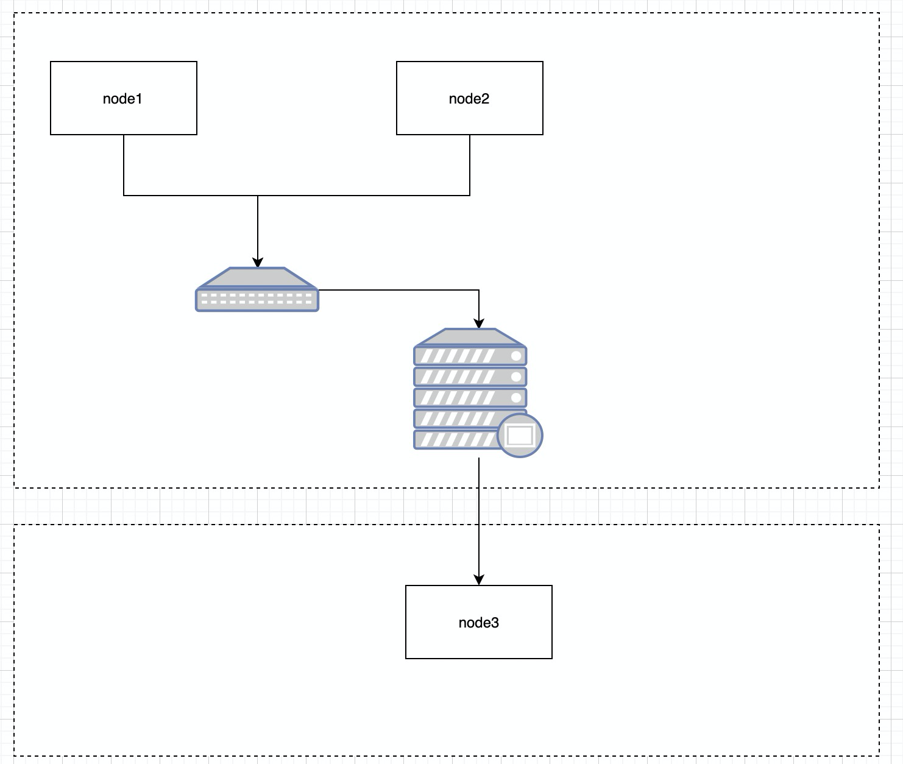
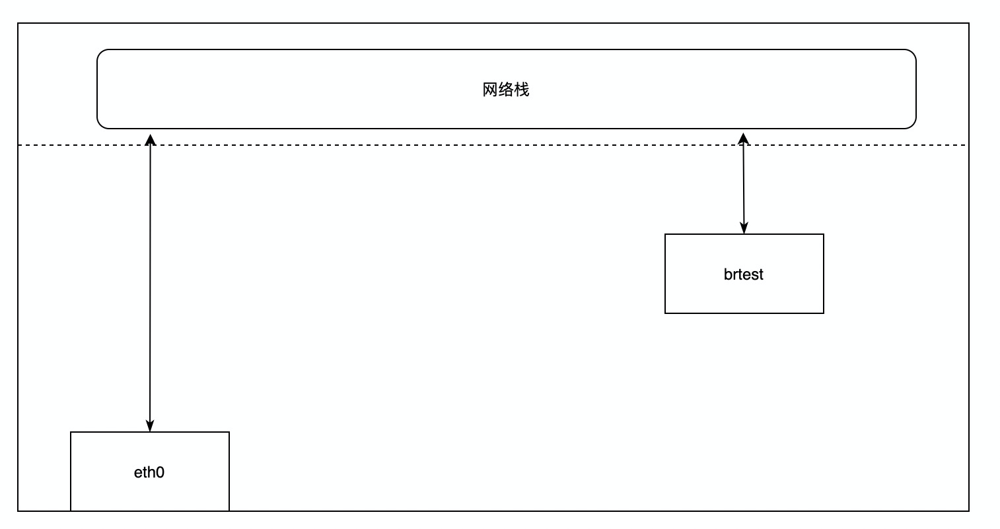
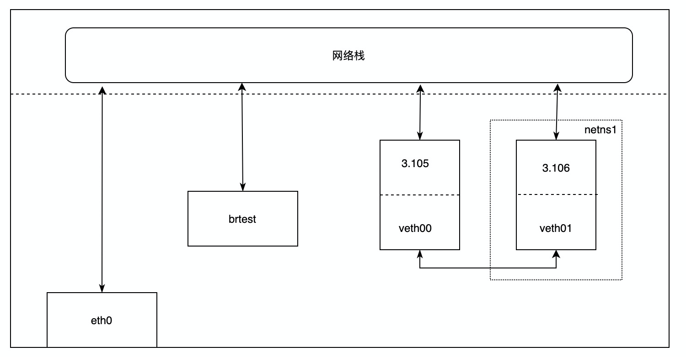
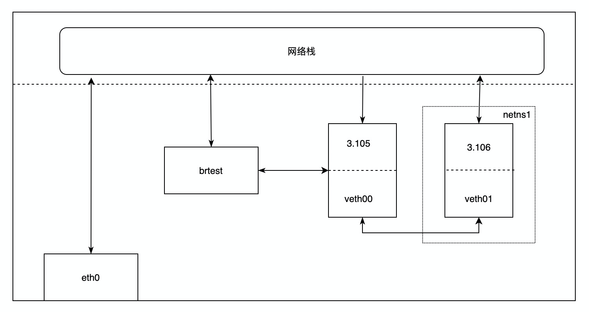
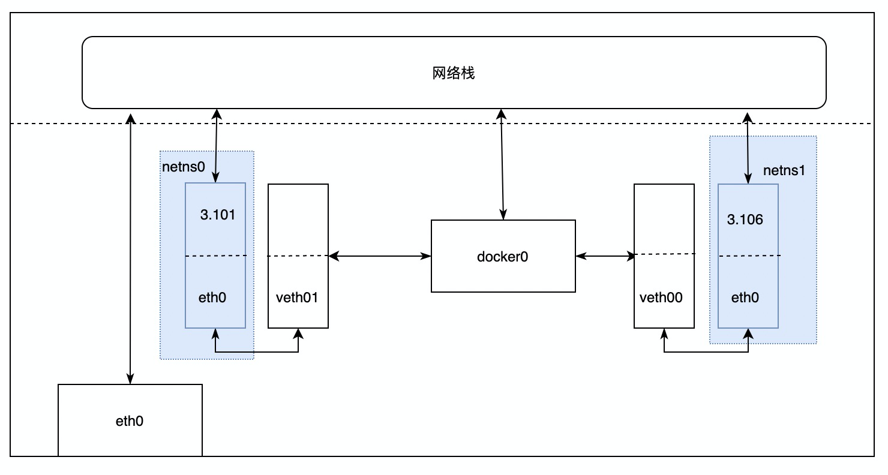

# linux bridge事件

## linux bridge是什么

Linux bridge就和普通的物理交换机差别不大。对于我们常见的物理网络，如下图：



交换机在物理网络中连接的是不同的物理机，这些物理机之间组成了一个二层网络，通过统一的网关路由器能够访问外部的环境（node1和node2属于同一个网络，node1和node3属于不同网络）。


bridge模式就是把上述的node改为namespace，把交换机改为linux bridge，可以把路由表理解为路由器的角色，记录下一跳的地址。

## linux bridge的作用

连接不同的（虚拟）网卡，连接到bridge上的设备会降级为从设备，即网卡没有了除了数据包的能力只负责转发，也可以理解为一根网线。bridge上的mac地址会变为网卡上的mac地址。

为什么叫从设备呢，我也是偶然发现的
```shell
~# brctl delif br0 veth2
device veth2 is not a slave of br0
```


## linux bridge实操

0、创建bridge
```shell
# 创建bridge
brctl addbr brtest
# 设置brtest可用
ip link set brtest up
# 查看这个bridge
brctl show brtest
```
这个时候宿主机的网路如下图所示:



这个时候通过brtest是不能ping通所有的IP的，因为啥也没有。

1、创建一个network namespace，为了让下面创建的两个网卡不在同一个namespace
```shell
# 创建一个network namespace
ip netns add netns1
# 查看宿主机上的network namespace
ip netns list
netns1
```

2、创建veth pair

```shell
ip link add veth00 type veth peer name veth01
# 查看能看到veth00和veth01
ip  link list
```

3、将其中一个veth放到第一步创建的namespace中
```shell
ip link set veth01 netns netns1
# 当前namespace看不到veth01了
ip link
# 查看netns1的网卡信息
ip netns exec netns1 ip link
1: lo: <LOOPBACK> mtu 65536 qdisc noop state DOWN mode DEFAULT group default qlen 1000
    link/loopback 00:00:00:00:00:00 brd 00:00:00:00:00:00
132: veth01@if133: <BROADCAST,MULTICAST> mtu 1500 qdisc noop state DOWN mode DEFAULT group default qlen 1000
    link/ether 12:36:29:d9:0d:c8 brd ff:ff:ff:ff:ff:ff link-netnsid 0
```

4、为第一步创建的namespace中的网卡分配ip
```shell
ip netns exec netns1 ip addr add 192.168.3.106/24 dev veth01
ip netns exec netns1 ip link set veth01 up
```

5、为另一个网卡分配ip

```shell
ip addr add 192.168.3.105/24 dev veth00
ip link set veth00 up
```
目前为止网络拓扑图如下：

可以看出brtest还是被孤立的，它现在谁也联通不了
```shell
# ping -I brtest 192.168.3.105
ping: Warning: source address might be selected on device other than brtest.
PING 192.168.3.105 (192.168.3.105) from 172.28.130.126 brtest: 56(84) bytes of data.
^C
--- 192.168.3.105 ping statistics ---
5 packets transmitted, 0 received, 100% packet loss, time 4100ms
 
 
# ping -I brtest baidu.com
ping: Warning: source address might be selected on device other than brtest.
PING baidu.com (39.156.69.79) from 172.28.130.126 brtest: 56(84) bytes of data.
^C
--- baidu.com ping statistics ---
9 packets transmitted, 0 received, 100% packet loss, time 8177ms
```
6、将veth pair的一端连到bridge上

```shell
ip link set dev veth00 master brtest
 
 
# brctl show brtest
bridge name bridge id       STP enabled interfaces
brtest      8000.4aafea69625d   no      veth00
```
这个时候网络拓扑图变为

变化了两点：
- veth00和brtest进行了互通
- 网络栈和veth00变为了单项通道，即veth00没有处理只有转发的能力
我们来验证一下veth00变为一个从设备
```shell
# ping -I veth00  192.168.3.106
PING 192.168.3.106 (192.168.3.106) from 192.168.3.105 veth00: 56(84) bytes of data.
^C
--- 192.168.3.106 ping statistics ---
3 packets transmitted, 0 received, 100% packet loss, time 2035ms
```
通过veth00 ping不同veth01了，这也很正常，数据包都到了brtest了么。

7、为bridge分配ip

所以给veth00分配ip一点意义就没有了，我们就可以把veth00的ip给brtest这个网桥了。
```shell
# 删除veth00的ip
ip addr del 192.168.3.105/24 dev veth00
# 给brtest赋ip
ip addr add 192.168.3.105/24 dev brtest
```
这个时候通过brtest连接veth01试试
```shell

# ping -I brtest  192.168.3.106 -c 1
PING 192.168.3.106 (192.168.3.106) from 192.168.3.105 brtest: 56(84) bytes of data.
64 bytes from 192.168.3.106: icmp_seq=1 ttl=64 time=0.060 ms
 
--- 192.168.3.106 ping statistics ---
1 packets transmitted, 1 received, 0% packet loss, time 0ms
rtt min/avg/max/mdev = 0.060/0.060/0.060/0.000 ms
```
但是现在还有个问题，通过brtest怎么连接到外网呢，就是把上述网络拓扑图中比较突兀的eth0也就是物理网卡，把它也变为和veth00一样的网线。

## linux birdge的使用场景

其实上述的就是容器比如dokcer的实现原理，对于虚拟机的实现原理可以理解为把veth pair换为tun/tap设备。

### 单节点容器相互访问


veth pair的一端在network namespace中，另一端接在了linux bridge上，所以图中的veth00/veth01就变为了从设备（linux bridge），即他们就变为了网线，没有了处理数据包的能力，只能转发数据包。

以192.268.3.101（container1） → 192.268.3.106（container2）为例：

1、 container1发送APR请求得到container2的mac地址

2、 container1的这个请求出现在了docker0网桥

3、 docker0网桥将ARP广播转发到其他接在docker0上的设备

4、 container2收到这个ARP请求，响应给container1

5、 container1拿到mac地址封装ICMP请求

6、 同样这个请求也会经由docker0出现在宿主机上

7、 docker0查到container2属于自己就转发给了container2

### 容器访问外部网络

以图中的container2要访问百度为例：

1、 container2 ping 220.181.38.148

2、 数据包同样会到达docker0网桥，即到达了宿主机

3、宿主机发现目的目的网段要交给eth0处理

```shell
~# route -n
Kernel IP routing table
Destination     Gateway         Genmask         Flags Metric Ref    Use Iface
0.0.0.0         172.28.143.253  0.0.0.0         UG    100    0        0 eth0
172.17.0.0      0.0.0.0         255.255.0.0     U     0      0        0 docker0
```
4、 由于源ip是内网ip还要进行一个NAT，通过eth0发到外网


## 参考

- https://segmentfault.com/a/1190000009491002#comment-area
- https://developer.aliyun.com/article/64855
