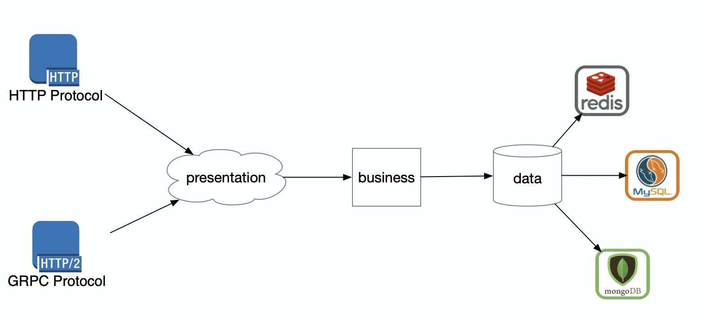
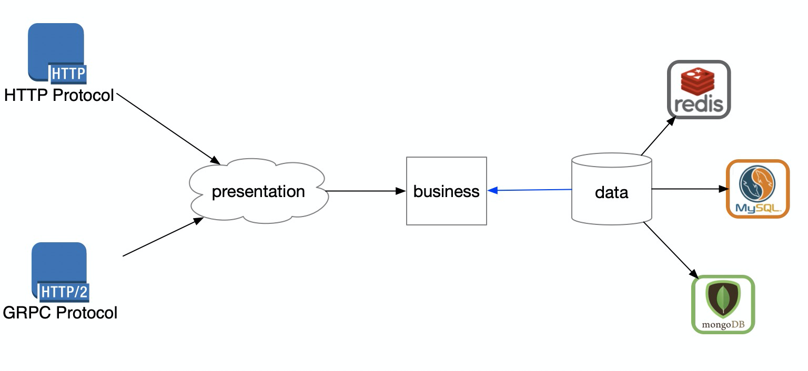

# 再谈DIP: 如何编写可测试代码

在前一篇文章[什么是SOLID设计原则](https://github.com/helios741/myblog/tree/new/learn_go/src/2021/04/solid)详细解释了什么SOLID的原则。今天我们通过一个搞项目的案例来真实的体验一下，做好了DIP之后让单元测试写起来爽翻天。


## 单元测试的重要性

单元测试在现今项目中的重要性不言而喻，尤其是Bob大叔大力宣扬单元测试，甚至在《代码整洁之道》中还说出覆盖率要尽可能的百分之百（可以看我写的笔记[《代码整洁之道：程序员的职业素养》](https://mp.weixin.qq.com/s/iIc-H50_uSdd73zQEMdWMQ)），因为这个两个编程老牛还公开掐过架（见[Coplien and Martin Debate TDD, CDD and Professionalism](http://www.infoq.com/interviews/coplien-martin-tdd)）。以我的资历肯定不可能评价Bob大叔和Jim Coplien，但是还是要说说的我的看法。个人觉得Bob大叔的想法有点偏激，毕竟在业务中老板是过来请你写代码的不是请你来写单测的，要是按照Bob大叔提倡的TDD，那基本写不了快糙猛的代码了。我认为写单元测试的地方有下面几个：

1、 出现过bug的地方，写单测是为了以后不会出现同样的bug

2、 方便的地方，如果你正在接运营商的短信服务，在测试可用性的时候没必要走全流程，走可用流程即可

3、 公用方法，这种必须保证正确并且增加到CI中，因为过于重要必须保证可用

4、 容易让人理解，在看go语言的开源项目的时候单测能让人很好理解，一是因为能马上运行局部代码看到效果，二是了解这个函数输入


对于业务测试尽量遵循好第一个原则即可。


## 业务代码写单测的困境

一句话就是*依赖*太多。



以典型的三层架构为例（表示层/转换层 --> 逻辑层 --> 访问层）。审视一下你的代码（专指后端业务代码），能不能做到不初始化DB就能测试；能不能做到不引入全局的包（比如静态配置、私有日志库）就能测试。如果你的回答是否定的并且还还认可我这幅图，那么就证明你的代码正在深陷泥潭。

如果上图的箭头表示控制的方向，那么大概率你的代码是不可测试的，不可测试的代码基本等于不能修改或者重构，不能修改或者重构的代码基本等于死代码，死代码咱就别说了，成天就剩下抱怨了，抱怨产品经理需求多，抱怨前任写的代码搓，抱怨同事不会体谅人。


虽然可以不采用TDD的模式去开发，但是如果代码不可测试就证明耦合太严重。


## 业务单测的前提

那么如果破局呢，其实只要将上图中的一个两个箭头换个方向即可，即：



只要把业务逻辑层和数据访问层的**依赖倒置**就可以了。这时候业务逻辑层就回归了中心的位置（他本身就应该是中心位置，老板只关系你功能实现没实现，管你存在哪干啥）。那么怎么做到数据访问层依赖业务逻辑层呢，这其实用的java中已经很成熟的技术了，叫依赖注入。


## 获取学生信息案例

项目地址[简单学生管理系统](https://github.com/helios741/myblog/tree/new/learn_go/src/2021/04/again-dip/student)，这是一个demo项目，希望你能过这个项目深入理解DIP（依赖倒置原则）以及如何编写可测试代码的思想。

我在项目中用了gin框架，但是就是用了简单的路由功能你完全不用在意。

### 1、 业务逻辑层(service)

这一层是工程的核心所在，向上要控制能**提供给表示层什么功能**，向下要向数据访问层**索取哪些功能**。两者的含义是：

- 向表示层提供给表示层什么功能： 我就这么多功能提供给你，你爱用不用
- 向数据访问层索取哪些功能：你要是想接进来必须给我这些功能。

看出来了没，业务逻辑层必须是个强硬的乙方（对表示层），也是个强硬的甲方（对数据访问层）。

先看服务层对数据放层的限制：

```go
type StudentRepo interface {
	GetByID(id int) (*Student, error)
}
type studentUseCase struct {
	repo StudentRepo
}
func NewStudentUseCase(repo StudentRepo) StudentUserCase {
	return &studentUseCase{repo: repo}
}
```

也就是要想在服务中使用某个数据访问层，必须实现GetByID这个方法。

再来看对表示层的限制

```go
type StudentUserCase interface {
	Get(id int) (*Student, error)
}
func NewStudentUseCase(repo StudentRepo) StudentUserCase {
	return &studentUseCase{repo: repo}
}
```

我就提供一个通过id查学生的方法你爱用不用，Get方法的具体实现如下（可不关注）：

```go
func (suc *studentUseCase) Get(id int) (*Student, error) {
	stu, err := suc.repo.GetByID(id)
	if err != nil {
		return nil, err
	}
	// 还会有很多业务逻辑
	return &Student{
		Name: stu.Name,
	}, nil
}
```

### 2、 数据访问层(repository)

刚才说了如果要对接上service必须实现**GetByID(id int) (*Student, error)**这个方法，那么我们就来看一下：

```go
var _ service.StudentRepo = (*student)(nil)

type student struct {
}

func (s *student) GetByID(id int) (*service.Student, error) {
	return mockStudent(id)
}

func NewStudentRepo() service.StudentRepo {
	return &student{}
}
```

可以调用NewStudentRepo就能返回一个实现了service.StudentRepo的对象，然后注入到上面的NewStudentUseCase即可使用（一会再串联起来， 如果*var _ service.StudentRepo = (*student)(nil)*这个看不懂，可以看[GO语言初学八小问](https://github.com/helios741/myblog/tree/new/learn_go/src/2021/04/effective_go)有具体解释）。

### 3、表示层

这一层也有叫转换层（如果你看了我这个demo项目，我也给它取名delivery）。主要作用负责各种service的组装、参数校验等功能。因为后端没有展示层所以再service之前做了这么很薄的一层。

```go
type studentDelivery struct {
	suc service.StudentUserCase
}

func (sd *studentDelivery) Get(id int) (*StudentReply, error) {
	stu, err := sd.suc.Get(id)
	if err != nil {
		return nil, err
	}
	return &StudentReply{
		Name: stu.Name,
		Sex: stu.Sex,
	}, nil
}

type StudentDelivery interface {
	Get(id int)(*StudentReply, error)
}

func NewStudentDelivery(suc service.StudentUserCase) StudentDelivery {
	return &studentDelivery{suc: suc}
}
```

其中StudentReply就是需要返回给调用者的数据结构。

### 4、 整合起来

来看下如何把三者整合起来：

```go
r.GET("/students/:id", func(ctx *gin.Context) {
		stuRepo := repository.NewStudentRepo()
		stuService := service.NewStudentUseCase(stuRepo)
		stuDelivery := delivery.NewStudentDelivery(stuService)
		// ...
		stu, err := stuDelivery.Get(id)
		// ...
		ctx.JSON(http.StatusOK, gin.H{"data": stu})
	})
```

将数据访问层(repo)注入到逻辑层(service)表示使用某个存储；将逻辑成(service)注入到表示层(delivery)表示提供这些能力。这样一个三层解耦架构就出现了，我们能分别对每一层进行测试，只要是实现对应的方法即可。

### 5、测试

针对这三层分别举个例子：

#### 数据访问层

```
func TestStudent_GetByID(t *testing.T) {
	s := repository.NewStudentRepo()
	stu, err := s.GetByID(1001)
	if err != nil {
		t.Errorf("[TestStudent_GetByID] error is %+v", err)
		return
	}
	t.Logf("[TestStudent_GetByID] success student entity is %+v", stu)
}
```

这个最简单，但是一般DB访问的话，会是下面的方式：

```go
type student struct {
	Conn *sql.DB
}
```

会在单测的时候传递句柄进去即可。

#### 逻辑服务层

```
type testStu struct {
}

func (ts *testStu)GetByID(_ int) (*service.Student,error)  {
	return &service.Student{Id: 32}, nil

}

func TestStudentUseCase_Get(t *testing.T) {
	a := &testStu{}
	stu := service.NewStudentUseCase(a)
	s,_ := stu.Get(43)
	if s.Id == 32 {
		t.Logf("[TestStudentUseCase_Get] success")
		return
	}
	t.Error("[TestStudentUseCase_Get] error")
}
```

这样我们可以专注于测试我们逻辑，即能给定输入能有固定的输出。不必担心DB连接什么的了。

#### 表示层

```go
type testService struct {
}

func (ts *testService)  Get(_ int) (*service.Student, error) {
	// 想干啥干啥
	return &service.Student{}, nil
}

func TestStudentDelivery_Get(t *testing.T) {
	s := &testService{}
	stuDelivery := delivery.NewStudentDelivery(s)
	stu, err := stuDelivery.Get(5)
	if err != nil {
		t.Errorf("[TestStudentDelivery_Get] error is %+v", err)
		return
	}
	t.Logf("[TestStudentDelivery_Get] studentRelay is %+v", stu)
}
```

和上面一样的逻辑，只要把service注入进去就能测试delivery的逻辑而不用担心service层。

### 6、 总结

上述五个步骤通过一个demo给你展示了如何使用依赖反转(DIP)和依赖注入(DI)实现可测试的代码。如果你有时间一定要读读我写的[整个工程demo](https://github.com/helios741/myblog/tree/new/learn_go/src/2021/04/again-dip)。然后再结合自己的代码进行体会。

## 总结

我在这遍文章先给你讲述了单元测试的重要性，以及分析了你的代码写不了单测的原因是因为过于耦合，通过在[什么是SOLID设计原则](https://github.com/helios741/myblog/tree/new/learn_go/src/2021/04/solid)中学习的DIP，就能将三层架构解耦（注意我这里并没有说彻底解耦），做到独立测试。

如果你觉得有思考，那么请在思考一下这两句话：

- 高层不应该依赖底层，二者应该依赖抽象
- 抽象不应该细节，细节应该依赖抽象


