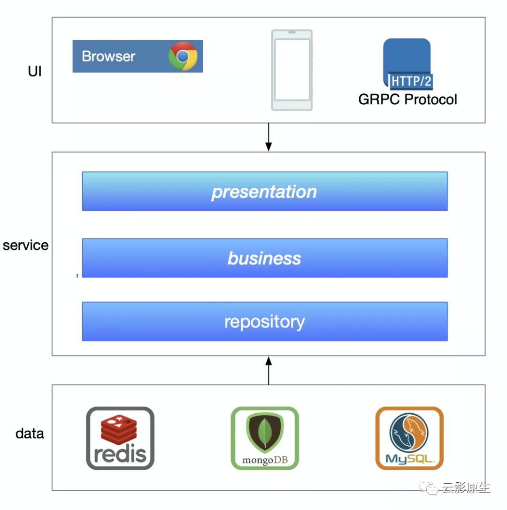
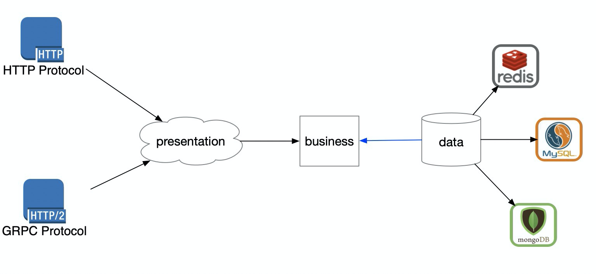

# 再谈ISP: 如何让代码解耦

在以前的文章[什么是SOLID设计原则](http://mp.weixin.qq.com/s?__biz=MzU0Njk1NTczNA==&mid=2247484069&idx=1&sn=58e5c9f6e3cb8dc1b4d90ffe2641fce7&chksm=fb548a1ccc23030a8d9c11e51e27d5fe3602b48a5e43560e1dc773bedd8abe5add305ca7cebc&scene=21#wechat_redirect)已经介绍过什么ISP（接口隔离原则），核心是没有用到的东西不要用，并且在文章中给出了相对的示例，今天通过一个真实案例来带你体验一下使用ISP如何让代码解耦。


⚠️：如果有时间一定要点击原文，看下代码仔细把玩。


## **代码为什么要分层**

> All problems in computer science can be solved by another level of indirection
>
> Butler Lampson

这里的分层是指的逻辑层，即我们可能用MVP、MVC这种分层架构来写一个后端服务（对于三层架构和MVC的区别有兴趣可以参考[三层架构和MVC的区别是什么](http://mp.weixin.qq.com/s?__biz=MzU0Njk1NTczNA==&mid=2247484099&idx=1&sn=5103f7fa88d7097a48b07b86cb0b7d2b&chksm=fb548a7acc23036cf7466d8e499aefb90da5cfdacb090f86b2acb7ce51c45e655526cbfc33cf&scene=21#wechat_redirect)）。可能你会觉得这个问题就是废话，从一开始写代码我们就被教导这是为了隔离逻辑，***表示层***专注于和客户端（其他服务）打交道，***逻辑层***专注于自己的核心逻辑，***数据层***专注于和数据打交道，这样让代码看起来更加清晰。

这么多年看下来感觉大家的理解真是千奇百怪，总结起来就是三个字***强耦合***。你可以问自己下面三个问题：

1. 如果换个表示层，比如以前处理HTTP的REST请求现在改为gprc需不需要的逻辑层代码
2. 如果换个后端存储，比如从mysql换到mongodb，需不需要动逻辑层代码
3. 如果依赖的服务变换了，比如依赖的服务转化了数据返回格式或者干脆换个依赖的服务，需不需要改动逻辑层代码

如果你的回答有一个***是***的话，那么你就没有理解分层的价值，你的代码就是强耦合的。


## **应该怎么分层**

我们把[三层架构和MVC的区别是什么](http://mp.weixin.qq.com/s?__biz=MzU0Njk1NTczNA==&mid=2247484099&idx=1&sn=5103f7fa88d7097a48b07b86cb0b7d2b&chksm=fb548a7acc23036cf7466d8e499aefb90da5cfdacb090f86b2acb7ce51c45e655526cbfc33cf&scene=21#wechat_redirect)中的三个逻辑层拿出来再看一下：



- presenation: 为了对接上层的客户端，把客户端格式转换为逻辑层好处理的格式以及把逻辑层返回的格式转换为和客户端约定的格式，可以有自己的领域对象（DTO）。
- business: 逻辑层，是业务的核心，所有的层都应该是给这一层服务的。可以有自己的领域对象（BO）。
- repository: 给逻辑层提供存取数据的地方，逻辑层不应该依赖它的细节，比如不应该关心对接的是mysql还是tidb，领域对象一般和表结构一一对应（DO）。

这里并不是说分层一定是最好的，如果的研发团队水平高的话也可以尝试DDD。


## **ISP对结耦的指导**

我们以[再谈DIP: 如何编写可测试的业务代码](http://mp.weixin.qq.com/s?__biz=MzU0Njk1NTczNA==&mid=2247484083&idx=1&sn=8b8c0d155f7dbb402f739562d4b919e7&chksm=fb548a0acc23031cd64a10af8abc43fe9d632f8da0f322d4ae603962ce561fdf002ef1d97941&scene=21#wechat_redirect)提到的获取学生信息API为例（点击原文有代码），这次我们从上往下看。


### 0、 API定义

```go
{
  stuRepo := repository.NewStudentRepo()
  stuService := business.NewStudentUseCase(stuRepo)
  stuDelivery := delivery.NewStudentDelivery(stuService)
  r.GET("/students/:id", stuDelivery.Get)
  r.PUT("/students/:id", stuDelivery.Update)
}
```

初始化了一些对student表示层的东西，然后就交给表示层去处理了。

### 1、presenation层

我们主要看Get这个方法：

```go
type studentDelivery struct {
  suc business.StudentUserCase
}

type StudentReply struct {
  Name string `json:"name"`
  Sex string `json:"sex"`
}

func (sd *studentDelivery) Get(ctx *gin.Context) {
  id, err := strconv.Atoi(ctx.Param("id"))
  if err != nil {
    // err handle
    return
  }
  stu, err := sd.suc.Get(id)
  if err != nil {
    // err handle
    return
  }
  ctx.JSON(http.StatusOK, gin.H{"data": StudentReply{
    Name: stu.Name,
    Sex: stu.Sex,
  }})
}
```

这一层的流程比较固定：

1、 将客户端传递过来的对象转换为逻辑层需要的东西，之前要增加校验等逻辑

2、 传递给逻辑层，并且拿到逻辑层的返回

3、 将逻辑层的返回转换为和客户端约定的格式

所以这一层也叫转换层。


### 2、business层

再来看看通过delivery层调用business层的Get的方法：

```go
type StudentUseCase struct {
  Id int
  Age int
  Sex string
  Name string
  Like string
}

type StudentUserCase interface {
  Get(id int) (*StudentUseCase, error)
}

func (suc *studentUseCase) Get(id int) (*StudentUseCase, error) {
  stu, err := suc.repo.GetByID(id)
  if err != nil {
    return nil, err
  }
  // 还会有很多业务逻辑
  return &StudentUseCase{
    Name: stu.Name,
  }, nil
}
```

这一层的StudengUseCase对于业务来说是很好处理的。剩下的就是你的核心逻辑了

### 3、repository层

最后看看business调用的GetByID方法

```go
func (s *student) GetByID(id int) (*business.StudentUseCase, error) {
	return mockStudent(id)
}
func mockStudent(id int) (*business.StudentUseCase, error) {
	if id == 1001 {
		return nil, errors.Wrap(SqlNotFound, fmt.Sprintf("sql err for mockStudent"))
	} else if id == 1002 {
		return nil, errors.New("this is sql error")
	}
	stu := business.StudentUseCase{
		Id: id,
		Name: "Helios",
		Like: "dsdsd",
		Age: 23,
	}
	return &stu, nil
}
```


这一层就是和数据打交道了，主要是将逻辑层的数据格式转换为数据库里面的格式即可。


在每一层中定义专属那一层的领域对象，共同为逻辑层服务，就构成了一个解耦的架构。我们在来看看开头提到的三个问题，我们分别给出答案：

1. 如果换个表示层，比如以前处理HTTP的REST请求现在改为gprc需不需要的逻辑层代码。**答：不用，多一个grpc的表示层即可，目的为了转换为逻辑层对象**
2. 如果换个后端存储，比如从mysql换到mongodb，需不需要动逻辑层代码。**答：不用，逻辑层以前就不关注存在哪里，修改数据层和DB之间的协议即可**
3. 如果依赖的服务变换了，比如依赖的服务转化了数据返回格式或者干脆换个依赖的服务，需不需要改动逻辑层代码。**答：不用，和数据层类似**

## 总结



[再谈DIP: 如何编写可测试的业务代码](http://mp.weixin.qq.com/s?__biz=MzU0Njk1NTczNA==&mid=2247484083&idx=1&sn=8b8c0d155f7dbb402f739562d4b919e7&chksm=fb548a0acc23031cd64a10af8abc43fe9d632f8da0f322d4ae603962ce561fdf002ef1d97941&scene=21#wechat_redirect)把三层的职责说清楚，他们共同目标是为业务逻辑层服务。今天我们讨论的是如何把三层的边界定义好。架构设计的目标之一就是解耦，如果今天你看懂了，并且实践到自己的项目中，那么你是到达了第一步。


通过两篇文章的案例将SOLID的I和P详细分析了下，以后可能不会继续分析S、O以及L，因为LSP（里式替换原则）是如何利用好继承，我们现在已经不怎么用继承了，因为继承是最耦合的东西。关于SRP（单一职责原则）核心讲的是关注点分离以及OCP的核心是可扩展，这两点都有点仁者见仁智者见智，很难像今天的ISP(接口隔离原则)以及DIP（依赖反转）那么可固定。

⚠️：如果有时间一定要点击原文，看下代码仔细把玩。