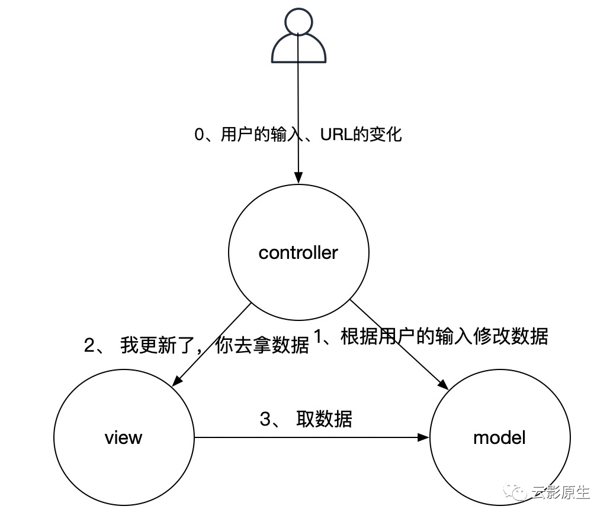
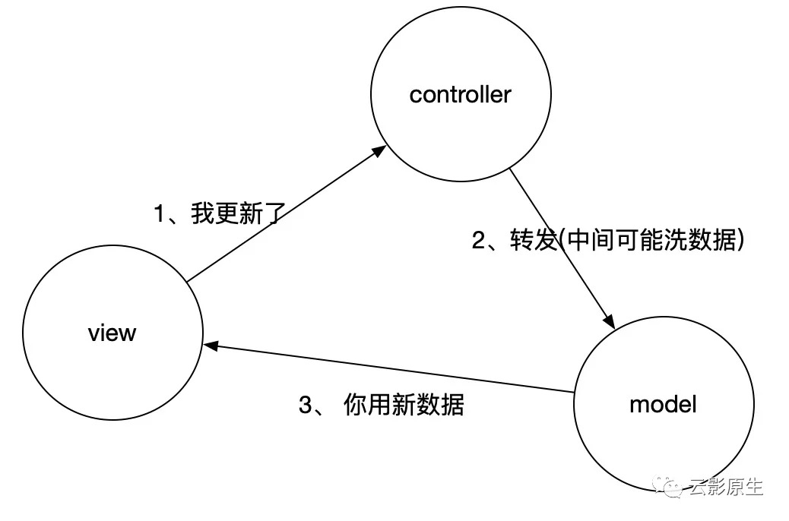
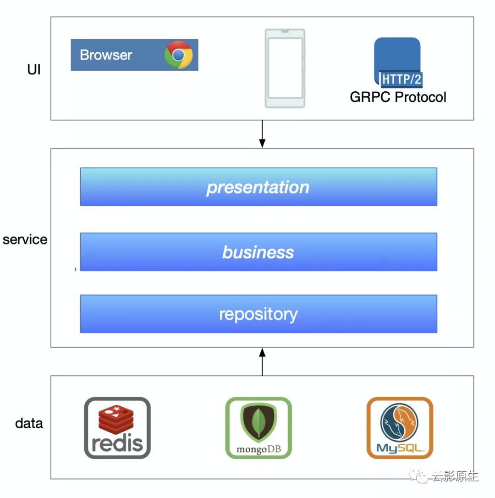
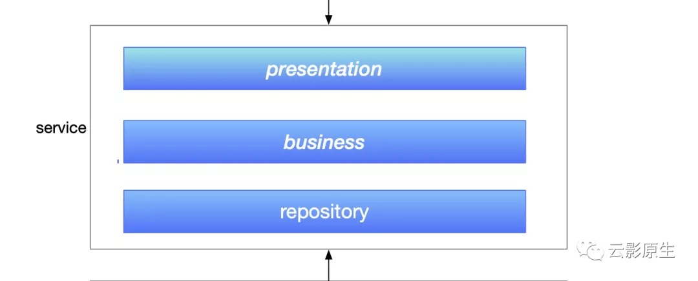

# 三层架构和MVC的区别是什么

在写完[再谈DIP: 如何编写可测试代码](https://github.com/helios741/myblog/tree/new/learn_go/src/2021/04/again-dip)之后引起了一个本应该出现在十年前的思考，这并不是一句玩笑话，在stackoverflow上的讨论基本都是在十年之前，甚至更久（[MVC Vs n-tier architecture](https://stackoverflow.com/questions/698220/mvc-vs-n-tier-architecture)、[MVC vs. 3-tier architecture?](https://stackoverflow.com/questions/4577587/mvc-vs-3-tier-architecture)、[what is the difference between 3 tier architecture and a mvc?](https://stackoverflow.com/questions/10739914/what-is-the-difference-between-3-tier-architecture-and-a-mvc)）。如果也有这个疑问，那么今天就解开一些吧。

## mvc和三层架构

MVC可以说是C/S架构下的产物，当代的年轻人已经很少听过C/S架构了，当初java GUI、MFC这些东西通过拖拖拽拽就能实现一个应用，还是风靡一时的。这种架构就算是今天你去搜的话，还没有个固定的说法，直到现在MVC的架构还在演进但思想是一致的，我们看下图：

如果按照当今的开发思路，感觉就是太耦合了。但是在当时项目开发量不大的情况下已经够用了。

你可能还会看到下面的图，这是比较“现代化”的MVC了，已经开始遵循数据的单向流动了：

如果你是搞前端的，那么在加上一条从view指向model的箭头你一定很熟悉了。今天的MVP、MVVM都可以说是MVC的变种。

## 三层架构又是什么

首先我们明确两个概念，tier和layer虽然翻译过来都是层的意思，但是三layer架构和三tier架构就是完全两码事了。

tier表示物理方面的***层***，比如现在浏览器界面通过HTTP协议访问后端服务，后端服务通过某种数据库协议请求数据库。UI、后端服务以及数据库这就是三tier，他们可能都不在同一台机器甚至不在同一个集群中。

layer更倾向于逻辑的***层***,比如刚才说的MVC、MVP以及MVVM都能发生在前端的一个服务中，也可能发生在后端的一个服务中。

下面图很好展示他们的关系：

这个图的整体就是三tier架构，但是service为了更好的处理自己的逻辑会分不同的layer，可能是DDD也可能是分层架构。

## 三层架构对日常开发的思考

感觉用tier和layer说话的真的太累了，反正本文后面也没有多少东西了，后续除了说***三层架构***的时候层属于tier剩下的都属于layer，如果你有一些开发经验的话，理解起来一点困难都没有。

看中间的service这属于我们的一亩三分地：

怎让他更优雅一点呢，向上有UI传递过来的千奇百怪格式的数据，向下还要对接各种复杂格式数据库。所以要是让代码更加优雅的话，就要让上下两层去适应业务的主要逻辑（这是[再谈DIP: 如何编写可测试的业务代码](http://mp.weixin.qq.com/s?__biz=MzU0Njk1NTczNA==&mid=2247484083&idx=1&sn=8b8c0d155f7dbb402f739562d4b919e7&chksm=fb548a0acc23031cd64a10af8abc43fe9d632f8da0f322d4ae603962ce561fdf002ef1d97941&scene=21#wechat_redirect)的主要逻辑）。

说到这里就算service的三层在逻辑上也是独立的，他们应该有各自处理的对象，不应该从presenation到business再到repository都是用的一个对象，这样太耦合了，我在[什么是SOLID设计原则](http://mp.weixin.qq.com/s?__biz=MzU0Njk1NTczNA==&mid=2247484069&idx=1&sn=58e5c9f6e3cb8dc1b4d90ffe2641fce7&chksm=fb548a1ccc23030a8d9c11e51e27d5fe3602b48a5e43560e1dc773bedd8abe5add305ca7cebc&scene=21#wechat_redirect)介绍的ISP设计原则就是杜绝这个问题，所以在presenation、business以及repository这三层中要分别有他们的对象（体现到golang中就是不同的类型）：

- DO(data object): 和数据库中的表一一对应的，是在repository具有的对象
- BO(business object): 这方便更好的处理业务定义的对象，是在business具有的对象
- DTO(data transfer object): 客户端传递过来的对象，是在presenation层具有的对象

知道了这几个对象，那么我们再来看这三个逻辑层应该有的职责：

- presenation: 做DTO到BO的转换，目的是为了更好的服务核心的逻辑层(business)
- business: 只管处理核心业务
- repository: 做BO到DO的转换，不在business层转换 一是为了减少business层的非业务核心逻辑，二是为了和数据库中的数据做映射。

## 引用

https://stackoverflow.com/questions/698220/mvc-vs-n-tier-architecture

https://www.c-sharpcorner.com/blogs/difference-between-mvc-and-3tier-architecture

https://www.codeproject.com/Articles/430014/N-Tier-Architecture-and-Tips

https://en.wikipedia.org/wiki/Multitier_architecture

