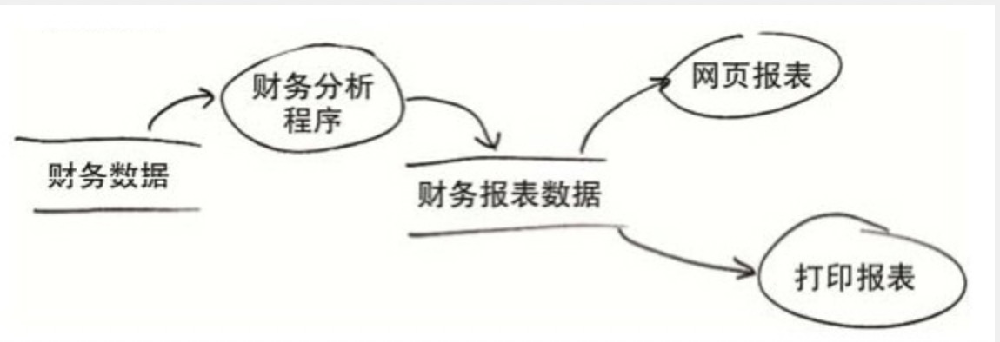
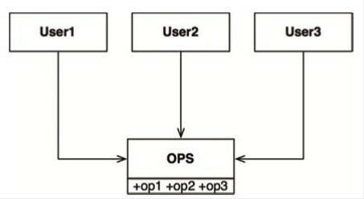

# 什么是SOLID设计原则

SOLID是Bob大叔的著作《架构整洁之道》中提炼总结的。SOLID是五个设计原则的缩写，目的是告诉我们如何将*类*或者*数据*组织为程序，目标如下：

- 使软件可容忍被改动
- 使软件更容易被理解
- 使组件/类可复用

先来简单看下这五个原则：

- SRP(single responsibility principle)：单一职责原则，每个模块只有一个被修改的理由
- OCP(open-close principle)：开闭原则，通过新增代码修改系统行为而不是通过修改代码
- LSP(liskov substitution principle)：里式替换原则，遵守约定来让组件可被替换
- ISP(interface segregation principle)：接口隔离原则，避免不必要的依赖
- DIP(dependency inversion principle)：依赖反转，底层应该依赖高层，依赖抽象而不是细节

下面我会结合实际场景详细讲解一下这五个原则。


## SRP: 单一职责原则

当看到一个类有过多的数据或者方法的时候，你就应该警惕，这种情况很有可能是违反了SRP。因为数据过多就意味着职责不清晰，干的太多太全反而不好。数据的隔离型会变差，隔离型变差进而导致了安全性变差。做的过多会让人理解起来更加不容易。


### 任何一个软件模块都应该有且仅有一个被修改的原因

先来看个简单的学生管理的情景，这个学生实体有修改密码、统计课程以及增加课程的需求。代码如下：

```golang
type Course string

type user struct {
	name string
	pwd string
	age int
	courses []Course
}
func (u *user) TotalCourse() int {
	return len(u.courses)
}

func (u *user) AddCourse(c Course) {
	u.courses = append(u.courses, c)
}

func (u *user) UpdatePassword(pwd string) {
	u.pwd = pwd
}

type User interface {
	TotalCourse() int
	AddCourse(c Course)
	UpdatePassword(pwd string)
}

func NewUser(name, pwd string, age int, courses []Course) User {
	return &user{name, pwd,age,courses}
}

func HandleUpdatePWD(pwd string) {
	u := NewUser("helios", "heliospwd", 99, []Course{})
	u.AddCourse("hahaha")
	u.UpdatePassword("newpwd")
	// ...
}
```

请仔细看HandleUpdatePWD这个函数，不仅修改了密码还顺便修改了函数，虽然这种情况很少出现但是是能做到的，理论上用户的基本信息和上课信息是隔离的，那么解决方法也呼之欲出了：

```go
type Course string

type user struct {
	name string
	pwd string
	age int
	
}

type student struct {
	courses []Course
}
func (s *student) TotalCourse() int {
	return len(s.courses)
}

func (s *student) AddCourse(c Course) {
	s.courses = append(s.courses, c)
}

func (u *user) UpdatePassword(pwd string) {
	u.pwd = pwd
}

type Student interface {
	TotalCourse() int
	AddCourse(c Course)
}

type User interface {
	UpdatePassword(pwd string)
}

func NewUser(name, pwd string, age int) User {
	return &user{name, pwd,age}
}

func NewStudent(courses []Course) Student {
	return &student{courses}
}

func HandleUpdatePWD(pwd string) {
	u := NewUser("helios", "heliospwd", 99)
	u.UpdatePassword("newpwd")
	// ...
}
```

这样修改之后，修改基本方法这辈子也不能触碰到课程相关的信息了。

### 任何一个软件模块都应该只对某一类行为者负责

再来看个书中的例子，体会一下什么叫**任何一个软件模块都应该只对某一类行为者负责**。公司内部的工资管理系统的Employee提供了下面三个方法：


- calculatePay()函数是由财务部门制定的，他们负责向CFO汇报
- reportHours()函数是由人力资源部门制定并使用的，他们负责向COO汇报
- save()函数是由DBA制定的，他们负责向CTO汇报

calculatePay和reportHours共用regularHours计算正常工作时长，如下：


然后CFO团队修改了政策，同时也修改了regularHours方法，然后上线之后发现自己的功能没问题，美滋滋的就回家了。但是当COO统计报表的时候就炸锅了。

修改方式也是拆分为不同的抽象，让他们只对分别的组织线负责。


## OCP: 开闭原则

开闭原则讲的怎么让代码具有可扩展性，当我们系统添加或者修改功能的时候，通过新增代码而不是通过修改老的代码而达到目的。

这个原则容易上初学者误解，初学者觉得很简单呀，从API到数据存储的路径上，如果现在有的东西我就复用，没有我就修新增一个完了呗。但是开闭原则有个前提就是*尽可能复用*。比如一个函数八行代码只有最后一行代码不一样，那你就重写一个，那不就真成传说中的CV（ctrl + v / ctrl + v）程序员了么。

开闭原则本质上是面向接口编程的一种体现。



我们要根据财务数据生成报表，可能是网页报表也可能是打印报表将来也可能是邮件报表。当目前只有打印网页报表的时候你的程序可能是下面这个样子：

```go
func HandleReport(id int) {
	data := getData(id)
	report := genReport(data)
	printWeb(report)
}
```

如果来了打印报表，如果遵循OCP的话只能变为CV程序员了，增加下面的方法：

```go
func HandleReport2(id int) {
	data := getData(id)
	report := genReport(data)
	printOther(report)
}
```

如果你开始的时候有很好的设计的可能会考虑到这一点，把打印报表尽心一下抽象就像下面这样：

```go
func HandleReport(id int, rp ReportPrinter) {
	data := getData(id)
	report := genReport(data)
	rp.Print(report)
}
```

这样就能适应更多的变化。当然OCP并不是让你永远不要修改代码，修改代码可能会影响线上服务但是要在可扩展性和危险性之间做一次权衡。要不然《重构》这本书就出版了，而且没有谁的代码是一步到位的。


## LSP: 里式替换原则

这个原则是Barbara Liskov发明的，所以就按照它名字命名了。来看下这个原则的定义：

> 这里需要的是一种可替换性：如果对于每个类型是S的对象o1都存在一个类型为T的对象o2，能使操作T类型的程序P在用o2替换o1时行为保持不变，我们就可以将S称为T的子类型

看着挺唬人的，其实就是泛型，也就是说一个参数能接受父类型，那么给它传递子类型也没问题。

LSP是指导的继承关系，这个原则也只适用于典型的面向对象语言，比如C++/java这些，但是你看最近十几年新出的语言，无论是python还是golang/rust也好都是所谓的duck类型。这也反映出了继承在面向对象中逐渐要退出历史舞台了。因为没有哪一种关系比继承关系更加耦合的了。因为golang的1.x中没有泛型，我们就用python演示一个典型违反LSP的场景。

```go
class Rectangle :
    def __init__(self):
        self.h = 0
        self.w = 0

    def setH(self, h):
        self.h = h
    def setW(self, w):
        self.w = w
    def area(self):
        return self.h * self.w

class Square(Rectangle):
    def setH(self, h):
        self.h = h
        self.w = h
    def setW(self, w):
        self.w = w
        self.h = w
if __name__ == '__main__':
    r = Square()
    r.setH(2)
    r.setW(5)
    assert r.area() == 10
    print("ok")
```

倒数第二行的代码就会断言失败。这种情况其实就不适合用继承了，因为一个是几何上的概念（正方式是特殊的四边形），但是在编程表达却不是这样的。


## ISP: 接口隔离原则

ISP主要讲究的是隔离二字，你不要用的依赖就不用，你可能会好奇，我用的东西怎么可能我用不上呢。给你展示一下我*经常*和同事的一段的对话：

- 同事：Helios，辛苦看一下为啥编译失败了
- 我（心想）：不是你说辛苦我就想辛苦的。。。你读读报错信息不行么，难道你登录的时候密码错了，你也拿着“密码或者账号错误”的错误信息找开发者么
- 我（实际）：你这个是因为缺少这个依赖
- 同事：我没有引用这个依赖呀
- 我（心想）：牛X，都不过脑子么
- 我（实际）：你依赖的依赖可能用了
- 同事：好的，我去找同事看一下
- ending....

这就是典型的自己都不知道依赖了什么，对于npm管理的却是一连串的比较多难以发现，但是对于架构选型的时候经常会依赖大的中间件，比如非zookeeper不行、只能对接Kafka之类的。这类是值得我们认真去考虑的。

比较典型的是作者这个例子：



user1、user2、user3分别依赖了OPS的op1、op2、op3，对于c++/java这种如果op2变化了，那么User1和User3也要重新编译。具体改进可以参考SRP的拆分，变为：


最终代码变为下面这样：

```go
type OPS struct {
	
}

func (o *OPS)Op1()  {
	
}
func (o *OPS)Op2()  {

}
func (o *OPS)Op3()  {

}

type U1Ops interface {
	Op1()
}
func NewUser1() U1Ops {
	return &OPS{}
}

type U2Ops interface {
	Op1()
}
func NewUser2() U1Ops {
	return &OPS{}
}


type U3Ops interface {
	Op1()
}
func NewUser3() U1Ops {
	return &OPS{}
}

```

这个不仅在代码级别的依赖有用，也告诉我们在架构设计的时候不要因为芝麻丢了西瓜，如果你们团队并没有人会zookeeper那么就不要引入依赖zookeeper的中间件了，不要只是看到它带来的好处还要看它带来的坏处。


## DIP: 依赖反转

这应该是个贯穿始终的思想。我们在前几个原则中为什么要强调依赖接口而不是具体实现。因为接口是稳定的实现是易变的，这就引出了依赖反转这个原则：

- 高层不应该依赖底层，二者应该依赖抽象
- 抽象不应该依赖细节，细节应该依赖抽象


### 高层不应该依赖底层，二者应该依赖抽象

这句话换为程序员界比较经典一句话就是“没有什么不是加一层不能解决的”。


当我们要在业务中依赖某个中间件（不仅中间件，DB、缓存啥的都算）的时候，如果直接用我们会遇到什么问题：

1、 我们要从mysql换为tidb就要动全身了

2、 如果要升级的话，设计到API的改变还需要改代码

这两者都不能让业务平滑。当然解决方案很容易想到了，加一层呗。让业务和中间件都去依赖这个proxy。以DB来说，业务不用管proxy底层用的什么产品，只需要用proxy提供的方法就行了；mysql只要提供能力就行。


### 抽象不应该依赖细节，细节应该依赖抽象

其实就是一只在强调的，要依赖接口，不要依赖具体实现。简化为就是：

```go
type service struct {
	
}

func (s *service)Do() {
	
}

type Service interface {
	Do()
}

func NewService() Service {
	return &service{}
}
```

这方面也有具体的编码原则：

- 应用代码多使用接口，尽量避免使用多的具体实现类，即变量的类型不应该是一个具体的类，应该是接口。
- 不要使用继承，因为依赖关系太强
- 在编码中避免写入与实现相关的文字，理论上不应该知道依赖的是谁


注⚠️：褐色的线代表实现。

能通过一张图将抽象和实现分隔开来，红色虚线上面是抽象，下面是具体实现。这样做的目的是为了，敲黑板，敲黑板，敲黑白

> 控制流跨越架构边界的方向与源代码依赖关系跨越该边界的方向正好相反，源代码依赖方向永远是控制流方向的反转

## 总结

本篇文章为你结合案例详细讲解了SOLID的原则。我们最后用一张脑图来进行收尾，毕竟文字的表达还是远不及图像。


当你的代码实现了这几个原则，你会感觉到你的代码就像积木一样能堆叠出很多东西，而不是拧麻花。