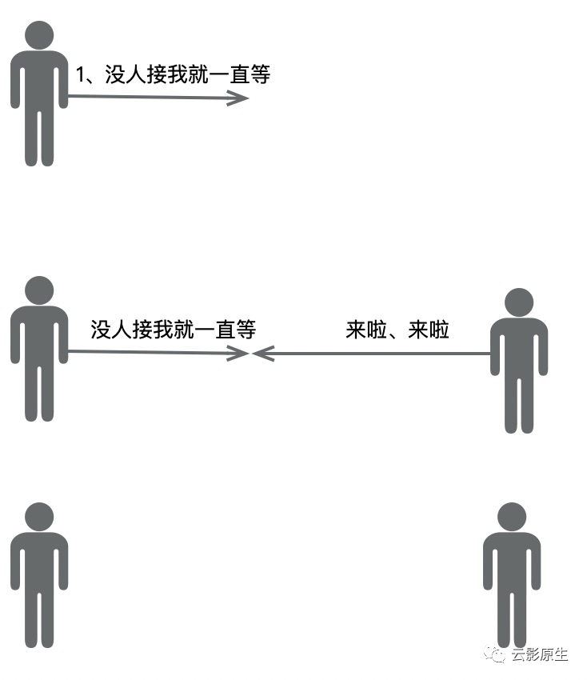
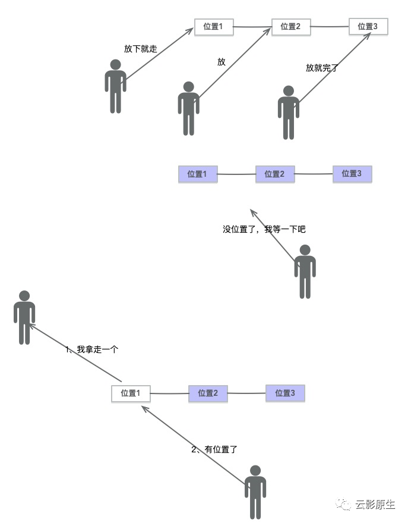
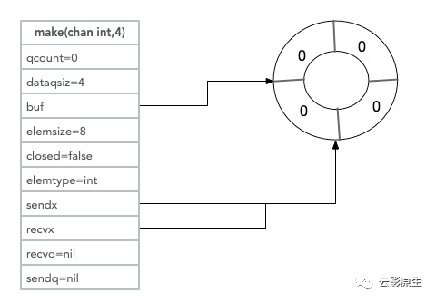
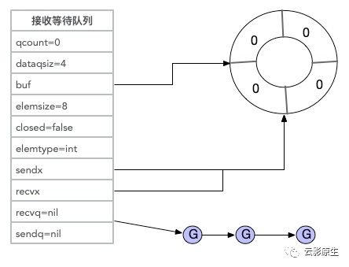
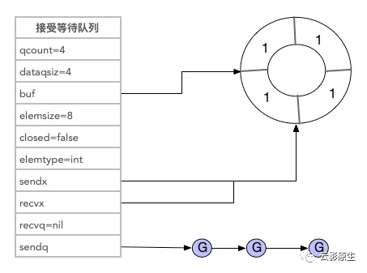
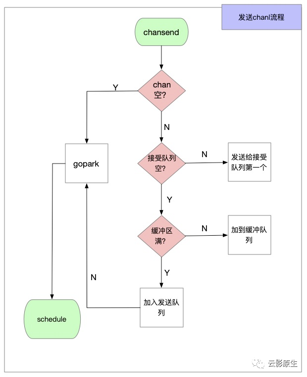
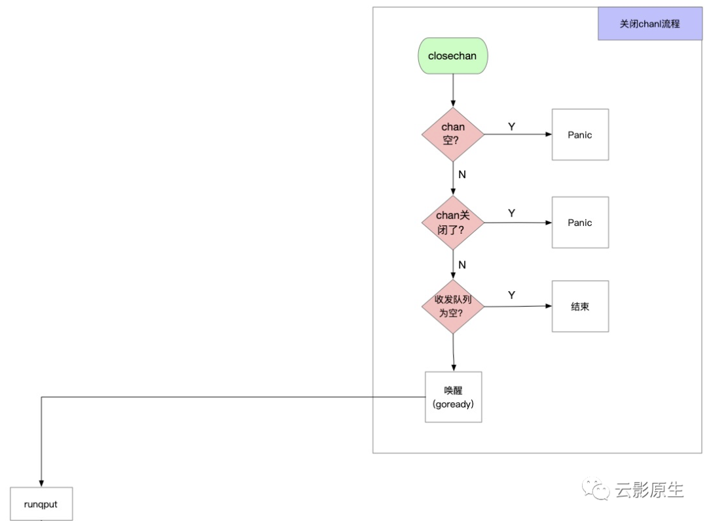

#  go中channel是如何发送的

本文会从语法到原理最后深入到源码中的函数深入浅出的讲解了channel发送的流程。

## channel的基本操作

这一点对于大多数写过go代码的人并不是难事，毕竟它属于并发编程中不能忽视的一部分，并发编程又是golang的主要宣传点，先看个无缓冲的channel回忆一下：

```go
func main() {
  var ch chan int
  ch = make(chan int, 0)
  go func() {
    time.Sleep(1 * time.Second)
    fmt.Println("接受开始!")
    fmt.Println("接受内容：", <- ch)
    fmt.Println("接受结束!")
  }()
  go func() {
    fmt.Println("发送开始!")
    ch <- 1
    fmt.Println("发送结束!")
  }()
  time.Sleep(2 * time.Second)
}
```

输出为：

```shell
发送开始!
接受开始!
接受内容：1
发送结束!
接受结束!
```

发送是被阻塞住的，原理如下图：



 <del>可能是当初设计者在等女朋友时候想出的这个设计。</del>如果将上述第三行的**ch = make(chan int, 0)**改为**ch = make(chan int, 0)**，就变为带缓冲的channel，输出就会变为：

```shell
发送开始!
发送结束!
接受开始!
接受内容：1
接受结束!
```

缓冲的channel在发送的时候不会被阻塞<del>，要不缓冲区是干啥的呢</del>。对应原理图如下：



<del>这个是不是设计者在排队拿号等位的时候想出的。</del>


## channel实现原理是什么

经过刚才的一番加图叙述之后，有数据结构常识的已经意识到了缓冲区就是**队列。**当超过缓冲区之后，如果想继续发送就会放进一个**发送等待池**，相应的当缓冲区和接受队列都为空的时候想继续发送还要有个**接受等待池**。

所以channel的实现就是队列+发送等待队列+接受等待队列，当然还有些零零碎碎的东西：

1、 为了避免缓冲区数据的频繁创建和销毁用的是环形队列

2、 还要有两个指针分别标志*发送了什么位置*和*接收到了什么位置*

3、 channel里面*元素的类型*、*元素的长度*以及*是否被关闭*也要有个字段标记吧

4、 并发存取数据的时候要加锁吧

知道了这几个东西那么channel的结构就呼之欲出了：

```go
type hchan struct {
  qcount   uint           // 在缓冲区中有多少个元素
  dataqsiz uint           // 缓冲区的总共长度
  buf      unsafe.Pointer // 缓冲区环形队列的指针
  elemsize uint16         // channel里面元素的大小，比如int就是8个byte
  closed   uint32         // 是否被close
  elemtype *_type         // channel元素的类型，比如int、float之类的
  sendx    uint           // 在缓冲区中发送的位置
  recvx    uint           // 在缓冲区中接受的位置
  recvq    waitq         // 接受等待队列的指针
  sendq    waitq        // 发送等待队列的指针
  lock mutex           // 锁，保护整个hchan结构
}
```

通过几张图来看看channel不同时期的hchan值的变化。

### 初始化



qcount表示环形队列中元素的个数，buf指向的环形队列中什么都没有（环形队列中0表示有值1表示没值）。

### 接受等待队列



如果初始化完还没有发送就开始接受，那么所有的接受goroutine都会放在接受队列上，等待有goroutine向channel中发送数据。

### 缓冲队列不为空


缓冲队列中有两个(qcount)元素，sendx指向的下一个发送的数据来了所放的位置，recex表示从buf中读数据的位置。

### 发送等待队列



当缓冲区的数据满了(qcount == dataqsiz),就会放在发送队列中，等待有goroutine去接收。

注⚠️

发送队列和接受队列其实是链表，长度无限，但是源码中叫队列我就沿用了。但是我感觉这可能是开发者最开始把它设想为队列所以就叫sendq/recvq了，后来改为链表了，但是名字已经骑虎难下了。这也是一个常见的代码坏味道，如果看更加详细的解释可以看[如何察觉代码坏味道：变量和结构](http://mp.weixin.qq.com/s?__biz=Mzg5MjYyNjUzOA==&mid=2247484109&idx=1&sn=a0eaed645240c3df5ae9ccabfafd5f95&chksm=c03a71c8f74df8de0a736b34e6b3072826b3a1808286f568858b27f299b89cf9108092ddda0a&scene=21#wechat_redirect)。


## **发送做了什么事情**



> A send on a nil channel blocks forever.
>
> https://golang.org/ref/spec#Send_statements

golang spec的这句“发送nil channel会一直阻塞”在第一判断（chan为空？）得到了体现（在源码中也是在函数头部位置），阻塞是通过调用gopark挂起的。

在chansend中还做了一个优化，如果*接受等待队列*不为空那么就把当前发送的数据直接给*接受等待队列*中的第一个，这也是第二个判断的来历（接受队列为空？）。

第三个判断就是我们熟知的如果缓冲区满了就进*发送等待队列*此时也是会调用gopark挂起。

你可能还会有一个疑问：

1、 发送到nil的channel就一直等待了么，咋唤醒？答：是的，因为连发送等待队列都没进，这是你写的bug

2、 发送等待队列中有数据，如果一直没人从这个channel里面读了怎么办，会不会造成泄漏？答：这就是为什么最好channel用完了要close的原因，在close的时候会唤醒recvq和sendq，sendq里面所有的gouroutine都会panic(send on closed channel).

那么就顺便看看close的流程：



close的流程比较简单，第一判断判断channel是否为nil，对应的是spce的这段话：

> Closing the nil channel also causes a run-time panic.
>
> https://golang.org/ref/spec#Close

第二个判断是否这个channel已经close了，对应的是spec的这段话：

> Sending to or closing a closed channel causes a run-time panic.
>
> https://golang.org/ref/spec#Close

最后将发送等待队列和接受等待队列中的goroutine都唤醒。

## **channel发送的整体流程**


schedule是runtime调度器的一部分，主要的作用是找到一个可以执行的goroutine进行执行，介绍一下其中关键函数的作用：

1、 close通过goready将等待队列中的goroutine变为可执行状态，这个函数最主要的是调用的runqput

2、 runqput就是将goroutine插到可执行队列，其实插到可执行队列的流程分为下面三个部分（这里不是本次的重点，看看即可）：

- 将P上的runnext踢下来，记为old
- 如果P上的队列没满，就放入P上的队列
- 如果P上的队列满了，就old和len(本地队列)/2的数据加入全局队列

3、chansend通过gopark挂起goroutine的原理是（这里不是本次的重点，看看即可）：将当前的goroutine切换为G0，然后调用schedule去执行一个可执行的goutine

