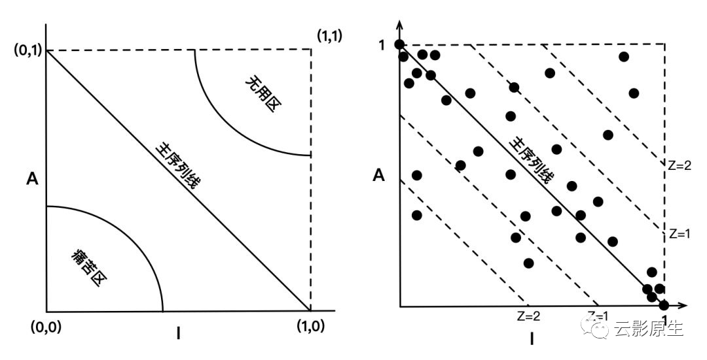

# 构建组件有哪些设计原则

在日常开发中免不了使用第三方库（比如日志库、web框架之类），有的人因为组件性能好所以用，有人因为用起来顺手所以用，这些评价的维度并没有错，本文从工程角度去探讨评价一个组件以及写好一个组件的原则，还会介绍如何量化一个组件的依赖关系。既然已经局限到工程了，那么就免不了**高内聚、低耦合**。本文会从高内聚和低耦合两方面来展开讲解组件的设计原则。

⚠️：

本文受到《架构整洁之道》的启发并糅合自己的思考，文中会引用书中的图片会注重来源。

## 什么是组件

组件是软件的部署单元，是整个软件系统在部署过程中可以独立完成部署的最小实体。c/c++/go编译出的二进制、java编译出的jar、对于静态语言python、javascript可能就是文件。组件就是可以独立存在的、能被独立引用的，小到一个日志库大到一个微服务都可以成为一个组件。

## 怎么做到高内聚

### REP(Reuse-Release Equivalence Principle):复用/发布等同原则

在当今编程工作中不引用点第三方库是很难成事儿的，不论是前端的npm/yarn、java的maven还是golang的gomodule，都会有版本号的概念。

现在开源大多遵循的时候[Semantic Versioning](https://semver.org/)，即***X.Y.Z***，

- X为major：不向下兼容，会有break级别的变动
- Y为minor：向下兼容，一般是修复bug和新增功能
- Z为patch：向下兼容，一般是修复bug

笔者曾经曾经就遇到过[ant design](https://github.com/ant-design/ant-design/)在patch版本中升级了typescript的版本（也是升级的patch）版本，这个版本的ts和我本地不兼容就导致编译的时候会出现诡异的问题。

这个原则的明确定义是：***软件复用的最小粒度应等同于其发布的最小粒度***。

如果你知道git submodule的话就会意识到git submodule是彻彻底底的反模式，当依赖代码更新了肯定会重新编译部署，而且版本管理强依赖git的tag特性，你要是直接引用别人master的代码，可能你这辈子都不敢更新了。

### CCP(Common-Closure Principle): 共同闭包原则

这个原则的定义是：***我们应该将那些会同时修改，并且为相同目的而修改的类放到同一个组件中，而将不会同时修改，并且不会为了相同目的而修改的那些类放到不同的组件中***。

说白了就是把容易变的放在一起，把稳定的放在一起。如果你读过我以前的文章[什么是SOLID设计原则](http://mp.weixin.qq.com/s?__biz=MzU0Njk1NTczNA==&mid=2247484069&idx=1&sn=58e5c9f6e3cb8dc1b4d90ffe2641fce7&chksm=fb548a1ccc23030a8d9c11e51e27d5fe3602b48a5e43560e1dc773bedd8abe5add305ca7cebc&scene=21#wechat_redirect)，你就会感叹到这不就是SRP(单一原则)的组件模式么。

CCP理解起来很简单，假设我们的服务依赖四个组件，但是四个组件中每次都是一个类变化，这就导致他们四个组件都是容易变化的，但是如果我们把易变的单独抽象为一个组件，以后可能就只会有一个依赖的组件变化了。

### CRP(Common-Reuse Principle):共同复用原则

***不要强迫一个组件的用户依赖他们不需要的东西。***

如果你读过[什么是SOLID设计原则](http://mp.weixin.qq.com/s?__biz=MzU0Njk1NTczNA==&mid=2247484069&idx=1&sn=58e5c9f6e3cb8dc1b4d90ffe2641fce7&chksm=fb548a1ccc23030a8d9c11e51e27d5fe3602b48a5e43560e1dc773bedd8abe5add305ca7cebc&scene=21#wechat_redirect)或者[再谈ISP: 如何让代码解耦](http://mp.weixin.qq.com/s?__biz=MzU0Njk1NTczNA==&mid=2247484111&idx=1&sn=af4ee6dd187f3a019b86141cb6e4b51b&chksm=fb548a76cc23036086bbf7249b447a5f8669e1bf90b6faae000a4d1d950e1504a549ede86c67&scene=21#wechat_redirect)你就知道CRP不过是ISP的组件模式。

但是这个原则是很有用，即用不上的就不要依赖。如果不遵循这个原则会招来很多不必要的变更，比如你依赖的A组件有a0和a1两个类，你只依赖的a0但是a1的变化肯定引起组件A的发布，这就是一次没有必要的更新。

### 三原则取舍

现在假如我们依赖的组件有A，B，C三个类，

- 如果这个组件没有版本号(比如git submodule)直接引用，那么就违反了REP
- 有明确版本号情况下，每次升级都是C变动，那么就违反了CCP。
- 现在其他人也要依赖这个组件，发现只依赖的B和C，那么就违反了CRP

我们发现这三者挺难一起满足的，尤其是CCP和CRP基本属于水火不容的地步，CCP和REP(下图的上面两个)倾向与把组件做的打，而CRP是希望把组件做的小。

- 如果只***满足REP和CRP不满足CCP***，就会导致很多小小组件，升级一个组件可能要连带升级几个小小组件。就像我们的服务跑在k8s上，k8s又是由apiserver、kubelet和controller-manager组成的，我们升级k8s肯定要把左右的组件都升级了。
- 如果只**满足REP和CCP不满足CRP**，这就会导致一个组件负责的功能比较多，很多时候升级是因为我们用不到的功能。就比如前端的React库依赖了react-router，react-router依赖了路由组件history，有一次history出现了不得不break change的bug，必须升级大版本，它升级大版本就导致react-router升级大版本。但是这个bug只有在ios能触发，我们web项目根本遇不到。
- 如果只**满足CCP和CRP不满足REP**，这一点就把矛头指向了git submoule，连个版本号都没有，谁敢升级。

## 怎么做到低耦合

### ADP(Acyclic-Dependencies Principle): 无环依赖原则

> 组件依赖关系图中不应该出现环

如果A组件这次迭代为B组件增加了一个字段，B组件同时也为A组件增加了个字段。那么谁先上线？

这一点也是**大家知道但不去做的共识**了，下面介绍两个消除循环依赖的方法。但是事先说一下，不要有把锤子看到什么都是钉子，如果你在自己的业务中提出像解决循环依赖，如果没人支持你就放弃了。

1、 依赖反转

如果你看过[什么是SOLID设计原则](http://mp.weixin.qq.com/s?__biz=MzU0Njk1NTczNA==&mid=2247484069&idx=1&sn=58e5c9f6e3cb8dc1b4d90ffe2641fce7&chksm=fb548a1ccc23030a8d9c11e51e27d5fe3602b48a5e43560e1dc773bedd8abe5add305ca7cebc&scene=21#wechat_redirect)或者[再谈DIP: 如何编写可测试的业务代码](http://mp.weixin.qq.com/s?__biz=MzU0Njk1NTczNA==&mid=2247484083&idx=1&sn=8b8c0d155f7dbb402f739562d4b919e7&chksm=fb548a0acc23031cd64a10af8abc43fe9d632f8da0f322d4ae603962ce561fdf002ef1d97941&scene=21#wechat_redirect)，就对这个原则一点也不陌生，这也是整洁架构的核心所在。

如果以前Authorizer依赖Entities，后续因为需求变换Entities又需要依赖Authorizer的Permissions，这就导致了循环依赖。我们可以让核心层的Entities定义接口，由Authorizer去实现这个接口，这样就消除了循环依赖。但是在微服务中这样是做不到了，更多是使用下面加一层的方法。

2、 加一层

先引用一句话

> All problems in computer science can be solved by another level of indirection

意思就是软件中没有什么是加一层不能解决的。也就是加个中间层，让两者都依赖中间层，循环依赖就解决了。

### SDP(Stable-Dependencies Principle): 稳定依赖原则

> 依赖关系必须要指向更稳定的方向。

当选择一个组件的时候，有一个依赖了三个我们不知道有没有用组件另一个没有依赖，那我们大概率会选择后者，因为这会有更少的原因去升级组件。

所以一个组件稳定与否不是看现在，而是看怎么应对变化。一个立起来的硬币为啥不稳定，因为它很脆弱一阵小风就给吹到了，对于软件也是一样的。

一个稳定的组件应该是很少的依赖别人的，如下图：

稳定意味着被依赖多（国企钱少稳定，互联网私企压力大），反之依赖别人更多那就是不稳定：

这就可以总结出一个不稳定性指标：

I = 依赖数量/(依赖数量 + 被依赖数量)

就比如下图：

对于Cc组件来说：

- 依赖的数量=1
- 被依赖的数量=3

所以I = 1 / (1 + 3) = 25%

### SAP(Stable-Abstractions Principle): 稳定抽象原则

> 一个组件的抽象化程度应该与其稳定性保持一致。

在[什么是SOLID设计原则](http://mp.weixin.qq.com/s?__biz=MzU0Njk1NTczNA==&mid=2247484069&idx=1&sn=58e5c9f6e3cb8dc1b4d90ffe2641fce7&chksm=fb548a1ccc23030a8d9c11e51e27d5fe3602b48a5e43560e1dc773bedd8abe5add305ca7cebc&scene=21#wechat_redirect)或者[再谈DIP: 如何编写可测试的业务代码](http://mp.weixin.qq.com/s?__biz=MzU0Njk1NTczNA==&mid=2247484083&idx=1&sn=8b8c0d155f7dbb402f739562d4b919e7&chksm=fb548a0acc23031cd64a10af8abc43fe9d632f8da0f322d4ae603962ce561fdf002ef1d97941&scene=21#wechat_redirect)中讲过**实现**相比于**抽象**是易变的，所以我们要更多的依赖抽象类或者接口。

看下图解释了核心逻辑应该处在服务的什么位置：

核心服务是被依赖，即稳定的。也就是核心服务是被依赖了，稳定性高就意味着可修改的空间小，容易造成牵一发而动全身。为了让核心逻辑层可扩展，我们应该在稳定高的层次里用抽象类或者接口，这也是符合[什么是SOLID设计原则](http://mp.weixin.qq.com/s?__biz=MzU0Njk1NTczNA==&mid=2247484069&idx=1&sn=58e5c9f6e3cb8dc1b4d90ffe2641fce7&chksm=fb548a1ccc23030a8d9c11e51e27d5fe3602b48a5e43560e1dc773bedd8abe5add305ca7cebc&scene=21#wechat_redirect)中OCP(开闭原则)的。

这里也有一个公式：A = 组件中抽象类和接口的个数/ 组件中类的个数

### 如何评价一个组件

现在有了不稳定系数I和抽象系数A，就能画出下面的张力图：

- 核心逻辑层应该位于左上角，即最稳定且最抽象
- 最外层（UI层或者数据访问层）应该位于右下角，即最不稳定且最具体

当然不可能这么完美，可以将这个象限分为下面三个部分：

- 痛苦区，即最稳定且最不抽象，这代码基本就成了祖传代码没人敢动了
- 无用区，即不稳定且最抽象，这个区域的代码比较搞笑，本应该是依赖别人(最不稳定)但是却有让其他人依赖的能力(最抽象)，所以这个区域的代码只能是写了但是没有用。
- 主序列线，我们不能做到在左上角或者右下角，但是尽量靠在主序列线就是相对好的组件
- D指标：D = |A + I -1|，即表示当前组件到主序列线的距离。这样就能将组件变为可量化分析的，距离主序列线越远要么过于抽象但依赖不足，要么过于具体而被依赖得太多。

## 总结

组件的高内聚设计原则（REP、CCP、CRP）告诉你一个组件应该怎么做才能做到高内聚，并且提供三者的张力图，在不同时期根据我们关注点的不同而进行取舍。

组件的低耦合设计原则（ADP、SDP、SAP）告诉你组件应该如何依赖以及依赖的方向，最后给出了量化指标依赖的原则。

希望你读完本篇文章审视一下自己的组件是否符合上面说的原则。