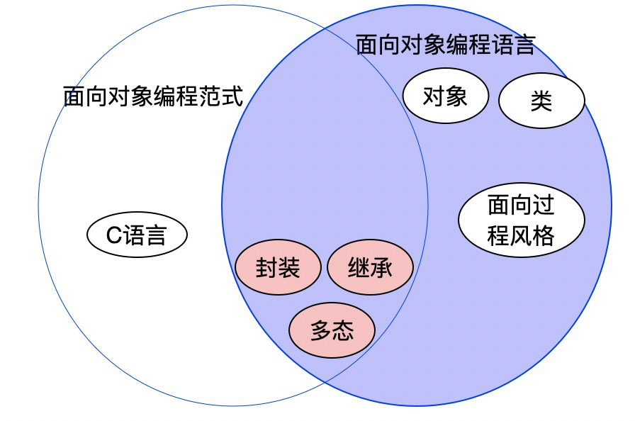
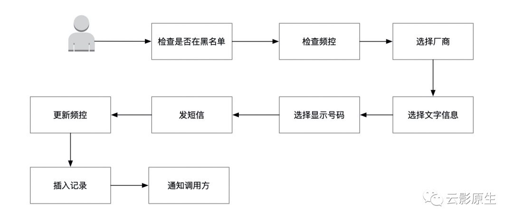
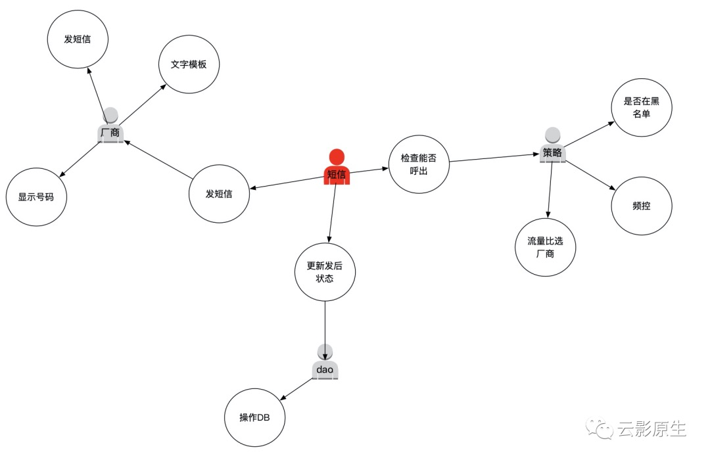

# 如何做到面向对象

现在很多程序员都在用诸如java、python、php这类面向对象的语言进行编写代码，但写出的代码却是面向过程的，导致杀鸡用牛刀。

本文会告诉你面向对象编程范式和面向对象语言的差别，并且介绍面向对象的常见误区以及如何结合面向对象的基本单元（类和对象）和特性（封装、继承、多态）来实现面向对象。

## **面向对象编程范式和面向对象语言**



从图中可以看出面向对象编程范式和面向对象语言并不是完全重合的，需要注意点如下：

- 面向对象编程范式和面向对象语言不能划等号
- 用面向过程语言（比如C语言）也能实现面向对象
- 用面向对象语言（比如java）也能写出面向过程的代码
- 面向对象独有的类和对象，但不一定是class关键字（JavaScript ES6之前是function，golang是struct）


## **面向对象的特点**

### 类和对象

类和对象是面向对象编程中组织的基本单元，它们之间的关系就像狗和哈士奇之间的关系。

```go
type dog struct {
	Name string
	MaxAge int // 最长寿命
	HairColor string // 毛色
	HairLength int // 毛长
}
func (d dog)Roar() {
	fmt.Println("汪汪")
}
func main() {
	husky := dog{Name: "哈士奇", MaxAge: 123, HairColor: "red", HairLength: 23}
}
```

类(在go中为struct)定义了狗应该具有的属性和方法，对象是对类的实例化即哈士奇有自己对应的名字、寿命以及吼叫方式。这是很考验我们抽象能力，考验我们能把需求抽象为类，通过类之间的交互实现需求。

### 封装

封装的目标是降低调用者的心智负担，想一想如果想给客户发一条营销短信还要自己记住下面的规则：

- 该用户的拨打策略
- 如何选择运营商
- 如何修改发后状态

这一套组合拳下去经过几周你写的代码就不记得了。

封装的原则就是**暴露行为而不是数据**

什么是行为，比如有如下的一个用户属性和方法：

```go
type user struct {
	name string
	pwd string
	age int
}
func (u *user)SetPwd(p string) {
	u.pwd = p
}
func (u *user)GetAge() int {
	return u.age
}
func (u *user)SetAge(a int) {
	u.age = a
}
```

如果你是学过java的程序员一定会很熟悉，有的编译器会对一些类的方法自动添加getter/setter方法，但是这样和直接把属性变为public没有任何区别，暴露的都是数据。如果我们站在调用者的角度去看，这些方法名没有什么含义。那么怎么算暴露行为呢，其实最简单的就是把方法名改一下就行了：

```go
type user struct {
	name string
	pwd string
	age int
}

func (u *user)ResetPwd(p string) {
	u.pwd = p
}

func (u *user)GetAge() int {
	return u.age
}
func (u *user)AddAge(a int) {
	u.age += a
}
```

封装是**高内聚**的核心，原则就是

1、 最好不好暴露数据，包含getter/setter，如果暴露数据太多会导致火车残骸（关于火车残骸这个代码坏味道可以查看[如何察觉代码坏味道：依赖](https://mp.weixin.qq.com/s/0Ay4EMVxgWgGSeaYmpNpoQ)）

2、 尽量少的暴露方法/接口，尽量内部消化

在封装方面变量/方法名容易理解会占据很大的一部分，可以参考[如何察觉代码坏味道：变量和结构](https://mp.weixin.qq.com/s/kPxvtvtOstOEgrQJcXLWPA)。


### 多态

说多态是面向对象的核心一点也不过分，多态还有一个别名叫可插拔。比如我们输出日志的方面可能是标准输出、可能是文件也可能是kafka，我们先来看个例子：

```go
var _ ReadWriter = (*readWriter)(nil)
type Reader interface {
	Read(p []byte) (n int, err error)
}
type Writer interface {
	Write(p []byte) (n int, err error)
}
type ReadWriter interface {
	Reader
	Writer
}
type readWriter struct {

}
func (r readWriter) Read(p []byte) (n int, err error) {
	panic("implement me")
}

func (r readWriter) Write(p []byte) (n int, err error) {
	panic("implement me")
}

func main() {
	rws := readWriter{}
	
	fmt.Fprintln(os.Stderr)
	fmt.Fprintln(rws)
}
```

你如果多态用的好，更换依赖的时候基本不用改代码。我们在[三层架构和MVC的区别是什么](https://github.com/helios741/myblog/tree/new/learn_go/src/2021/04/mvc-three-tier)中介绍了业务的三层架构中逻辑层处在核心位置上，其他都要依赖逻辑层，在[什么是SOLID设计原则](https://github.com/helios741/myblog/tree/new/learn_go/src/2021/04/solid)中介绍的依赖反转的核心也是多态，并且在[再谈DIP: 如何编写可测试代码](https://github.com/helios741/myblog/tree/new/learn_go/src/2021/04/again-dip)再进一步介绍了依赖反转。

我们依赖第三方的时候要依赖抽象不要依赖实现，过多的依赖实现也是个坏味道（关于依赖实现这个代码坏味道可以查看[如何察觉代码坏味道：依赖](https://mp.weixin.qq.com/s/0Ay4EMVxgWgGSeaYmpNpoQ)）


### 继承

> 想要一根香蕉，但得到的却是一只拿着香蕉的大猩猩，甚至还有整个丛林。
>
> ——乔·阿姆斯特朗

如果你编程工作中经常使用继承（c++/java）的话，肯定对上面这句话感同深受，具体我就不解释了，都在脏话里面了。

所以要提倡**组合优于继承**还有一种专业的叫法叫mixin(<del>迷信</del>)。如果B继承了A，那么B和A的关系是is-a的关系；如果是B组合了A那么B和A的关系是B有A的能力（able）。

```go
type Worker interface {
	Work()
}

type Learner interface {
	Learn()
}

type Sleeper interface {
	Sleep()
}
// ----- 实现这些能力------------
type work struct {}
func (w work)Work()  {}

type learn struct {}
func (l learn)Learn()  {}

type sleep struct {}
func (s sleep)Sleep() {}

// ----- 工作能力和学习能力的组合------------
type workLearn struct {
	Name string
	Worker
	Learner
}

func NewTeacher() *workLearn {
	return &workLearn{
		"Helios",
		work{},
		learn{},
	}
}

// ----- 工作能力和睡觉能力的组合------------
type workSleep struct {
	Name string
	Worker
	Sleeper
}

func NewCXY() *workSleep{
	return &workSleep{
		"Helios741",
		work{},
		sleep{},
	}
}
// 有工作能力就能处理
func WWork(w Worker) {
	w.Work()
}

func main()  {
	tea := NewTeacher()
	cxy := NewCXY()
	WWork(tea)
	WWork(cxy)
}

```


## **面向对象的好处**

我们就来用一个调用运营商发短信的例子来对比一下面向过程和面向对象，以及说明一下面向对象的好处。

面向过程编程的流程如下图：




面向对象编程的流程如下图：



面向过程面对的是一个孤散的点，面向对象面对的是一个个的模型以及他们提供的行为。


## **总结**

> 面向对象编程就是以多态为手段来对源代码中的依赖关系进行控制的能力，这种能力让软件架构师可以构建出某种插件式架构，让高层策略性组件与底层实现性组件相分离，底层组件可以被编译成插件，实现独立于高层组件的开发和部署。
>
> 架构整洁之道

在面向对象语言几乎占据非系统编程全部份额的今天，还要讨论面向对象，那是因为太多的人都是用面向对象的语言去编写面向过程的代码，我曾经和同事开玩笑的说，现在的代码和十年前用c语言写出第一行hello world的时候没有本质区别。

在使用面向对象的时候考验的是我们抽象的能力，我们能不能把一个个的业务行为抽象为具体的类，然后进行高内聚低耦合的编写代码。如何做到使用面向对象编程方式进程高内聚低耦合呢：

- 封装（高内聚）：抽象面向行为而不是面向数据的类，具体评判指标就是看看你们代码中有多少getter/settter/update等字眼
- 继承（低耦合）：通过组合由于继承的方式，让类具有更多的**能力**，当然这也不是说让类变得大，如果避免类变得过大可以看[再谈ISP: 如何让代码解耦](https://github.com/helios741/myblog/tree/new/learn_go/src/2021/04/again-isp)以及什么是SOLID设计原则
- 多态（低耦合）：通过依赖反转实现核心代码对边缘代码（数据访问层、展示层）结耦。

<del>程序猿没有对象的原因可能是因为用了面向对象语言但是没有用面向对象编程范式</del>


