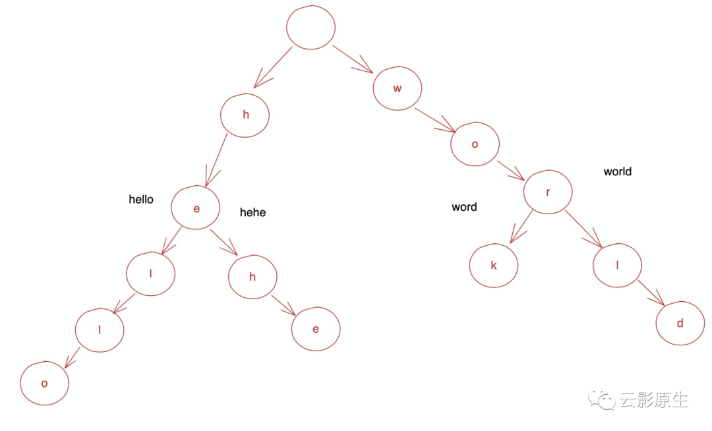
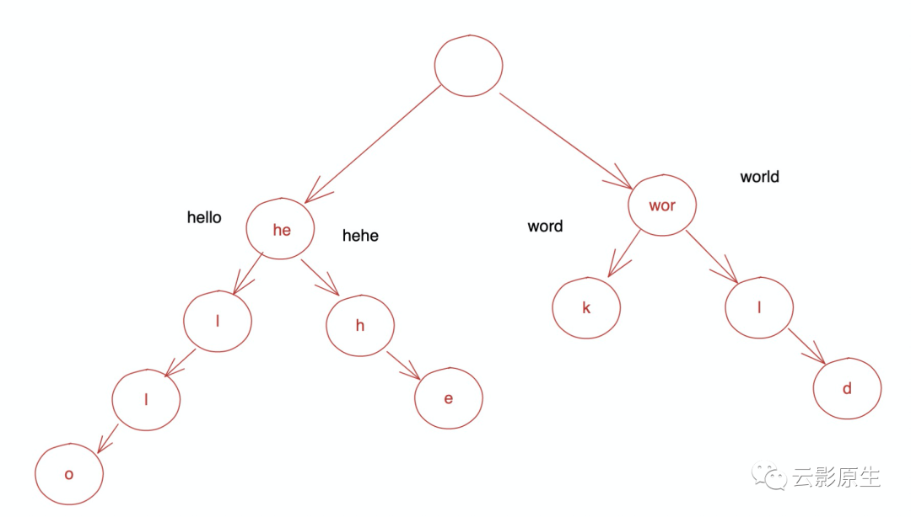
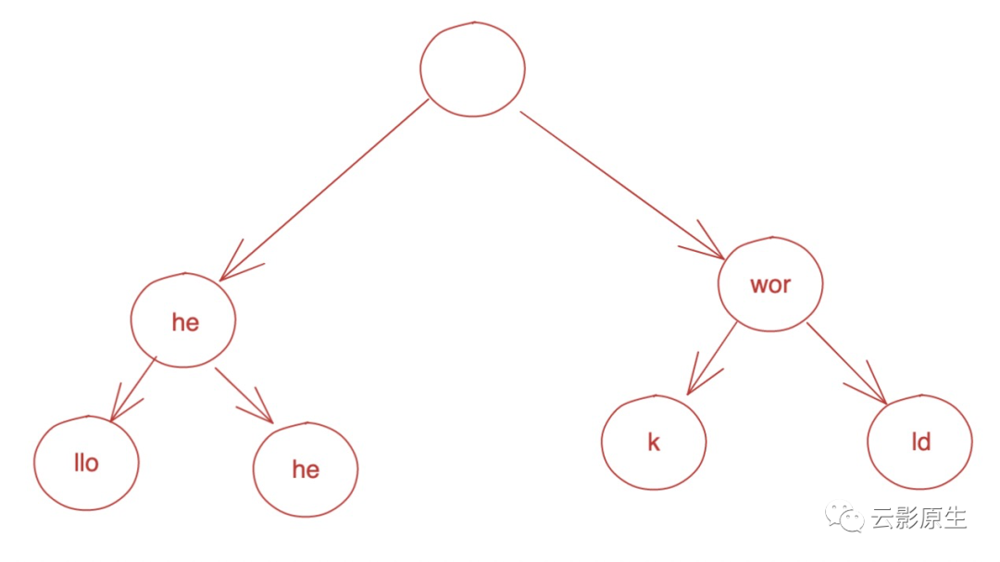
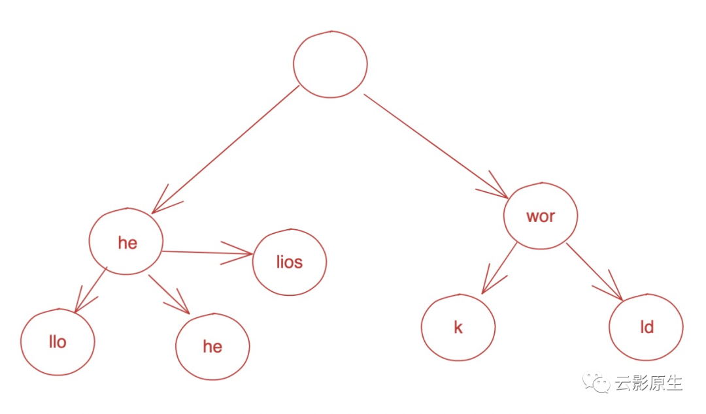
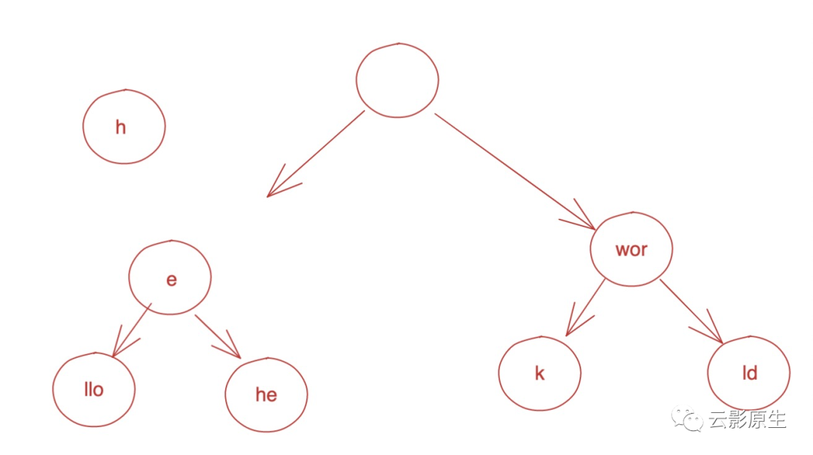
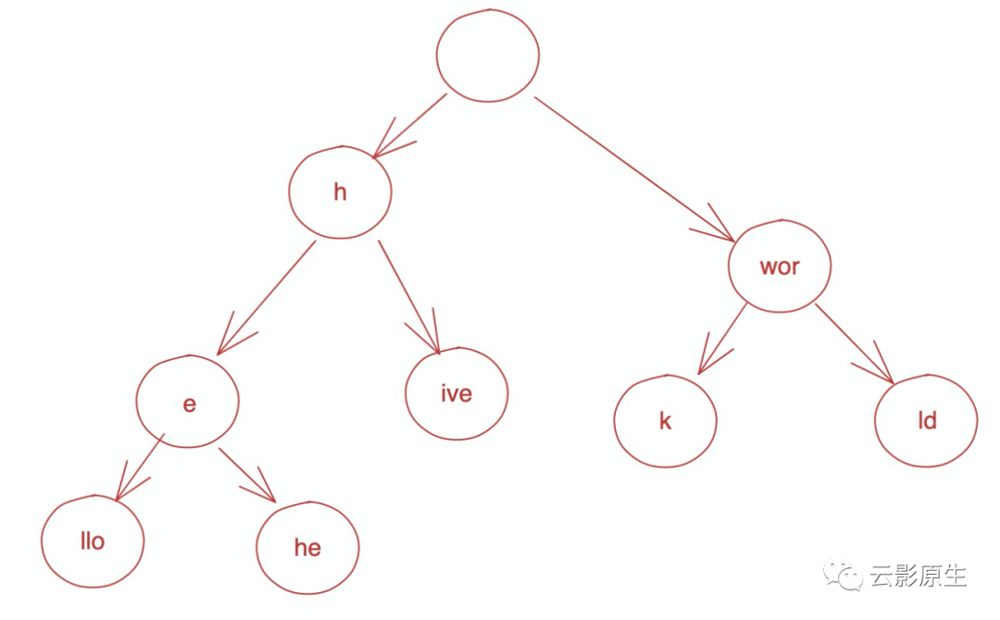

# radix tree有哪些用途

当我们透过使用去看原理的时候，会发现很多地方都用到了radix tree，比如redis中存储slot对应的key信息、内核中使用radix tree([lib/radix-tree.c](https://github.com/torvalds/linux/blob/master/lib/radix-tree.c))管理数据结构、大多数http的router通过radix管理路由。

本文会通过三方面介绍：

1、 radix tree是什么：通过一个例子分析radix tree的用途和原理

2、 radix tree的实现：通过golang来建立树以及建立树之后的查找

3、 radix tree实现简单http router：将radix tree的实现更进一步，实现http router的路由查找功能


## **radix tree是什么**

现在来思考这样一个问题，一个单词本能够插入很多个单词，然后给定一个单词，查看已有的单词表中是否有给定单词前缀相同的单词。比如：

1、 插入hello

2、 插入hehe

3、 插入work

4、 插入world

5、 查询he YES

6、 查询woo NO

可能咋看上去是个简单的问题，**存起来每次循环去匹配不完了么**。如果单词表的量级是几w并且查询也是几w呢？你的电脑风扇就要响了。

那么怎么优化呢？从线性结构变为树状结构是个比较典型的思路，这时候字典树（tire tree）就出场了，我们看下树的结构：



现在的查找的速度就和树的高度有关了，树的高度又是什么呢？就是最长的一个单词又因为每个节点最多有26个字母所以一次查询的复杂度就是O(16 * 最长单词的长度)，如果有10w个单词，这个时间基本可以看作是常数时间。

那么还有没有进一步优化的空间呢，我们发现有的单词前缀是一样的(比如hello和hehe有两个共同字母、work和world和有三个共同字母)，通过上面结构会浪费查找次数（hello和hehe浪费一次，work和world浪费两次），那么很容易的想到就是把相同的合并起来，比如下面的图：



那么还能不能继续优化呢？

再观察这个树结构，查找到前缀hehe之后只能查找llo或者he了，如果是上面的结构又浪费了几次查找（查找hello浪费了两次、查找hehe浪费一次），我们就能得出下面的树结构了：



你可能会问如果再多一个单词怎么办？调整树的结构也很简单，比如我们再插入helios和hive这个单词，调整步骤如下:

1、 找到helios和hive在树中的最长前缀（即he和h）

2.1、 如果 最长前缀 == 节点包含字符长度(helios查找到he)，那么将新单词-最长前缀(lios插入到)这个节点的子节点



2.2 如果 最长前缀 != 节点包含字符长度，将改节点的拆分为两部分：**公共前缀** + **剩余**，将公共前缀作为他们父节点插入，**剩余**然后重复1.1

-  2.2.1、将节点拆分为两部分（h和e）



-   2.2.2、 将公共前缀作为父节点，插入树中：


2.3 将新单词的-公共前缀作为子节点插入



至此我们今天的主人公radix tree就介绍完了，它比较适合大量前缀相同的查找，比如ip地址、redis中的key等。


## **radix tree的实现**

我们通过代码来简单看下如何构建一棵树，我们先来看一下输入输出：

```go
  rt := &node{child: make(map[uint8]*node)}
  rt.insert("hello")
  rt.insert("hehe")
  rt.insert("hive")
  rt.insert("helios")
  fmt.Println(rt.find("how")) // false
  fmt.Println(rt.find("heh")) // true
```

node结构如下：

```go
type node struct {
  v string
  // 表示子节点的数量，也可以用26个元素的数组实现
  child map[uint8]*node
}
```

- v表示该节点包含的前缀，根结点是空
-  child是个map，map的key表示子节点的第一个字符，value是子节点的指针。

insert是先找到和输入字符串在树中有公共前缀的那个节点，然后判断是否需要把节点裂开，说起来比较绕，还是用图举例子：


比如要插入hive了，这时候最长前缀是左边第一个节点的h，那么就需要把he这个节点裂开，变为下面这样：


如果现在插入hiver直接将r作为ive的子节点就行了。

首先看下**找到和输入字符串在树中有公共前缀的那个节点**的代码：

```go
func (n *node) findCommonPrefixNode(pf string) (*node, string) {
  newPf := longestPrefix(n.v,pf)
  nn := n
  for len(newPf) == len(nn.v) && len(newPf) != len(pf) {
    for index, cnode := range nn.child {
      if index == pf[0] {
        nn = cnode
        break
      }
    }
    newPf = longestPrefix(nn.v, pf)
    pf = pf[len(newPf):]
  }
  return nn, newPf
}
```

本质上是树的遍历过程：

1、 找到当前节点和给定字符串的最长前缀（helios和hello的最长前缀是hel）

2、 如果最长前缀和当前节点的值相同并且给定字符串不等于最长前缀，那么就继续从子节点找

3、 如果第二步不成立，证明已经找到了那么就返回


找到了最长匹配的节点之后，那么就是可以插入了:

```go
func (parent *node)insert(path string) {
  nn, commonPrefix := parent.findCommonPrefixNode(path)
  // 代表不用分裂节点，直接插入即可
  if nn.v == commonPrefix {
    nn.appendChild(path[len(commonPrefix):])
    return
  }
  // 为了下沉，保存孩子节点
  oldChild := nn.child
  // 清空这个节点的孩子节点
  nn.child = make(map[uint8]*node)
  // 开始分裂
  nn.appendChild(path[len(commonPrefix):])
  newPath := nn.v[len(commonPrefix):]
  nn.child[newPath[0]] = &node{
    v:       newPath,
    child:   oldChild,
  }
  nn.v = commonPrefix
}
```

可以对着上面的图看这个过程。

appendChild的实现比较简单，就是个插入：

```go
func (n *node)appendChild(path string) {
  if len(path) < 1 {
    return
  }
  n.child[path[0]] = &node{
    v:       path,
    child: make(map[uint8]*node),
  }
}
```

至此，一棵树就建立起来了。

最后是查找的过程，树的遍历没有什么难度：

```go
func (n *node)find(path string) bool {
  if n == nil {
    return false
  }
  if path == "" {
    return true
  }
  for index, c := range n.child {
    if index != path[0] {
      continue
    }
    // 如果前缀不一样， 返回false
    commonPrefix := longestPrefix(c.v, path)
    if commonPrefix == c.v {
      return c.find(path[len(c.v):])
    }
    if path == commonPrefix {
      return true
    }
    return false
  }
  return false
}
```

如果你有兴趣，完整可以跑的代码在：[code](https://github.com/helios741/myblog/blob/new/learn_go/src/2021/07/radix-tree/he/example/radix-tree/main.go)


## **radix tree实现简单http router

radix tree的适用范围我们已经知道了，即大量前缀相同的字符串，我们提供的http API不就符合这个范围么。如果我们有100个API并且QPS上万的话，匹配URL的时间还是很可观的。

那我们来看下需求，就是实现类似于gin路由匹配的功能：

```go
r := router.New()
r.GET("/frends/:id/helios", helloHandler)
r.GET("/frend/:id/helios", helloHandler)
r.GET("/frend/:id", helloHandler)
```

其实和上面的例子就是多个将:id这类需要解析的单独处理，先来看下节点的结构：

```go
type nType int
const (
  ntStatic nType = iota
  ntParam
  ntCatchAll
  ntCount
)
type prefix string
type node struct {
  nType nType
  prefix prefix
  child [ntCount][]*node
  handler map[string]http.HandlerFunc
}
```

我们将节点分为三类：常规类型(/friends)、带参数类型(:id)以及通配符类型(*os)，本次我们为了节省代码长度只说前两种类型，

prefix代表改节点包含的字符，因为操作比较多(比如获取最长前缀、是否是带参数类型)所以定义了个类型。

child表示子节点，每个类型都有一个子数组。

handler表示匹配到该节点的处理函数，key表示http method(比如GET、POST)，value表示对应的处理函数。


插入节点和刚才的逻辑大差不差，就是多了处理逻辑：

```go
func (n *node) insert(pf prefix, method string, handler http.HandlerFunc) {
  nn, newPf := n.findCommonPrefixNode(pf)
  if nn.prefix == newPf {
    nn.appendChild(pf[len(newPf):], method, handler)
    return
  }
  oldChild := nn.child
  nn.cleanChild()
  nn.appendChild(pf[len(newPf):], method, handler)
  nn.child[ntStatic] = append(nn.child[ntStatic], &node{
    nType:   ntStatic,
    prefix:  nn.prefix[len(newPf):],
    child:   oldChild,
    handler: nn.handler,
  })
  nn.prefix = newPf
  if _, ok := nn.handler[method]; ok {
    nn.handler[method] = nil
  }
}
```

当一个请求来了，查找流程设定的优先级是静态匹配的大于带参数匹配的：

```go
func (n *node) find(pf prefix, method string) (map[string]string, http.HandlerFunc, error) {
  if n == nil {
    return nil, nil, ErrNotMath
  }
  // 静态的优先级比较高
  for _, c := range n.child[ntStatic] {
    if c.prefix[0] != pf[0] {
      continue
    }
    if len(c.prefix) == len(pf) && c.handler[method] == nil{
      return nil, nil, ErrNotMath
    } else if len(c.prefix) == len(pf) {
      return nil, c.handler[method], nil
    }
    params, handler, err := c.find(pf[len(c.prefix):], method)
    if err == nil {
      return params, handler, nil
    }
  }
  // 如果静态优先级不行，那就搞params的
  for _, c := range n.child[ntParam] {
    if pf.isLastBlock() && c.handler[method] == nil {
      return nil, nil, ErrNotMath
    } else if  pf.isLastBlock() {
      return map[string]string{string(c.prefix[1:]): string(pf)}, c.handler[method], nil
    }
    params, handler, err := c.find(pf[len(pf.curBlock()):], method)
    if err == nil {
      if params == nil {
        params = make(map[string]string)
      }
      params[string(c.prefix[1:])] = string(pf.curBlock())
      return params,  handler, nil
    }
  }
  // 可能还有通配符
  return nil, nil, ErrNotMath
}
```

至此router查找的核心逻辑就结束了，但是router并没有结束，还有需要需要考虑的地方，比如：

1、 router还差context怎么实现

2、 怎么记录一个请求的middlewire

3、 单元测试和benchmark写什么

4、 ...

关于路由查找的可跑代码在这里([code](https://github.com/helios741/myblog/blob/new/learn_go/src/2021/07/radix-tree/he/example/hello-world/main.go)，点击原文直达)，当然我会持续更新代码完善过程因为这是曹大留的作业😂

