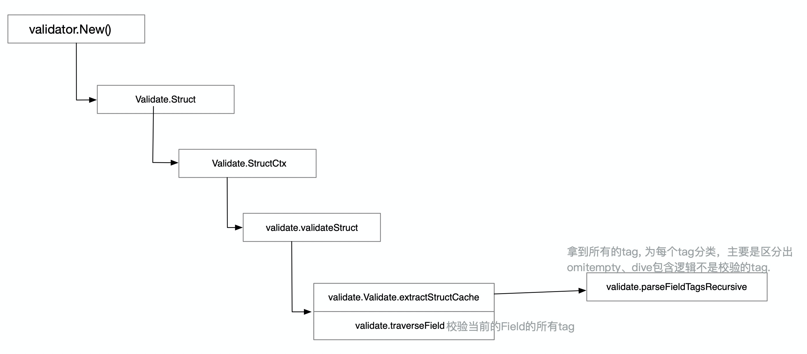

# Go如何实现对任意struct的校验


## 需求

在写一个接口的时候我们要对入参数进行检验。比如下面的结构要判断User.Age必须是大于0的、LastName是存在的、Email是合法的，凡此种种，如果每个字段都手写校验，即使是用的通用方法你也会比较烦躁。

```go
type Address struct {
  Street string
  City   string
  Planet string
  Phone  string
}
type User struct {
  FirstName      string    
  LastName       string    
  Age            uint8     
  Email          string    
  FavouriteColor string    
  Addresses      []*Address
}
```

我们希望通过go提供的struct tag的方式实现，就比如下面这样：

```go
type User struct {
	Name           string     `validate:"required"`
	Age            uint8      `validate:"gte=0,lte=130"`
	Email          string     `validate:"required,email"`
}
```

我们设置Name为必传字段，Age属于大于0并且小于130、Email是必传的并且要符合email格式。


## reflect小常识

reflect提供了对golang的类型可编程的能力，我们需要知道对于一个变量底层是有两个结构分别去存储值和类型的(xxxxxx)。我们能够通过`reflect.TypeOf(x)`拿到这个变量对应的类型，通过`reflect.ValueOf(x)`拿到变量的值。

```go
type User struct {
  Name           string     `validate:"required"`
  Age            uint8      `validate:"gt=0"`
}
user := User{
  Name:  "Helios",
  Age:   0,
}
fmt.Println(reflect.ValueOf(user), reflect.TypeOf(user)) // {Helios 0} main.User
```

如果想查看struct每个字段（在本文中**Field**和字段是通用的，后文大量使用Feild）的值和类型怎么办呢？

```go
vv := reflect.ValueOf(user)// {Helios 0}
vt := reflect.TypeOf(user)// main.User
for i := 0; i< vv.NumField(); i++ {
  fieldValue := vv.Field(i)
  fieldTyp   := vt.Field(i)
  fmt.Println(fieldValue) // Helios
  fmt.Println(fieldTyp)   //{Name  string validate:"required" 0 [0] false} 
}
```

如果要拿到tag呢？？？

如果你想对reflect有进一步的了解话，可以看[laws-of-reflection](https://blog.golang.org/laws-of-reflection).


## reflect小应用

有了上面的reflect的小知识，就知道对于下面一个结构，能通过

- `reflect.ValueOf()`拿到User的reflect值对象
- `reflect.TypeOf()`拿到User的reflect类型对象
- `reflect.ValueOf(v).NumField()`拿到这个struct有多少个属性
- `reflect.ValueOf(v).Field(i)`拿到某个属性的reflect值对象
- `reflect.ValueOf(v).Field(i).Interface()`拿到某个属性的值，返回值是interface{}，需要什么值自己去转
- `reflect.TypeOf(v).Field(i)`拿到某个属性的reflect类型对象
- `reflect.TypeOf(v).Field(i).Tag.Get("validate")`拿到某个属性的tag，以string的方式返回
- 通过`.Kind()`判断属于什么类型

```go
type User struct {
  Name           string     `validate:"required"`
  Age            uint8      `validate:"gt=0"`
  Email          string     `validate:"required"`
}
user := User{
  Name:  "Helios",
  Age:   0,
  Email: "",
}
```

有了这些我们我们就能自己实现验证函数了，比如（重点看注释）：

```go
func simpleValidate(v interface{}) error {
	value := reflect.ValueOf(v)
	if value.Kind() == reflect.Ptr { // 如果传递进来的是指针
		value = value.Elem()           // 拿到这个指针指向的地址
	}
	typ := value.Type()              // 等价于reflect.TypeOf(v)
  
	for i := 0; i < value.NumField(); i++ { // 循环遍历属性   
		tag := typ.Field(i).Tag.Get("validate") // 获得tag并且进行简单处理
		var (
			tagK string
			tagV string
		)
		equalIndex := strings.Index(tag, "=")
		if equalIndex!= -1 {
			tagK = tag[0:equalIndex]
			tagV = tag[equalIndex + 1:]
		}
    field := value.Field(i) 
		switch field.Kind() {  // 根据struct的属性进行判断，下面实现了两个简单的校验
		case reflect.String:
			if tag == "required" {
				if len(field.Interface().(string)) < 1 {
					return errors.New(tag + "not match" + typ.Field(i).Name)
				}
			}
		case reflect.Uint8:
			if tagK == "gt" {
				target, _ := strconv.Atoi(tagV)
				if field.Uint() <= uint64(target) {
					return errors.New(tag + "not match" + typ.Field(i).Name)
				}
			}
		}
	}
	return nil
}
```


## 简易版validator

但是上述的验证功能还是很弱的，先说几点局限性：

1、对于更复杂的结构+处理很多tag，上面的方式switch case能写到吐；

2、 不能自定义tag的名字，比如tag的名字不叫validata叫binding；

3、 如何进行错误处理，即准确定位那个字段错误了；

4、 不能外部自己定义tag以及处理函数。


归根到底就是上面的验证函数太过于具体，不够抽象，提供的灵活性差。我们下面以此来解决这几个问题


### struct的每个field都可能有多个tag，switch/case里面的代码过多，难以维护

本着遇事加一层的原则，将**解析struct**和**执行校验**分开，将struct解析为我们容易懂的结构。

struct 和field是一对多的关系，field和tag也是一对多的关系，我们可以在*解析struct*阶段，将struct中的每个Field抽象为下面的结构，然后依此校验：

```go
/* 这是为了让读者看结构好理解的
type User struct {
  Name           string     `validate:"required"`
  Age            uint8      `validate:"gt=0"`
  Email          string     `validate:"required"`
}
user := User{
  Name:  "Helios",
  Age:   0,
  Email: "",
}
*/
type FieldParam interface {
	Field() reflect.Value
	Param() string
}

type Func func(v FieldParam) bool //每个tag对应的一个函数

type field struct {
	parent string   // 可能是struct的嵌套，记录他爸爸的Field名字，输出错误日志的时候好看
  name  string    // 当前Field name, (User.Name)
  value reflect.Value // reflect.ValueOf().Field(i)
	typ   reflect.StructField // reflect.TypeOf().Field(i)
	tags  []*tag         // 包含的tag
}

type tag struct {
	tagName              string   // gt    required
	param                string   // 0     ""
	fn                   Func     // func   func
	hasParam             bool     // true    bool
}
```

然后校验每个tag的时候只需要执行每个tag上的对应函数即可，先来看来校验struct的过程；

```go
func (v *validate) validateStruct(s interface{}) {
	val := reflect.ValueOf(s)
	typ := reflect.TypeOf(s)
	// ...
	// 遍历整个struct得到Field
	for i := 0; i < val.NumField(); i++ {
		fieldValue := val.Field(i)
		fieldType := typ.Field(i)
		tag := fieldType.Tag.Get(v.tagName)
		v.validateFiled(&field{
			parent: typ.Name(),
			name:  fieldType.Name,
			value: fieldValue,
			typ:   fieldType,
			tags:  v.parseTag(tag), //  得到每个Field的所有tag
		})
	}
}
```

parseTag函数比较简单，Field上的所有tag生成tag数组：

```go

func (v *validate) parseTag(tagStr string ) (tags []*tag){
	tagItems := strings.Split(tagStr, v.splitStr)

	for _, item := range tagItems {
		t := &tag{
			tagName:  item,
			fn:       v.builtInValidations[item],
		}
    
		if strings.Contains(item, "=") {
			t.hasParam = true
			param := strings.Split(item, "=")
			t.param = param[1]
			t.tagName = param[0]
			t.fn = v.builtInValidations[t.tagName]
		}
		tags = append(tags, t)
	}

	return tags
}
```

有了Feild以及对应的tag，我们就行执行校验了，这是个核心函数并且也比较长：

```go

func (v *validate) validateFiled(fd *field)  {
	fp := &fieldParams{
		fieldValue: fd.value,
	}
  // 如果是feild是struct那么就递归遍历
  // 你可能发现validateFiled和validateStruct是相互调用的
  // 没错，就是相互调用的
	if fd.value.Kind() == reflect.Struct {
		v.validateStruct(fd.value.Interface())
	}
	for _, t := range fd.tags {
		if t.hasParam {
			fp.param = t.param
		}
    // 错误结构，后续会继续说
		fe := &fieldError{
			ns:    fd.parent,
			tag:   t.tagName,
			val:   fd.value,
			typ:   fd.typ,
		}
		if ok := t.fn(fp); !ok {
			v.errs = append(v.errs, fe)
			return
		}
	}
  // 如果field是slice或者数组，拿出啦继续搞
	if fd.value.Kind() == reflect.Slice ... {
		for i := 0; i < fd.value.Len(); i++ {
			childFieldValue := fd.value.Index(i)
			f := &field{
				name:  fmt.Sprintf("%s_%d", childFieldValue.String(), i),
				value: childFieldValue,
				typ:   fd.typ,
			}
			v.validateFiled(f) 
		}
	}
}

```

至此，解析和验证的阶段就结束了，你可能会有两个疑问🤔️：

1、 receiver的validate的接受是什么做什么用的

2、 每个tag的回调是怎么注册进去的

解答这两个问题，我们要从如何使用validator说起：

```go
v := validator.New()
user := &User{
  FirstName:      "helios",
  Age:            0,
}
if err := v.Struct(user); err != nil {
  t.Error(err)
  return
}
```

使用和[go-playground/validator](https://github.com/go-playground/validator)是一致的，我们点开New函数就能揭晓答案了：

```go
type validate struct {
	tagName            string // tagname默认叫validate，可以通过SetTagName设置
	splitStr           string // 多个tag之间通过什么符号分割，默认是,也能改
	errs               ValidationErrors // 一个struct可能有多个field校验不合格，存为slice
	builtInValidations map[string]Func  // tag对应的处理函数
}
func New() Validator{
	v := &validate{tagName: defaultTagName, splitStr: defaultSplit}
	// 把required这类内置的tag注册进来
	v.builtInValidations = make(map[string]Func)
	for tag, handler := range buildInValidators {
		v.builtInValidations[tag] = handler
	}
	return v
}

```

我们最后来简单看一个函数的注册：。。。。

。。。


## go-playground/validator如何实现的

如果上面的流程的流程理解了，再来看[go-playground/validator](https://github.com/go-playground/validator)会发现基本差不多<del>因为上述就是我看完go-playground/validator实现的简易版</del>。当然它会有更多的细节处理，比如tag的alias、针对某个key特殊处理或者通过sync.Pool优化性能之类的。我把go-playground/validator的流程总结了下面的一张图，如果你想看代码的希望能够帮助你。



## 总结

上述的几个步骤就是我实现自己的validator的辛苦过程，最开始拿到**需求**的时候很蒙圈，系统的学习了下reflect相关的东西，还发现了一个比较尴尬的问题：`reflect.StructField`这个struct只能通过`typ.Fild(i)`其他的方式得不到，比如：

```go
user := User{
		FirstName:      "Badger",
		LastName:       "Smith",
		Age:            135,
		Email:          "Badger.Smith@gmail.com",
		FavouriteColor: "#000-",
		Addresses:      []*Address{address},
}
vv := reflect.ValueOf(user)
vt := vv.Type()
fmt.Println(vt.Field(5).Type) // vt.Field(5)返回的结构就是reflect.StructField
```

但是如果我想拿到user的`reflect.StructField`的却拿不到，这个结构还是比较方便的。怎么通过`reflect.Type`转到`reflect.StructField`没有找到方法！！

后来通过reflect+switch/case实现了简单版本，当然最初也参考了曹大的[5.4 validator请求校验](https://github.com/chai2010/advanced-go-programming-book/blob/master/ch5-web/ch5-04-validator.md)，发现和想要的差距太大，可扩展性太低（其实这个时候我已经看了go-playground/validator代码了，但是太拘泥于细节了，不能体会为什么这么设计），就又回去参考go-playground/validator，发现validate、field、tag这几个结构还是设计的很好的。从它那里借鉴<del>抄</del>了很多代码。

然后通过


