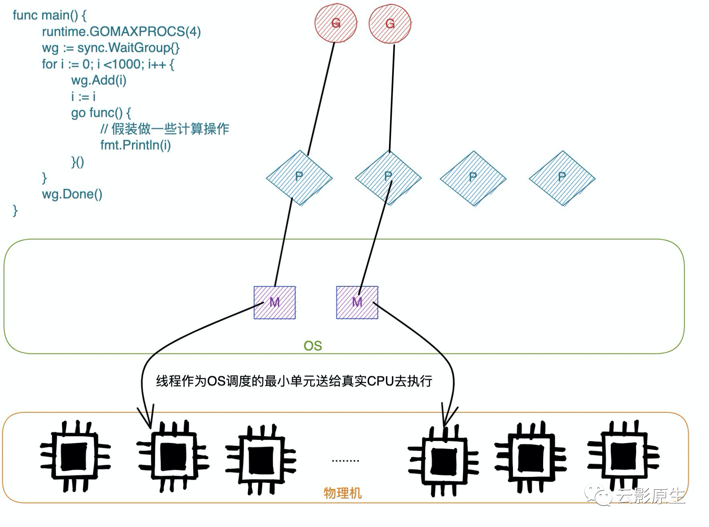

# 为什么Go服务容器化之后延迟变高

在今年的gopherchina上发现有两三个topic都在说Go服务容器化的P（如果你不知道P是什么，没有关系，马上就会解释）数量的问题，现象是被**容器限制了4C的服务跑在96C的机器上，相比于物理机部署的延时高了很多**。原因是因为Go启动的时候读的宿主机的CPU核心数，启动了96个P，**96个P都在找G去执行但是只有4C的处理时间，导致大量CPU耗费在找G和上下文切换**。解决方案就是**引入uber的automaxprocs这个库**就可以了。


我回公司之后通过trace发现自己的2C服务确实起了很多P，于是先在自己业务上加上了这个库，经过一周的观察发现并没有什么变化，后来得的结论是**服务的QPS不够高，不能引发问题**（后面会详细解释）。


后来同事的一个高QPS服务也遇到了这个问题，加上了这个库马上突破了那时候的QPS限制。再后来公司的框架升级，准备把这个库默认启动，我就对框架做了一系列的压测，对这个问题又深入了，所以写这篇文章总结一下。


因为事先已经知道结果了，所以你看的时候可能感觉是反过来了，我是从结论出发一步步推演问题原因。


## 一、Go 调度知识扫盲

在就不深入讲解GMP的调度模型，为了不影响初学者阅读，我只是简单介绍一下，理解的可以直接跳过这一小段。


Go是在runtime实现的任务调度，每个go关键字都会创建一个用户任务，称之为G；但是线程才是操作系统调度的最小单位，用户任务需要系统线程去执行，那么就需要创建系统线程，我们称之为M；这个就是Go 1.0及其之前的调度器。


后来感觉不行了，如果把所有的任务放在全局的话，每次执行一个任务都要加锁、以前的资源都是挂在M上的，陷入内核态的时候保存和恢复浪费内存以及G没有亲和性可言（在一个M上运行的G被挂起之后，下次执行很大概率不会到这个M，当时的缓存也就没有用了）。


我们可以先暂停一下看下linux的任务调度是怎么样的，简单的一句话：**进程是资源的最小单位，线程是调度的最小单位**。Go的runtime把G当作最小调度单位了，那么在加一个资源的最小单位不就得了么，这个时候在M和G之间的P就呼之欲出了，通过P这个结构来看下P的作用：

```go
type p struct {
  // ...
  mcache *mcache
  pcache pageCache
  runq [256]guintptr
  runnext guintptr
 
  // ...
  sudogcache []*sudog
  sudogbuf [128]*sudog
   
  // ...
  mspancache struct {
    len int
    buf [128]*mspan
  }
  // ...
}
```

主要的作用有两个：

1、 通过增加本地队列减少锁操作：有个本地队列runq以及优先级最高的runnext，也就是说一个P最多包含257个G；

2、 内存管理：mcache、pcache以及mspancache这些东西一看就是管理内存的，现在可以简单的理解为他们管理的内存大小不一样，内存管理名词太多，再说能说到天亮；

那么有两个问题自然而然的出现了：


### **问题一、如果一个P上的G超过了257个咋办？**

答：G还有一个全局队列，如果超过了就会放在全局队列上，全局队列是个链表，无限长。


### **问题二、如果一个P上的所有G执行完了咋办？**

答：这个就要从P寻找可用的G来说了，对应的函数是findrunnable（至少记住这个名字，后面还会看到）,优先级如下：

  1、 如果P的runnext存在有就用这个G【不加锁】，如果没有往下做

  2、 从P的local queue中顺序拿一下【不加锁】，如果local queue为空没有往下走

  3、 从全局队列中拿一个【加锁】，顺便从全局队列拿出128个给这个P（如果全局队列中没有128个就都给它，省的以后总来要），如果全区队列为空就继续往下走

  4、 从netpoll中拿，如果有返回第一个，剩下的通过injectglist放到全局队列中【加锁】，如果没有往下走

  5、 通过runqsteal函数随机从其他的P的本地队列中偷一半给当前P，然后将偷到的最后一个返回，如果还没有，那就算了，**将P设置为空闲状态并且将M从P中拿下来**，但是不会kill M。


这两个问题之后，你可能还会有两个问题：

### **问题三、系统线程不会被kill么**

答：确实是这样的，如果开启100系统线程空闲之后，那岂不是这个100个系统线程都不会被kill就在那静静的等着。

所以Go服务最好不要用太多的CPU，几百个线程就将近一个G的内存了，你这台机器要是再部署多个就尴尬了。


### **问题四、goroutine没有优先级么**

答：没有优先级，你要么少开点goroutine或者改runtime的代码。


用下面例子可视化一下流程：

```go
func main() {
 runtime.GOMAXPROCS(4)
 wg := sync.WaitGroup{}
 for i := 0; i <1000; i++ {
  wg.Add(i)
  i := i
  go func() {
    defer wg.Done()
   // 假装做一些计算操作
   fmt.Println(i)
  }()
 }
 wg.Wait()
}
```

这个程序会创建1k个goroutine，当创建两个的时候如下图：



在初始化的时候P就会创建出来4个，但是并不会马上创建出来4个系统线程。会等到使用的时候才会去创建，类似于COW的思路。

当所有goroutine都创建出来的时候：


## 现象

环境

- Go版本：1.13

- 物理机核数： 96C
- 容器设置的CPU：4C

下图中**绿**色表示通过`runtime.GOMAXPROCS()`讲P的数量设置为4，即服务能使用的核心数。**蓝色**表示没有管`runtime.GOMAXPROCS()`，P的数量默认设置为物理的核心数上（后面会解释为什么）。


我们分别记录了从200Q到4000Q几个段设置runtime.GOMAXPROCS(4)与否的**CPU使用**、**内存使用**、**平均延时**、**单POD开启线程数**以及**CPU受限率**的对比。

很明显能看出，当QPS超过1K的时候差距变得特别明显，当压测到4000Q的时候未设置runtime.GOMAXPROCS(4)的CPU使用是设置了的2.2倍，后面的差距越来越大，CPU高了延迟自然就大了起来。设置runtime.GOMAXPROCS(4)的服务还能压到1wQ。


## 三、CPU为什么会高


我抓了一下，没设置runtime.GOMAXPROCS(4)的情况下limit是4C的pod跑在96C机器上的pprof截图：


能清楚的看到自己服务执行的时间才占了一半的时间。我们再来看下除了http服务哪个函数占用的时间长：


直接看下mcall这个东西：


如果你理解了P找到G的过程就不难理解上述函数的作用，以及为什么findrunable会消耗CPU，因为有**96个P去都会执行findrunable找G，执行任务的线程用的CPU就相对少了**，因为一共就那么多CPU。


## 四、为什么CPU受限率高

GMP也是一个生产消费模型，我们的程序去生产G，然后M消费，P负责中间协调，但是上述场景生产速率过高，消费能力太弱（96:4）这就会导致任务挤压。在docker场景中表现出来就是CPU受限率特别高，如果你在一个4C的机器上开启设置runtime.GOMAXPROCS(96)可能表现就是机器挂到了。这个时候就变为了下图：


### CPU限制小加餐

在Linux中有专门的Cgroup文件系统（可以通过mount -t cgroup看到），定义了很多子系统，能对某个进程限制CPU使用量、跑在哪几个核上以及限制内存的使用量等。

通过一个例子详细的介绍一些cgroups，我们通过下面的命令启动一个nginx容器：

```shell
docker run -d \
--cpu-shares 513 \
--cpus 2 --cpuset-cpus 1,3 \
--memory 1024M \
--memory-swap 1234M \
--memory-swappiness 7 -p 8081:80 nginx
bbdadec016e2667a1de24f2e683bfa84c6a5c0ed1add6e1a4ae4e289e004eefc
[root@172_27_132_95 ~]# docker ps | grep nginx
bbdadec016e2        nginx
```

- --cpu-shares: 在多个进程之间，使用CPU的比例
- --cpus: 用几个cpu，这个是由*cpu.cfs_period_us*和*cpu.cfs_quota_us*共同决定
- --cpuset-cpus: 这容器用在哪几个cpu上执行
- --memory: 内存的限制
- --memory-swap: 设置交换分区的大小，一般要大于memory
- --memory-swappiness: 使用swap memory的比例，0～100区间，0表示尽量不要用swap，100表示尽量使用swap


在/**sys/fs/cgroup/cpu,cpuacct**下面是对CPU的资源控制配置文件：

```shell
# ll /sys/fs/cgroup/cpu,cpuacct
...
drwxr-xr-x   7 root root 0 11月  9 17:24 docker
...
```

主要这个docker目录：

```shell
ll /sys/fs/cgroup/cpu,cpuacct/docker/
总用量 0
bbdadec016e2667a1de24f2e683bfa84c6a5c0ed1add6e1a4ae4e289e004eefc
...
```

和乱码一样的一长串东西就是我们刚才创建nginx的容器id，再进去看看：

```shell
# ll /sys/fs/cgroup/cpu,cpuacct/docker/bbdadec016e2667a1de24f2e683bfa84c6a5c0ed1add6e1a4ae4e289e004eefc/
-rw-r--r-- 1 root root 0 11月 11 09:53 cpu.cfs_quota_us
-rw-r--r-- 1 root root 0 11月 11 09:53 cpu.rt_period_us
...
-rw-r--r-- 1 root root 0 11月 11 09:53 tasks
```

tasks表示这个容器启动了多少进程，看一下就知道了：

```shell
cat /sys/fs/cgroup/cpu,cpuacct/docker/f9ab36a90a5a3cb0ca3276f3937eb875b32bb201255a34783b8778fcf07717c8/tasks
1753
2059
```

我们可以在机器上看一下这两个进程就是父子关系：

```shell
# pstree 1753
nginx───nginx
# pstree 2059
nginx
```

我们再来看下如何限制CPU的使用量，我们通过--cpus 2设置了这个容器只使用2C的CPU。这是通过下面两个参数共同决定的：

- cpu.cfs_period_us：指的是运行周期
- cpu.cfs_quota_us：这个周期内这个进程占用多少时间

我们设置了cpus为2，代表的意思是在10000ms的运行周期内占用20000ms的时间，即要两个CPU。

```shell
# cat /sys/fs/cgroup/cpu,cpuacct/docker/bbdadec016e2667a1de24f2e683bfa84c6a5c0ed1add6e1a4ae4e289e004eefc/cpu.cfs_quota_us
200000
# cat /sys/fs/cgroup/cpu,cpuacct/docker/bbdadec016e2667a1de24f2e683bfa84c6a5c0ed1add6e1a4ae4e289e004eefc/cpu.cfs_period_us
100000
```

对于其他cgroups限制的分析交给兄弟们自己分析，要不然就写的太长了。


## 五、如何解决

这里我们抛开Go语言，谈谈如何将多核CPU用到极致，比如8C的CPU：

- 我们开6个线程可不可以，就算每个线程分别在一个CPU上执行那还剩两个CPU没用呢
- 我们开10个线程可不可以，因为总会有两个线程需要等待执行，当执行到它们的时候就意味着会有上下文的切换，上下文切换就要保存现场、设置寄存器就会浪费时间
- 开8个线程的话，就会让每个线程充分的利用CPU资源，如果没有新任务就不进行切换
- 那如果开200个线程呢，我们且不说200个线程占用多少内存，这个比开启10个线程更加损失CPU的亲和性以及不可估量的上下文切换时间


最好的策略就是将runtime.GOMAXPROCS设置为自己服务申请的CPU核心数量。每次让业务自己手动设置runtime.GOMAXPROCS等于自己服务占用核数好像有点不合理，怎么能让业务和运行环境如此耦合呢！


我们知道Go程序启动的时候getncpu通过sysctl获取CPU核心数，它是读的/proc/cpuinfo文件，并不是通过被cgroups限制的cpu子系统计算来的，所以我们通过读容器内的文件就能计算得到，首先我们先拿到我们使用了哪些cgroups(cat /proc/self/cgroup):

```shell
12:devices:/kubepods/burstable/pod5bb7d18f-1440-4104-bf00-bf4998acc6ff/c2ccf53dabe5ecde2447e7e1d51de77b7f23ddf79b5a8714c46d77f0b4b1ef1b
11:cpuset:/kubepods/burstable/pod5bb7d18f-1440-4104-bf00-bf4998acc6ff/c2ccf53dabe5ecde2447e7e1d51de77b7f23ddf79b5a8714c46d77f0b4b1ef1b
10:blkio:/kubepods/burstable/pod5bb7d18f-1440-4104-bf00-bf4998acc6ff/c2ccf53dabe5ecde2447e7e1d51de77b7f23ddf79b5a8714c46d77f0b4b1ef1b
9:freezer:/kubepods/burstable/pod5bb7d18f-1440-4104-bf00-bf4998acc6ff/c2ccf53dabe5ecde2447e7e1d51de77b7f23ddf79b5a8714c46d77f0b4b1ef1b
8:perf_event:/kubepods/burstable/pod5bb7d18f-1440-4104-bf00-bf4998acc6ff/c2ccf53dabe5ecde2447e7e1d51de77b7f23ddf79b5a8714c46d77f0b4b1ef1b
7:pids:/kubepods/burstable/pod5bb7d18f-1440-4104-bf00-bf4998acc6ff/c2ccf53dabe5ecde2447e7e1d51de77b7f23ddf79b5a8714c46d77f0b4b1ef1b
6:cpu,cpuacct:/kubepods/burstable/pod5bb7d18f-1440-4104-bf00-bf4998acc6ff/c2ccf53dabe5ecde2447e7e1d51de77b7f23ddf79b5a8714c46d77f0b4b1ef1b
...
```

用:分割，分别是id、子系统、挂载根路径。

因为docker通过Mount namespace已经修改了我们的挂载点，通过cat /proc/self/mountinfo拿到修改后挂载点：

```go
7040 7036 0:24 /kubepods/burstable/pod5bb7d18f-1440-4104-bf00-bf4998acc6ff/c2ccf53dabe5ecde2447e7e1d51de77b7f23ddf79b5a8714c46d77f0b4b1ef1b /sys/fs/cgroup/net_cls ro,nosuid,nodev,noexec,relatime master:10 - cgroup cgroup rw,net_cls
7041 7036 0:25 /kubepods/burstable/pod5bb7d18f-1440-4104-bf00-bf4998acc6ff/c2ccf53dabe5ecde2447e7e1d51de77b7f23ddf79b5a8714c46d77f0b4b1ef1b /sys/fs/cgroup/memory ro,nosuid,nodev,noexec,relatime master:11 - cgroup cgroup rw,memory
7044 7036 0:28 /kubepods/burstable/pod5bb7d18f-1440-4104-bf00-bf4998acc6ff/c2ccf53dabe5ecde2447e7e1d51de77b7f23ddf79b5a8714c46d77f0b4b1ef1b /sys/fs/cgroup/cpu,cpuacct ro,nosuid,nodev,noexec,relatime master:14 - cgroup cgroup rw,cpu,cpuacct
7052 7036 0:33 /kubepods/burstable/pod5bb7d18f-1440-4104-bf00-bf4998acc6ff/c2ccf53dabe5ecde2447e7e1d51de77b7f23ddf79b5a8714c46d77f0b4b1ef1b /sys/fs/cgroup/cpuset ro,nosuid,nodev,noexec,relatime master:19 - cgroup cgroup rw,cpuset
...
```

以空格分割，分别是mountID、parentID、deviceID、**挂在根结点**、**挂载点**、可选配置、可选field、-表示可选参数结束、文件系统类型、文件系统挂在源、**额外配置**。

我们以第一条为例，选取关注的三个信息：

- 挂在根结点（即宿主机的目录）: kubepods/burstable/pod5bb7d18f-1440-4104-bf00-bf4998acc6ff/c2ccf53dabe5ecde2447e7e1d51de77b7f23ddf79b5a8714c46d77f0b4b1ef1b
- 挂载点（即容器目录）：/sys/fs/cgroup/net_cls
- 额外配置：rw,net_cls，用逗号分隔，net_cls表示这是net_cls子系统，同理cpuset表示这是cpuset子系统

如果这个进程里面使用了cpu 子系统并且在对应的挂载信息额外配置中包含cpu cgroups，那么对应的挂载点就是在宿主机上对这个进程的限制，将cpu.cfs_period_us和cpu.cfs_quota_us读出来做除法就行了。


如果你理解了这个过程，那么你也自然理解[uber-go/automaxprocs](https://github.com/uber-go/automaxprocs)的原理。

## 总结

这是一个在容器化Go服务必须要面对了问题，这次我们从结论出发相比于从问题出发缺少了一下分析过程，以及排查思路。但是能够从更多更全的指标分析这个问题，串起来从上层应用到Go runtime调度最后到内核如何对一个进程进行资源限制的整个过程。