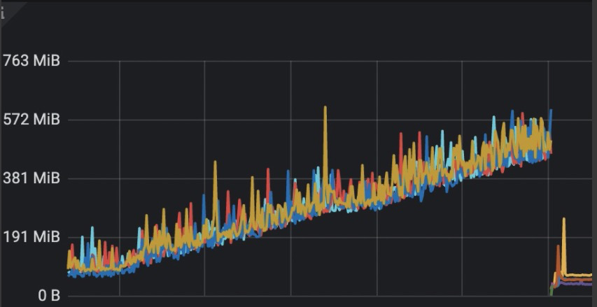
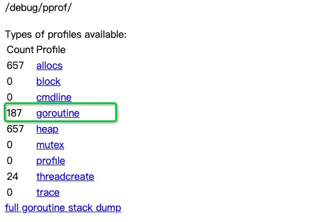
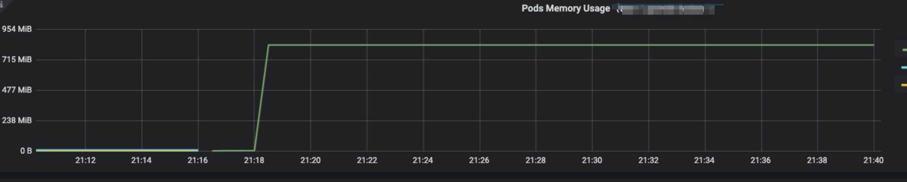
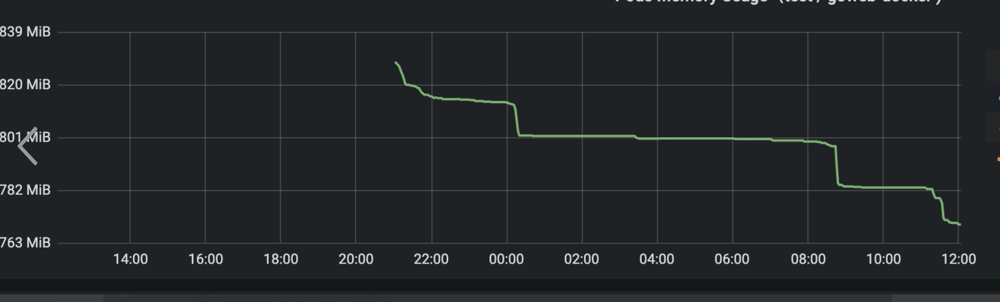
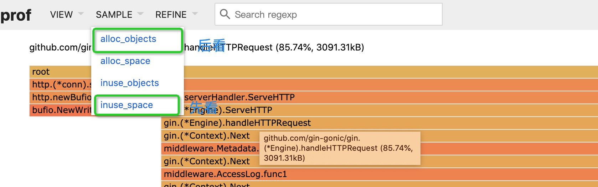

# Go程序内存假泄漏是怎么回事

其实这是一个很早之前我发现的一个问题，好多gopher都遇到过的这个问题。如果你的Go服务版本是**大于等于**1.12并且**小于**1.16的话，大概率也会遇到这个问题。


## 现象&分析

我们的服务使用期是在每天早10:00到晚9:00，有一天早上我来公司比较早（9:55左右），日常查看监控，这个时候理论上应该一点量没有，CPU也正常（在低位）但是内存特别高（低峰应该20+M，但是监控显示将近1G）。


然后我就查看了最近三天的内存使用量（如下图），竟然从来没降低过。



然后就开始排查呗（<del>趁着没人发现赶快解决</del>）。第一反应就是内存泄漏了，内存泄漏最大概率还是goroutine的泄漏，通过pprof查看，也就不到两百的goroutine呢，也是正常呀。



那么问题来了，可能是堆内存高，也可能是栈占的内存高了，要是栈的内存高那就不好搞了（<del>突然想起我当时的前几天写了个递归，难道是出事了</del>），此时的我不知道为啥想再排除一个更不可能的问题，是不是GC一直没有执行（<del>因为同事也改了编译环境</del>）。然后打开pprof的下图(事后补的， 可能有些偏差，主要看文字)：


我把重点的指标在图中进行了标注，说明了三个问题：

1、 执行了GC

2、 goroutine占用的栈空间很小

3、 堆inuse很小。

本来就想看个GC有没有执行的，结果看出来个难以理解的问题。


我有点蒙圈了，，哪里的内存泄漏了，既不是栈又不是堆。我又查了查go101的内存泄漏总结（[Memory Leaking Scenarios](https://go101.org/article/memory-leaking.html)，我在最后总结一下内存泄漏的情况）都不符合。


经过一连串劲爆操作(Google + stackoverflow + github)，发现了也有人遇到过类似的问题:

- [all: resident set size keeps on increasing, but no memory leaks](https://github.com/golang/go/issues/38257)
- [runtime: Go routine and writer memory not being released](https://github.com/golang/go/issues/32124)
- [runtime: RSS keeps on increasing, suspected scavenger issue](https://github.com/golang/go/issues/36398)


## 解决

这个原因涉及到了Go 1.12的一个改动：

> On Linux, the runtime now uses `MADV_FREE` to release unused memory. This is more efficient but may result in higher reported RSS. The kernel will reclaim the unused data when it is needed. To revert to the Go 1.11 behavior (`MADV_DONTNEED`), set the environment variable `GODEBUG=madvdontneed=1`.

意思就是将madvise的策略从`MADV_DONTNEED`改为`MADV_FREE`了（linux >= 4.5才生效），这个会提高runtime返回给操作系统内存的效率，但是不会更新RSS，只有在系统内存有压力的时候才会更新。（对应的issue[runtime: use MADV_FREE on linux as well](https://github.com/golang/go/issues/23687)）。

这就是导致我们遇到的问题，各种参数都很正常，但是就是内存就是降不下俩，这是因为我们内存的监控的是RSS。

解决方法也是很简单就是在编译的时候加上`GODEBUG=madvdontneed=1`即可。


因为这个问题遇到的人太多了，并且难以排查，Go团队在1.16的时候又将这个参数改回来了。

> On Linux, the runtime now defaults to releasing memory to the operating system promptly (using `MADV_DONTNEED`), rather than lazily when the operating system is under memory pressure (using `MADV_FREE`). This means process-level memory statistics like RSS will more accurately reflect the amount of physical memory being used by Go processes. Systems that are currently using `GODEBUG=madvdontneed=1` to improve memory monitoring behavior no longer need to set this environment variable.

所以以后1.16就不会遇到问题了，对应的issue：[runtime: default to MADV_DONTNEED on Linux](https://github.com/golang/go/issues/42330).

笔者从1.11一直测试到了1.16（1.11和1.16只测试的默认一种情况，1.12～1.15测试两种情况），并没有看出所谓的性能有什么提升。


## 后续进展

可以通过下面的程序模拟一下这个过程，（[栗子来源](https://github.com/golang/go/issues/36398)）：

```go
func allocate(s int) {
 a := make([]byte, s * 1024 * 1024)
 for i := 0;i < len(a); i += 4096 {
  a[i] = 'x'
 }
 fmt.Printf("allocateallocateallocateallocate%c %d\n", a[0], s)
}

func main() {
  allocate(100)
  allocate(200)
  allocate(500)
  time.Sleep(300 * time.Second)
}

```

使用1.12的默认值的话的效果如下：



加上`GODEBUG=madvdontneed=1` 如下：


效果上符合预期的，但是各个版本还是有一些小小的不同，比如1.13的默认值，并不像1.12一样一直处于一条执行，会有短短降低的时候：



这是因为在1.13有个小优化[Proposal: Smarter Scavenging](https://go.googlesource.com/proposal/+/aa701aae530695d32916b779e048a3e18311a2e3/design/30333-smarter-scavenging.md)，将最佳分配改为最先分配。而且1.13之后加上`GODEBUG=madvdontneed=1`之后的变化曲线和1.12也是有所不同：


这个可能因为那个小优化，但是具体问题还在进一步跟进。


## 总结

今天讲了一下不是内存泄漏但是拥有内存泄漏表象的问题，通过这个问题，我们来总结一下排查内存泄漏问题的路径：

1、 检查Go的版本是不是在1.12到1.15的左闭右开区间，如果是的话，通过pprof能够信息确定是不是真的有内存泄漏


2、 看pprof是堆占用的内存高（heapInuse、headpAlloc），还是栈占用的内存高（Stack），最好通过pprof的可视化工具看（[golang性能分析工具指南--pprof](https://mp.weixin.qq.com/s/TRQ_vwYuqXnuFLYAGbxlQA)），比如(火焰图、top、调用关系图)：



这一串操作下来应该就能确认是什么问题了。

