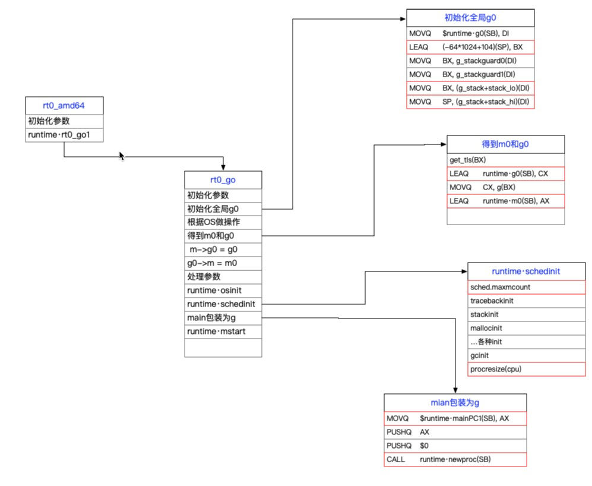

# Go程序是如何跑起来的


## 为看懂汇编

汇编小常识


## 工具小扫盲：dlv


## 如何启动的

我把启动的过程整理为了一张图， 并且把重点部分做了标记。



注⚠️

rt0_amd64和rt0_go都是汇编代码在`runtime/asm_amd64.s`文件中；

剩下的函数都在`runtime/proc.go`文件中。


### 初始化全局g0

```asm
MOVQ	$runtime·g0(SB), DI
LEAQ	(-64*1024+104)(SP), BX // BX = -64*1024 + 104 + SP
MOVQ	BX, g_stackguard0(DI)
MOVQ	BX, g_stackguard1(DI)
MOVQ	BX, (g_stack+stack_lo)(DI) // g.stack.lo = BX = -64*1024 + 104 + SP
MOVQ	SP, (g_stack+stack_hi)(DI) // g.stack.hi =  SP
```

要看懂这段代码就必须先说一下runtime.g结构中关于栈的几个字段。

```go
type stack struct {
	lo uintptr
	hi uintptr
}

type g struct {
	stack       stack   // offset known to runtime/cgo
	stackguard0 uintptr // offset known to liblink
	stackguard1 uintptr // offset known to liblink
  // ...
}
```

- `g.stack`表示的是这个goroutine能够使用的内存范围是[lo, hi)。
- stackguard0：Go栈的边界，也提供给抢占式调度用。TODO
- stackguard1： C栈的边界

知道了这个，我们再来回过头看这个栈的空间一共是64*1024 - 104字节，也就是将近64M。只有main函数的g0的栈才会这么大，普通的goroutine的栈只有2K，后面我们会看到2K怎么来的。


### 得到m0和g0

```asm
get_tls(BX)
LEAQ	runtime·g0(SB), CX  // CX = runtime·g0
MOVQ	CX, g(BX)           
LEAQ	runtime·m0(SB), AX  // AX = runtime·m0

// save m->g0 = g0
MOVQ	CX, m_g0(AX)       // m0.g0 = g0
// save m0 to g0->m
MOVQ	AX, g_m(CX)       // g0.m = m0
```

如果你看过Go runtime代码的话就会经常看到getg()，但是看这个函数定义的时候却啥也没有：

```go
func getg() *g
```

这个会在编译的时候根据你的平台从不同的地方拿，这里其实就是从tls(thread local storage)中拿的，getg这个函数我们一会儿会大量见到。

剩下的代码配合后面的注释也都不难理解。


### runtime·schedinit


```go
func schedinit() {
	// 来了吧。。。。
	_g_ := getg()

	sched.maxmcount = 10000  // 设置最多启动1w个M

	tracebackinit() // 让一些变量的初始化提前
	mallocinit() // 初始化内存管理相关
	// ... 
	itabsinit()     // 初始化iface的全局映射表

	gcinit()

	procs := ncpu
	if procresize(procs) != nil {
		throw("unknown runnable goroutine during bootstrap")
	}

	// ...
}
```

这里面有一系列相关的初始化操作，比较重要的对于内存管理的初始化（初始化堆以及m上的mcache）和GC的初始化，这都是和runtiem密切相关的。

还就是设置P的数量等于CPU 和核心数。TODO


### runtime.main

```go
// create a new goroutine to start program
MOVQ  $runtime·mainPC(SB), AX   // AX = runtime.main
```

我们先来看一下`runtime·mainPC`这个变量的定义：

```asm
DATA	runtime·mainPC+0(SB)/8,$runtime·main(SB)
GLOBL	runtime·mainPC(SB),RODATA,$8
```

如果我看了第一节，很容易就理解这是行如`runtime·mainPC := runtime·main`一个结构。那么我们就来看一下runtime.main这个函数：

```go
func main() {
	g := getg()

	if GOARCH != "wasm" { // no threads on wasm yet, so no sysmon
		systemstack(func() {
			newm(sysmon, nil, -1) // 后台进程
		})
	}
	
  lockOSThread()
	// 只能是m0才能进入这个函数
	if g.m != &m0 {
		throw("runtime.main not on m0")
	}

	gcenable() // 开启GC
	fn := main_main // Go程序定义的main函数
	fn()
	// ...
}
```

runtime.main主要做了下面几个事情：

-  1、 执行sysmon后台线程

- 2、 runtime.main这个g.m是不是m0

-  3、 开启GC

-  4、 执行Go程序main包下面的main函数

我们来分别看一下这几个东西

####  1、 执行sysmon后台线程

这个我们在TODO

#### 2、  runtime.main这个g.m是不是m0

这个其实不是用多说就是一个if判断。提醒一下大家main函数通过lockOSThread()将g0绑死到了m0上，所以这个调度也是不用P的。下面还会有地方能和这里呼应。


####  3、 开启GC

```go
func gcenable() {
	c := make(chan int, 2)
	go bgsweep(c)
	go bgscavenge(c)
	<-c
	<-c
}
```

为什么这么说呢，这也解答了为什么我们启动一个go程序，会多好几个goroutine。


#### 4、  执行Go程序main包下面的main函数

不知道你有没有这样的一个疑问🤔️，就是Go怎么知道读mian包下面的main函数呢。我们下面main_main的定义就知道的。

```go
//go:linkname main_main main.main
func main_main()
```

这里是讲mian包下面这个私有的mian函数进行的导出，所以如果你改下这个定义：

```go
//go:linkname main_main1 main.main1
func main_main()
```

它就会读你main包下面的mian1函数了


### runtime.main包装为g

```asm
PUSHQ AX                        
PUSHQ $0      // 这两行主要是给提供参数
CALL  runtime·newproc(SB)   // runtime.newproc(0,runtime.main)
```

`newproc(siz int32, fn *funcval)`是创建一个新的G的过程，两个参数分别是栈大小和对应的执行函数。这个函数比较复杂，先通过一张图来梳理一下：


```go
func newproc(siz int32, fn *funcval) {
	argp := add(unsafe.Pointer(&fn), sys.PtrSize)
	gp := getg()
	pc := getcallerpc()
	systemstack(func() {
		newproc1(fn, argp, siz, gp, pc)
	})
}
```

就是对newproc1简单包装，在来看下newproc1：

```go
func newproc1(fn *funcval, argp unsafe.Pointer, narg int32, callergp *g, callerpc uintptr) {
	_g_ := getg()

	siz := narg
  // 8字节对齐
	siz = (siz + 7) &^ 7

	_p_ := _g_.m.p.ptr()
	newg := gfget(_p_)
	if newg == nil {
    //  malg(stacksize int32) *g 
		newg = malg(_StackMin) // _StackMin = 2018 所以一个g的栈大小是2K
		casgstatus(newg, _Gidle, _Gdead)
	}

	// ... 将p放到执行队列上
	runqput(_p_, newg, true)

}
```

其实看到这里已经足够了。关于`runtime.gfget`就是先从gfree里面拿一些空间放到这个P上，这是减少重新分配内存。

```go
// Get from gfree list.
// If local list is empty, grab a batch from global list.
func gfget(_p_ *p) *g {
retry:
	if _p_.gFree.empty() && (!sched.gFree.stack.empty() || !sched.gFree.noStack.empty()) {
		// 将全局的gfree放到P上
		for _p_.gFree.n < 32 {
      // 
			sched.gFree.n--
			_p_.gFree.push(gp)
			_p_.gFree.n++
		}
		// ...
		goto retry
	}
	gp := _p_.gFree.pop()
	if gp == nil {
		return nil
	}
	_p_.gFree.n--
	// ...
	return gp
}
```

`runtime.malg`是给一个goroutine分配栈空间：

```go
func malg(stacksize int32) *g {
	newg := new(g)
	if stacksize >= 0 {
		stacksize = round2(_StackSystem + stacksize)
		systemstack(func() {
			newg.stack = stackalloc(uint32(stacksize))
		})
    // ...
	}
	return newg
}
```

如果你有兴趣可以继续看`runtime.stackalloc`这个函数实现就是简单的栈空间赋值。

最后是`runtime.runqput`，在[[含视频]从一个问题看go scheduler执行流程](https://mp.weixin.qq.com/s/0EM9ZTdJgVbgP3Dwfr51bQ)和[Go scheduler这十年](https://github.com/helios741/myblog/tree/new/learn_go/src/2021/08/go_scheduler_history)都对这个过程做了讲述，我们在简单提一下，如果想了解Go 调度器的可以看下这两篇文章。先看图理解下过程：


有了图示的过程，看代码几乎不费力了(注释写的也特别好)：

```go
// runqput tries to put g on the local runnable queue.
// If next is false, runqput adds g to the tail of the runnable queue.
// If next is true, runqput puts g in the _p_.runnext slot.
// If the run queue is full, runnext puts g on the global queue.
// Executed only by the owner P.
func runqput(_p_ *p, gp *g, next bool) {

	if next {
	retryNext:
		oldnext := _p_.runnext
		if !_p_.runnext.cas(oldnext, guintptr(unsafe.Pointer(gp))) {
			goto retryNext
		}
		gp = oldnext.ptr()
	}

retry:
	h := atomic.LoadAcq(&_p_.runqhead) 
	t := _p_.runqtail
	if t-h < uint32(len(_p_.runq)) {
		_p_.runq[t%uint32(len(_p_.runq))].set(gp)
		atomic.StoreRel(&_p_.runqtail, t+1) 
		return
	}
  // 全局队列
	if runqputslow(_p_, gp, h, t) {
		return
	}
	goto retry
}
```

至此我们main包的mian函数已经作为g被放到待调度任务里面了。那么下一步就是开启调度循环能染我们的任务跑起来的。

### runtime·mstart

最后一步来了这个最好和上面两个连起来看：

```asm
MOVQ  $runtime·mainPC(SB), AX   
PUSHQ AX
PUSHQ $0      // arg size
CALL  runtime·newproc(SB)
POPQ  AX
POPQ  AX

// start this M
CALL  runtime·mstart(SB)
```

看下runtime.mstart：

```go
func mstart() {
	_g_ := getg()
	// ... 省略cgo相关
	_g_.stackguard0 = _g_.stack.lo + _StackGuard
	_g_.stackguard1 = _g_.stackguard0
	mstart1()
	// ...
}
```

再来看下mstart1函数

```go
func mstart1() {
	_g_ := getg()
	if _g_ != _g_.m.g0 {
		throw("bad runtime·mstart")
	}

	// 初始化m0
	minit()

	// 针对m0做一些特殊处理，主要是信号相关
	if _g_.m == &m0 {
		mstartm0()
	}
	// 执行挂在m上的函数
  // newm(fn func(), _p_ *p, id int64)的fn参数就是挂在m.mstartfn上的
	if fn := _g_.m.mstartfn; fn != nil {
		fn()
	}
	
  // 和前面的M0和G0不用P呼应上了。
	if _g_.m != &m0 {
		acquirep(_g_.m.nextp.ptr())
		_g_.m.nextp = 0
	}
  // 启动调度循环
	schedule()
}
```

我们可以看出这个函数的主要作用是开启调度循环。


## 总结

