# Go scheduler这十年

本文会从2008年Go诞生之初调度器的模样一直说到2019年发展到抢占式调度这个比较完善的调度模型的整个过程。

如果你对调度还不算了解可以看看[[含视频\]从一个问题看go scheduler执行流程](http://mp.weixin.qq.com/s?__biz=Mzg5MjYyNjUzOA==&mid=2247485542&idx=1&sn=1f33260ac5f26e06fe27e2d4739f0b43&chksm=c03a7b63f74df275cfa4a83bb3ffb2856d99b1c08a00fc88b44ed81c0e4b66ccc0c1de4284bb&scene=21#wechat_redirect)这个把整个过程说的比较详细，如果想看文字可以看[为什么Go服务容器化之后延迟变高](http://mp.weixin.qq.com/s?__biz=Mzg5MjYyNjUzOA==&mid=2247485445&idx=1&sn=b67ede492f149e90d543bd8ef46bcd37&chksm=c03a7b00f74df2166ea1f59c3428a7484d01cd2153399fd0e4554964e21fdd0b65207a7efd16&scene=21#wechat_redirect)这个里面的【调度扫盲】也是讲的比较通俗。


## **Clean up scheduler 2008.08.05**

关键词：Go未发布、GM模型、能通过编译、C实现

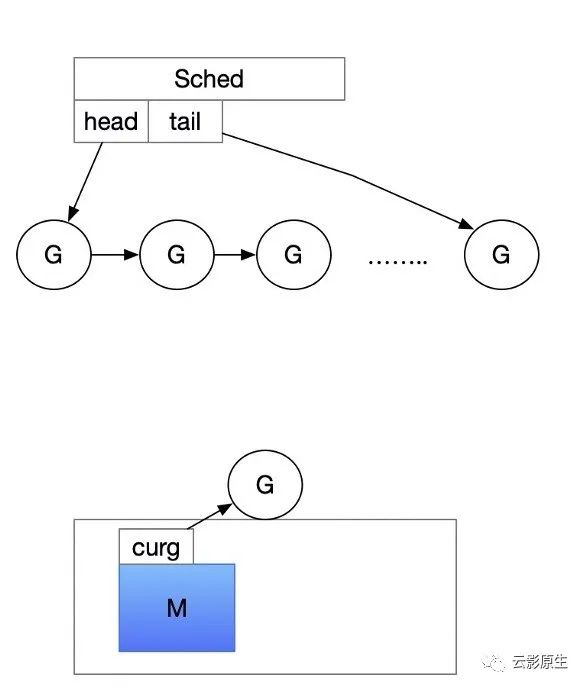

只有一个活跃的线程（能通过gomaxprocs环境变量制定），某些情况下比如锁的场景还没处理好。当然如果你的程序不涉及同步就可以用。


提交代码的之前连proposal都不写，主要是奠定了自定义调度器的基础，这个时候其实和线程调度没什么区别，一个任务调度到一个线程上执行到死，否则不切换。


代码（段末尾有）特别容易看：

```go
m0init -> scheduler -> nextgandunlock
                                -> gget() 加锁从全局拿一下
                                -> 如果拿不到休眠M
```

得到一个运行的G过程特别简单（不像现在几百行代码还要分top和stop两个阶段）：


```go
// Get from `g' queue. Sched must be locked.
static G*
gget(void)
{
  G *g;

  g = sched.ghead;
  if(g){
    sched.ghead = g->schedlink;
    if(sched.ghead == nil)
      sched.gtail = nil;
    sched.gwait--;
  }
  return g;
}
```

当时G的主要结构：


```go
struct  G
{
  // ...
  Gobuf sched; // SP + PC寄存器
  G* alllink; // 所有的G（不包含自己）
  int16 status;
  int32 goid; // 自增ID
  G* schedlink; // 全局可复用G队列（已经死掉那些）
  // ...
};
```


M的主要结构：


```go
struct  M
{
  G* g0; // g0 w interrupt stack - must not move
  G* curg; // 当前运行的goroutine
  G* lastg; // 最后一个运行的goroutine
  Gobuf sched; // SP + PC
  // ...
  Note havenextg;
  G* nextg; // 下一个要运行的G
  M* schedlink; // 全局空闲的M（M好像不会死！）
  // ...
};
```


全局队列的主要结构：

```go
struct Sched {
  Lock;

  G *gfree; // 缓存已经死掉的G，下次直接用省内存

  G *ghead;
  G *gtail;
  int32 gwait; // 还多多少G等着运行
  int32 gcount; // 还活着多少G

  M *mhead; // ms waiting for work
  int32 mwait; // 多少个M等着执行任务
  int32 mcount; // 多少个M活着
  int32 mmax; // 最多有多少活跃的M

};
```

我们可以看出，只要你思路足够好再实现个最小原型，总有人用。

代码：

https://github.com/golang/go/blob/96824000ed89d13665f6f24ddc10b3bf812e7f47/src/runtime/proc.c


## **things are much better now 2009双十一**


关键词：Go1.0、支持GM的多对多、


上个版本是直接初始化gomaxprocs个M，现在改成增量了，也就是用的时候才去创建。以前调度函数叫scheduler现在把r去掉了，叫schedule了，可能是为了和内核统一。


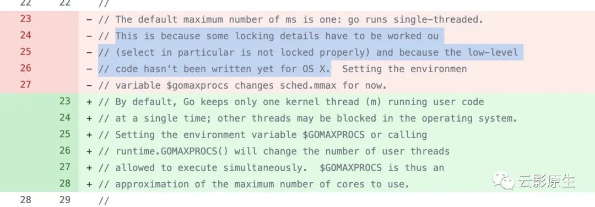

代码：

https://github.com/golang/go/blob/go1.0.1/src/pkg/runtime/proc.c


## Scalable Go Scheduler Design Doc 2012

关键词：Go1.1、重构了Go scheduler、引入P、引入steal working


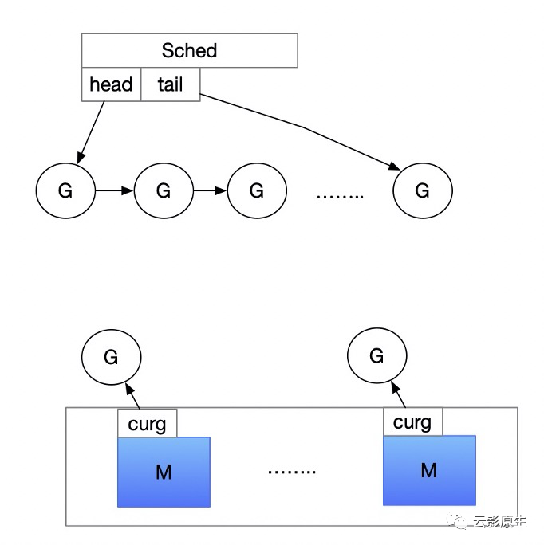

G-M模型的问题：

- 全局大锁 + 中心化状态：这个大锁保护goroutine相关的所有操作，比如创建、完成以及调度等
- 频繁的换入换出：goroutime频繁的换入换出会导致延时增加以及额外的开销
- 内存cache问题：当前内存cache和栈cache都是和所有的M相关的，应该让他们只与对应的M相关，并且进行syscall的M不需要内存cache。这带来过多的资源消耗。
-  系统线程频繁阻塞恢复：增加了许多开销

为什么要有P：

- 作用：P是Go代码执行Go代码所需的资源。
- 变化：一些全局上的对象放到了P上，一些放到M的变量也放到了P上
- 用法：当G要被执行的时候，必须获得P

spinning的两种状态：

- 1、P在寻找G
- 2、M在那空闲着，等着有P来捞它

Potential Further Improvements：

- 尝试后进先出，改善局部性 ---------- 最新版本（1.16）也没有这种尝试
- 直到G运行的时候才去分配栈空间     done
- 当唤醒被阻塞的G的时候，先去寻找上次运行的那个P   done
- 尽量让相同的P在相同的M上。   done
- 设置M的上限为k*GOMAXPROCS ---------- 最新版本（1.16）也没有这种尝试，设置了个1w的最大值

这个时候还是一个任务执行到死，但是寻找G的雏形已经建立起来并且延续至今：


1、 runqget：先从本地队列拿

2、 globrunqget：加锁从全局队列拿

3、 injectglist：从（non-blocking）netpoll中拿，然后将拿到的一个返回，剩下的加锁放到全局队列

4、 runqsteal：偷一半，返回最后一个，剩下的放到自己的本地队列

5、pidleput：把P放到空闲队列

6、 stopm： 将P和M解绑

具体的函数我整理为一张图：

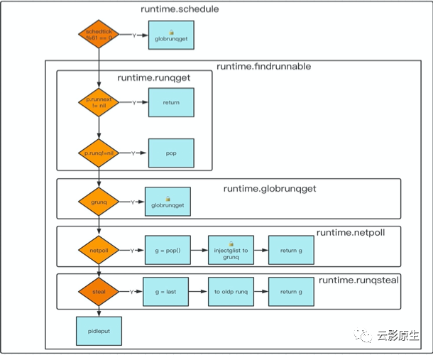

我们再分别看比较复杂的两个，从全局队列拿和steal working的阶段：

从全局队列拿：

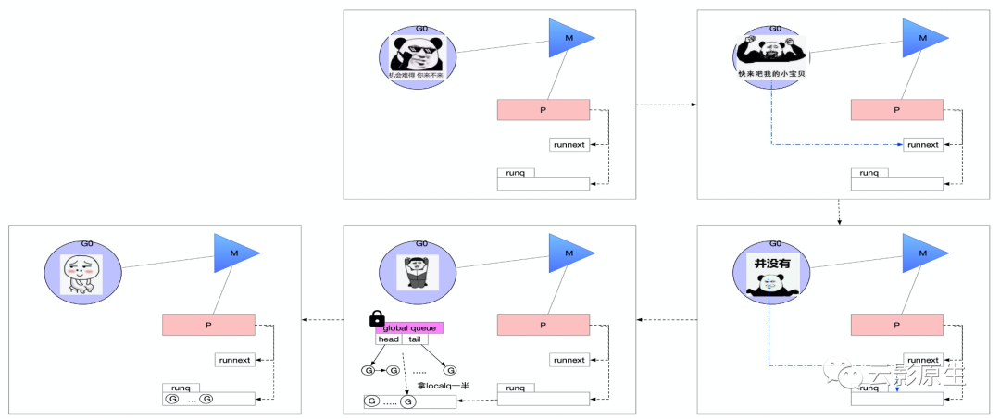

通过steal working从其他的P中拿：

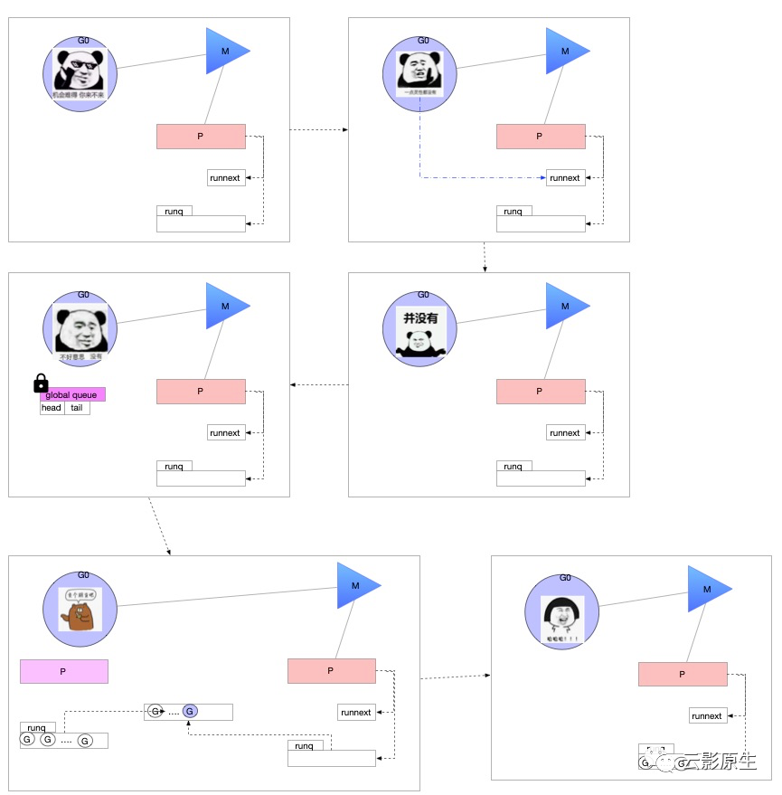

sysmon（每10ms检查一次是否需要抢占）：

- netpoll：每10ms从（non-blocking）netpoll中拿可运行的goroutine，插入到全局队列

- retake：从20us到10ms，每次sleep double的时间然后去抢占

- - handoffp：如果P的状态是Syscall：唤醒一个新的M执行这个P的认为，让那个M去执行syscall吧

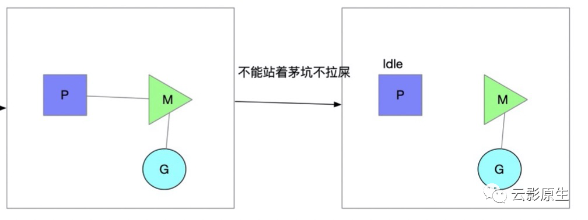

我们能够看出到目前为止，Go还是不具备抢占正在运行G的能力。

https://github.com/golang/go/blob/go1.1.2/src/pkg/runtime/proc.c

https://docs.google.com/document/d/1TTj4T2JO42uD5ID9e89oa0sLKhJYD0Y_kqxDv3I3XMw


## **Go Preemptive Scheduler Design Doc 2013**

关键词：Go1.2、基于协作的抢占式调度、


在这之前遇到的问题：

- 没有抢占，一个goroutine长时间不能切换到另一个
- 没有抢占，GC的STW可能需要很长时间，因为没人管他们


方案：

- 概述：每次函数调用都会都会检查栈，如果栈超了就调用runtime函数。
- 原理：sysmon检查对于goroutine超过Xms的P，把这个 g->stackguard 的设置为stackPreempt，下次分割栈检查的时候会调用morestack，其中有检查需不需要被抢占的逻辑
- 备注：在STW的时候会抢占所有的goroutine

优点：

- 无需额外管理
- 实现简单，无需信号

缺点：

- 增加了runtime的复杂度

不会发生抢占的点：

- 持有锁
- 正在运行g0
- 分配内存或者gc的任务
- 不是Grunning状态
- 没有P或者P不是Prunning状态

注⚠️：

- the preemption must be disabled when shared data structures (e.g. chans, hashmaps, scheduler, memory allocator, etc) are in inconsistent state, and that inconsistency can break either scheduler or GC.
- 通过debug.SetMaxThread设置M的数量

触发抢占的地方（将g.stackguard0 = stackPreempt）：

- sysmon如果发现一个G运行了超过了10ms就调用preemptone触发抢占
- 当GC的时候调用preemptall把所有的G都标记为抢占

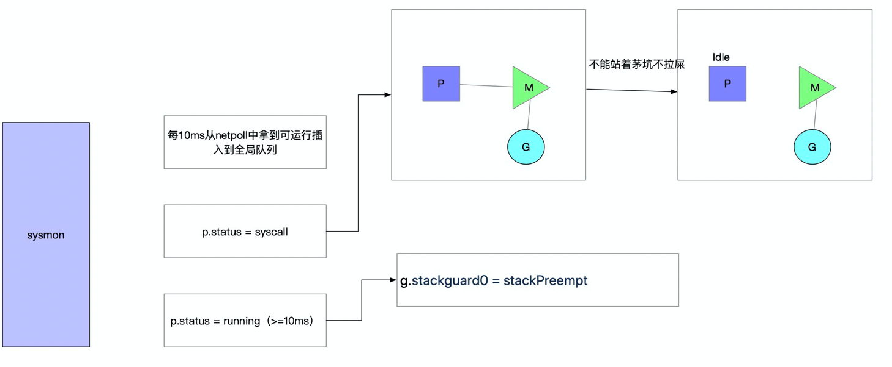


执行抢占流程：

- 编译器会在函数调用前插入morestack，
- morestack → newstack ：如果g.stackguard0等于stackPreempt走下面流程进行抢占
- gopreempt_m → goschedImpl : 将G放到全局队列上，再进入调度循环

```go
package main

import (
 "fmt"
)

//go:noinline
func b() {
 // TODO
}

//go:noinline
func a() {
 // some op
 b()
}

func main() {
 go func() {
  a()
 }()

 fmt.Println("ending...")
}
```

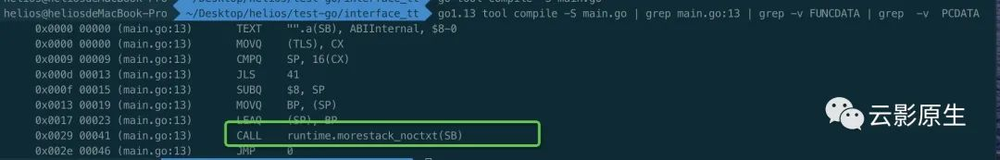

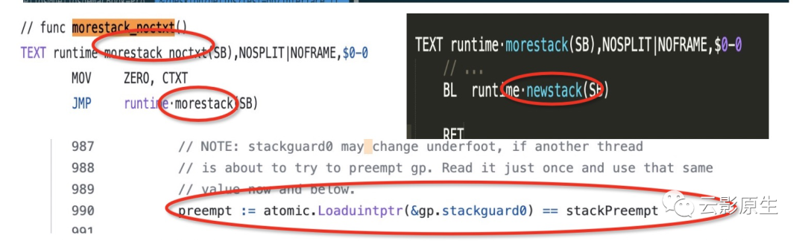

这个调度模子会陪着Go语言一直走到1.13版本，才切换为基于信号的抢占，至于遇到了什么问题，我们后面说。


https://golang.google.cn/doc/go1.2#preemption

https://github.com/golang/go/blob/go1.2/src/pkg/runtime/proc.c

https://docs.google.com/document/d/1ETuA2IOmnaQ4j81AtTGT40Y4_Jr6_IDASEKg0t0dBR8/edit#


## **Go 1.5 GOMAXPROCS Default  2015.05**

关键词：Go1.5、用Go重构C


GOMAXPROCS默认等于runtime.NumCPU。


以前虽然也是能并发但是不能做到并行，就和python的GIL一样。现在对单用户goroutine和多用户goroutine都有好处。因为go服务启动的时候还是会启动几个goroutine的。

以前觉得一个G在不同的M之间的切换的成本很高，后来机器的核心数量多了，加上调度的能力也上来的，再仅仅用一个核那就更不合适的，尤其是没有太多上下文切换的场景。

GOMAXPROCS这个设置的太大和太小都不行，太小就会导致频繁的上下文切换，太大就会导致CPU过高（[为什么Go服务容器化之后延迟变高](http://mp.weixin.qq.com/s?__biz=Mzg5MjYyNjUzOA==&mid=2247485445&idx=1&sn=b67ede492f149e90d543bd8ef46bcd37&chksm=c03a7b00f74df2166ea1f59c3428a7484d01cd2153399fd0e4554964e21fdd0b65207a7efd16#rd)）。

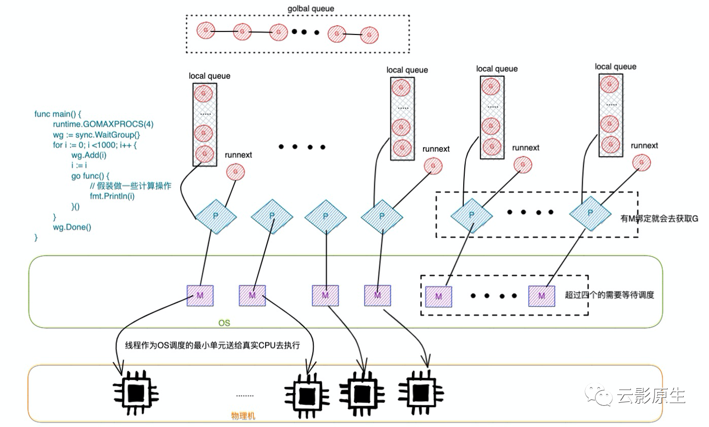


https://docs.google.com/document/d/1At2Ls5_fhJQ59kDK2DFVhFu3g5mATSXqqV5QrxinasI/edit


## **How does the golang scheduler work? 2016.07.16**

关键词：Go1.5、用Go重构C

G被阻塞的几个条件：

- 系统调用
- 进行channel操作
- Cgo
- 被抢占的时候
- 一些边缘的case

https://www.quora.com/How-does-the-golang-scheduler-work/answer/Ian-Lance-Taylor


## **Proposal: Non-cooperative goroutine preemption 2019.01**

关键词：Go1.14、基于信号的抢占式调度


基于主动让出的协作式调度的问题：

- 影响吞吐：STW的时间延迟变高（因为如果有密集计算的话，GC需要等着那个goroutine主动让出）
- 调度延迟：大多数线程堵在那（因为前面的goroutine没有让出），只在一个P上执行抢占时间肯定长
- This can delay stack scanning, which consumes CPU while the runtime waits for a preemption point and can ultimately delay GC termination, resulting in an effective STW where the system runs out of heap and no goroutines can allocate.


基于错误的循环抢占：

- （https://github.com/golang/go/issues/10958）这个issue的哥们说，咱在循环前再加一个指令吧，这个指令在X86和unix平台上没问题，连寄存器压力都没有
- 说是这么说，但是性能还是降低了7.8%，还有几个更明显的异常值（用的Go1.5）


基于错误的循环抢占的缺点：

- It can‘t target specific threads or goroutines, so it’s a poor match for stack scanning, ragged barriers, or regular scheduler preemption
- 不能释放一部分的锁：如果有的for负责lock住了要做一些事情，你把一个unlock的for打开了，那就尴尬了
- 在non-x86 and non-UNIX platforms需要更多的指令
- 认为坏的内存引用是一个好的程序停止点是影响调试器，并且在OSX系统上还有bug

基于信号抢占的难点也是核心要解决的问题：

- 问题：无论在哪个地方发生抢占，Go必须能够找到goroutine堆栈中的存活指针

- 提案：如果一个goroutine再一个GC原子性操作的点上被抢占，那么runtine可以恢复后面再重试

- 不安全包括：

- - unsafe.Pointer：使用unsafe.Pointer转的时候是不安全的（比如转换为uintptr），因为可能中间有不合法的变量
  - write barrier检查和direct write之间不能有安全点
  - 编译器生成的临时指针可能会超过能分配的长度，比如在for range

- 解决：

- - the compiler records stack and register maps for nearly every instruction
  - uses conservative GC techniques to find pointers in the inner-most stack frame of a preempted goroutine.


https://go.googlesource.com/proposal/+/master/design/24543-non-cooperative-preemption.md


