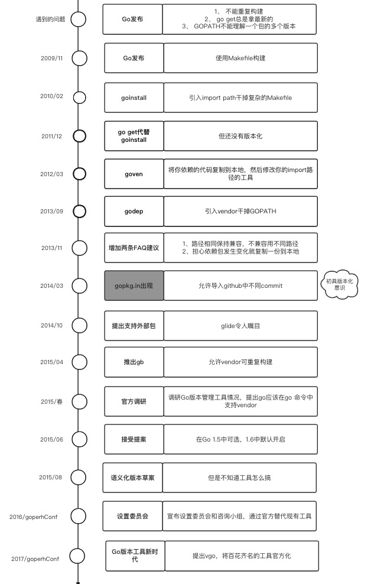

# [翻译] Go += Package Versioning

我们需要在Go中增加版本管理。

更确切的说，我们需要在Go 开发者和工具之间增加包版本的概念，以至于他们（开发者和工具）在相互沟通的时候能准确的知道构建、运行和分析哪个程序。`go`命令需要能准确的告诉开发者在某个特定的构建中使用了哪个版本的依赖包。

版本化将使我们进行可重复的构建，因此如果我告诉你使用我程序的最新版本，我知道你得到的信息中不仅仅是我代码的最新版本还包含了我代码依赖包的相同版本，这让你能构建和我完全等同的二进制。


版本化还可以让我们确保明天的构建方式和今天的构建方式完全相同。即使有新版本的依赖项，`go`命令在没有被要求升级之前不会升级。


虽然必须增加版本化，但不会去掉`go`命令中最好的部分：简单、快速、易理解。现在许多开发者并不注意版本化，工作依然正常。如果我们得到了正确的模型和默认值，我们能够以*开发者依然不关心版本化但更容易理解*的方式增加版本化。当前的工作流程应该尽可能少的改变。发布新版本应该很简单。总的来说，必须淡化版本管理，不需要时时刻刻关注。


简而言之，我们需要在不破坏`go get`原有功能的情况下增加包版本化。这篇文章勾勒出一个现在就能尝试的提案希望最终能成为`go`命令的基础。我希望将这篇文章作为讨论什么是有效的是什么是无效的开端。基于这个讨论，我将要调整提案和原型，然后我将要为Go 1.11 增加可选功能提交[官方go提案](https://golang.org/s/proposal)。


这个提案保持`go get`优秀的功能，增加可重复构建、消除vendoring、废弃GOPATH作为go项目的基础，以及提供从`dep`及其前辈平滑迁移的能力。也就是说这个提案仍然属于早期阶段。如果在细节上有问题，我们会在它成为Go发行版之前修复它。


## 背景

在我们看提案之前，让我们看看如何走到今天。这可能有点长，但是历史对于现在有重要的教训，能够帮助我们理解提案发生了什么变化。如果你看的不耐烦，随意调到下面的提案或者读[本文相关的例子](https://research.swtch.com/vgo-tour)。


### Makefile，goinstall和go get

在2009年11月份，Go的最初发布版本包含编译器、链接器和一些二进制。你必须运行`6g`和`61`编译和链接你的程序（我们提供了示例的makefile）。在大多数情况下，这是能够构建单一软件包和写一些特定的makefile的最小包装的gobuild。<del>没有和其他人共享代码好的方式。</del>我们知道还需要很多，我们发布了我们能够做什么，剩下的和社区一起做。


在2010年的2月份，我们[提案了goinstall](https://groups.google.com/d/msg/golang-nuts/8JFwR3ESjjI/cy7qZzN7Lw4J)，这是一个新的、零配置的从远程仓库（Bitbucket或Github）下载包的命令。`goinstall`引入了import 路径规则（现在的Go开发者已经认为这是理所当然的）。因为当时没有代码遵循这个约定，`goinstall`只对除了标准库没有引入其他包的项目有效。开发者很快从自己不同的命名方案迁移到今天熟知的统一方案，而已经发布的软件包也逐渐形成统一的生态。


`go install`还消除了makefile以及它带来的用户自定义构建变量的复杂性。在每次编译时候不能生成代码对于一些包作者是不方便的，但这种简化对包使用者化是非常重要的：用户在构建包之前不用担心和作者不是一个工具集。这个简化对工具的使用也是很重要的。对于包makefile是强制的、按部就班的；逆向工程如何将不同的工具（比如`go vet`或代码补全）应用于同一个软件包是相当困难的。即使得到正确的依赖关系，让包只在有必要的时候重建，这对于makefile也是困难的。尽管一些人持反对态度因为灵活性被剥夺了，显然好处超过了不便之处。


在2011年12月，作为Go 1的准备工作之一，我们[引入go命令](https://groups.google.com/g/golang-dev/c/8DNjlySemwI/m/-1CDvVX6QVcJ)，通过`go get`代替`goinstall`。


总的来说`go get`是具有变革性的，它使Go开发者能够分享源代码并且在彼此工作的基础上构建。并将构建细节隔离在go命令的内部实现工具化。但是`go get`缺少版本化的概念。在[goinstall的第一次讨论中](https://groups.google.com/g/golang-nuts/c/8JFwR3ESjjI/m/cy7qZzN7Lw4J)我们很清楚的知道需要在版本化方面做一些事情。不幸的是，至少对于我们Go团队来说，这不是很清晰。当`go get`需要一个包，它总是获取最新的一个，将下载或更新操作委托给像Git/Mercurial这样的版本管理工具。包版本化的却是至少导致两个明显缺点。


### 版本化和API的稳定性

第一个缺点是不能向用户表达**在本次更新中**？？？？？？

在2013年11月，Go 1.2在FAQ中增加了一项关于包版本化的基本建议（从Go 1.10开始没有变化）：

> 如果包想要公开被使用那么要保持向后兼容。在[Go 1的兼容性准则](https://golang.org/doc/go1compat)中有很好的引用: 不要删除导出的变量和函数、鼓励标记复合字面量等。如果需要不同的功能，新增代替修改。如果有不兼容，使用新包和新路径。

在2014年3月，Gustavo Niemeyer创建了 [*gopkg.in*](https://gopkg.in/),宣传“Go语言稳定的API”。这个域名是一个具有版本意识的github重定向器。允许导入一个Git仓库中不同的commit/branch（像`gopkg.in/yaml.v1`和`gopkg.in/yaml.v2`）。根据语义化版本的划分，包作者有break change的时候应该引入一个新的大版本，所以v1版本的早期和晚期能相互替换，而v2导入路径是一个完全不同的API。


在2015年8月，Dave Cheney提交了一份关于[语义化版本的草案](https://golang.org/issue/12302)。这引发了接下来几个月的有趣讨论，每个人好像都同意给代码用语义化版本给代码打标签，但是没人下一步应该做什么，即工具用这些版本做什么？


任何语义化版本都不可避免的引用[Hyrum's law](http://www.hyrumslaw.com/)来反驳：

> 伴随着API使用的用户增加，你承诺了什么并不重要。你系统中所有可以被观测到的行为都会被人依赖。

虽然从经验上讲Hyrum's law是对的，但是语义化版本仍然在构建发布版本之间的关系预期是有用的。从1.2.3升级到1.2.4不会影响你的代码，但是从1.2.3 升级到2.0.0是可能会的。如果你的代码在更新到1.24出现了问题，那么作者很欢迎你报告错误，并且在1.2.5修复。如果你的代码在更新到2.0.0之后出现了问题（甚至可能是编译失败），这种情况很有可能是作者故意为之，在2.0.1修复的概率也很小。


Hyrum's law并没有说语义化版本是不好的，我得出的结论是**构建时应该注意依赖和作者相同的版本**除非强制不这样做。也就是说，默认是可重复构建的。


### vendoring和重复构建

第二个缺点是他不能确保甚至不能表达可重复构建的想法。没有办法保证你代码用户使用的依赖和你的依赖是相同的。在2013年11月，Go 1.2 在FAQ中也增加了一个基础的建议：

> 如果你使用第三方包，并且担心它出现不受控制的改变，那么最好的办法是复制一份到本地（Google内部就是这么做的）。导入路径为本地副本路径。例如，你可能将“original.com/pkg”放到“you.com/external/original.com/pkg”。Keith Rarick's  的`goven`专门做这个事情。

在2012年3月，Keith Rarick 开发了`goven`这个项目，它能把依赖复制到本地，并且更新你的导入路径。为了成功构建修改源代码的依赖关系是必要的，但这样也是令人遗憾的。这些修改使它很难与较新的副本比较和合并，并且需要对使用该依赖的其他代码进行更新。


在2013年9月，[Keith宣布了godep](https://groups.google.com/g/golang-nuts/c/8NJq6jTIpas/m/Vpf-KZtVu9MJ),"锁定包依赖的新工具"。`godep`先进的地方增加了我们现在理解的Go vendor，即在不修改源文件的情况将依赖复制到项目中--不需要直接工具链的支持，通过某种方式设置GOPTH即可。


在2014年10月，Keith为了让符合规定的工具更好的理解项目，提出要在工具链中[支持“外部包”的概念](https://groups.google.com/forum/#!msg/golang-dev/74zjMON9glU/dGhnoi2IMzsJ)。到那时，有多种与`godep`类似着力点。Matt Farina在一篇名叫“Glide在Go版本管理的海洋”中比较了Godep与较新的工具进行对比，其中glide最令人瞩目。


在2015年4月， Dave Cheney[推出了gb](https://dave.cheney.net/2015/05/12/introducing-gb)号称“允许通过vendor可重复构建的工具”，再也不用重写import路径。(gb的另一个动机是让代码不用必须放在GOPTH中，尽管这对一些开发者并不很合适)。


2015年春天， Jason Buberel调研了Go版本管理工具情况，为了避免重复看看能为统一做些什么事情。这次调研让Go团队清楚的认识，`go`命令应该直接支持vendor并且不需要重写import路径。与此同时，Daniel Theophanes开始起草vendor中目录中代码来源和版本的格式。在2015年6月，我们接受了Keith的[作为 Go1.5vendor实验](https://golang.org/s/go15vendor)的提议，在Go 1.5中作为可选项，在1.6中默认开启。我们鼓励所有的vendor作者和Daniel合作去采用同一种metadata文件格式。


将vendor的概念纳入go的工具链能够允许像`go vet`这样的分析工具更好的理解项目，今天有十几个包管理工具或者vendor工具能够管理vendor目录。另一方面，因为所有的工具使用不同的metadata文件格式，它们不能互相交流并且不能共享关于依赖的信息。


vendor并不是包管理的完整解决方案，它仅仅是提供可重复构建。它对理解包的版本和决定选择使用哪个包来讲没有什么用处。像`glide`和`dep`这样的版本管理工具通过某种方式设置vendor目录，隐含的将版本化的概念添加到Go的构建中，但是没有直接的工具链支持，这让Go生态中的很多工具无法意识到版本。很明显，Go需要直接的工具链支持包的版本。


### 一个官方的包管理实验

在2016年的GopherCon上，gopher的兴趣组在Hack Day (现在叫 Community Day) 对[go版本管理进行了广泛的讨论](https://docs.google.com/document/d/1xMJ0c-YxvcgNglzjbALzncs5_Acr0MST29oMf9TkgQI/edit)。一项成果是[在包管理工作上设置委员会和咨询小组](https://groups.google.com/g/go-package-management/c/P8TehVoFLjg/m/Ni6VRyOjEAAJ)，以及为Go包管理工具创建一个新的工具。我们设想这个工具同意和替代现有工具，但他仍在使用vendor在官方工具链之外实现。在Peter Bourgon的组织下[起草了提案](https://docs.google.com/document/d/1qnmjwfMmvSCDaY4jxPmLAccaaUI5FfySNE90gB0pTKQ/edit)，在Sam的领导下[以dep的方式实现](https://github.com/golang/dep)，委员会成员有Andrew Gerrand、Ed Muller、Jessie Frazelle和Sam Boyer，在Peter Bourgo。关于相关背景，可以查看Sam写的文章：

- 2016年2月 [你想写一个版本管理工具](https://medium.com/@sdboyer/so-you-want-to-write-a-package-manager-4ae9c17d9527)
- 2016年12月 [Go版本管理工具的故事](https://blog.gopheracademy.com/advent-2016/saga-go-dependency-management/)
- 2017年7月在gopherconf的讨论 [Go版本管理工具的新时代](https://www.youtube.com/watch?v=5LtMb090AZI)


`Dep`有很多用途：这对目前可用的做法是个重要的改进，这是迈向解决方案重要的一步也是试验性的一步，我们叫它“官方实验”--能帮助我们了解什么对Go开发者有效什么对Go开发者无效。但是`dep`并不是go命令整合包管理的最终原型。这是一种强大的、几乎能以任意灵活的方式去探索设计空间，就像我们解决如何构建Go程序时makefile扮演的角色一样。一旦我们更好的理解设计空间并将其缩小到几个必须支持的特性，这将有助于Go生态去除其他特性、减少表达、采用强制的规范能让Go代码更加统一和容易理解、使工具更容易构建。


这片文章时`dep`之后的下一步：集成到go命令的初稿相当于`goinstall`的包管理。原型是一个叫`vgo`的独立命令。vgo是go命令的替代品但它增加了对包版本化的支持。这是一个新实验，我们将看看能从中学到什么。就像我们引入`goinstall`一样，今天已经有些代码和项目已经能和vgo兼容了，而其他项目要做出一些改变使其兼容。我们要为了简化系统和用户的复杂性取消一些控制和表现力，就像取消makefile一样。我们正在寻找早起的采纳者帮我们实验vgo，这样我们就能尽可能的从用户那里学习。


vgo实验的开始并不意味着我们不再支持dep，在go命令普及之前我们还会支持dep。我们还将致力于将dep平滑迁移到go命令。尚未转换为dep的项目仍然能获得好处（注意[`godep`](https://github.com/tools/godep) 和 [`glide`](https://github.com/Masterminds/glide) 已经结束了活跃的开发，鼓励迁移到dep）。如果vgo满足需求，新项目最好直接使用vgo。


## 提案

在go命令中增加版本化的提案有四个步骤。

1、 采用Go FAQ和gopkg.in指导的import兼容原则；也就是说建立一种契约，对于给定的导入路径新版本应该向后兼容
2、 使用一种称为最小版本选择的简单新算法，在一次构建中选择使用包的版本
3、 引入Go module的概念，即一组版本化的包作为一个单元比生命依赖必须满足的最低要求
4、 确定如何将这一切改造为现有的go命令，使基本的工作流程和现在没有太大区别

剩下的章节要介绍每个步骤，另一篇文章将要介绍细节。

### 导入兼容性规则

**包管理系统中几乎所有的痛苦都来自于磨平不兼容**。例如，大多数系统允许B 依赖 D 6或者更新版本，然后允许C依赖D的2、3、4版本不能是5或者更新版本。如果你想写个包A同时依赖B和C，不幸的问题出现了：没有合适D的版本依赖（因为B和C依赖的D的版本不兼容）。你对此是无能为力，单纯的从B的角度和C的角度看并没有错。


与其设计一个避免无法构建的系统，这个提案要求包作者遵循导入兼容性规则：

> 如果旧包和新包有相同的导入地址，
>
> 那么新包必须向后兼容旧包

这个规则是Go FAQ中建议的重述。引用的FAQ的最后说“如果你有破坏性升级，那么你需要创建一个新路径”。今天，很多开发者想用语义化版本区表达破坏性升级，所以我们将语义化版本植入到我们的提案中。具体来说，主要版本2及其之后可以通过路径来包含版本：

```go
import "github.com/go-yaml/yaml/v2"
```

创建v2.0.0，在语义化版本上意味着会有不兼容，因此，根据导入兼容性的要求，创建一个新导入路径的新包。因为大版本有不同的导入路径，一个给定的Go可执行文件可能包含每个大版本中的一个。这是复合预期的。这允许大程序的一部分独立的从v1升级到v2。

包作者遵循导入兼容原则，可以避免我们面对兼容性难题，使这个系统成倍的简单以及包系统不那么零散。当然，在实践中，尽管做了做了最大的努力，同一个大版本的更新偶尔也会造成不兼容。因此一个不升级太快的机制很重要。这就把我们带到了下一步。


### 最小版本选择

包含cargo和dep在内的所有包管理工具，在构建的过程中都是[使用最新的允许版本](https://research.swtch.com/cargo-newest.html)。我认识这是一个错误的默认值，有两个原因：
1、 “最新允许版本”可能由于外部事件导致改变，比如版本升级。相同构建命令今天和明天构建出来有区别
2、 为了覆盖默认值，开发者需要花时间去告诉包管理工具“不，不要使用X”，然后包管理工具需要花时间[去找到不使用X的方式](https://research.swtch.com/version-sat)


这个提案采取了一种不同的方法，我称之为最小版本选择。在一次构建中，它默认使用每个依赖包的最老版本。这样明天构建出来的不会和今天不一样，因为不会有更旧的版本发布。如果想覆盖默认值，开发者需要花费时间告诉包管理工具“不，要使用Y”，然后包管理工具能很容易去判断使用哪个。我把它称之为最小版本选择因为选择的版本是最小的并且也是整个系统中最小的，几乎避免了现有系统的所有复杂性。


最小版本选择允许模块去执行依赖的最小版本。它对升级和降级都给出了很好的答案并且这些操作实施起来很有效率。这允许正在构建整个项目的作者指定排除那么个版本、指定哪个特定的依赖版本被fork的副本替代，无论是在本地还是作为自己的模块发布。这些排除和替换规则并不适用于作为其他模块的依赖，这让用户全面的控制自己程序的构建，但是不会控制其他程序的构建。

最小版本选择不用lock文件默认提供可重复构建。


导入兼容性是最小版本选择简单的关键。用户不能说“不，那太新了”而是说“不，那太旧了”。这种情况下，解决方案很清楚：使用一个最低限度最新的版本。而较新版本是可以用老版本替换的。


### 定义Go module

Go 模块是一组共享路径导入前缀的包集合，称之为模块路径。模块是版本化的单位，模块版本被写成语义化版本字符串。当开发者使用Git开发时，开发者通过给模块的Git仓库增加tag来定义一个新的语义化版本。虽然推荐语义化版本，但是也是支持具体commit的。


一个模块在名叫`go.mod`的文件中声明它依赖其他模块的最低版本要求。例如下面的例子：

```go
// My hello, world.

module "rsc.io/hello"

require (
	"golang.org/x/text" v0.0.0-20180208041248-4e4a3210bb54
	"rsc.io/quote" v1.5.2
)
```

该文件定义了一个由路径`rsc.io/hello`标识的模块，它依赖`golang.org/x/text` 和`rsc.io/quote` 这两个模块。一个模块本身的构建始终使用go.mod文件中所列出依赖的制定版本。As part of a larger build, it will only use a newer version if something else in the build requires it.


包作者想通过语义化版本发布包时，推荐使用tag而不是具体的commit。rsc.io/quote模块由github.com/rsc/quote提供，有标记的版本，比如v1.5.2。然而`golang.org/x/text`没有提供版本。对于命名不使用tag的commit，` v0.0.0-*yyyymmddhhmmss*-*commit*`这样的伪版本能制定某一个天的某个commit。在语义化版本中，` v0.0.0-yyyymmddhhmmss-commit`这个中的v0.0.0代表预发布版本，`*yyyymmddhhmmss*-*commit*`代表预发布标示。语义化版本将预发布的优先级排在v0.0.0或之后版本的前面，通过字符串比较来排列预发布的优先级。在伪版本中将日期放在前面，可以确保字符串比较和日期比较是一致的。


`go.mod`能实现在上一节提到的排除或者替换一个模块，但这只适用于直接构建，并不适用于作为程序的子模块。这是一个包含所有提到功能的[例子](https://research.swtch.com/vgo-tour)。


`Goinstall`和老版本的`go get`直接使用git/hg这类的版本控制工具去下载代码，这导致了很多碎片化的问题，比如没有`bzr`的开发者不能下载存储在Bazaar中的代码。相比之下，模块总是通过HTTP提供压缩包。go get在之前需要为流行的代码托管网站提供版本管理工具。现在`vgo`可以通过代码托管平台提供的API获取压缩文件。


模块统一表示为zip文件让模块下载代理的协议和实现变得简单。企业和个人处于一些原因要自己搭建proxy，可能是因为安全或者当源文件被删除的时候能被proxy缓存住。proxy保证代码能够获得、go.mod确定使用哪些包这样就不在需要vendor目录了。


### go 命令

为了和module一起使用必须更新go命令。一个显著的改变是像`go build`、`go install`、`go run`、`go test`这样的普通命令将根须需要解决依赖关系，当你要在全新模块中使用`golang.org/x/text`的时候只需要在代码中增加相关的import然后引用即可。


最重要的改变是，GOPATH不再是编写Go代码的必须场所。因为`go.mod`包含依赖模块的完整路径也定义了每个依赖的版本，包含`go.mod`文件的目录作为独立的工作空间标志着一个目录树的根，与其他目录分开。现在你仅仅需要使用`git clone`、`cd`就能在任何地方写代码，完全不用GOPATH。


## 译者总结

我用一张图总结Go版本化的历程。





