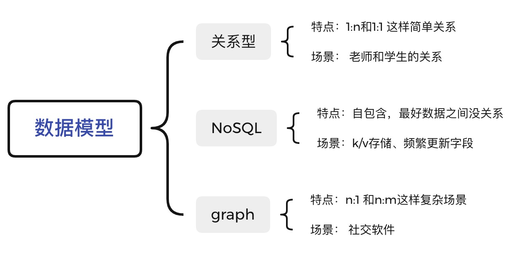

# DDIA读书笔记（一）: 评价服务和数据模型

我最近组织了一个读《Designing Data-Intensive Applications》这本书的读书会，这本书的中文名叫《数据密集型应用系统设计》，但是据说中文版翻译的不好，所以看的英文版。准备在45天读完（不是读懂）这本书。基本是两周一个大模块，一周两个小章节的进度，所以在接下来的六周我会每周发至少一篇这本书的读书笔记。

注⚠️

数据密集型就是我们常说的CPU密集型任务。

## 为什么要读这本书

### 1、 推荐的人多

我在寻找今年下半年读啥书的时候，发现好多人都推荐《Designing Data-Intensive Applications》，当然也伴随着说翻译的不咋样的言论，我就随大流的读了英文版。

### 2、 学习英语

一直看英文的文献没啥问题，也读过《concurrency in go》这种有代码看文字不成问题的书，这次挑战一下，没有多少代码的英文书籍。

## 评价一个服务

下图是作者总结一个服务需要面对的问题：

### **可靠性**

设计服务必须要面对失败设计，即**万物皆会挂，**所以理想情况就是能处理所有突发情况，但是这是不现实的，需要尽可能的设计错误case，比如：

- 突然杀死服务
- 经常演练
- 错误复盘

常见的故障有：

- 硬件故障：磁盘、CPU都是有MTTF的，不能认为硬件一定是好的；

- 软件故障：操作系统bug、同一个机器的其他进程占满资源、我同事还说过一个遇到的问题，程序通过get_host获得机器ip然后做了一些操作，迁移机房的时候出现了bug

- 人为故障：导致软件的大多数问题都是配置问题，这一方面我们我们能做的事情比较多：

- - 监控报警
  - 快速回滚恢复机制
  - 增加修改校验，尤其是出错率高的地方

我还要多说一句Googl的做法：通过软件的做法容忍硬件的故障，我以前就看过Google用一坨老旧磁盘代替新磁盘并且效果不错，在[观小盖对话左耳朵耗子有感](http://mp.weixin.qq.com/s?__biz=Mzg5MjYyNjUzOA==&mid=2247485490&idx=1&sn=894a2ec8dbeabe9df298f529c4157f28&chksm=c03a7b37f74df221c9ecdb039929a5a108b70dba8359063862ff67a7031405d735500ab5e45a&scene=21#wechat_redirect)中耗子叔也说过Google的用软件架构容忍基础服务故障。

### 扩展性

扩展性出现问题大多都是架构出了问题，比如：

1. 用户量double了，如果资源不变服务会怎么样
2. 用户量double了需要增加多少资源才能保持稳定

那么如何评价呢，是通过吞吐还是响应时间，吞吐一般是数据处理采用的，我们这里只说常用的在线服务，即通过**响应时间**评价。

如上图，我们通过平均响应时间去评价好像不靠谱，所以就需要看top99，top95这类的数据，top99的意思就是99%的数据在Xms内返回。我们对调用方签订的SLA一般也是指的topxx。但是我们一般不会要求的太高，比如要求top99.99，对于有GC的语言，可能GC一下就没了、操作系统调用也需要时间，像Go这样自己实现调度的还要考虑runtime的耗时（对Go的调度感兴趣可以看[[含视频\]从一个问题看go scheduler执行流程](http://mp.weixin.qq.com/s?__biz=Mzg5MjYyNjUzOA==&mid=2247485542&idx=1&sn=1f33260ac5f26e06fe27e2d4739f0b43&chksm=c03a7b63f74df275cfa4a83bb3ffb2856d99b1c08a00fc88b44ed81c0e4b66ccc0c1de4284bb&scene=21#wechat_redirect)、[Go scheduler十年的变迁](http://mp.weixin.qq.com/s?__biz=Mzg5MjYyNjUzOA==&mid=2247485722&idx=1&sn=e988b6825b1a2ac303c46888ea823cc6&chksm=c03a7a1ff74df309eeda6b930d63091bc8c790bd8a3f8c6f893350cc7c1d0f781b2269723da7&scene=21#wechat_redirect)）。

扩展一般分为两种：垂直扩展和水平扩展，前者就相当于增加机器规格，后者就相当于增加机器数量。一般的发展顺序是先垂直扩展，后来发现太贵就水平扩展，如果是有状态服务就引出了分布式。

### 维护性

先看个我做的标注：

看着比较熟悉吧，这就是传说中的祖传代码。

避免祖传代码也有三个指导原则：

1、 可运维：把控生命周期

> “good operations can often work around the limitations of bad (or incomplete) software, but good software cannot run reliably with bad operations”

可视化监控、了解关联服务的状况、操作可预测（如果操作了X那么Y会发生）、好的默认值（比较难）。

2、 简单：功能不变的情况下保持简单

让代码变得复杂的方式：

- 定义过多的状态，自己看起来都眼花缭乱
- 模块之间的耦合
- 错综复杂的依赖
- 命名让人困惑
- 为了性能作出的hack
- 针对一些问题特殊的case

这些问题对一个开发者除了倒数第二个可能大多数人都遇到过。减少复杂度的方法就是尽可能的抽象，即不要依赖实现，要依赖抽象，想具体了解的朋友可以看[再谈ISP: 如何让代码解耦](http://mp.weixin.qq.com/s?__biz=Mzg5MjYyNjUzOA==&mid=2247484115&idx=1&sn=0c6bfd0efc6d94f391272024b0adae3e&chksm=c03a71d6f74df8c04c82fa54b48d737d22cceb3fa276dd33eaa3f985966da222de23952926f5&scene=21#wechat_redirect)、[构建组件有哪些设计原则](http://mp.weixin.qq.com/s?__biz=Mzg5MjYyNjUzOA==&mid=2247484116&idx=1&sn=d3b94dee16ba8438db475c163138a408&chksm=c03a71d1f74df8c75b6e6c52307586478a2cb0417de5852dc9285c80b840183c716101b6cd83&scene=21#wechat_redirect)、[如何做到面向对象](http://mp.weixin.qq.com/s?__biz=Mzg5MjYyNjUzOA==&mid=2247484117&idx=1&sn=05f74ad34261595d8dd61168399c01c3&chksm=c03a71d0f74df8c6a28626fb30964166689971ecf0c12dbc7740393876a995b25eb6b7d4ca17&scene=21#wechat_redirect)、[再谈DIP: 如何编写可测试的业务代码](http://mp.weixin.qq.com/s?__biz=Mzg5MjYyNjUzOA==&mid=2247484113&idx=1&sn=75b4b0780597b2e64b5ba5d988749e16&chksm=c03a71d4f74df8c2c3f87ea595dae451b3832a28b53c23dfb9bb0d20789bf05411fd4952de2e&scene=21#wechat_redirect)、[什么是SOLID设计原则](http://mp.weixin.qq.com/s?__biz=Mzg5MjYyNjUzOA==&mid=2247484112&idx=1&sn=168070271839c1b71a86b27dee21859c&chksm=c03a71d5f74df8c3c1ae7f1574dbcc6f73adc1968f8f8a9bc0c770c94959b2fc4df5a5381ce2&scene=21#wechat_redirect)。

2、 发展：让改变更加容易

> simple and easy tounderstand systems are usually easier to modify than complex ones.

## 数据模型

这一章节虽然作者用了比较多的篇幅讲，但是大部分内容都是日常开发用过的，比如json、xml这些数据表示、三类数据库的查询方式。还介绍了NoSQL和SQL经常吵架，NoSQL（比如文档数据库）经常想和SQL抢地盘，主打是**可扩展（相对SQL）**、**性能好(\**相对SQL\**)且开源**、**支持SQL不支持的查询**、**放弃SQL校验scheme的功能**。

我们把最后一点**放弃SQL校验scheme的功能**展开讲讲：因为这个功能，在写入的时候就会判断数据是否合法，但是像NoSQL和graph model他们就是不管三七二十一写就完了，但是需要在从数据库拿出来的时候程序校验。如果类比我们的程序，SQL就相当于编译时检查，其他的就像在运行时候检查，是优点还是缺点全靠人说。

虽然SQL和NoSQL经常吵架，但是遇到n:1和n:m这样场景的时候却站在了同一阵营，即：**不是强项**。

这个时候graph model就出马了，但是它是在这个领域是专家，到了其他领域也是捉襟见拙。到现在这三类数据库分别发展出了自己优势，吵架也自然消失了。

其实作者还讲了分层，如果需要的可以看：[三层架构和MVC的区别是什么](http://mp.weixin.qq.com/s?__biz=Mzg5MjYyNjUzOA==&mid=2247484114&idx=1&sn=d722b5a65cf6d0a2d74fad94b57b2135&chksm=c03a71d7f74df8c19cc68c98538ba07ceb324e332b9257f90858f369b550502f94ac0dab48fa&scene=21#wechat_redirect)、[再谈ISP: 如何让代码解耦](http://mp.weixin.qq.com/s?__biz=Mzg5MjYyNjUzOA==&mid=2247484115&idx=1&sn=0c6bfd0efc6d94f391272024b0adae3e&chksm=c03a71d6f74df8c04c82fa54b48d737d22cceb3fa276dd33eaa3f985966da222de23952926f5&scene=21#wechat_redirect)。

## 总结

本周令我收获最大的还是知道graph model解决n:1和n:m模型，我以前从来没有思考过这个问题，也没有具体的场景，如果让我设计一个n:1的业务场景，在没看这本书之前，我可能还会用关系模型，然后进行复杂的操作。

任何脱离业务场景的讨论都是耍流氓。