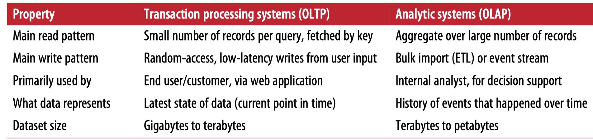
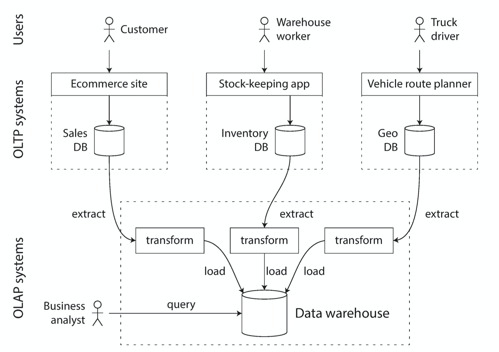
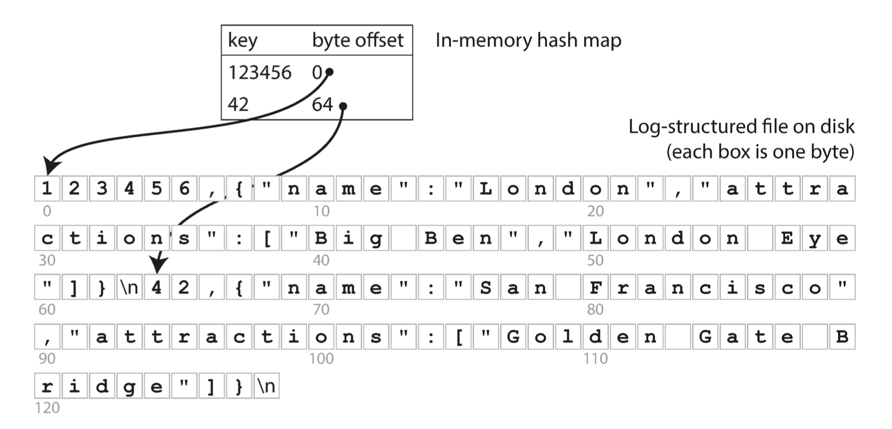
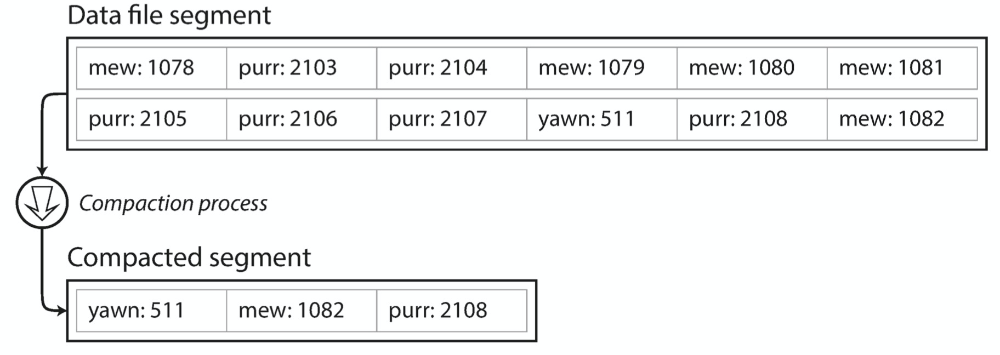
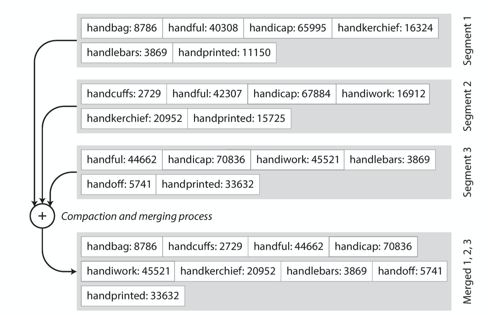
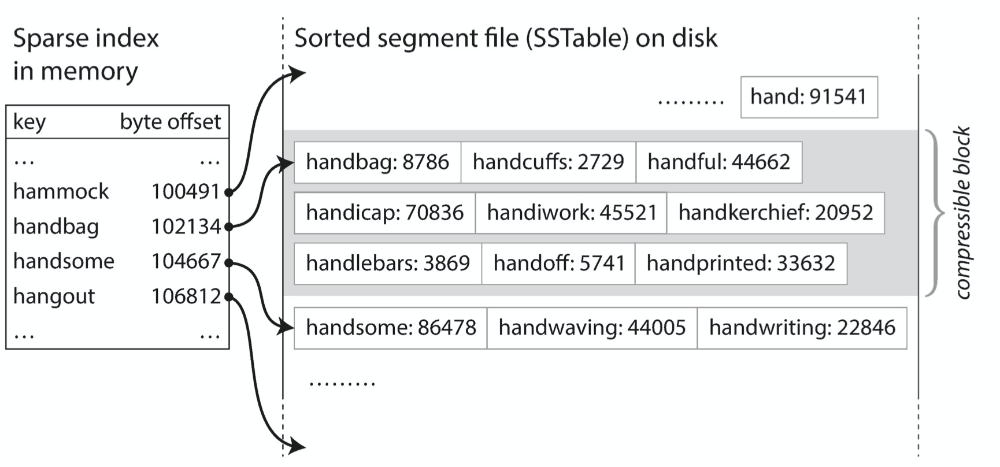
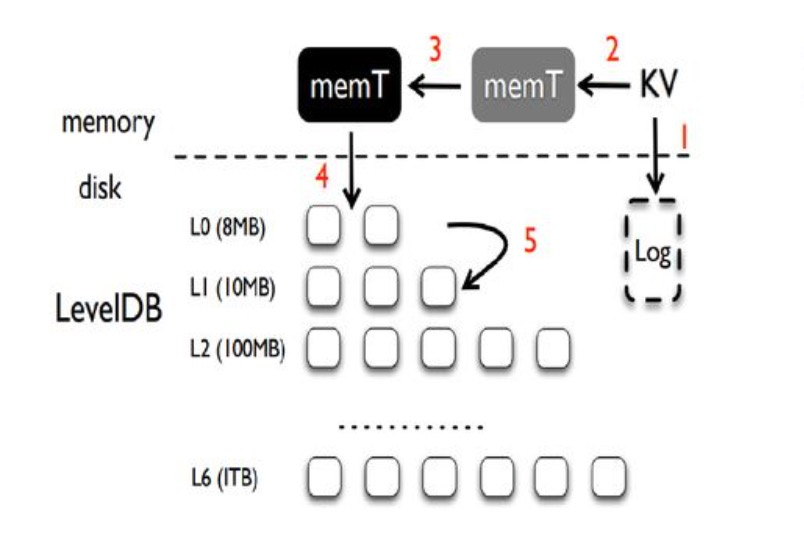
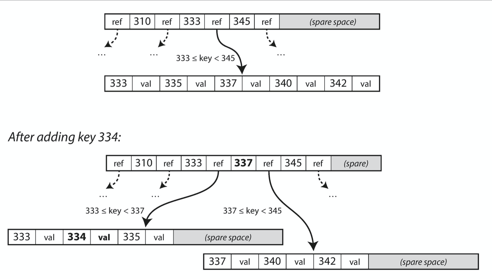
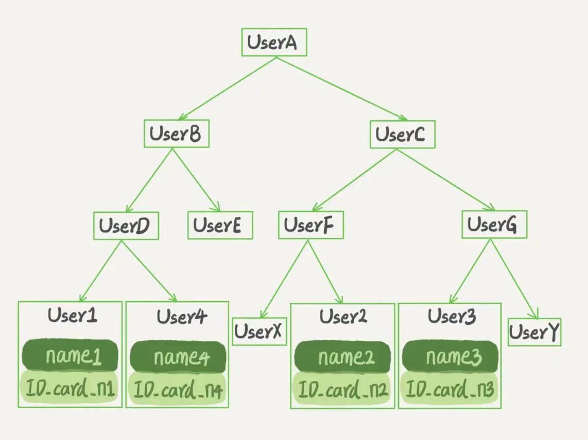
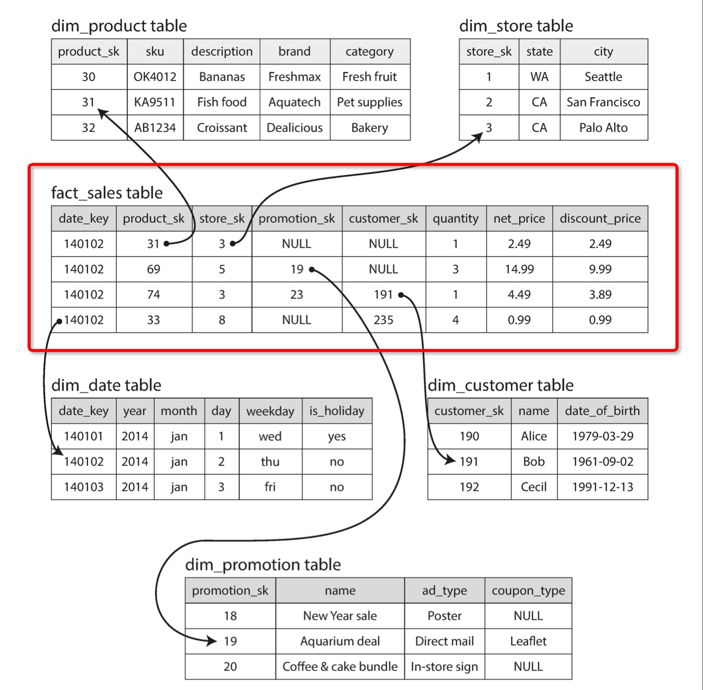

# DDIA读书笔记（二）: 高效的数据存取和传输


第三章和第四章是以存储和核心，没有讲各种存储的实现，是high level的角度去分析什么样的业务场景应该使用什么样的技术。还是那句话**任何技术都不是银弹**，都是有适用场景的，连nginx也不会例外（本文也不会说nginx相关，只是举个例子，前天和大佬聊天聊到envoy为什么在某些地方能代替nginx，其中一方面是开源版本的nginx不支持动态加载配置，必须reload😂）。


## 名词扫盲

### 事务（transaction)

这是个比较令人迷惑的单词，理解为数据库中的事务（多次操作要么都成功要么都失败）并没有错但是片面了。


这里还是要说下历史，早期的数据库专门用户订单交易，和钱打交道肯定要保证操作的一致性，所以一次操作就叫做事务。但是数据库发展了并不局限于金钱交易，事务这个单词还是保留下来了，并不要求ACID了，描述为一次读写操作（可以是一个请求也可以是一次批处理操作）。这样以后你看到transaction或者翻译不咋好的中文，就能够更拓展的去看了。


### OLTP（online transaction processing）

侧重处理，一般称为在线服务，要求的是更低的响应时间

### OLAP（online analytic processing）

侧重分析，一般称为是离线服务，要求的是吞吐。


### OLTP和OLAP的区别

其实有时候并没有很明显的区别，比如你只有几千万的行，处理和分析都用一个库性能也不会太差。下面是两者的侧重点：




### ETL(Extract–Transform–Load)

OLAP系统一般不能直接用OLTP的库，一是会线上服务，二是OLTP的数据存储场景也不适合OLAP做分析，所以需要将OLTP的格式转换为OLAP擅长的领域，这就是ETL的作用，如下图：



### 其他

聚簇索引

第二索引

磁盘的顺序写和内存差不多


## 高效的数据查询


### 索引出场


趣事一坨（不看也行）：

初学者：对于一条SQL对于某个字段查询慢了

老油条：去找DBA加索引

初学者：加索引就行了，为啥快

老油条：balabala一大堆

初学者：为啥叫索引呢，感觉很不好理解

老油条：？？？


这就好像前几天同事给我解释东西说“因为用了反射所以慢”，我下意识的感觉这个因果关系不合理，就问了一句**为什么反射慢**。。。

------

话说回来，现在理解了索引（index）就是一种抽象，上面的那种问法明显是问的是具体（初学者本质上问为什么不直接叫B+ tree而是叫索引），索引是优化查询（降低查询复杂度）的数据结构，在mysql中是B+ tree、在levelDB中是LSM-tree + SSTable、甚至我们用的hash map也可以是，现在好多人把索引和mysql的B+ tree划等号也是理解的局限。


还有就是索引不一定会让查询变快，也可能会变慢，还是要根据场景来看，这也是为什么每个字段没有默认索引的原因之一。


### 频繁更新：hash map

比如要记录一些网站的信息，这个时候会频繁更新，比如有访问次数的字段。每次磁盘的随机读写太消耗性能，可以把所有的数据都存在内存中·，比较典型的是[Bitcask](https://riak.com/assets/bitcask-intro.pdf)。

如果Value的文件过大可以存数据文件中（相当于磁盘缓存），结构如下：



在内存中存储Key（在磁盘的位置），通过Key能找到磁盘数据。

每次只需要数据文件中新增数据即可，会有一个后台任务去将他们合并，过程如下：




只新增数据不更新的原因：

1、 避免随机写

2、如果更新的时候挂了，会造成数据一半新和一半旧的情况

3、 merge不用担心碎片问题


可能会有如下疑问：

1、 都在内存中如果故障了怎么办：其实也是有mysql redo log机制，每次写操作都会顺序写日志，故障恢复的时候会检查md5

2、 出现删除操作怎么办：删除操作可以写一条删除标志，可以参考copy-on-write机制（可以看[浅谈docker中镜像和容器在本地的存储](https://github.com/helios741/myblog/tree/new/learn_go/src/2019/20191206_docker_disk_storage#%E5%9B%9B-docker%E4%B8%AD%E7%9A%84overlayfs)）

3、 频繁写出现写冲突怎么办：类似于单reactor单线程机制，只有一个线程去写


缺点：

1、 范围查找效率低

2、 key太多，内存受不了

### 频繁更新： lsm-tree

lsm-tree和上面的例子类似，但是为了解决范围查找的问题，使用SSTable（sort string table）去存储key，本质上通过类似于归并排序在merge的时候排序的：



每个key都代表一个范围，比如下图：



当要寻找handiwork的时候，我们知道肯定在[handbag, handsome)这个区间，我们就能在handbag对应的SSTable中通过二分查找找到对应的数据。


总结一下LSM-tree的特点：

1、 相当于多级缓存，在内存中维护最近操作的

2、 如果一个SSTable满了标记为只读，然后新建一个SSTable负责写入，只读的SST准备Merge回磁盘

3、 后台merge，也叫压缩

4、 保证故障恢复，也是每次操作先写redo log


最常见的实现是Google的LevelDB和facebook的RocksDB，通过LevelDB的结构举个例子：



你可能还有一个疑问，如果每次都查询不存在的数据，那不是很容易疯狂查磁盘，这个时候著名的Bloom filters就起作用了，他能快速的告诉你数据不存在。


### 读频繁: B-tree

这个其实不用多说了，对于mysql比较熟悉都多多少少知道几个名词，什么B+tree、innoDB、、WAL、redolog、binlog、聚簇索引、索引的左缀匹配等等等等这些东西。



这里说的B tree是不存储值的，比如上图中334对应的val是一个指向数据行的指针。mysql的B+tree就是根据实际情况进行了优化，不仅存了指针还顺便把对应索引的值存储下来了，比如下图（抄自丁奇的mysql专栏）：




|          | B-tree                                                       | LSM-tree                                                   |
| -------- | ------------------------------------------------------------ | ---------------------------------------------------------- |
| 分割单位 | os page（更适合操作系统分配和回收）                          | 字节                                                       |
| 适用场景 | 读频繁                                                       | 写频繁                                                     |
| 内存碎片 | 可能有                                                       | 🈚️                                                          |
| 写放大   | 一次DB操作至少两次（一次redolog，一次更新对应的os page）磁盘操作（叶子结点不分页的情况） | 至少一次（redolog），剩下的会和其他写操作一起merge后顺序写 |
|          |                                                              |                                                            |


你可能有个疑问，如果我想给多个字段加索引怎么办，比如地址的位置的经度和纬度分别加索引，这就是多列索引也是是LSM-tree做不到的。这个在mysql中对应的聚合索引（concatenated index），这个时候左缀匹配就呼之欲出了，如果读者想继续了解，就去看丁奇的专栏吧😂。

```
SELECT * FROM restaurants WHERE 
	latitude > 51.4946 AND latitude < 51.5079 AND 
	longitude > -0.1162 AND longitude < -0.1004;
```


等以后内存牛批了之后，索引就能都放在内存中了，这也能做很多磁盘难以操作的数据结构，也能更加细粒度的控制数据了，内存过载的时候再通过LRU替换到磁盘，但是这都不是主要原因，主要原因是**避免了内存写入到磁盘的编解码**。


B-tree索引发展小tips：

1、 index都是存的指向堆的引用

2、 因为查的太多，跳的次数也影响性能，所以index保存row record

3、 但是又太浪费空间了，所以只有一个index（clustered index）这样就行，剩下的（covering index）指向这个主index


## 高效的数据分析

OLTP重响应时间，OLAP就比较注重吞吐了。


OLAP存储的数据行一遍比较多大，几百个字段是常见的，如下图：



红色框框就是最核心的表，其他的字段要么直接存储值要么通过外键关联到其他表的行。


### 列式存储

OLAP的场景一般不会用到所有字段，比如统计累计场景，只会使用一列或者几列就可以了。一列的数据的重合度就相当高了（比如性别字段），压缩比也会相当高。

关于列式存储的写入操作的本质，也是通过将行数据在内存中转换为列数据顺序写到磁盘避免随机读写。


## 数据传输的取舍

这个大家做过开发都比较熟悉了，语言绑定的咱就别说了，现在微服务大行其道已经成为了事实标准，但是写编解码程序要注意安全问题，别在编解码的过程中能让攻击者随意实例化类，当初fastjson的安全问题让各个写java的同学痛哭流涕。


## 语义化


向前兼容：老代码兼容新数据
向后兼容：新代码兼容老数据


### 同步调用

这一章让我意识到，五年前左右鼓吹的**让RPC像本地调用一样**其实是一条弯路，因为不能避免网络问题，以及依赖方出错的重试问题。


### 异步调用

我们常见的消息队列有以下几个特点：

1、 作为消息缓冲（自产自消）

2、 错误自动重试

3、 不必关心接收方是谁，即接耦

4、 能支持多个接收方，1:n


当时按照我的开发经验，即**外物皆可挂**来说，还是要同步异步结合的方式放置消息队列本身挂掉。

还有个讲的虚头巴脑的actor model感觉和reactor模型差不多，也是类似于通过一个线程去执行更新操作避免竞争。可以看看这篇文章[The actor model in 10 minutes](https://www.brianstorti.com/the-actor-model/)了解一下。


