# DDIA读书笔记（三）: 如何保证数据同步时的可靠性

为什么需要数据多副本在今天来说已经不言而喻了：

1、 用户体验：让用户就近（物理距离）访问

2、 可靠性：避免单点故障

3、 扩展性：方便横行扩展

## 主从同步

### 同步方式有哪些

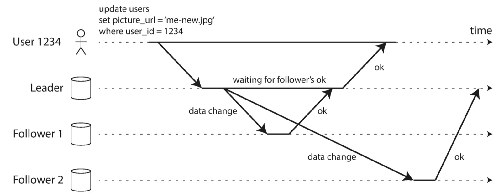

主从同步的方式有下面三种：

- 同步：主节点需要等待所有的从节点响应成功才算插入成功
- 半同步（上图所示）：主节点等待一部分从节点响应成功就算插入成功
- 异步：主节点不用等待从节点响应就算插入成功，给客户端响应

**可靠性**是依次递减的，但是**可用性**是依次增高的，我们需要这两者之间做取舍，这个取舍会一致伴随我们。

### 如何新增节点

试想一下，如果我们每次新增一个节点都从其他节点上copy全量的数据会面临下面的问题：

1、 新节点Copy的时候还会有写入，导致漏数据

2、 传送数据浪费机器性能，妨碍被复制机器上其他请求处理

3、 如果为了数据一致性加锁，那用户会哭泣

一般采取类似mysql的拷贝一次备份文件（snapshot）然后主动请求的方式。我们的数据库一般会定时备份（一天一备或者一周一备份）。

0. 主数据库定时备份
1. 新节点拿到最近一次主节点的snapshot
2. 新节点去主节点那从这个snapshot之后所有数据
3. 新节点处理这些数据

### 节点挂了怎么办

### 从节点挂了

无关紧要，要么新加一台要么等着它恢复，恢复回来从失败点同步就行了

### 主节点挂了

1、 节点挂掉检测：一般是timeout

2、 选主

3、 切换客户端写到新主，将老leader降级为follower

主节点挂了比较严重，我们来思考下面几个问题：

-  如果是异步同步，leader挂掉的时候还没将数据同步到从节点，新leader已经接收数据，老leader恢复后同步数据的时候会出现数据冲突（比如主键冲突）。这种如果出现不能解决只能降级了，比如不要老节点数据了，但是这样的数据库在可靠性要求高的情况下就不适用了
- 针对上述第1步，如果timeout设置不合理（太长导致会故障很长时间，太短会导致误选主）可能会造成脑裂的情况

- 针对上述第2步，如果选了一个同步数据比较慢的节点，还可能出现上述情况，但是如果这个主键数据已经在redis（缓存）中有了一份，那么又会导致数据不一致
- 针对上述第3步，到底是应该先将老leader降为follower还是先切主，如果是先选主切主，可能在这之间老leader恢复继续接受请求导致数据不一致，如果是先降级后切，会导致一定的不可用时间。这一点我请教了下公司的DBA同事，Mysql场景一般采取后者，很明显在可靠性和可用性之间选择了可靠性。

### 主从同步的时候传递什么数据

这一点和mysql很像

#### Statement格式

可以理解为是SQL（update t_user set name="helios" where id=23;）

 这样看似简单并且数据小，但是有下面几个难点：

- 很难处理随机数据：比如RAND()、NOW()这些
- 强依赖顺序：这个SQL可能依赖已经存在的数据

#### Write-ahead log (WAL)

包含的是磁盘中哪些字节被修改了，但是这个是强依赖存储引擎的。

#### row

WAL相当于物理结构，row就相当于逻辑结构。包含操作的所有数据，比如insert 三行就是这三行列的所有数据。

#### Trigger

能让用户自定义函数。

### 主从延迟怎么办

主从一般会让所有读走从节点，写走主节点。这也是一般互联网常见业务。

#### 写后立即读怎么办

比如在页面上提交表单用户立马刷新一次，比如下面：

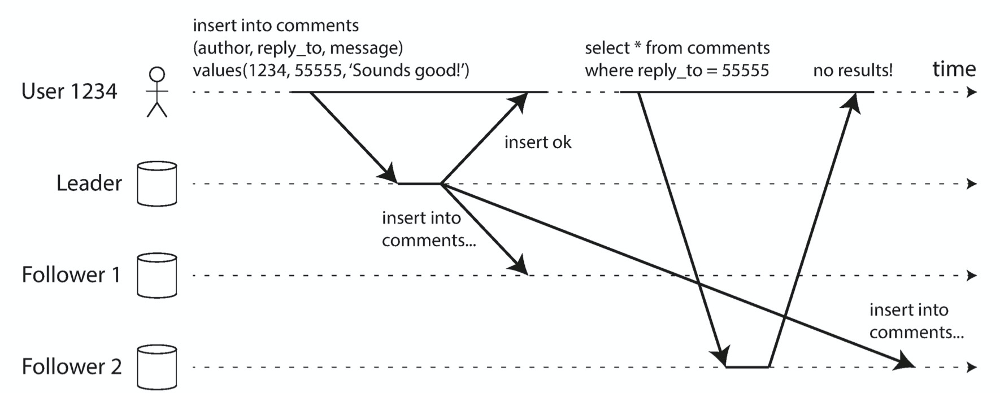

一般有下面几种解决方法：

1、 针对改为即查的用户查询走主库（微信修改头像）

2、如果这个更新针对所有人的，就要跟踪这个更新如果没有同步到所有从节点就从主节点查询

3、 客户端记录一次操作的时间戳，如果服务节点这条记录早于这个时间戳就发送给其他节点

还有一个问题，就是比如你现在用ipone手机在淘宝上加了购物车，想在ipad上刷新一下就能看到，那么问题也会有问题：

- ipad不知道ipone最后更新的时间戳
- 如果数据库副本在不同的数据中心，你需要给路由到相同的数据中心

#### 单调读

如果用户刷新页面发现已经看到的记录没有了，如下图：

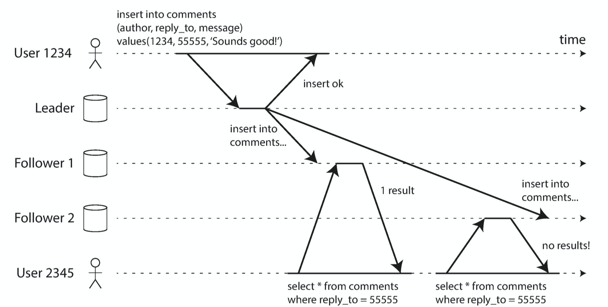

单调读就是保证不会发生上述错乱的情况。解决方法就是让同一个用户只到固定的副本上查询。

#### 一致性前缀

还有一些违反因果关系的，比如聊天场景：

A： 吃了么

B：吃了

但是如果出现下图的情况，在聊天记录中就能看到：

B：吃了

A： 吃了么

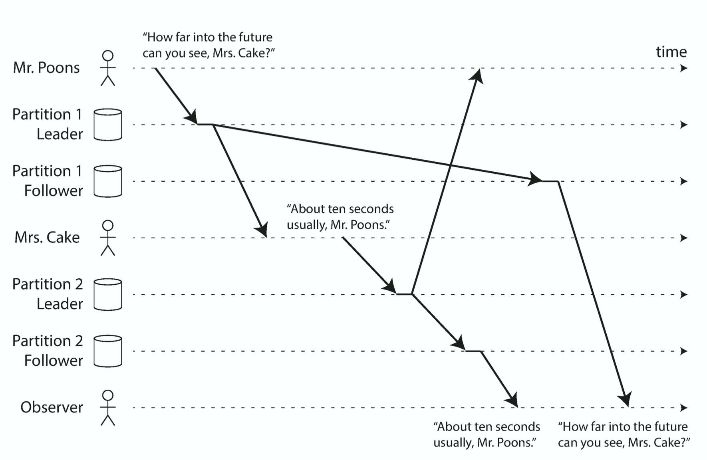

一致性前缀就是保证不会出现因果错乱的情况。这个也是将所有的写到一个分区（分区在下一篇文章讲）。

## 多主同步

### 什么场景适合多主

#### 多数据中心操作

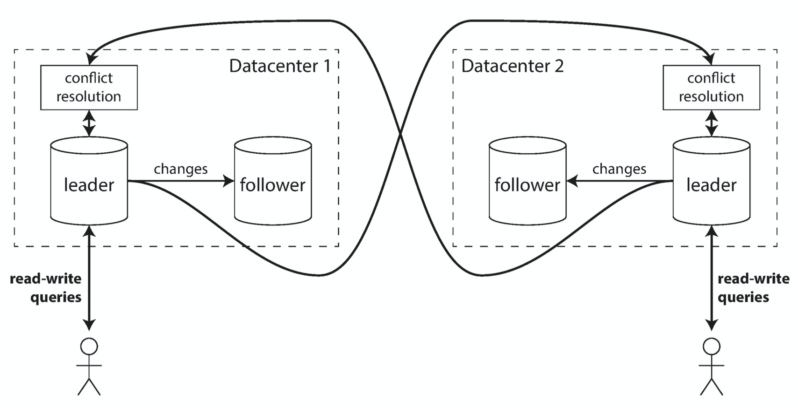

优点：

1、 性能高：用户写就近的数据中心

2、 允许数据中心故障：一个挂了还有另一个

最大的确定就是处理**两个主节点对同一个写处理写冲突困难**。

#### 客户端有离线操作

比如你的ipad离线还会在日历中添加会议、日程等，等有网络的时候会同步到ipone和mac，这里每个设备就是一个主节点，数据同是异步的。

CouchDB是个代表。

#### 多人同时编辑

比如石墨文档，一般是先更新本地然后异步的更新远程，有冲突再说有冲突的，大不了提示出来，反正比加锁好。

### 如何处理写冲突

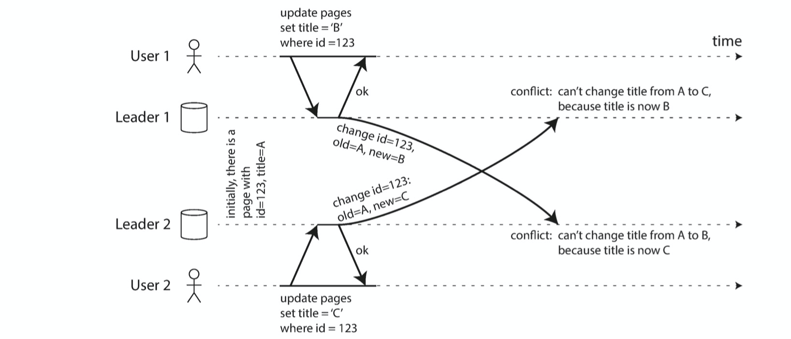

终于要面对两个leader节点并发写一个字段的问题了。

#### 冲突避免

确保所有针对同一个记录的写都到同一个主节点上。

#### 趋向一致性

多leader不像单leader那样能保证写入的顺序。怎么像单leader那样保证顺序呢：

1、 last write wins (LWW)： 通过时间戳或者UUID

2、 给每次操作一个唯一ID，高编号优先级总是高于低编号的

3、 按照字母顺序merge【太扯淡】

4、 记录冲突，后面让人去解决的，git 冲突的思路

能看到上述方案每一个靠谱的，确实也没事普世的靠谱方案，一般都要权衡。

#### 自定义冲突检测逻辑

有两种：

- On write： 数据库检测到冲突的时候，执行用户代码。比如Bucardo
- On read：冲突出现的时候，所有冲突会被保存，当数据被读的时候交给客户端处理，比如CouchDB

### 多主结构必须考虑的问题

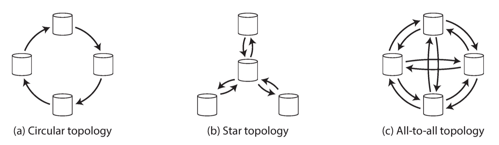

使用前两者基本和单主没什么区别，使用c会导致下面的情况难以处理。

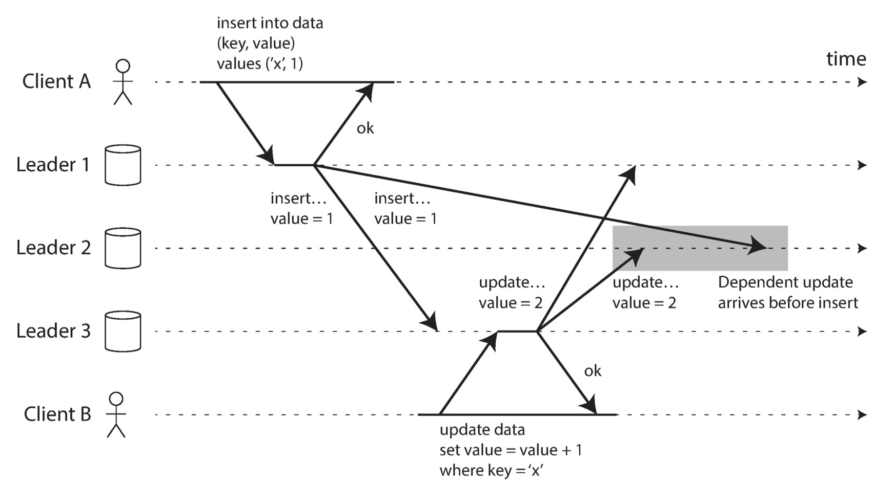

## 无主同步

最出名的是Dynamo，所有所有的leader-less的DB都叫Dynamo-style（比如Cassandra、Voldemort）.

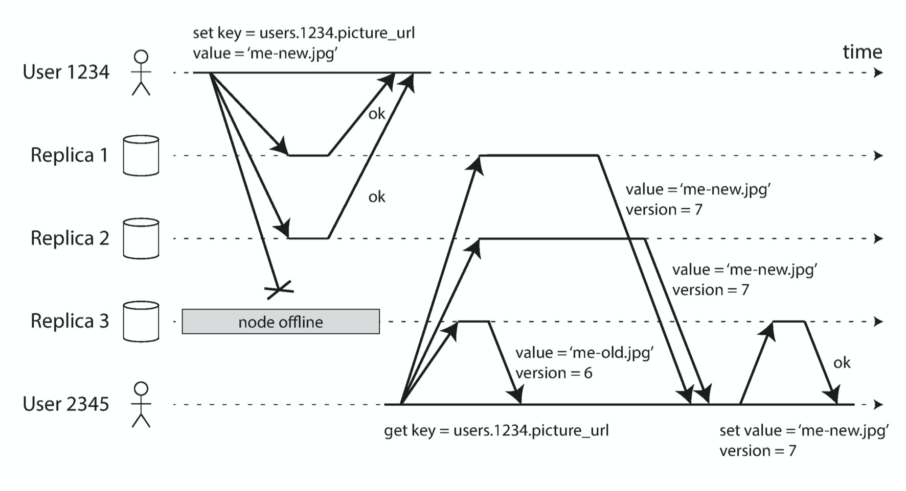处理数据不一致的两种方式：

1、 read的时候发现读到老的，就给更新咯

2、 有个后台线程去更新数据不一致的情况

一般对于写入节点的数量、每个请求从几个节点读取的数量也是有要求的：

- n:  多少个可以写入的节点（一般小于集群数量，因为集群中会有其他节点做备胎）
- w：每次写入多少个节点算成功
- r：每次从多少个节点读，保证能读到最新的数据

要满足w + r > n，这样保证r和w有重叠，如下图：

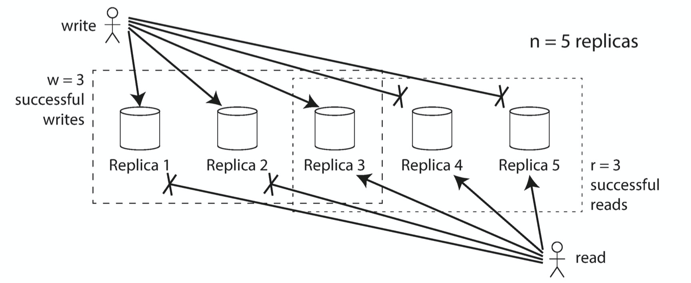

但是也会各种原因出现不一致，比如：

1、配置不合理，不保证r和w有重叠

2、 并发写难以处理，可以按照时间戳优先

3、 读写并发的时候无法确定，读的有最新的

4、如果写的没超过w个，再回滚的过程中读可能读到新的

5、 如果一个有新值的节点挂了，用一个含有老值的节点顶上，肯能就违反了有w个值存新值的前提了

并且没有leader导致，就没有固定顺序，为了保证顺序就更加困难。

### 如何检测冲突

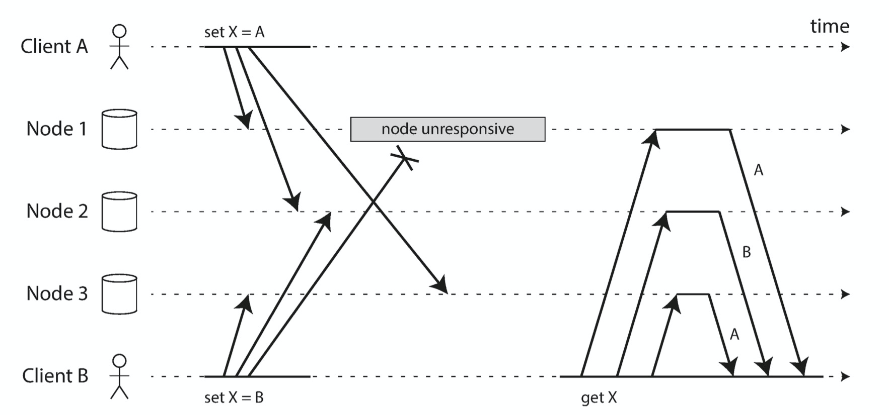

由上图可知，解决冲突是交给了客户端，这是在集群中没有自动处理数据冲突的情况，如果有这个后台线程，业务还要感受DB集群的内部逻辑。

#### Last write wins (LWW)

这种方式比较不靠谱，因为如果用时间戳的话是根据客户端生成的，你还得保证人家的所有客户端时间没问题。所以这种方式用的很少，比如Cassandra使用UUID作为key，给每个写操作唯一的key。

#### 捕捉happens-before关系

A和B针对同一个字段写入有下面三种关系：

- A优先于B
- B优先于A
- A和B同时

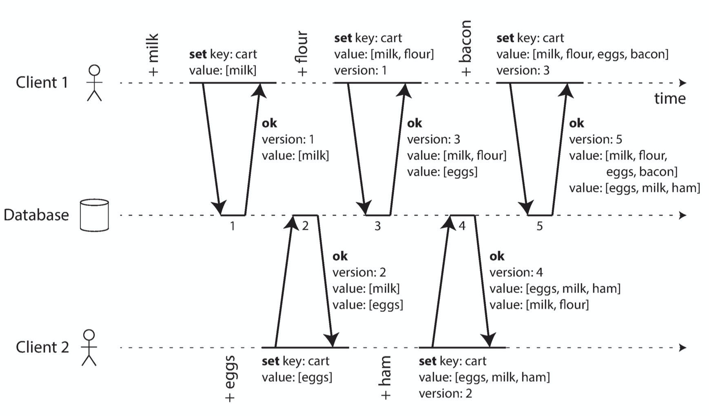

上图所示要想捕捉到happens-before的关系就需要server + clinet的配合，如下：

- server针对每个key都保持一个版本
- client读的时候返回所有相同版本的值
- client写的时候必须merge
- 服务端接收到之后进行merge

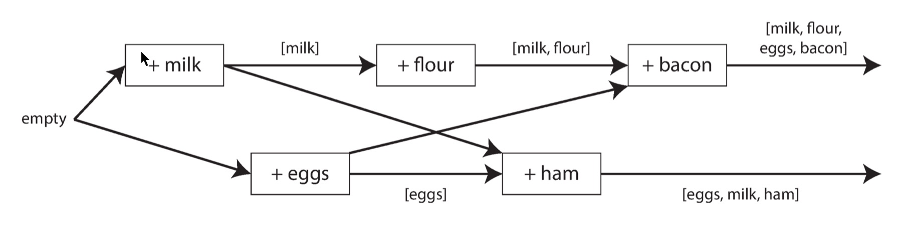

## 总结

根据本篇的内容就能感受到，相对简单的架构相对稳定，但也相对性能差。更多的时候是需要我们在可靠性和高效性之间做权衡。