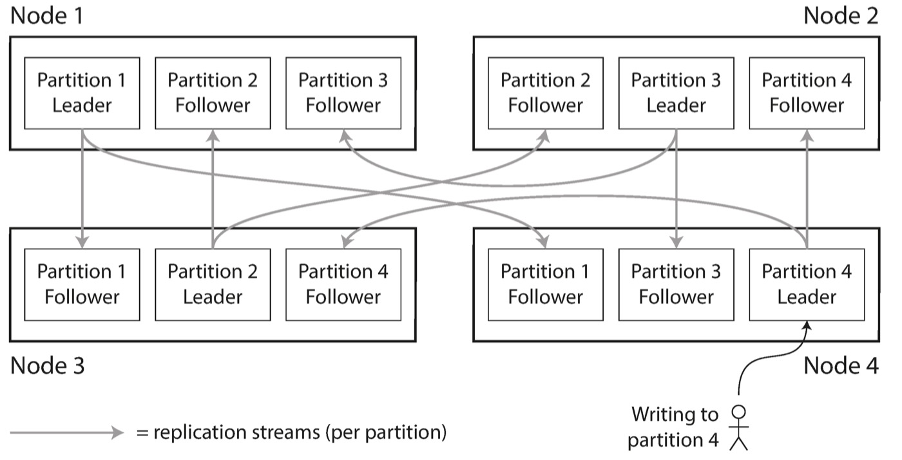
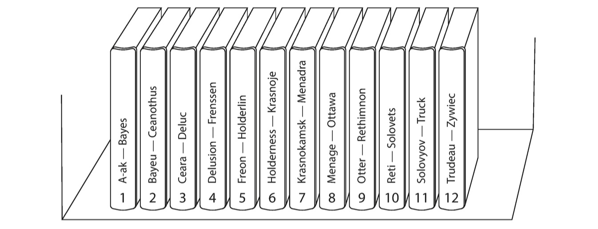
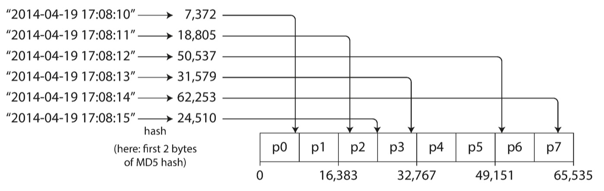
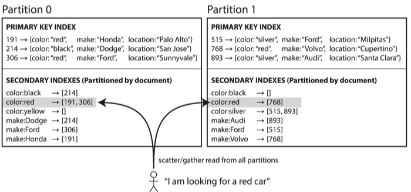
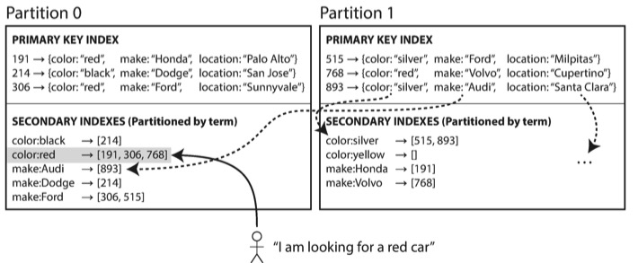
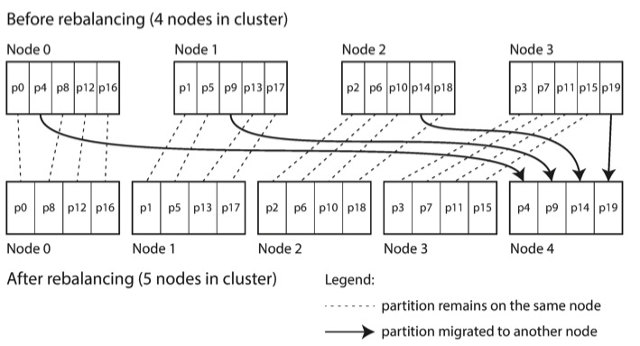
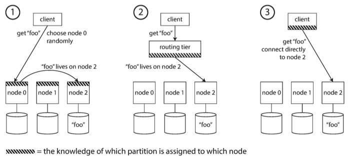

# DDIA读书笔记（四）: 数据太大一台机器装不下

在[DDIA读书笔记（三）: 如何保证数据同步时的可靠性](https://github.com/helios741/myblog/blob/new/learn_go/src/2021/09/ddia_3/README.md)中的同步机制都是把数据全量同步，但是如果数据量太大怎么办呢？如果你开发过业务系统，第一时间想到的肯定是分库分表呗，这种业务代码耦合底层数据库的做法直至今日还是在用。今天的介绍的就是面对大数据量的存储怎么办。你可能会想起公司架构师或者DBA布道tidb的时候说tidb的优点就是不用分库分表，但是它有个partition的概念，今天的主题就是说的它，中文名也叫分区，除了叫partition也叫sharding。

- 如果你用MongoDB, Elasticsearch或者 SolrCloud它叫shard；
- 如果你用HBase，它叫region
- 如果你用Bigtable，它叫tablet
- 如果你用Cassandra或Riak，它叫vnode
- 如果你用Couchbase，它叫vBucket

数据同步和分区的关系如下：

## 分区的两种方式

### 1、 根据key排序分区

优点：

1、 适合区间查询

缺点：

1、数据不是均匀的，可能h开头的远远大于T开头的

2、 热点数据集中

### 2、 根据hash(key)分区

也叫一致性哈希。

缺点是**不能区间查询**，但是这是可以排序key分区结合使用的，比如我们把<user_id, update_time>设置为联合的key，其中hash(key)标识去哪个分区，update_time表示通过更新时间排序之类，这就也能达到区间查询的目的。

### 如何避免热点

针对写热点，比如微博明星出轨大家都@Ta，导致针对同一个key的大量写入，如果检测到这种情况就在key后面加个随机数，比如hash(key + random)，这就能让写分散到各个分区，倒是读就成为了一个问题，因为需要将不同的数据进行整合。

读热点一般是在架构上通过本地缓存、中心缓存、限流、熔断实现

## 如何实现二级索引

数据同步（不分区，比如mysql）的场景如果查询慢了，我们就说去加个索引，但是分区的情况怎么加二级索引的呢，毕竟数据都不在一块了，一般分区建立二级所有有下面两种方式

### 基于文本(document)

这个标题的原文叫“Partitioning Secondary Indexes by Document”，我是不知道咋翻译靠谱一点，继续看下文之后反过来在看看标题吧。

比如声明了一个color:red的索引，每次分区中新增包含color:red的内容，默认就会把这个内容的id加入到索引列表中，每个分区中都会维护这个索引列表，所以查询的时候需要查询所有的分区，这时候就会出现短板效应，即查询结果依赖响应时间最长的一个。

### 基于关键词(Term)

这个标题英文叫“Partitioning Secondary Indexes by Term”读者自己感受的，翻译起来困难。

思路是将二级索引和内容同等对待，比如有索引有color: black、color: red、color: silver、color: yellow、make:Audi这五个索引，color: black、color: red和make:Audi在分区0中，其余的两个在分区1中，然后这个索引会告诉我们去哪个分区找，这样就省去必须到所有的分区查找了。

那么你会问了，我怎么知道color: black这个索引在分区1中呢，刚才不是刚学过根据key排序的分区么，用上呀。

基于关键词和基于文本的两种二级索引各有利弊：

- 基于关键词的更适用于读频繁的场景，因为不用读所有的分区
- 基于文本的更适用于写频繁的场景，因为基于关键词的需要写一个数据需要涉及其他的二级索引分区；
- 基于关键词的如果要强一致还需要分布式事务的支持，现在大多数数据库索引更新一般是异步的，比如AWS的DynamoDB号称在基础设施不挂的情况保证毫秒级别的二级索引更新

## 有哪些rebalance的策略

1、 hash mod N： 不多说，字面意思，即N个节点代表N个分区，缺点就是加机器的时候可能得改客户端逻辑。

2、 固定的分区（一个节点上的分区不固定）：当节点的去留都会rebalance，还能让一些牛逼机器搞读取频繁的分区。

老分区等客户端的指向更新之后再做移除操作。这种不好的地方就是不好确定分区个数，太少吧数据集中不适合扩展，太多吧不适合管理。

3、 动态分区：一个分区数据多了split，数据少了merge。

4、 每个节点按比例分配分区：上面两种都是按照分区未单位现在改为节点为单位，节省了分区漂移的成本，增加机器的时候是平均分的数据。

5、 人工rebalance：

全自动的缺点：

- 重新路由请求
- rebalance数据
- 不能控制出发时间，要是在高峰期rebalance那就尴尬了
- 还要有失败检测

Couchbase, Riak, 和 Voldemor 使用机器检测需要分区，人工操作的方式。

## 请求路由有哪几种

老生常谈的服务发现问题：

1、 全路由服务发现：每个节点都能作为转发

2、 服务端服务发现

3、 客户端服务发现

## 总结

通过本文你就知道为什么现在大多数业务还是用mysql+分库分表解决业务问题：

1. 分库分表方案成熟
2. 数据库部署方案成熟
3. 数据可靠
4. 业务用的习惯

分布式数据库面临着各式各样的问题：

1. 分布式索引加起来多贵
2. 使用业务使用何种分区