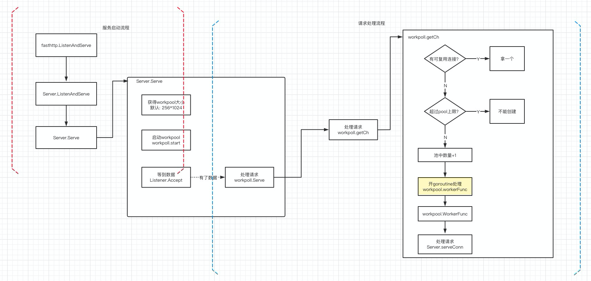

# Go的fasthttp快的秘诀：简单事情做到极致

本文介绍fasthttp针对net/http的不足做了哪些优化。通过原理+数据的方式让你不仅知其然还知其所以然。


## 背景

我把fasthttp、net/http以及gin（可有可无）分别对小包（512字节）和大包（4K）进行压测，得到了平均响应时间、tp99、CPU以及内存数据。


我们能够看出大包和小包在**平均响应时间**和**tp99**无明显差异。

当QPS超过4K之后分水岭越来越明显，fasthttp消耗最少(比原生少30%)，gin和原生的http相差无几。

fasthttp表现明显比标准库节省将近40%，其余的相差无几。

## net/http慢在哪

先看下如何启动一个http服务的demo：

```go
func h(w http.ResponseWriter, r *http.Request) {
	fmt.Fprintf(w, "Hello, %q", html.EscapeString(r.URL.Path))
}

func main()  {
	http.HandleFunc("/bar", h)

	log.Fatal(http.ListenAndServe(":8080", nil))
}
```

我们分三步看，先看路由注册流程（http.HandleFunc）然后看下最简单的http服务启动流程（http.ListenAndServe）最后分析接受请求流程（h(w http.ResponseWriter, r *http.Request)）。


### 1、路由的注册流程（http.HandleFunc）

这一步比较简单，最简单的想法就是搞一个`map[string]hander`，然后接收请求的时候和请求的path进行比较，如果存在就执对应的方法，不存在就404。确实默认http处理就是这么做的：

```go
// 路由的结构如下
type ServeMux struct {
	mu    sync.RWMutex
	m     map[string]muxEntry
	// ...
}

var DefaultServeMux = &defaultServeMux

var defaultServeMux ServeMux


func HandleFunc(pattern string, handler func(ResponseWriter, *Request)) {
	DefaultServeMux.HandleFunc(pattern, handler)
}

func (mux *ServeMux) HandleFunc(pattern string, handler func(ResponseWriter, *Request)) {
	mux.Handle(pattern, HandlerFunc(handler))
}

func (mux *ServeMux) Handle(pattern string, handler Handler) {
	// ...省略参数校验处理
	if mux.m == nil {
		mux.m = make(map[string]muxEntry)
	}
	e := muxEntry{h: handler, pattern: pattern}
	mux.m[pattern] = e
}
```

看到这里，你可能感觉有点不对。


平常使用gin、echo等框架，诸如`/students/:id`这样的统配是怎么实现的呢。确实原生http提供的路由比较粗糙，所有才有了替代方案，即通过radix tree实现，如果你有兴趣可以看[radix tree有哪些用途](https://github.com/helios741/myblog/tree/new/learn_go/src/2021/07/radix-tree)。开源项目[httprouter](https://github.com/julienschmidt/httprouter)是最初实现，有兴趣可以看下代码，并不多。

### 2、 http的启动流程（http.ListenAndServe）

这一步骤极其简单，就是用net包对tcp层进行了封装。

```go
func ListenAndServe(addr string, handler Handler) error {
	server := &Server{Addr: addr, Handler: handler}
	return server.ListenAndServe()
}

func (srv *Server) ListenAndServe() error {
  // 当有数据的时候返回
	ln, err := net.Listen("tcp", srv.Addr)
	if err != nil {
		return err
	}
  // 进行处理
	return srv.Serve(ln)
}
```

srv.server就是我们马上要讲的处理方法。


### 3、 接收请求流程（h(w http.ResponseWriter, r *http.Request)）

温馨小提示：


Goland是很好的调试工具。比如我对h函数打个断点然后请求一下：


------

每个连接一个goroutine，即*goroutine-per-connection*模式。代码并不少但逻辑比较简单清晰，我把整个过程整理为了一张图（黄色框框代表需要创建新对象）：


这么看只能看到执行流程，并不能看到在哪一步消耗比较大，我们借助pprof分析一下（如果对pprof不懂，可以看[golang性能分析工具指南--pprof](https://mp.weixin.qq.com/s/TRQ_vwYuqXnuFLYAGbxlQA)）：

先看下概览图(火焰图中的函数除了runtime相关的，在上图中均能找到对应函数)：


能看到conn.serve占用了65.14%，我把各个函数的占用按照从高到低做一下统计：

- conn.finishRequest占用了30.69%
  - 这里面主要调用的是bufio.Flush方法，这个避免不了了。
- conn.readRequest占用了22.49%
  - 每次都要创建request和response对象，很浪费，可以通过sync.Pool优化
- Hander.ServerHTTP占用了4.81%
  - 看到了没，执行处理函数时间志占用了这么点
- startBackgroundRead开启的goroutine（backgroundRead）占用了4.67%
- startBackgroundRead占用了4.3%
- context.WithCancel占用了1.15%
- 一些不超过1%的就不统计了


除了上面这些还有一点就是，每次来了一个连接实例化一个连接对象是相当浪费的。


## fasthttp做了哪些优化

通过下面的代码就能启动fasthttp的小demo：

```go
func h(ctx *fasthttp.RequestCtx) {
	fmt.Fprintf(ctx, "Hello, world!\n\n")
}

func main() {
	log.Fatal(fasthttp.ListenAndServe(":8082", h))
}
```

fasthttp的实现有点像但Reactor多goroutine的模式，如下图：



fasthttp优化的唯一原则就是**复用**，包括连接复用和内存复用（其实连接复用也可以叫内存复用）。

首先说说连接服用，思路和java的线程池以及http的连接池的思路是一致的（上图右边的判断），如有可以复用的就复用，没有可复用的并且池子还么满那么就创建一个，如果池子满了就报错。

对于内存复用，就是大量使用了sync.Pool，基本acquire开头的都是


我们最context做一下benchmark看看使用sync.Pool能提升多少性能，benchmark代码如下：

```go
func BenchmarkServer_AcquireCtxPool(b *testing.B) {
	s := Server{}
	s.ctxPool.Put(&RequestCtx{})
	for i := 0; i<b.N;i++ {
		ctx := s.AcquireCtx(nil)
		s.ctxPool.Put(ctx)
	}
}

func BenchmarkServer_AcquireCtxCreate(b *testing.B) {
	s := Server{}
	for i := 0; i<b.N;i++ {
		ctx := s.CreateCtx(nil)
		s.ctxPool.Put(ctx)
	}
}
```

```shell
BenchmarkServer_AcquireCtxPool-8     	68610426	        17.4 ns/op	       0 B/op	       0 allocs/op
BenchmarkServer_AcquireCtxCreate-8   	 2375942	       474 ns/op	    1428 B/op	       1 allocs/op
```

可以看出在每次操作的消耗上快了25倍+，使用sync.Pool的内存消耗几乎为零。<del>关于sync.Pool怎么实现的，还有机会在说的，别跑题</del>

我们通过pprof再来看一下整体流程：


- runtime占用了47.4%
  - 这是因为程序执行过快，导致runtime相对较高了，并不是问题
- workpool.getCh占了51.88%


除了必不可少的bufio.Peek(占用9.85%)和bufio.Flush(占用26.61%)剩下的所剩无几了（15.37%）。


## fasthttp做了哪些优化

1、 多使用sync.Pool进行复用

根据笔者统计，用了整整30个sync.Pool，比如常见的context、request对象、header、response对象....

```shell
grep -r " sync.Pool" ./ | grep -v "_test.go" | wc -l

30
```


2、使用pprof定位哪里有问题

fasthttp的作者并不是拍脑门优化的，是通过`go tool pprof --alloc_objects your-program mem.pprof`哪里有内存消耗然后针对性优化


3、 使用byte[]代替string

对于这一点笔者也做了benchmark：


但是有个比较奇怪的现象，1.12竟然是相对最快的：


为什么string转[]byte会慢呢，稍微探究一下，程序如下：

```go
package main

var eight = "dsdsdsdsdsdsdsd"
func main() {

 _ = []byte(eight)
}
```


打断点：


mallocgc是分配内存操作，没超过64K还好一点，如果超过了64K就会直接向OS申请。


## 总结

上周看了许多net库的实现，说一下感叹吧。

一门新生的语言还必须要走成熟语言（java）的全过程，并且在这个过程中涌现了各式各样的开源项目都是借鉴java的netty（不仅是rpc框架，还有设计模式、代码规范等等都是借鉴成熟语言的成熟方案）。