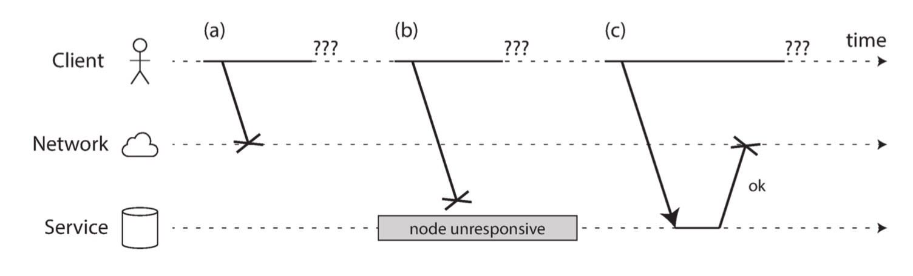
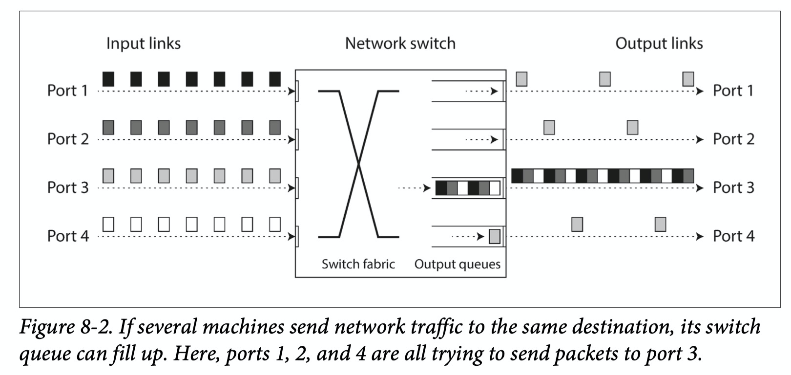
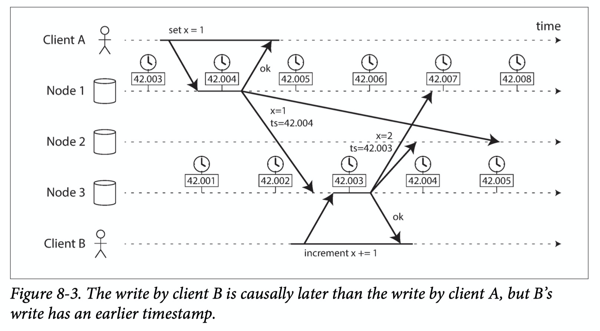
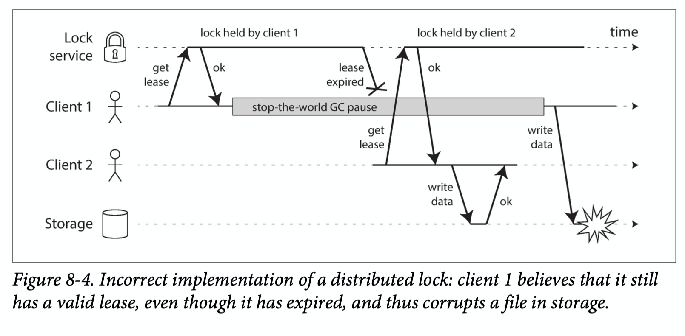
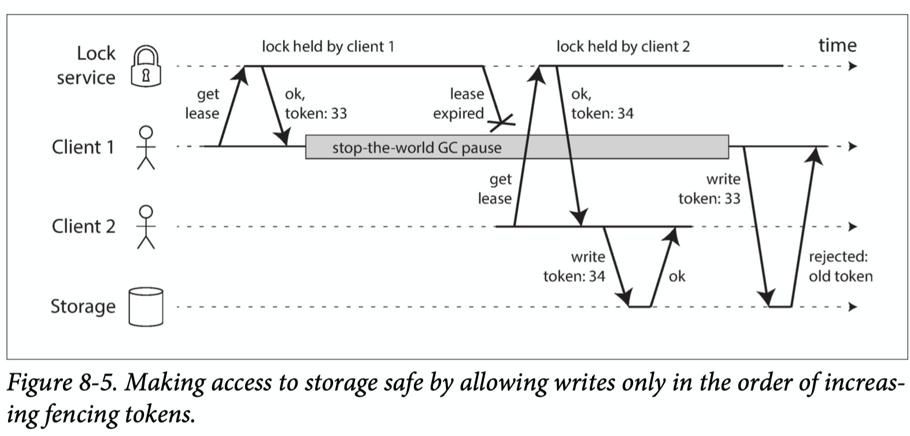

# DDIA读书笔记（五）: 分布式系统的破与立

我们为了解决单台机器的资源不足、地理位置不接近用户导致响应时间长、单点故障等原因将系统迁移为分布式的，也遇到了新问题，对于一个请求，单机要么成功要么失败，但对于分布式存在部分成功/失败。

那么一个思路是搞超级计算机（几千核）能解决单机存储空间不足但是解决不了亲用户的地理位置和单点故障问题，在说分布式面对的问题之前我们先来看看超级计算机的问题（排除一个选项）。

超级计算机的优点就是资源多，服务之间交流（IPC）快，但是还有如下缺点：

1、 硬件问题需要停服、一挂全挂

2、 需要高规格的硬件，

3、 需要特定的网络拓扑，比如多维网格和环状体（multi-dimensional meshes and toruses）

4、 容错能力没有其他的强

5、 距离用户远

## 网络不可信

### 1、 一个请求可能在哪出现故障

一个请求的可能故障点：

1、 请求在网络中丢失

2、 由于网络拥塞或者接受buffer慢了，消息被阻塞在发送端

3、 对端节点挂了

4、 远端节点CPU在处理其他的，延迟处理这个请求

5、 在响应的途中丢包

6、 发送端机器过载，在buffer排队

### 网络真的那么不可靠么？

说几组数据：

1、 一个中型的数据中心每个月至少出现12次网络故障，故障的一半影响了单台机器另一半影响了整个机架。

2、 调研表示，增加冗余设备并不能减少故障，因为人会犯错

3、 书籍作者好像并不喜欢AWS，他形容EC2的频繁的网络故障使用臭名昭著(notorious)这个词，认为个人管理好的数据中心可能提供更好的稳定性，但是笔者认为维护数据中心的需要的人力成本和技术成本都太高。

要尽可能的想到所有的情况，就算想到鲨鱼咬断海底的电缆也不奇怪。

### 除了timeout你还能说出其他检测失败的方式么

无，但是能说出靠固定的timeout检测是不靠谱的。Akka 和 Cassandra实现了类似TCP重传的自适应timeout可以抄一抄。

比如网卡的带宽从1G/s突然减少到10K/s这样的错误，timeout时做不到的，但是这样可以认为这个节点不用了。

### 网络会出现哪些问题

可以分为拥塞和排队两种

1、 网络上的包太多需要排队

2、 目的主机负载太高，没空处理需要排队

3、 虚拟机经常需要暂停几十毫秒切换到其他虚拟机，需要排队

4、 TCP的拥塞控制需要在发送端搞个队列

### 我们发的请求属于同步网络还是异步网路？

结论：计算机网络属于异步网络，传统固话网络属于同步网络。

为什么说传统固话网络属于同步网络呢？先看下流程：

0、 当电话呼起的时候会建立一个通道（两者之间的线路，为呼叫分配固定并且有保障的带宽，直到结束）

1、 ISDN每秒固定发送4000个帧

2、 每个帧分配16字节的空间

3、 在通话过程中保证每250微秒发送16字节数据

4、 没有排队，timeout也就能确定下来了

与其叫同步不如叫独占，异步叫共享网络。

一个是静态的带宽，一个是动态自适应的带宽。

## 时钟不可信

要是读完这一章，可能让你想去读霍金的《时间简史》。

每台机器都有自己时钟，一般是石英晶体振荡器。

闰秒：地球自转慢了会导致误差，所以需要认为加一秒（全球已经进行了27次闰秒）。

### 什么情况需要用到时间

<del>没有时间上班容易迟到</del>

可以分为两类，时间段（超时时间）和时间点（文章发表时间）。

前者也叫逻辑时钟后者叫物理时钟

自己机器上的时间是不可靠的，同NTP同步的时候随时会回调（导致向前或者向后跳变）。这就导致时间点可能不一定是真正的时间点（什么才是真的时间呢，迷乱了没）。

应对时间段却有个好方法，就是每次调用都生成一个自增的数字，两次调用的减就是时间段，它是通过控制增加速率的方式应对时钟回调。

### 本地时间初始化之后为什么会不准确

时钟不同步的原因：

1、 计算机上的石英时钟和温度有关

2、 如果本地时钟和NTP相差太大，拒绝改变或引起跳变

3、NTP server被防火墙拦住了

4、 网络拥塞

5、NTPserver配置问题

6、 应用服务处理不了闰秒

7、虚拟机环境可能CPU执行其他的虚拟机，导致用户看起来时间停止

8、 客户端依赖本地时间

### 时间不一致会导致什么问题

难以言表的问题，看下图

Node1 和Node3的时间不同步（Node3慢于Node1），我们看一下会发生什么结果：

1、 Client A在*42.004*设置了x=1，Node1写成功之后，Node2和Node3是异步发送的

2、 ClientB将X的值+1，先发送到了Node3，时间是*42.003*早于*42.004*，所以Node3的值是1

3、 同理Node1和Node2的x值也是1

4、 真正后发生的Client B的请求丢了

这就引出了LWW不适用的几种场景：

1、 一个节点时间滞后于另一个节点，可能会默默的丢数据

2、 不能处理绝对并发，时间戳一致

### 分布式情况下如何保证单调增

既然时间不确定，那么类比我们服务的响应时间也不能保证100%在5ms，但是能保证p99/p999，所以时间也有类似的置信空间，比如系统有95%的把握现在是时间在10.3s和10.5s之间。

我们请求一个服务（Google’s TrueTime API in Spanner）的时候返回两个值[earliest, latest],如果我们请求两次返回A = [Aearliest, Alatest] 和 B = [Bearliest, Blatest]，并且满足A earliest< A latest< B earliest< Blatest那么我们就认为B在A之后。

## 什么是正确

### 什么情况会出现多leader共存

比如在一个leader的任职期间因为发生长时间GC导致其他节点认为他已经挂了，重新选主，等老的主节点恢复的时候可能会导致多主共存，比如下图：

怎么防止这种情况呢？在Storage加入校验呗；

那么校验什么（通过什么校验）呢？这就引出了*fencing token*机制，如下图：

每次client请求锁服务获取锁的时候会返回一个自增的token，调用存储的时候会传递这个token，如果有比这个token大的token访问过，那么就拒绝否则就接受。

### 什么是拜占庭问题

我们所有的讨论都建立在一个前提：我们相信请求的响应是正确的，即使可能丢包、延迟但是只要响应了就不可能是伪造的。

### 拜占庭问题有哪些例子

1、 硬件在太空中可能会收到辐射的影响，导致不遵守以前的协议，变得不可靠

2、 P2P这种区块链网络，任何人都能写，但是写的对不对就不知道了

### 如何评价分布式一致算法

安全性（唯一、单调）和稳定性（故障处理），前者出现错误时灾难性的，后者可能会停服，想想淘宝被挖断电缆的例子。

### 软件工程和计算机科学有什么不同

软件工程允许在出现未知错误的时候打印错误信息，然后通过人去处理。

## 总结

对待分布式遇到的问题，测试的case再多也不为过，没有故障创造故障也要上。In distributed systems, suspicion, pessimism, and paranoia pay off.

我们知道计算机是没有短板效应的，我们可以用比较挫的组建构建出高可靠的系统，最典型的就是Google的GFS。

