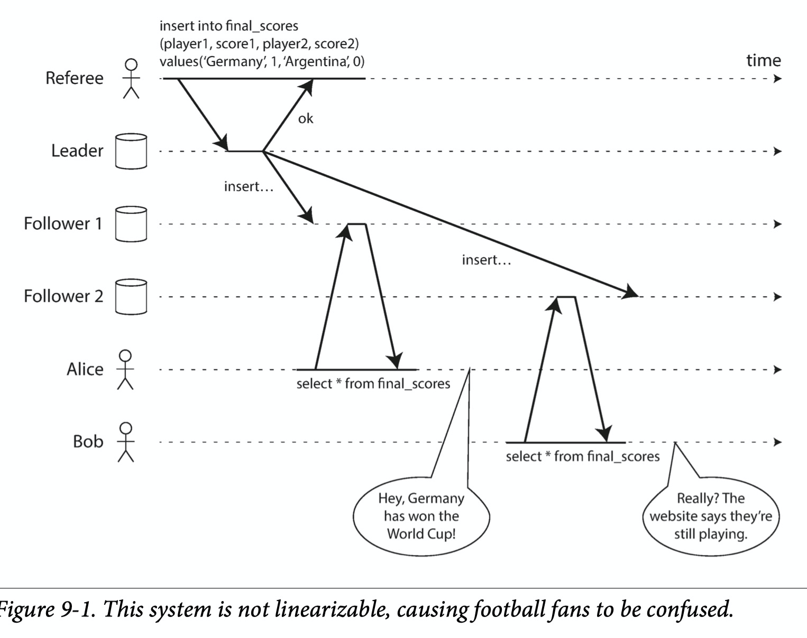
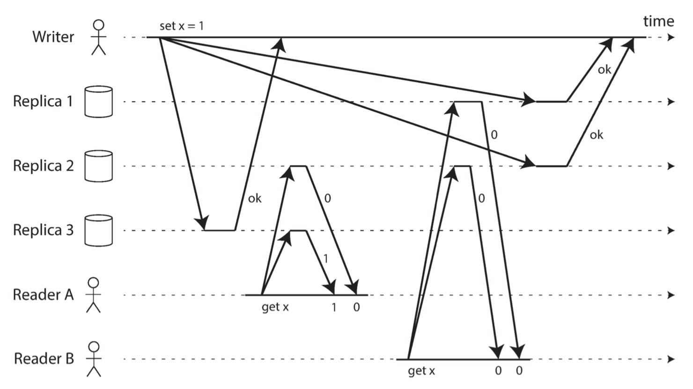

# DDIA

在上一篇[DDIA读书笔记（五）: 分布式系统的破与立](https://github.com/helios741/myblog/tree/new/learn_go/src/2021/10/ddia_5)讲到了在分布式中可能会有下面三个不可避免的问题：

1、 网络不可靠：丢包、延迟

2、 时钟不可靠：时钟不同步

3、 应用暂停：其他节点认为已经挂掉

最终一致性没有说最终的时间

事务和一致性的区别：前者解决并发读写；后者解决副本状态同步

一致性的三个问题：

linearizability（also known as atomic consistency , strong consistency, immediate consistency, or external consistency）：strongest consistency models

causality and total ordering： issue of ordering events

how to atomically commit a distributed transaction

上面这两行有什么区别联系。

## Linearizability

最简单的想法：DB给人只有一个副本的错觉那不就完了么。

linearizability is a recency guarantee

Linearizability是什么？

最简单的想法：DB给人只有一个副本的错觉那不就完了么。

linearizability is a recency guarantee

如下图，图的上半部分是不符合Linearizability的，下半部分是符合Linearizability的。

------

什么情况违反了Linearizability？

如下图，比赛都结束了Alice看到了最终结果，Bob刷新还是没得到。

linearizability有什么用？

1、 分布式锁或者选主：当一个节点成为主节点的时候，所有人读到的都是一样的（写可以通过CAS，读的方式各有不同，zk通过sync()， etcd通过读去r个节点）

2、 唯一性：用户名在系统中是唯一的

3、 

怎么保证Linearizability？

1、单主：如果出现多主，或者非同步复制的情况下，容易造成错读。如果单主，就要区分普通读和Linearizability读，Linearizability读去走主库。

2、一致性算法：👍，能处理脑裂和副本上没有最新数据问题，保证了Linearizability

3、 多主：多主同时写，异步复制，因为有冲突决策的过程，完全不保证Linearizability

4、 无主：通过同时读多个副本保证的到最新的，但是依赖时间，以及在并发的情况下出现race，可能不是Linearizability

线性化和Serializability的区别？

Linearizability有什么损耗？

CAP有什么问题？

CAP的意义主要是宏观和历史意义，它是根据经验提出的理论，只解决了网络分区这一个大问题，并没有解决诸如网络延迟，网路抖动这一系列更加细化的网络问题。

CPU为什么不使用Linearizability？

想象一下每个CPU都有自己的memory cache和寄存器，一个core去写同一块内存另一个core去读这块内存需不需要保证Linearizability？

答案：需要，但是没保证，因为性能不高（这也是CAP没考虑的一点）。

TODO 这个和CAP好像能merge

## 顺序保证

如何保证因果性？

跟踪每一条数据，就像可重复读的事务隔离级别一样。

然而跟踪所有的数据太不靠谱了，因为消耗太大。

还有一个是sequence number，每个操作有一个唯一自增的sequence number。

如何解决分布式一致性？

Lamport timestamps这个时候就搞不赢了，因为如果要创建一个全局唯一的用户名的话，还需要检查所有节点，如果其中有个节点挂了，你就必须等了。

如何保证Linearizability write？

只要保证写日志的顺序一致，然后cas即可。

怎么保证写日志的顺序一致呢？

为什么说保证分布式一致性不可能？

这就是FLP理论。

