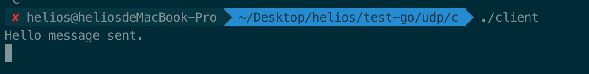
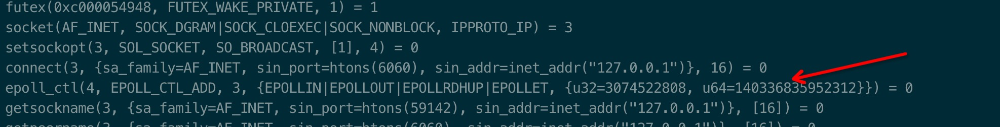
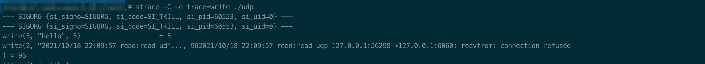

# 为什么UDP需要建连


最近在用Go程序写udp服务的时候，有一次服务端忘记启动了，直接启动的客户端发现如下错误：

```shell
2021/10/17 11:54:59 read udp 127.0.0.1:53913->127.0.0.1:6060: recvfrom: connection refused
```

我的内心还是尴尬的，因为这和课本上讲的不一样。


udp不是无连接的么，为什么还会出现`connection refused`呢

本文会按照先解密在分析的思路来讲解这个问题。


注⚠️：

1、 强烈推荐看这边文章(https://ops.tips/blog/udp-client-and-server-in-go/)。从UDP的使用到各个函数的原理分析都很细致。

2、 本文的所有代码在原文同级目录均有


## connection refused的Go代码

server.go

```go
func main() {
	udpAddr, err := net.ResolveUDPAddr("udp4", "localhost:6000")
	if err != nil {
		log.Fatal(err)
	}


	conn, err := net.ListenUDP("udp", udpAddr)
	if err != nil {
		log.Fatal(err)
	}

	for {
		buffer := make([]byte, 4096)
		n, addr, err := conn.ReadFromUDP(buffer)
		if err != nil {
			log.Fatal(err)
		}

		message := buffer[:n]
		_, err = conn.WriteToUDP(message, addr)

		if err != nil {
			log.Println(err)
		}
	}

}
```

这里需要指出的是net.ListenUDP返回的是UDPConn，而net.ListenTCP返回的是TCPListener。

后者每有一个连接进来都会调用Accept函数，而前者是无连接的自然也就没有Accept这个步骤。

client.go

```go
func main() {
	RemoteAddr, _ := net.ResolveUDPAddr("udp", "localhost:6060")

	conn, err := net.DialUDP("udp", nil, RemoteAddr)
	if err != nil {
		log.Fatal("dial", err)
	}
	defer conn.Close()
	_, err = conn.Write([]byte("hello"))
	if err != nil {
		log.Fatal("write:", err)
	}

	buffer := make([]byte, 4096)
	_, _, err = conn.ReadFromUDP(buffer)
	if err != nil {
		log.Fatal("read:", err)
	}

	fmt.Println(string(buffer))
}
```

当我们不运行server直接运行client的时候就会出现connection refused。我们用Go还找不到答案（后续会说为什么），需要通过C继续探索。


## 结论

说结论之前需要我们先看C语言实现UDP的client和server的代码：

server.c

```c
int main() {
	int sockfd;
	char buffer[MAXLINE];
	char *hello = "Hello from server";
	struct sockaddr_in servaddr, cliaddr;

	// Creating socket file descriptor
	if ( (sockfd = socket(AF_INET, SOCK_DGRAM, 0)) < 0 ) {
		perror("socket creation failed");
		exit(EXIT_FAILURE);
	}

	memset(&servaddr, 0, sizeof(servaddr));
	memset(&cliaddr, 0, sizeof(cliaddr));

	// Filling server information
	servaddr.sin_family = AF_INET; // IPv4
	servaddr.sin_addr.s_addr = INADDR_ANY;
	servaddr.sin_port = htons(PORT);

	// Bind the socket with the server address
	if ( bind(sockfd, (const struct sockaddr *)&servaddr,
			sizeof(servaddr)) < 0 )
	{
		perror("bind failed");
		exit(EXIT_FAILURE);
	}

	int len, n;

	len = sizeof(cliaddr); //len is value/resuslt

	n = recvfrom(sockfd, (char *)buffer, MAXLINE,
				MSG_WAITALL, ( struct sockaddr *) &cliaddr,
				&len);
	buffer[n] = '\0';
	printf("Client : %s\n", buffer);
	sendto(sockfd, (const char *)hello, strlen(hello),
		MSG_CONFIRM, (const struct sockaddr *) &cliaddr,
			len);
	printf("Hello message sent.\n");

	return 0;
}
```

client.c

```c
int main() {
	int sockfd;
	char buffer[MAXLINE];
	char *hello = "Hello from client";
	struct sockaddr_in	 servaddr;

	// Creating socket file descriptor
	if ( (sockfd = socket(AF_INET, SOCK_DGRAM, 0)) < 0 ) {
		perror("socket creation failed");
		exit(EXIT_FAILURE);
	}

	memset(&servaddr, 0, sizeof(servaddr));

	// Filling server information
	servaddr.sin_family = AF_INET;
	servaddr.sin_port = htons(PORT);
	servaddr.sin_addr.s_addr = INADDR_ANY;

	int n, len;

	sendto(sockfd, (const char *)hello, strlen(hello),
		MSG_CONFIRM, (const struct sockaddr *) &servaddr,
			sizeof(servaddr));
	printf("Hello message sent.\n");

	n = recvfrom(sockfd, (char *)buffer, MAXLINE,
				MSG_WAITALL, (struct sockaddr *) &servaddr,
				&len);
	buffer[n] = '\0';
	printf("Server : %s\n", buffer);

	close(sockfd);
	return 0;
}
```

虽然是C代码，但是并不难读

- 通过socket函数创建一个UDP套接字
- 创建ipv4地址，绑定端口和ip
- 如果没有client连接进来，server会一直阻塞在recvfrom，client同理

这段程序不启动server直接调用client的话会一直卡在sendto。



如果你熟悉Go的net.DialUDP的话，就知道他系统调用了connect系统调用，我们可以通过strace(strace ./udp)验证一下:



server不启动报错如下：




从上面两段（Go和C的）来分析，UDP建连是为了响应错误，udp的建连并不会像TCP那样真的进行的三次握手只是在内核中做socket -> 目的ip+port的映射，当我们调用sendto出错的时候（比如地址不可达）如果不建立连接的话，内核知道这个错误但是不知道发给哪个socket，建连之后就知道了。

除了容错之外还有一方面就是效率，先来看下不建立连接的UDP发包过程：

建立socket -> sendto -> 断开socket -> 建立socket -> sendto -> 断开socket。

如果建连的话就是：

建立socket -> sendto-> sendto-> sendto -> 断开socket。

即socket复用。


## 建连的消耗


对比一下几组数据：

| 建连方式                    | 耗时   | 代码                                   |
| --------------------------- | ------ | -------------------------------------- |
| udp over loopback           | 14 µs  | net.DialUDP("udp", nil, RemoteAddr)    |
| udp over unix domain socket | 55 µs  | net.DialUnix("unixgram", laddr, raddr) |
| tcp over loopback           | 119 µs | net.Dial("tcp", ":8089")               |
| tcp over unix domain socket | 37 µs  | net.Dial("unix", "/tmp/a.sock")        |


## UDP原理


图from：https://www.geeksforgeeks.org/udp-server-client-implementation-c/


如果你写过TCP程序的就知道TCP使用write/read的参数中都是不用指定远程地址了，这也是面向连接的意思，在一个连接上收发就不用指定了。但是UDP这种无连接（non-connected）的协议就不一样，调用writeto/readfrom的时候必须把远程地址加上。


如果你在看一下最开始的Go程序，会发现client中net.DialUDP返回的UDPConn是能调用Write的，net.ListenUDP返回的UDPLinstener就不能调用Read/write。因为前者是connected后者是 non-connected。


你可能想问socket是什么？socket是文件描述符，里面包含了很多文件的操作（比如read/write/close）。

read/readfrom有什么区别？如果同时写过TCP和UDP网络程序的话这个会很好理解read是面向连接的，readfrom是面向无连接的。


```c
ssize_t read(int fd, void *buf, size_t count);

```


```c
recvfrom(int sockfd, void *buf, size_t len, int flags,
                 struct sockaddr *src_addr, socklen_t *addrlen)
```


## 总结

本文通过Go代码引出为什么UDP需要建立连接，然后通过C程序为你讲述不建立连接的后果，再然后通过一些数据表明了建立连接的耗时最后着重分析了UDP的原理。


这两周接触网络编程我才意识到，原来书本上的理论觉得再正确到了实际编程的时候还有很多细节要考虑。


如果想继续深入UDP in Go可以看https://ops.tips/blog/udp-client-and-server-in-go/，讲的深入浅出，从示例到内核原理都展示出来，看的时候让我觉得“这哥们基本功真扎实”。

还可以看下鸟窝的分享，里面有大量的程序实例https://colobu.com/2016/10/19/Go-UDP-Programming/。