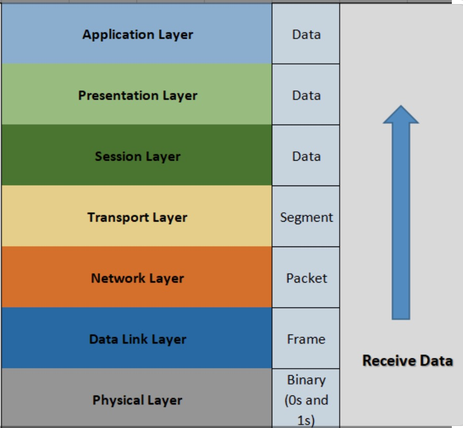
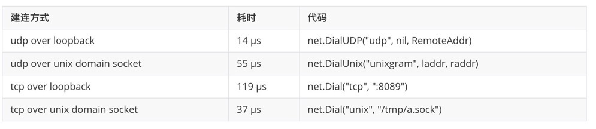

# unix domain socket in Go 示例详解+大集合

由于最近上的工作需要，把unix domain socket（后面简称uds）系统的看了一遍，也对常用实现（TCP、UDP、http、grpc）写了一些实现，并性能做了一些测试。我们在本文会详细四者的用法，以及最后给出性能对比。

最后因为市面（github）上没有直接压测uds的工具，我就简单写了一个，能测平均延迟、P99、P90等数据，输出如下：

```shell
Unix HTTP client
一共发包: 1000
压测耗时：321 ms
平均延迟: 320 µs
p99延迟: 494 µs
p90延迟: 259 µs
p50延迟: 206 µs
最高耗时：31374 µs
最低耗时：145 µs
```

代码也在文章同级目录。


## unix domain socket是什么

看名字就知道network socket有联系，可以理解为network socket是多主机之间通信，uds是单机的进程间通信。


我们一般是在四层（传输层）进行网络编程，想一下为什么不在操作更底层的数据包呢，那不能性能更快？

因为网络层是针对主机之间的通信，不能明确发送给哪个进程，网络层之上的传输层中包含目标端口，一个端口又只能被一个进程监听，所以这就有了一一对应关系。

当操作系统收到一个数据包，从物理层需要一层层的拆包到传输层，如下图：



各个层之间的拆包以及没画出来的netfilter的劫持都是有损耗的。

那么既然单机通信，网络层的主机之间通信对于我来说是没必要的呀，那删掉呗，client和server指向同一个文件描述符（网络读写操作的也是文件）不就完了么。

那么uds就这么应运而生了，所以你可以看到在TCP程序中将监听端口的network socket通信改为监听文件的uds就是改一下监听方式就行了。

那么快了多少呢？

我们以TCP为例子：



在建连方面还是很明显的。


## uds over tcp

如果你做过TCP级别的编程的话，改起来比较简单只是以前的端口改为socket文件。看到下面代码你可能就理解经常听说的`goroutine-per-connection`是什么意思了。

server.go

```go
func main() {
	os.Remove(sockP)
	l, err := net.Listen("unix", sockP)
	if err != nil {
		log.Fatal(err)
	}
	defer l.Close()
	for {
		conn, err := l.Accept()
		fmt.Println("local addr: ", conn.LocalAddr().String())
		if err != nil {
			log.Fatal(err)
		}
		go func(c net.Conn) {
			for {
				buf := make([]byte, 20)
				_, err := c.Read(buf)
				if err != nil && err != io.EOF {
					c.Close()
					break
				}
				if err == io.EOF {
					break
				}
				fmt.Println("recv: ", string(buf))
				c.Write([]byte("hello client"))
			}
			c.Close()
		}(conn)

	}
}
```

client.go

```go
func main() {
	conn, err := net.Dial("unix", sockP)
	if err != nil {
		panic(err)
	}
	if _, err := conn.Write([]byte("hello server")); err != nil {
		log.Print(err)
		return
	}
	var buf = make([]byte, 1024)
	if _, err := conn.Read(buf); err != nil {
		panic(err)
	}
	fmt.Println("client recv: ", string(buf))
}
```


## uds over udp

在[]()中说了datagramTODO


server.go

```go
func recvUnixMsg(conn *net.UnixConn) {
	var buf = make([]byte, 2048)

	_, raddr, err := conn.ReadFromUnix(buf)
	if err != nil {
		return
	}
	fmt.Println("udp recv: ", string(buf))
	conn.WriteToUnix(buf, raddr)

}

func main() {
	os.Remove(sockP)
	laddr, err := net.ResolveUnixAddr("unixgram", sockP)
	if err != nil {
		panic(err)
	}

	conn, err := net.ListenUnixgram("unixgram", laddr)
	if err != nil {
		panic(err)
	}
	for {
		recvUnixMsg(conn)
	}
}
```


client.go

```go
func main() {
	os.Remove(lSockP)
	raddr, err := net.ResolveUnixAddr("unixgram", rSockP)
	if err != nil {
		panic(err)
	}

	laddr, err := net.ResolveUnixAddr("unixgram", lSockP)
	if err != nil {
		panic(err)
	}
	conn, err := net.DialUnix("unixgram", laddr, raddr)
	conn.SetDeadline(time.Now().Add(time.Second))
	if err != nil {
		log.Fatal("[DialUnix] error: ", err)
		return
	}
	if _, err = conn.Write([]byte("hello udp server")); err != nil {
		log.Fatal("[Write] error: ", err)
		return
	}

	var buf = make([]byte, 2048)
	_, err = conn.Read(buf)
	if err != nil {
		log.Fatal("[Read] error: ", err)
		return
	}
	
	fmt.Println("udp client recv:", string(buf))
}

```


## uds over http


server.go

```go
type Ser struct {}

func (s Ser) ServeHTTP(rw http.ResponseWriter, r *http.Request) {
	rw.Write([]byte("hello client"))

}
func main() {
	fmt.Println("Unix HTTP server")
	os.Remove(SockPath)
	server := http.Server{
		Handler: Ser{},
	}
	unixListener, err := net.Listen("unix", SockPath)
	if err != nil {
		panic(err)
	}
	server.Serve(unixListener)
}
```


client.go

```go
func main() {

	fmt.Println("Unix HTTP client")
	httpc := http.Client{
		Transport: &http.Transport{
			DialContext: func(_ context.Context, _, _ string) (net.Conn, error) {
				return net.Dial("unix", SockPath)
			},
		},
	}
	response, err := httpc.Get("http://unix" + "adsdsdsds")
	if err != nil {
		panic(err)
	}
	var buf = make([]byte, 1024)
	response.Body.Read(buf)
	fmt.Println("client resv: ", string(buf))
}
```


## uds over grpc

grpc的和HTTP差不多，功夫主要浪费在client端

server.go

```go
func getListen(isTcp bool) (net.Listener,error) {

	if isTcp {
		return net.Listen("tcp", port)
	}
	return net.Listen("unix", "/tmp/a.sock")
}
func main() {
	os.Remove("/tmp/a.sock")
	lis, err := getListen(false)
	if err != nil {
		log.Fatalf("failed to listen: %v", err)
	}
	s := grpc.NewServer()

	pb.RegisterGreeterServer(s, &server{})
	log.Printf("server listening at %v", lis.Addr())
	if err := s.Serve(lis); err != nil {
		log.Fatalf("failed to serve: %v", err)
	}
}
```


client.go

```go
func UnixConnect(context.Context, string) (net.Conn, error) {
	unixAddress, err := net.ResolveUnixAddr("unix", "/tmp/a.sock")
	conn, err := net.DialUnix("unix", nil, unixAddress)
	return conn, err
}

func getDial(isTcp bool) (*grpc.ClientConn,error) {
	if isTcp {
		return grpc.Dial(address, grpc.WithInsecure(), grpc.WithBlock())
	}
	return grpc.Dial("/tmp/a.sock", grpc.WithInsecure(), grpc.WithBlock(), grpc.WithContextDialer(UnixConnect))
}

func main() {
	conn, err := getDial(false)
	if err != nil {
		log.Fatalf("did not connect: %v", err)
	}
	defer conn.Close()
	c := pb.NewGreeterClient(conn)

	ctx, cancel := context.WithTimeout(context.Background(), time.Second)
	defer cancel()
	reply, err := c.SayHello(ctx, &pb.HelloRequest{Name: defaultName})
	fmt.Println("grpc recv: ", reply.String())
}
```


## 性能对比


|               | 平均时延 | P99     | P90    | P50    |
| ------------- | -------- | ------- | ------ | ------ |
| tcp over uds  | 5 µs     | 7 µs    | 5 µs   | 5 µs   |
| tcp over lo   | 5 µs     | 15 µs   | 6 µs   | 5 µs   |
| udp over uds  | 38 µs    | 107 µs  | 49 µs  | 36 µs  |
| udp over lo   | 29 µs    | 44 µs   | 34 µs  | 26 µs  |
| http over uds | 283 µs   | 390 µs  | 196 µs | 157 µs |
| http over lo  | 416µs    | 446 µs  | 263 µs | 204 µs |
| grpc over uds | 1.1 ms   | 1.7ms   | 1.4ms  | 1.0ms  |
| grpc over lo  | 1.2 ms   | 2.2  ms | 1.8 ms | 1.6ms  |


UDP的数据让人很难理解，我还一度以为是我测试的有问题，其实想想也容易理解。对基于回环网卡UDP程序，如果read buffer慢了会造成丢包，基于UDS的UDP程序虽然没有丢包问题但是拥塞会特别严重。


UDP在课本上对标的TCP程序，简单、快速，但是结果却让人大跌眼睛了呢。不得不说课本上在理论上说的是对的，如果你用UDP写程序，流量大了很可能都会把千兆网卡打爆。


TCP比UDP快的原因还有一点，那就是TCP能够连接复用（我手动实现的），这就省去了建连的时间，建连才是最浪费时间的。


总结UDP就是**简单是简单，能不能干成事儿哪就不一定了**。


还有就是grpc，我以为他的性能完爆http，结果却差了这么多，我是直接用官方ping/pong的例子测试。猜想的原因可能是：

1、 http能保持多条长连接，grpc基于http/2虽然能连接复用但是只有一条连接，前者相当于**并行**后者相当于**并发**

2、 我不会用


我本来还想测试一下fasthttp的，感觉没啥大意义，一般用的都是长连接


## 总结

伴随着k8s的兴起，越来越多程序需要IPC，即sidecar模式。但是要做到尽可能少的侵入业务，通过socket是很好的方式，想象一下通过共享内存+信号量的P/V方式对业务的侵入性有多大。

uds就是把socket通信又做到了极致。

关于IPC的性能对比，有个专门的库可以看一下[ipc-bench](https://github.com/rigtorp/ipc-bench)。

可以看一下不同IPC之间的性能对比（from [TCP loopback connection vs Unix Domain Socket performance](https://stackoverflow.com/questions/14973942/tcp-loopback-connection-vs-unix-domain-socket-performance)我测试的只是大致范围，比较粗糙）：

```shell
Here you have the results on a single CPU 3.3GHz Linux machine :

TCP average latency: 6 us
UDS average latency: 2 us
PIPE average latency: 2 us

TCP average throughput: 0.253702 million msg/s
UDS average throughput: 1.733874 million msg/s
PIPE average throughput: 1.682796 million msg/s
```


