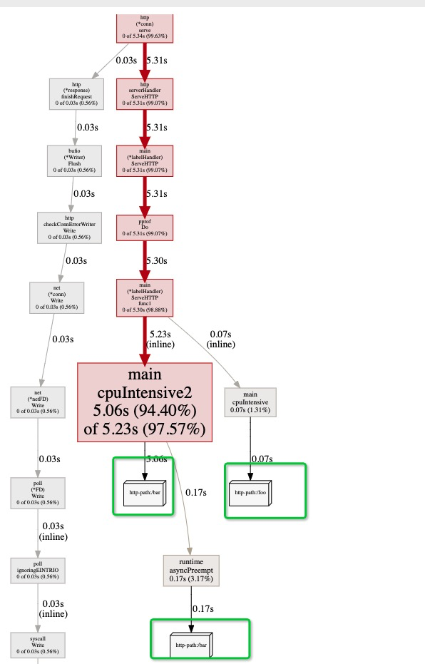
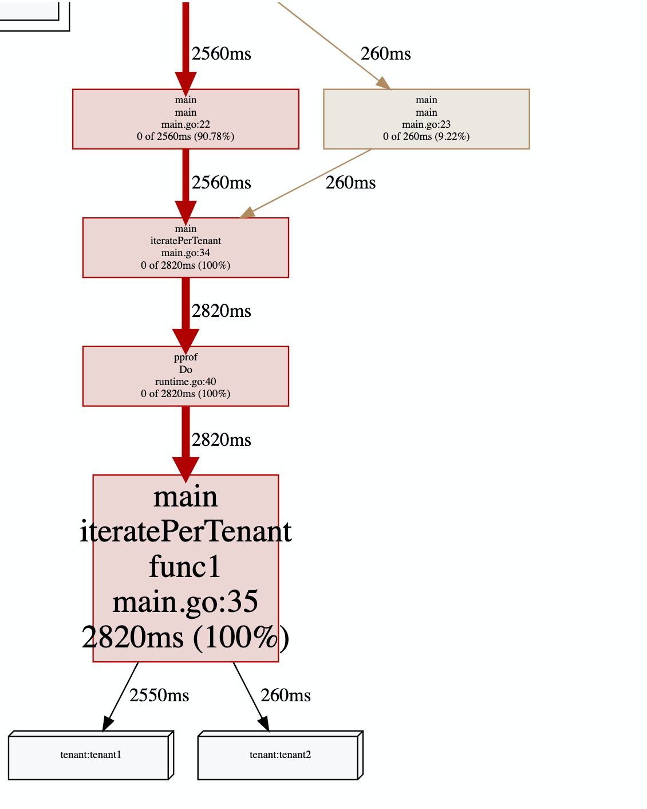
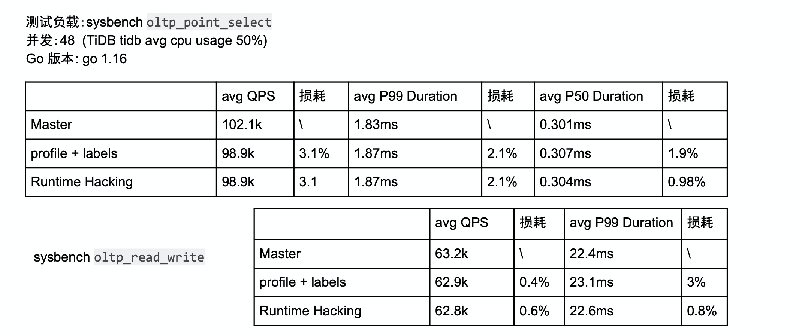
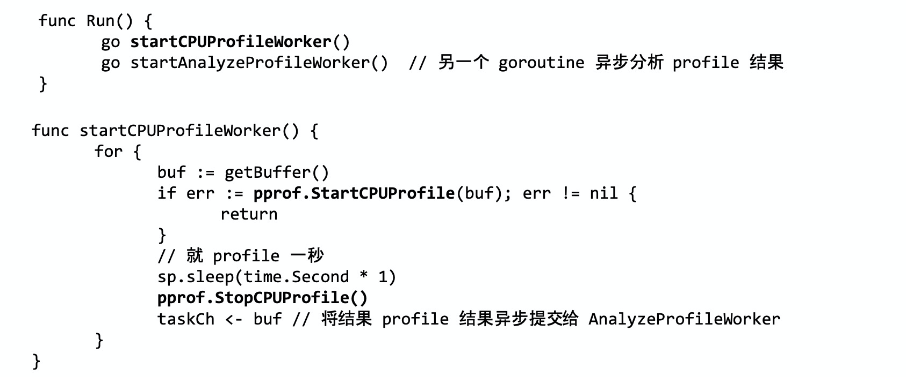
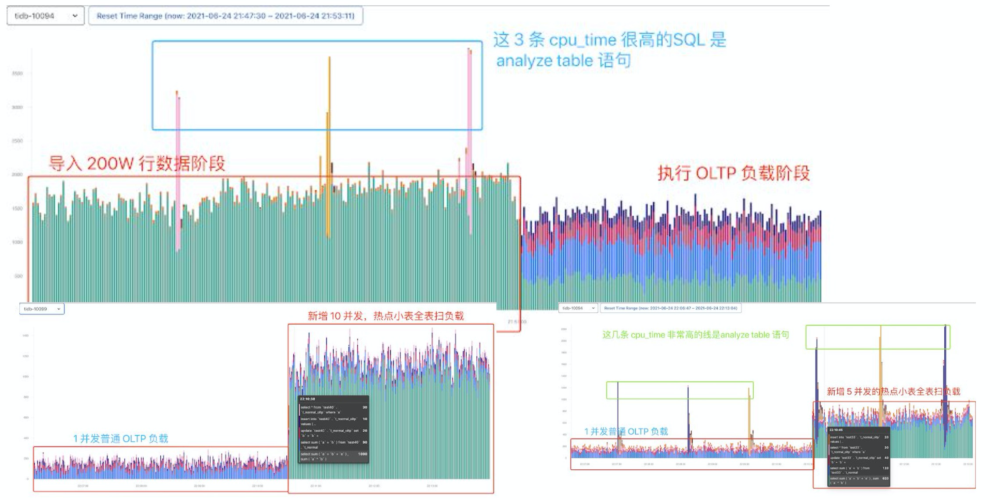

# Go的profile label能解决什么问题？

Go语言内置的CPU profile([Go性能分析工具指南--pprof](https://mp.weixin.qq.com/s/TRQ_vwYuqXnuFLYAGbxlQA))能看出哪些函数占用的CPU比较高，但是如果我们想知道这个占比高的函数来自于哪里，这就需要翻自己代码甚至就搞不清楚是谁调用的了。本篇文章就介绍profile label极其应用场景。


## profile label介绍

先来看下最终的效果：



从上图中能看到`main.cpuIntensive2`和`runtime.asyncPreempt`都属于*http-path:/bar*这个标签，`main.cpuIntensive`属于*http-path:/foo*这个标签。这是用的pprof 1.9之后提供的Do方法：

```go
func Do(ctx context.Context, labels LabelSet, f func(context.Context))
```

来看下在代码中怎么实现的：

```go
func main() {
	go func() {
		log.Fatal(http.ListenAndServe(":6060", nil))
	}()

	c, _ := net.Listen("tcp", ":8082")
	log.Fatal(http.Serve(c, &labelHandler{}))
}
func (l *labelHandler) ServeHTTP(w http.ResponseWriter, r *http.Request) {
	labels := pprof.Labels("http-path", r.URL.Path)
	pprof.Do(r.Context(), labels, func(ctx context.Context) {
		switch r.URL.Path {
		case "/foo":
			cpuIntensive()
		case "/bar":
			cpuIntensive2()
		}
	})
}

func cpuIntensive() {
	for i := 0; i < 1e7; i++ {}
}

func cpuIntensive2() {
	for i := 0; i < 1e9; i++ {}
}
```

就是这么简单，在命令行还有一些比较有趣的工具，比如我们查看一共有多少个tag：

```shell
(pprof) tags
 http-path: Total 5.3s
              5.2s (98.68%): /bar
            70.0ms ( 1.32%): /foo
```

只看某个tag：

```go
(pprof) tagfocus="http-path:/foo"
(pprof) tags
 http-path: Total 70.0ms
            70.0ms (  100%): /foo

(pprof) top10 -cum
Active filters:
   tagfocus=http-path:/foo
Showing nodes accounting for 70ms, 1.31% of 5360ms total
      flat  flat%   sum%        cum   cum%
         0     0%     0%       70ms  1.31%  main.(*labelHandler).ServeHTTP
         0     0%     0%       70ms  1.31%  main.(*labelHandler).ServeHTTP.func1
      70ms  1.31%  1.31%       70ms  1.31%  main.cpuIntensive (inline)
         0     0%  1.31%       70ms  1.31%  net/http.(*conn).serve
         0     0%  1.31%       70ms  1.31%  net/http.serverHandler.ServeHTTP
         0     0%  1.31%       70ms  1.31%  runtime/pprof.Do
```

忽略某个tag：

```shell
(pprof) tagignore="http-path:/foo"
(pprof) tags
TagHide expression matched no samples
 http-path: Total 5.2s
            5.2s (  100%): /bar

(pprof) top10 -cum
TagHide expression matched no samples
Active filters:
   tagignore=http-path:/foo
Showing nodes accounting for 5.23s, 97.57% of 5.36s total
Dropped 16 nodes (cum <= 0.03s)
Showing top 10 nodes out of 17
      flat  flat%   sum%        cum   cum%
         0     0%     0%      5.27s 98.32%  net/http.(*conn).serve
         0     0%     0%      5.24s 97.76%  main.(*labelHandler).ServeHTTP
         0     0%     0%      5.24s 97.76%  net/http.serverHandler.ServeHTTP
         0     0%     0%      5.24s 97.76%  runtime/pprof.Do
         0     0%     0%      5.23s 97.57%  main.(*labelHandler).ServeHTTP.func1
     5.06s 94.40% 94.40%      5.23s 97.57%  main.cpuIntensive2 (inline)
     0.17s  3.17% 97.57%      0.17s  3.17%  runtime.asyncPreempt
         0     0% 97.57%      0.03s  0.56%  bufio.(*Writer).Flush
         0     0% 97.57%      0.03s  0.56%  internal/poll.(*FD).Write
         0     0% 97.57%      0.03s  0.56%  internal/poll.ignoringEINTRIO (inline)
```


不仅仅是这样，我们还能看不同label在同一个函数上执行的时间，比如（from [Demystifying Pprof Labels with Go](https://www.polarsignals.com/blog/posts/2021/04/13/demystifying-pprof-labels-with-go/)）：




## 性能和场景

关于性能怎么样，这肯定是会问的问题。我第一次听说这个功能还是在tidb的一次分享中，他们做了真实的压测，如下：



可以看到，使用了profile label最多会损失3%左右的性能，在[Demystifying Pprof Labels with Go](https://www.polarsignals.com/blog/posts/2021/04/13/demystifying-pprof-labels-with-go/)中透露出来的数据差不多。

除了上面常规的手段，tidb通过profile label统计SQL的执行时间，个人觉得这种方式还是很值得借鉴的，他们思路如下：

1、 在 SQL 解析器完成解析后，生成 SQL 的指纹信息(SQL Digest)

2、 生成带着这个 Digest 的 Context 

3、 对当前的SQL使用profile label

具体做法如下：



最后的结果如下：




## 总结

profile label的实现还算简单，核心代码就下面一行：

```go
//go:linkname runtime_setProfLabel runtime/pprof.runtime_setProfLabel
func runtime_setProfLabel(labels unsafe.Pointer) {
	getg().labels = labels
}
```

pprof本质上是通过`runtime.GoroutineProfile()`读goroutine的栈进行分析，两者一结合就是我们看到pprof的图了。


总结一下cpu profile的优缺点：

优点：

1、在可视化工具中暴露的不是冷冰冰的函数，而是自定义标签

2、 方便排查问题

3、 区分来源，比如一个函数从http过来的流量占用多少、从mq消费占用多少

缺点：

1、 就像在[Go程序如何查看一个请求中各个函数的真实占比?](https://github.com/helios741/myblog/blob/new/learn_go/src/2021/11/fgprof/README.md)中说的，pprof是基于采样的（默认100ms一次），有一定的误差；

2、 只支持cpu pprof，不支持I/O等off cpu的profile

3、 最高3%的性能损耗，

## 参考

https://rakyll.org/profiler-labels/

https://www.polarsignals.com/blog/posts/2021/04/13/demystifying-pprof-labels-with-go/

https://github.com/golang/proposal/blob/master/design/17280-profile-labels.md

