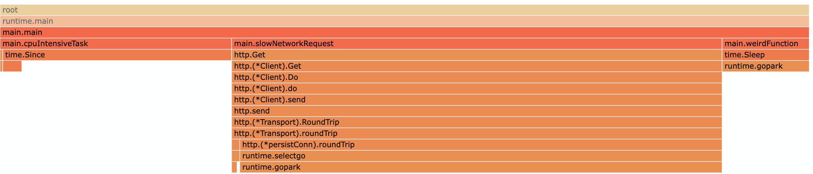

# Go程序如何查看一个请求中各个函数的真实占比？


最近排查问题，真的看到Go语言工具的缺陷甚至叫缺失。其实以前也介绍过[pprof](https://mp.weixin.qq.com/s/TRQ_vwYuqXnuFLYAGbxlQA)和[trace](https://mp.weixin.qq.com/s/0J3t7c4-DqRxcNQv0bEGlQ)，这俩一个能看宏观问题，一个能看微观问题，宏观就代表不准确，微观就意味着性能差（请求的时候对线上服务有影响，文件down下来之后文件图像太复杂电脑处理不过来）。今天介绍个能看真实请求中各个函数占比工具fgprof（性能大神Felix Geisendörfer出品）。


## 官方内置pprof：on cpu

我们喜闻乐见的CPU pprof只能看查看**在一段时间内某个函数在CPU上浪费的时间**，但是对于互联网公司的服务大多都是I/O服务，一个请求CPU占用的并不高，更高的是I/O。比如下面的例子([from](https://github.com/felixge/fgprof/blob/master/example/main.go))

```go
func main() {
  // ... 不重要程序的省略
	for {
		// 网络请求，会比较慢
		slowNetworkRequest()
		// CPU密集的计算
		cpuIntensiveTask()
		// 乱七八糟的函数
		weirdFunction()
	}
}

```

我们使用Go内置的cpu pprof看下（go tool pprof -http=:9876 http://localhost:6060/debug/pprof/profile?seconds=10）：


这个就比较扯，mian函数都是执行cpu密集的函数了，其他的都没了。但是我们通过time看下每个函数的真实执行时间：

```go
slowNetworkRequest duration: 3078ms
cpuIntensiveTask duration: 1440ms
weirdFunction duration: 512ms
```

和火焰图有很大不同。


## 什么是off-cpu

我们知道官方内置的pprof，只能看goroutine在CPU上运行的时间，即running状态，其他的状态均不会统计，如下图：


<center>from go-profiler-notes</center>

这和CPU的线程调度是同样的原理。如果想知道off cpu其实和知道on cpu的原理一样，通过采样的方式读取当前所有goroutine（runtime.GoroutineProfile），然后分析状态。


## 我们要的是on CPU + off cpu

回到我们的题目“如何查看一个请求中各个函数的真实占比？”，fgprof这个库就解决了我们的问题，我们先来看下如何使用：

```go
http.DefaultServeMux.Handle("/debug/fgprof", fgprof.Handler())
go func() {
		log.Println(http.ListenAndServe("localhost:6060", nil))
}()
```

和开启官方pprof一样简单，我们打开火焰图看一下（go tool pprof -http=:9876 http://localhost:6060/debug/fgprof?seconds=3）：



这个占比就符合我们通过time打出来的真实占比了。


## 再谈Go程序的分析工具

官方的pprof是基于采样的，默认是100HZ即10ms一次，只能看出长时间的大概全貌，根本分析不了个例，所以uber内部搞了个pprof++，微秒级采样（[pprof++: A Go Profiler with Hardware Performance Monitoring](https://eng.uber.com/pprof-go-profiler/)）但是这是基于改了runtime的，基本没看到哪个公司有用。uber已经给官方提了proposal（[Proposal: hardware performance counters for CPU profiling.](https://go.googlesource.com/proposal/+/refs/changes/08/219508/2/design/36821-perf-counter-pprof.md#5-empirical-evidence-on-the-accuracy-and-precision-of-pmu-profiles)），在Hold阶段还没到Accept，什么时候这类更精准的工具能出现在官方里面还不知道猴年马月。


Go本身不太适用CPU密集服务，但是CPU profile label却能很好的定位到哪个函数浪费的CPU比较高，是个好工具，也看到有公司真实使用。


再回归内存方面，Go一直没解决内存引用如何排查的问题，fgprof的作者在[go-profiler-notes](https://github.com/DataDog/go-profiler-notes/blob/main/guide/README.md#memory-profiler-limitations)中也表示对此无能为力，被大佬推荐过[cmd/viewcore](https://github.com/golang/debug/tree/master/cmd/viewcore)，但是还没有完善，我最近也没有研究。


最后就是runtime暴露出来的hook是太少了，根本没办法植入自己代码（link方式这种官方不推荐的方式不说了），有的时候一个问题出现了，能根据理论猜到是调度的问题，但是如果想实践证明的话，就必须改runtime代码，甚至改网络模型。还有比如我有100个goroutine，完全不能知道状态，只能通过link runtime代码的方式hack出来。


## 总结

