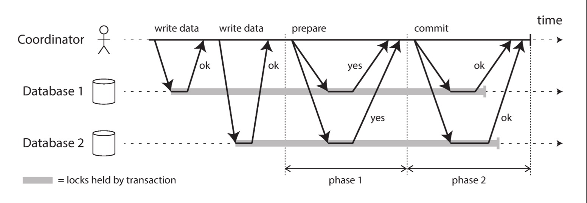
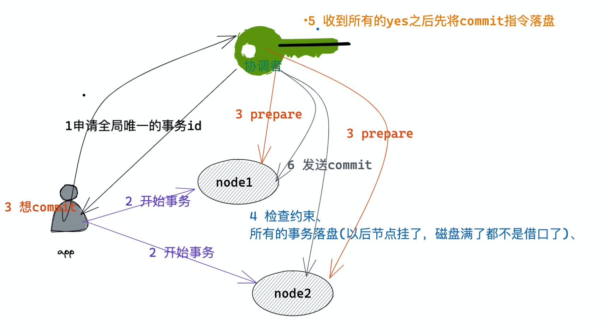

# 两阶段提交的得与失

本文也是DDIA的读书笔记，但是因为第九章的内容实在太多，放在一篇里面总结不过来，所以就拆开来总结。

在日常开发过程中，我们都比较熟悉mysql那种单机的事务，即先写日志到磁盘然后提交事务（commit），如果在commit之前写日志之后机器crash了，那么等机器恢复回来的时候能继续提交，否则就回滚。但是在分布式的环境中变得复杂了，有可能出现下面的状况：

1、 一些节点在提交的时候检测到有冲突或者违反了约束

2、 一些节点因为网络原因超时，最终导致回滚了

3、 一些节点在提交之前crash了，恢复之后回滚了

上面的情况都会导致数据一直（一些节点提交成功，一些节点提交失败）。根据上面的情况我们总结出在分布式的情况下保证原子性需要具备的几个条件：

1、 提交之前不会出现约束或者冲突问题

2、 不会被网络影响

3、 节点恢复后保证一致性

我们来看看2PC如何解决上述问题的吧。

## 2PC如何保证原子性

2PC通过引入协调者来将数据的写入分为prepare和commit/abort两个阶段。

这张图就展示了2PC的两个阶段：

1、 prepare阶段：协调者发送prepare指令给所有的参与者，问他们是否能提交，有一个返回no就执行回滚

2、 commit/abort阶段：如果都返回yes那么就发送commit

我把整个过程（六步）通过一张图阐述了一下：

0、 应用要开启一个事务

1、 向协调者申请一个全局唯一的事务id

2、 应用在每个节点上开启事务（附带着刚才生成的全局事务id）

3、 当应用想要提交的时候，告诉协调者去处理，协调者先给所有节点发送prepare指令（通过全局事务id标志）

4、 节点收到prepare指令之后，检查自己是否能够提交，然后把事务的数据先写到磁盘，这样有两个好处，第一是comit指令来了能很快执行、第二是如果在commit阶段写数据的话，磁盘不够用了也没办法回滚了

5、 协调者如果接收的响应都是yes提交commit执行，否则提交abort指令

6、 如果节点挂了迟迟不能响应，那么协调者会**死等**

## 2PC的容错处理

容错分为两部分，第一部分是参与节点挂了，我们在上述的第6步也说了，协调者会死等。还有一部分是协调者挂了（协调者是单点）怎么处理，我们也来分阶段看一下：

1、 如果在发送prepare之前挂了：没啥关系，回滚呗，反正谁也没影响

2、 在prepare之后，commit之前：协调者只能死等commit/abort，如下图：

所以说发送任何日志之前写日志，恢复的时候也容易。

## 2PC的问题

2PC可以说是满足CAP中的CP，即强一致性。在某一个事务的过程中，只要有一个节点挂了那么这个事务只能等到节点恢复。还有就是2PC过程中的第4步，每次prepare都会将事务的commit和abort的操作都准备好（写日志），这也是比较耗费资源和性能的。

我们会在下一篇文章中通过3PC解决2PC的问题，但是会引入新的问题，希望大家不要期待。

## 总结

我们回过头来看2PC怎么解决开头的三个问题中前两个的：

1、 将写数据分为prepare和commit，在prepare阶段检查了唯一约束等

2、 网络可以说是忽略不计了，用时髦的话说“都用了2PC了，就别管响应时间了”

3、 在一次事务过程中任意一个阶段挂了，都会导致事务不能完成，需要**死等**

