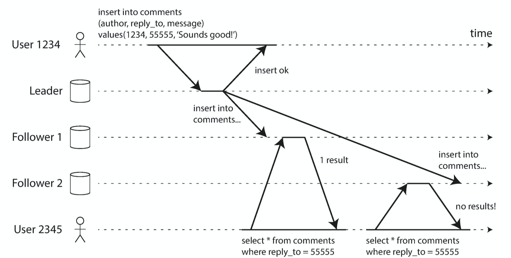
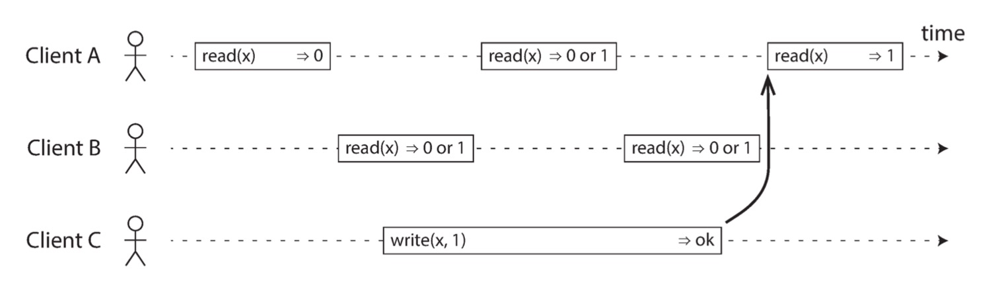
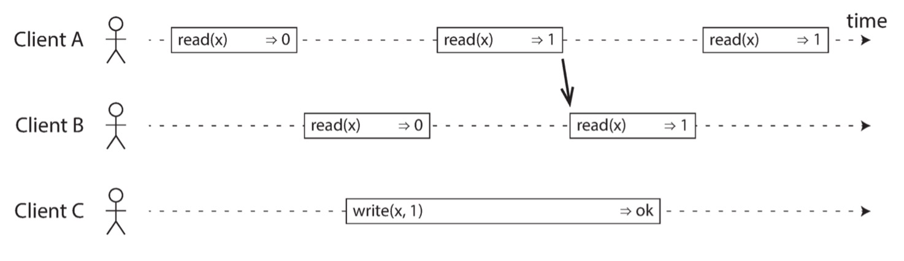
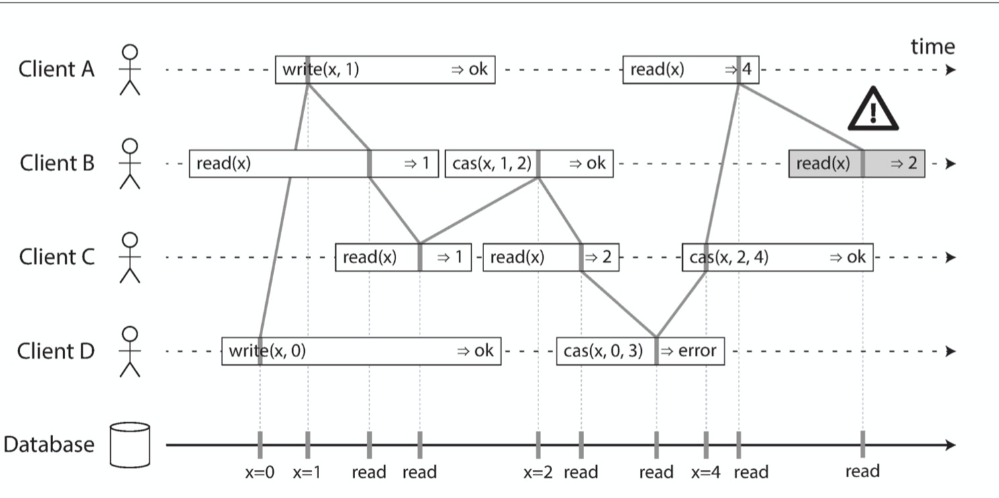
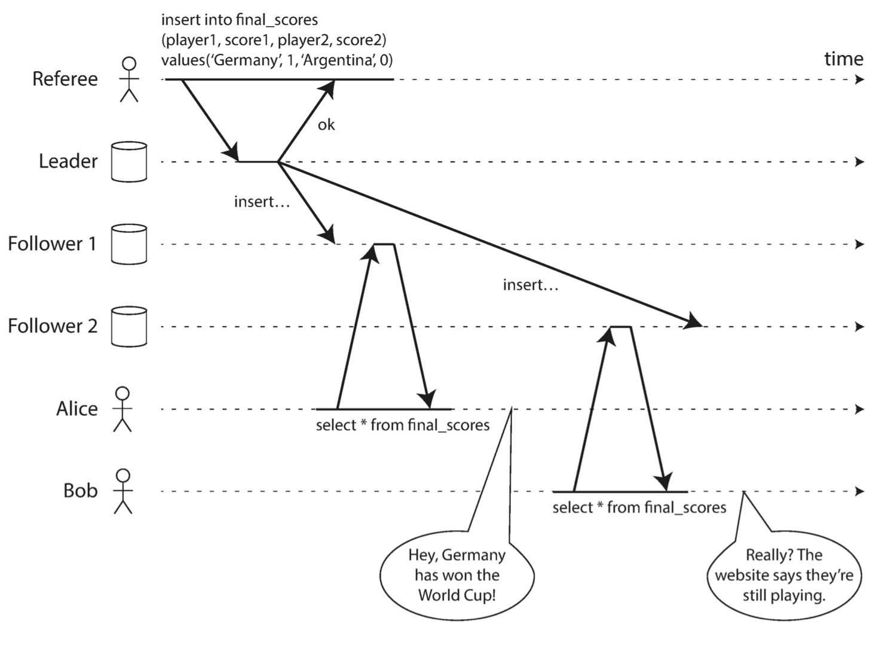
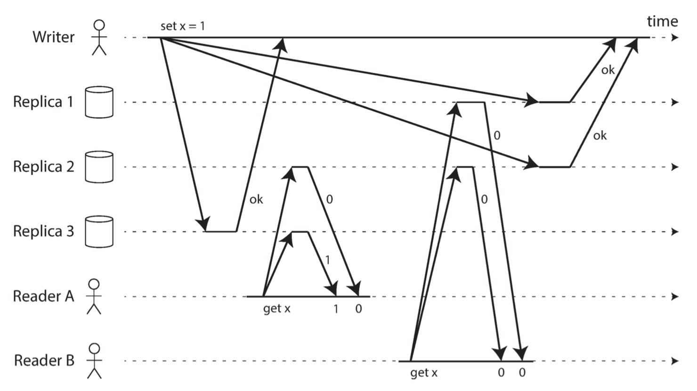
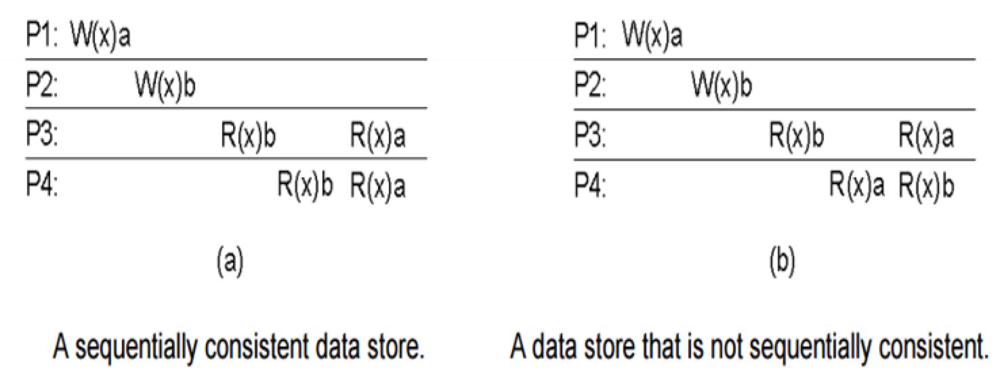

# 为什么分布式系统需要保证Linearizability

Linearizability（线性一致性）也叫做强一致性，等读完本篇文章你就知道他有多“强”。

## 什么是Linearizability？

Linearizability的含义是**只要有一个client读到了x的较新版本（V0），那么以后所有client读取到的x，它的版本不能小于V0**。如果你初次读可能读不懂，甚至感觉是一句废话。理解这句话需要你理解最终一致性，我们在[DDIA读书笔记（三）: 如何保证数据同步时的可靠性](https://github.com/helios741/myblog/blob/new/learn_go/src/2021/09/ddia_3/README.md)提到的半同步复制就是最终一致性的典型代表，我们在来看看他有什么问题：

对于已经提交的数据，从不同的节点上读到的数据可能是新的也可能是旧的。

你也可以停下脚步想想这么解决这个问题？tips：在分布式环境中时间不可靠，见[DDIA读书笔记（五）: 分布式系统需要面对的问题](https://github.com/helios741/myblog/blob/new/learn_go/src/2021/10/ddia_5/README.md)。

我们看下面一张图：

x初始值为0，在client C将x设置为1的过程中client A请求了x一次，clientB请求了x两次，这就导致了读写并发，所以client A的第二次请求和client B的请求都是未知，返回0和1都可以。

我们来看下，怎么样满足线性一致性：

在读写并发的过程中，clientA读取到了x的最新值1，那么后续的所有读取都不能是0。

再来看个不符合Linearizability的例子（图中上下交错的线代表实现先后）：

我们能看到client B的最后一次读是不符合Linearizability，因为client A已经提前读到了最新数据。

## 非Linearizability会造成什么问题？

来看下面的例子：

本来世界杯已经结束了，Alice已经看到分数，Bob还没有看到，需要多次刷新，这也是最终一致性导致的。

tips：最终一致性的“最终”说的太含糊了，也没告诉人“最终”是多长时间，也就在工程上还可行。

## Linearizability能做什么？

1、 分布式锁或者选主：当一个节点成为主节点的时候，所有人读到的都是一样的（写可以通过CAS，读的方式各有不同，zk通过sync()， etcd通过读去r个节点）

2、 唯一性：用户名在系统中是唯一的

3、 因果性质：看球的那个例子

## 如何保证Linearizability？

| 分类       | Linearizability状况       | 原因                                                         |
| ---------- | ------------------------- | ------------------------------------------------------------ |
| 单主       | 可能Linearizability       | 多主和非同步复制容易造成错读；区分读类型，Linearizability读走主库 |
| 一致性算法 | Linearizability           | 能处理脑裂和副本上没有最新数据问题                           |
| 多主       | 完全不保证Linearizability | 多主同时写，异步复制，因为有冲突决策的过程，完全不保证Linearizability |
| 无主       | 有时不是Linearizability   | 通过同时读多个副本保证的到最新的，但是依赖时间，以及在并发的情况下出现race |

对于出现race的多主不是Linearizability，用下图解释下：

writer需要写到3个节点，但是在写的过程中，Reader A和Reader B并发去读，先请求的Reader A读到了已经更新的节点，后请求的Reader B读到的全是旧节点，这就不符合Linearizability。

## 为什么一些系统不实现Linearizability？

想象一下每个CPU都有自己的memory cache和寄存器，一个core去写同一块内存另一个core去读这块内存需不需要保证Linearizability？

答案是没有保障的，原因也很简单，就是因为浪费性能。如果了解raft或者paxos就知道完成一次请求需要两次网络请求。

## Linearizability有多强？

可以说是分布式一致性里面要求最高的一种，能和他比肩的只有全同步复制的mysql，但是性能比较差又不能容错。

**前缀一致性**：前面踢球的例子，就是不要出现跨时空的例子，“前缀”这个名字确实让人难以理解。

**因果一致性**：在聊天系统常用到，只要保证聊天的因果就行。

**顺序一致性**：可以理解为不关怎么样的执行顺序，最后能得到结果就行，主要在CPU领域，比如下图：

## 总结

很多人不理解事务和一致性的区别：前者解决并发读写；后者解决副本状态同步。

其实Linearizability理解起来很简单，就是让客户端感受不到分布式的存在，即每次读写都是针对同一个副本。让客户端看起来是同一个副本是通过分布式共识算法解决的，现在市面上比较流行的paxos和raft，这个后续会单独分析。

