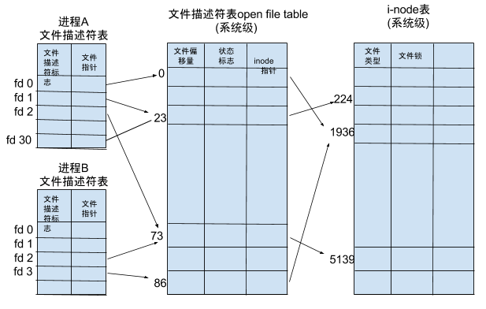

# 进程间如何传递fd？


## 什么是fd

大家肯定都或多或少的知道什么是fd（file describer），当调用open系统调用的时候会返回int类型的值，这个文件即可以理解为是这个文件的ID，也可理解为操作这个文件的句柄（当然理解为后者更好，前者类比的不恰当）。

那么我们在深入的问自己下面的几个问题：

1、 文件描述符到底是进程级别还是系统级别？

2、 文件描述符和inode之间的关系？

我们先来回答“文件描述符到底是进程级别还是系统级别？”，我们可以看一个例子：

```go
func main() {
  f1, _ := os.Open("/root/go/a.txt")
  f2, _ := os.Open("/root/go/a.txt")
  fmt.Println(int(f1.Fd()), f2.Fd())
  time.Sleep(time.Second * 60 * 50)
}
```

我们同时启动两次，来看看分别输出什么，都是输出的`3 5`，我们看到打开第一个文件输出的3，自然的想到前面的0、1、2去哪了？然后在回忆一下我们*要把一个命令的输出/错误输出到一个文件中*怎么搞？

是不是使用形如`command 2>a.log`这样的命令。所以这就引出了三个全局的文件描述符（除了他们都是进程级别的了）：

| 名字     | fd   | 缩写   |
| -------- | ---- | ------ |
| 标准输入 | 0    | stdiin |
| 标准输出 | 1    | stdout |
| 保准错误 | 2    | stderr |

我们再把这个问题深挖一下，**fd怎么对应到真实的文件的呢？**，首先需要科普一下Linux文件系统的结构(图from [introduction-to-the-linux-virtual-filesystem-vfs](https://www.starlab.io/blog/introduction-to-the-linux-virtual-filesystem-vfs-part-i-a-high-level-tour))：


VFS的存在相当于为上层提供统一的接口，下层能对接任意的存储，比如ext系列、nfs、xfs等。inode存放的是文件的metadata，比如权限，大小是多大，占多少个块等，这个结构相当大。TODO，贴inode的结构。

VFS还要具有快速**通过文件名得到inode**的能力，总不能把所有的inode都缓存下来吧，这谁也受不了了呀，所以就有了dentry（directory entry），他是一个承上启下的结构，能通过文件名快速得到inode，VFS会把尽量多的dentry缓存下来，即dentry cache。

现在我们对文件系统有了初步的认识，我们在回过头来看*应用拿到的fd和具体负责存储的inode之间的关系*，看下图（from[文件描述符（File Descriptor）简介](https://segmentfault.com/a/1190000009724931)）：




我们通过open拿到的是一个指针，指向的是全局由kernel维护的file table，这个里面记录着文件以什么*mode*被打开以及指向的inode。


https://stackoverflow.com/questions/13378035/socket-and-file-descriptors


https://www.computerhope.com/jargon/f/file-descriptor.htm

https://stackoverflow.com/questions/5256599/what-are-file-descriptors-explained-in-simple-terms

https://www.starlab.io/blog/introduction-to-the-linux-virtual-filesystem-vfs-part-i-a-high-level-tour

https://www.kernel.org/doc/html/latest/filesystems/vfs.html

多态

https://www.bottomupcs.com/file_descriptors.xhtml

## 如何在进程间传递fd

像nginx、envoy重启的时候都是会先fork一个子进程出来，然后这个子进程默认继承了父进程的文件描述符，TODO nginx怎么做的优雅重启。

但是如果子进程要给父进程传递，或者两个不相关的进程传递就需要采用IPC，将文件描述符的指针传递过去了。read/write这种最基本的I/O函数解决不了传递控制数据（TODO 英文叫啥），这个时候recv/send和recvmsg/sendmsg就呼之欲出了，这里我们只介绍recvmsg/sendmsg，因为它是recv/send加强版，能够给内核传递的参数更多。我们主要来看下功能最强大的sendmsg（send、send以及sendmsg之间的差别可以看[recv(2) ](https://man7.org/linux/man-pages/man2/recvmsg.2.html)和[send(2)](https://man7.org/linux/man-pages/man2/sendmsg.2.html)）

```c
ssize_t sendmsg(int sockfd, const struct msghdr *msg, int flags);
ssize_t recvmsg(int sockfd, struct msghdr *msg, int flags);
```


主要来看msghdr这个结构：

```c
struct msghdr {
   void         *msg_name;       /* Optional address */
   socklen_t     msg_namelen;    /* Size of address */
   struct iovec *msg_iov;        /* Scatter/gather array */
   size_t        msg_iovlen;     /* # elements in msg_iov */
   void         *msg_control;    /* Ancillary data, see below */
   size_t        msg_controllen; /* Ancillary data buffer len */
   int           msg_flags;      /* Flags (unused) */
};
```

能够通过msg_control传递不常见的协议头、文件描述符以及unix认证信息等（老版本的叫msg_accrights）。这里就不过多说，有兴趣的请看《unix网络编程卷1: API》的14.5章，讲的很详细。


现在我们知道通过socket传递不仅能传递payload数据还能传递附加数据（也叫控制数据），现在我们能写代码开搞了。


https://stackoverflow.com/questions/28003921/sending-file-descriptor-by-linux-socket

小加餐：

类unix系统提供了5组I/O相关的函数，如下：


## 在Go中实现进程传递fd

我们实现如下：

1、 进程A监听9087端口对外提供服务

2、 进程B监听`/tmp/sock.sock`文件，接受其他进程（这里只有进程A）传递过来已经listen文件描述符，继续进行accept处理

3、 进程A监听Interrupt信号，收到信号将监听9087端口的文件描述符传递给B进程，然后退出

4、 最后B进程监听9087端口对外提供服务

我们先看一下执行流程：

1、 启动a程序,并确认

```shell
lsof -i:9087
COMMAND   PID   USER   FD   TYPE             DEVICE SIZE/OFF NODE NAME
a       82703 helios    5u  IPv6 0xd805aa2d675a920f      0t0  TCP *:9087 (LISTEN)
```

2、 启动b程序

3、 通过nc localhost 9087和a程序沟通

```shell
nc localhost 9087
aaa
a process response
aaa
a process respons
```

4、通过kill -2 a进程的pid，触发链接迁移，能观察到两个现象：步骤三的链接断了以及9087是由b程序监听的了，如下：

```shell
COMMAND   PID   USER   FD   TYPE             DEVICE SIZE/OFF NODE NAME
b       82725 helios    8u  IPv6 0xd805aa2d675a920f      0t0  TCP *:9087 (LISTEN)
b       82725 helios    9u  IPv6 0xd805aa2d675a920f      0t0  TCP *:9087 (LISTEN)
```

5、 再通过nc localhost 9087就是和b程序进行沟通了

```shell
nc localhost 9087
aaa
b process response
aaa
b process respons
```


我们先来看下a的代码：

```go
const sock = "/tmp/sock.sock"
func main() {
	l, _ := net.Listen("tcp", ":9087")
	defer l.Close()
  // 监听信号
	ch := make(chan os.Signal, 1)
	signal.Notify(ch, os.Interrupt)
  // 开启迁移链接的goroutine
	go transferConn(ch, l.(*net.TCPListener))
	for {
		c, err := l.Accept()
		if err != nil {
			log.Println(err)
			break
		}
		go func() {
			for {
				var buf = make([]byte, 1)
				c.Read(buf)
				c.Write([]byte("a process response\n"))
			}
		}()

	}
}

func transferConn(ch <-chan os.Signal, l *net.TCPListener) {
	<-ch
	log.Print("start transfer listener")
	c,err := net.Dial("unix", sock)
  
	unixConn := c.(*net.UnixConn)
	linstenFile, err := l.File()

	rights := syscall.UnixRights(int(linstenFile.Fd()))
	var buf = make([]byte, 1)
  
	unixConn.WriteMsgUnix(buf, rights, nil)
	fmt.Println("ending transfer listener")
	l.Close()
}
```


syscall.UnixRights就是相当于填充的`msghdr.msg_control`字段。

再来看看b程序：

```go
const sock = "/tmp/sock.sock"
func main() {
	_ = syscall.Unlink(sock)
	l , _ := net.Listen("unix", sock)
	log.Print("listen " + sock)
	defer l.Close()
	recvListener(l.(*net.UnixListener))
}

func recvListener(unixListener *net.UnixListener) {
	unixConn, _ := unixListener.AcceptUnix()
	defer unixConn.Close()
	var (
		buf = make([]byte, 1)
		oob = make([]byte, 1024)
	)
	_, oobn, _, _, _ := unixConn.ReadMsgUnix(buf, oob)
	scms, _ := unix.ParseSocketControlMessage(oob[0:oobn])

	recvFds, _ := unix.ParseUnixRights(&scms[0])

	recvFile := os.NewFile(uintptr(recvFds[0]), "")

	recvFileListener, _ := net.FileListener(recvFile)

	recvListener := recvFileListener.(*net.TCPListener)

	for {
		conn, _ := recvListener.Accept()
		go func() {
			for {
				var buf = make([]byte, 1)
				conn.Read(buf)
				conn.Write([]byte("b process response\n"))
			}
		}()

	}
}
```

其实看下来挺清晰的，属于不看不知道一看就会的那种。


https://man7.org/linux/man-pages/man3/cmsg.3.html

https://stackoverflow.com/questions/28003921/sending-file-descriptor-by-linux-socket


## 总结

本文就先到这了，