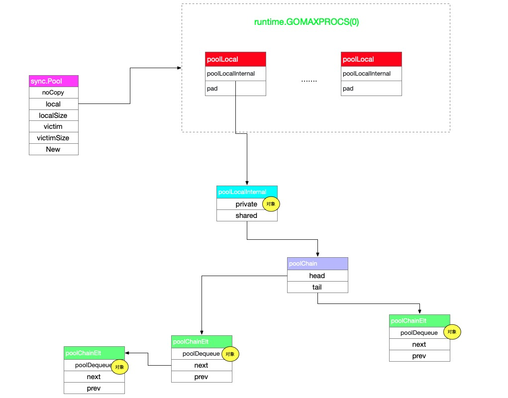

# sync.Pool做性能优化有哪些问题


在工作中发现很多人对sync.Pool的理解还是不够，我总结了以下几个常见的问题，如果你能回答出为什么那么证明你对sync.Pool已经有了一定的理解，如果不能都回答上来，可以花几分钟阅读一下本文。

1、 sync.Pool里面的元素是只增不减的么？

2、 可不可以通过全局对象自己实现pool替代sync.Pool？有哪些问题？

3、 优化GC常见方式是减少对象个数（小对象合并为大对象、减少堆上对象分配）来缓解标记的压力，sync.Pool也是优化的标记阶段么？

4、为什么sync.Pool不提供一个len()方法告诉我们pool里面还有多少个元素?

5、 Pool中的元素是slice有什么需要注意的


## 为什么会有sync.Pool

我们在[Go的fasthttp快的秘诀：简单事情做到极致](https://github.com/helios741/myblog/blob/new/learn_go/src/2021/09/fasthttp_priciple/README.md)中说到fasthttp把总结出性能优化的一条建议“**通过测试看pprof哪里有内存分配，然后通过sync.Pool进行优化**”。

其实sync.Pool的主要作用就是优化，优化对象申请时和堆上对象太多对GC造成的压力（如果对这句话不理解可以继续往下看）。

它里面存在的对象可能会被清除，sync.Pool利用GC比较巧妙的实现了类似LRU的功能，当然这个LRU还是比较原始（如果不理解怎么实现的可以往下看，因为这一节是我最后写的）。


以及他是并发安全的。

## sync.Pool的原理


### 数据结构

先来通过下图有个大致的印象，后面通过Get和Put方法把这张图串起来。




先看左上角的sync.Pool对象我们能够得到下面三个信息：

1、 sync.Pool是不能复制的

2、 local虽然不知道是啥，但应该是个slice，localSize表示local里面有多少个元素，victim同理

3、 New函数是初始化要提供的，即当Get为nil的时候调用的

·

local和victim的类型是一样的，类型是`[P]poolLocal`，P就是runtime中processer的数量（如果不熟悉可以看[Go scheduler这十年](https://github.com/helios741/myblog/blob/new/learn_go/src/2021/08/go_scheduler_history/README.md)和[从一个问题看go scheduler执行流程](https://mp.weixin.qq.com/s/0EM9ZTdJgVbgP3Dwfr51bQ)），我们后续在说为什么这么设计。


然后就到了`poolLocal.poolLocalInternal`，里面有两个字段分别是private和shared

- private只有一个对象，加上G已经固定在了P上，只有当前的P会访问这个字段，所以不用加锁
- shared是一个无锁链表，可能当前的P访问也可能被其他的P访问（其他的P没有了就来steal）


### local 和victim的关系

如果你熟悉CPU cache的话看到victim可能会想到victim cache，sync.Pool的victim就是借鉴的CPU victim cache，这里为了后续好理解简单说一下CPU victim cache原理：以CPU的L1 cache举例，L1 cache miss之后会重填，但是这次重填可能是错误的，victim cache的作用是减少cache miss误填损失，所以把L1 miss的先存到victim cache中（victim cache可以理解为在L1和L2之间），当误填之后要把上一次的拿回来的时候就不用一层层的着了，直接在victim cache中返回了。


### Get的原理

Get的流程本质上就是优先级的问题，优先级的标准就是拿到对象的速度，首先是相当于L1cache的local字段，不加锁的private肯定最快，然后从自己的队列中拿，从别人队列中拿最慢，L1 cache（local）中找不到就去L2 cache即victim中拿，逻辑和从local中 拿的逻辑一样。完成流程如下：

1、 将当前的G和P进行绑定（禁止抢占、GC）

2、 如果private不为nil，将G和P接绑，返回

3、 如果private等于nil，从shared中拿，如果能拿到，将G和P接绑，返回

4、 如果shared中为空，从其他的P的local偷一个，如果能偷到，将G和P接绑，返回

5、 如果从其他的P的local偷不到，从本P的victim的private字段中拿，如果能拿到，将G和P接绑，返回

6、 如果从本P的victim的private字段中拿不到，从本P的victim的shared中pop一个，如果能拿到，将G和P接绑，返回

7、 如果从本P的victim的shared为空，那么从其他的P的victim中偷，如果能偷到，将G和P接绑，返回

8、 如果上述都没拿到，那么就先将G和P接绑，判断有没有New方法，如果有就返回New方法的执行结果，没有就返回nil


```go
func (p *Pool) Get() interface{} {
	// 1、 将当前的G和P进行绑定（禁止抢占、GC）
	l, pid := p.pin()
	x := l.private
  // 2、 如果private不为nil，将G和P接绑，返回
	l.private = nil
	if x == nil {
		// 3、 如果private等于nil，从shared中拿，如果能拿到，将G和P接绑，返回
		x, _ = l.shared.popHead()
		if x == nil {
			x = p.getSlow(pid)
		}
	}
  // 8、 如果上述都没拿到，那么就先将G和P接绑，判断有没有New方法，如果有就返回New方法的执行结果，没有就返回nil
	runtime_procUnpin()
	if x == nil && p.New != nil {
		x = p.New()
	}
	return x
}

func (p *Pool) getSlow(pid int) interface{} {
	size := atomic.LoadUintptr(&p.localSize) // load-acquire
	locals := p.local                        // load-consume
  // 4、 如果shared中为空，从其他的P的local偷一个，如果能偷到，将G和P接绑，返回
	for i := 0; i < int(size); i++ {
		l := indexLocal(locals, (pid+i+1)%int(size))
		if x, _ := l.shared.popTail(); x != nil {
			return x
		}
	}

	size = atomic.LoadUintptr(&p.victimSize)
	if uintptr(pid) >= size {
		return nil
	}
	locals = p.victim
	l := indexLocal(locals, pid)
  // 5、 如果从其他的P的local偷不到，从本P的victim的private字段中拿，如果能拿到，将G和P接绑，返回
	if x := l.private; x != nil {
		l.private = nil
		return x
	}
  // 6、 如果从本P的victim的private字段中拿不到，从本P的victim的shared中pop一个，如果能拿到，将G和P接绑，返回
	//7、 如果从本P的victim的shared为空，那么从其他的P的victim中偷，如果能偷到，将G和P接绑，返回
	for i := 0; i < int(size); i++ {
		l := indexLocal(locals, (pid+i)%int(size))
		if x, _ := l.shared.popTail(); x != nil {
			return x
		}
	}
	atomic.StoreUintptr(&p.victimSize, 0)
	return nil
}
```


如果你熟悉调度调度的话，差不多也是这个流程。


### Put的原理

因为shared是个链表可以无限扩展，所以就比较简单了，如果private为nil那就往private中放，如果不为空那就放在shared中。

```go
func (p *Pool) Put(x interface{}) {
	if x == nil {
		return
	}
	l, _ := p.pin()
	if l.private == nil {
		l.private = x
		x = nil
	}
	if x != nil {
		l.shared.pushHead(x)
	}
	runtime_procUnpin()
}
```

不用多解释


### 如何做到将G和P绑定的

这里将G和P绑定不是，让G拥有执行权力，而是让这个P只能运行当前G，即不能抢占，GC也不能。

```go
func (p *Pool) pin() (*poolLocal, int) {
	pid := runtime_procPin()
	s := atomic.LoadUintptr(&p.localSize) // load-acquire
	l := p.local                          // load-consume
	if uintptr(pid) < s {
		return indexLocal(l, pid), pid
	}
  // 只会走到这里一次
	return p.pinSlow()
}

func procPin() int {
	_g_ := getg()
	mp := _g_.m

	mp.locks++ // 最重要的一行
	return int(mp.p.ptr().id)
}
```

在STW的时候会进行判断(_g_.m.locks不为0就不能STW，要等它unlock)：

```go
func stopTheWorldWithSema() {
	_g_ := getg()

	if _g_.m.locks > 0 {
		throw("stopTheWorld: holding locks")
	}
  // ...
}
```


抢占在1.14之后有两个点：一是基于信号的另一个是基于协同的也就是在函数调用的时候，他们最终都会调用canPreemptM，这个函数名一看就知道什么，能不能抢占呗，我们在来看看函数体：

```go
func canPreemptM(mp *m) bool {
	return mp.locks == 0 
  && mp.mallocing == 0 
  && mp.preemptoff == "" 
  && mp.p.ptr().status == _Prunning
}
```

第一条就是`mp.locks == 0`所以说，mp.locks!=0是不能触发抢占的。

我们目前为止还没看到local在哪初始化的，这就是pinSlow的功劳了：

```go
func (p *Pool) pinSlow() (*poolLocal, int) {
	// 操作全局变量要加锁
	allPoolsMu.Lock()
	defer allPoolsMu.Unlock()
  
	s := p.localSize
	l := p.local
	// 证明是首次创建，将当前的pool塞到全局allPools中，方便清理
	if p.local == nil {
		allPools = append(allPools, p)
	}
	
  // 创建local，原子保存
	size := runtime.GOMAXPROCS(0)
	local := make([]poolLocal, size)
	atomic.StorePointer(&p.local, unsafe.Pointer(&local[0])) // store-release
	atomic.StoreUintptr(&p.localSize, uintptr(size))         // store-release
	return &local[pid], pid
}

```


### GC的时候pool在做什么


sync.Pool中的local和victim的关系如下：

1、 当发生GC的时候把victim中的元素清空

2、 将local 中的元素移动到victim中，结束GC

3、 当下一次Get的时候，发现local中没有从victim中拿，避免重新生成新对象


在调用sync/pool.go中的init方法会把GC时候需要做的事情，通过runtime_registerPoolCleanup(runtime.sync_runtime_registerPoolCleanup)注册进去。

```go
func init() {
	runtime_registerPoolCleanup(poolCleanup)
}

func poolCleanup() {

  // 把victim中的元素清空
	for _, p := range oldPools {
		p.victim = nil
		p.victimSize = 0
	}

	// 将local 中的元素移动到victim中
	for _, p := range allPools {
		p.victim = p.local
		p.victimSize = p.localSize
		p.local = nil
		p.localSize = 0
	}

	// 以便下次使用
	oldPools, allPools = allPools, nil
}
```

GC时候具体执行的函数是`gcStart -> clearpools`:

```go
var poolcleanup func()

func sync_runtime_registerPoolCleanup(f func()) {
	poolcleanup = f
}

func clearpools() {
	if poolcleanup != nil {
		poolcleanup()
	}
}
```


⏰现在解决了文章开始的第一个问题和第四个问题（“ **sync.Pool里面的元素是只增不减的么？**”、“**为什么sync.Pool不提供一个len()方法告诉我们pool里面还有多少个元素?**”），因为pool中的元素是可能被GC掉的，自然里面的长度会减少，计算长度的话需要STW，并且没有什么意义。


### sync.Pool为什么要这么设计

一切都是为了性能，减少锁的压力无非两种：一是有锁变无锁、大锁拆小锁到最后遍无锁。

我们简单来看下[1.12 sync.Pool](https://github.com/golang/go/blob/go1.12.17/src/sync/pool.go)的设计，来看看官方怎么优化演进的:

```go
type Pool struct {
	noCopy noCopy

	local     unsafe.Pointer // local fixed-size per-P pool, actual type is [P]poolLocal
	localSize uintptr        // size of the local array

	New func() interface{}
}
type poolLocalInternal struct {
	private interface{}   // Can be used only by the respective P.
	shared  []interface{} // Can be used by any P.
	Mutex                 // Protects shared.
}

```

第一就是没次操作shared需要加锁，但是调用runtime_procPin的时候不能使用mutex，因为可能会造成死锁，所以没次使用mutex还要runtime_unprocPin（这问题我会在后面具体解释）。

第二是没有victim优化，我们结合注册到GC清理的函数来看：

```go
func poolCleanup() {
	for i, p := range allPools {
		allPools[i] = nil
		for i := 0; i < int(p.localSize); i++ {
			l := indexLocal(p.local, i)
			l.private = nil
			for j := range l.shared {
				l.shared[j] = nil
			}
			l.shared = nil
		}
		p.local = nil
		p.localSize = 0
	}
	allPools = []*Pool{}
}
```

每一次GC，一股脑的把所有的元素都干掉了，这就导致性能特别低，官方的这次[sync: use lock-free structure for Pool stealing](https://github.com/golang/go/commit/d5fd2dd6a17a816b7dfd99d4df70a85f1bf0de31#diff-491b0013c82345bf6cfa937bd78b690d)就是做出了咱们前面讲的重大的一步，性能提升很大：

```shell
name                 old time/op     new time/op     delta
Pool-12                 3.00ns ± 0%     2.21ns ±36%  -26.32%  (p=0.000 n=18+19)
PoolOverflow-12          600ns ± 1%      587ns ± 1%   -2.21%  (p=0.000 n=16+18)
PoolSTW-12              71.0µs ± 2%      5.6µs ± 3%  -92.15%  (p=0.000 n=20+20)
PoolExpensiveNew-12     3.14ms ± 5%     3.69ms ± 7%  +17.67%  (p=0.000 n=19+20)

name                 old p50-ns/STW  new p50-ns/STW  delta
PoolSTW-12               70.7k ± 1%       5.5k ± 2%  -92.25%  (p=0.000 n=20+20)

name                 old p95-ns/STW  new p95-ns/STW  delta
PoolSTW-12               73.1k ± 2%       6.7k ± 4%  -90.86%  (p=0.000 n=18+19)

name                 old GCs/op      new GCs/op      delta
PoolExpensiveNew-12       0.38 ± 1%       0.39 ± 1%   +2.07%  (p=0.000 n=20+18)

name                 old New/op      new New/op      delta
PoolExpensiveNew-12       33.9 ± 6%       40.0 ± 6%  +17.97%  (p=0.000 n=19+20)
```


⏰这解决了文章开始的第二个问题（“**可不可以通过全局对象自己实现pool替代sync.Pool？有哪些问题？**”），因为我们自己实现肯定要加锁（ 就算自己实现无锁也要用两次CAS，有的时候压测下来可能还不如Mutex），不能像标准库那样充分利用runtime的能力。


## sync.Pool的问题


### 1、 内存长时间不回收

先来看段代码（from [#23199](https://github.com/golang/go/issues/23199)）：

```go
func main() {
	pool := sync.Pool{New: func() interface{} { return new(bytes.Buffer) }}

	processRequest := func(size int) {
		b := pool.Get().(*bytes.Buffer)
		time.Sleep(500 * time.Millisecond) // 模拟处理时间
		b.Grow(size)
		pool.Put(b)
		time.Sleep(1 * time.Millisecond) // 模拟空闲时间
	}

	// 向Pool中Put是个256M的
	for i := 0; i < 10; i++ {
		go func() {
			processRequest(1 << 28) // 256MiB
		}()
	}

	time.Sleep(time.Second) 

	// 向Pool中Put是个1K大小的
	for i := 0; i < 10; i++ {
		go func() {
			for {
				processRequest(1 << 10) // 1KiB
			}
		}()
	}

	// 持续触发GC看什么时候内存降低
	var stats runtime.MemStats
	for i := 0; ; i++ {
		runtime.ReadMemStats(&stats)
		fmt.Printf("Cycle %d: %dB\n", i, stats.Alloc)
		time.Sleep(time.Second)
		runtime.GC()
	}

}
```

当执行35次GC之后，内存才降低下来：

```go
Cycle 30: 537018704B
Cycle 31: 148640B
```

如果你向pool中put 1000个1k大小的，那么内存持续的时间会更长。

### 2、 频繁GC导致Pool被清空

我们在前面看到了1.13相比于1.12在GC方面的变化，1.12只要GC所有的元素将被清空，1.13是如果一个在pool中的元素连续两次GC都没有被Get出来，那么就会被清空，比如：

```go
func main() {
	a := sync.Pool{}
	a.Put("dsdsd")

	runtime.GC()
	runtime.GC()
	fmt.Println(a.Get())
}
```

根据咱上面的介绍，我们能看出这是输出nil，但是感觉还是太频繁了，两次GC可能在一分钟就完成了。

### 3、 频繁创建sync.Pool


我们通过pinSlow知道了每次创建一个sync.Pool，都会想全局的allPools中append一个，再来回顾一下pinSlow：

```go
func (p *Pool) pinSlow() (*poolLocal, int) {
	runtime_procUnpin()
	allPoolsMu.Lock()
	defer allPoolsMu.Unlock()
	pid := runtime_procPin()
  // ...
  if p.local == nil {
		allPools = append(allPools, p)
	}
  // ...
}
```

能看到需要先将G和P解除固定，然后申请这把全局锁allPoolsMu，以后遇到一个请求创建一个sync.Pool的时候就要注意了，并发上不去的原因可能是因为这里有把大锁。那么下一个问题来了，为什么加锁之前要把G和P解除固定呢。我们假设三个条件：

- 只有一个Process（P）；
- 有两个goroutine，分别是G1和G2
- 一个全局的mutex，m1

G1获取到了m1，之后被调度走了，G2得到了执行权，并且调用procUnpin和P绑定，然后G2也要获取m1，但是G1被执行了，所以就死锁了。所以保证每次加锁的顺序是一致的，即先拿锁，再调用procUnpin。

1.13的问题比较严重，因为local上的shared也是有锁的，就导致每次操作shared之前要先unprocUnpin，然后加锁，但是GC清理的时候是不加锁的，所以就可能导致race。这个问题让我想起了gin.Context中的Keys字段，他提供的Set和Get方法（里面有锁操作）还把Keys设置为大写，个人认为是个设计失误，当然现在已经骑虎难下了[Context.reset should be locked against keys](https://github.com/gin-gonic/gin/issues/2874)和[context.Keys should be private](https://github.com/gin-gonic/gin/issues/2873) 。


### 4、 buffer pool的最佳实践


⏰这解决了文章开始的第五个问题（“**Pool中的元素是slice有什么需要注意的**”） ，因为是slice底层的数组可能占用的空间比较大，导致长时间内存不回收，看起来像内存泄漏。


## 总结

⏰对于文章最开始的第三个问题（“**优化GC常见方式是减少对象个数（小对象合并为大对象、减少堆上对象分配）来缓解标记的压力，sync.Pool也是优化的标记阶段么？**”），池化在性能要求高的场景中很常用，最重要的是减少分配速度，如果池化的是连接的话节省建连的时间，在Go这种带GC的场景中，节省对象分配就是节省标记阶段，将对象是用完Put会pool中就是减少的清扫阶段。


GC频繁可能并不是适合用。


内存分级、锁分级别


