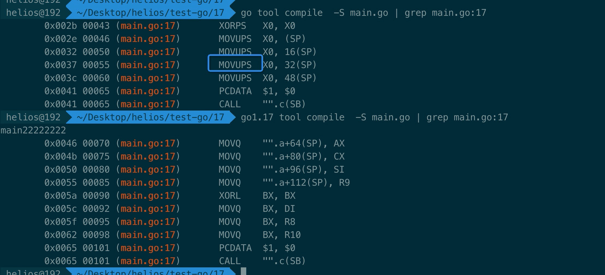
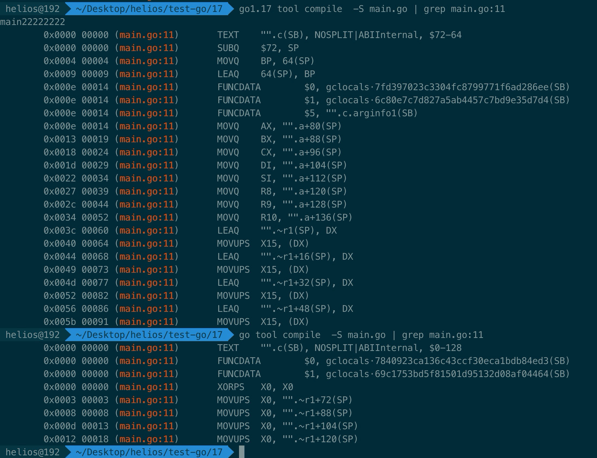
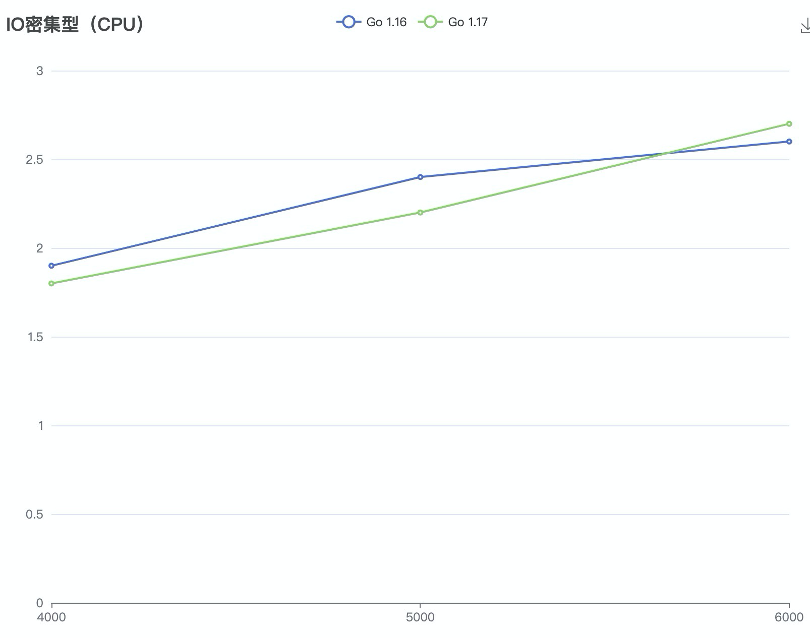
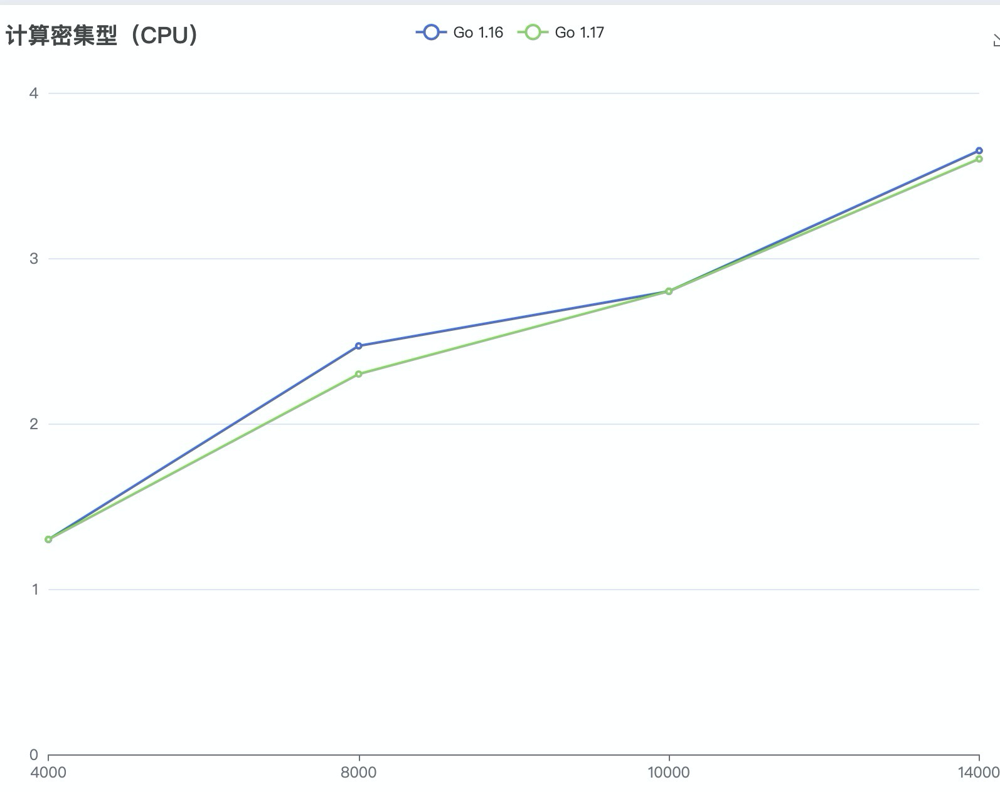

# GO 1.17调用规约到底优化了多少

最近因为工作上的需要，对Go1.17的调用规约进行了解，希望对于想把服务升级到1.17+的朋友有所帮助。

最近因为工作上的需要，对Go1.17的调用规约进行了解，希望对于想把服务升级到1.17+的朋友有所帮助。

从本文你会得到：

1、 什么是调用规约

2、 为什么Go要从基于栈的调用规约切换为基于寄存器的调用规约

3、 Go如何实现的

4、 我还会通过benchmark、IO密集和计算密集对比给出真实结果

5、一些对这次改动的评价


先说结论，官网说优化了5%，真实效果也确实也只有5%，甚至者5%还是有条件的比如说达到4KQPS之后，但5%在真实情况真的很难看出，下面我们就一起来看看吧

## 什么是调用规约

这是比较细节和底层的东西，我们可以想两个问题：

1、 当函数A带着3个int类型的实参调用函数B（A(e, f, g ) -> B(e, f, g int)）的时候，3个参数放在哪？

2、 为什么同为编译完的二进制，Go和C之间不能相互调用？

这个两个问题都指向了调用规约，第一个是调用规约是什么，第二个是如何实现调用规约的。


CPU访问寄存器比访问内存要快两个数量级，对于函数传参这么频繁的操作大多数语言都是用平台的寄存器，但有一个缺点就是**平台太多，兼容起来太麻烦**。但堆栈内存是自己能控制的，所以存取内存的方式虽然慢但能用。这个思路有点像java怎么解决语言跨平台问题一样，再抽一层呗

基于寄存器/平台的调用规约又分为Caller-saved registers 和 Callee-saved registers两种：

- Caller-saved registers：也叫易失性寄存器，用来保存不需要跨函数传递的参数,比如A(q, w) -> B(q, w int) -> C(w int)，也就是说寄存器保存的值在保证程序正确的情况下会发生变化
-  Callee-saved registers：持久性寄存器，调用方调用函数之后存储在寄存器的值不会变（不会让被调用方改掉），因为需要持久保存对于带GC的语言又是一个挑战。

为什么要有 Callee-saved registers呢，最典型的就是保存调用栈。你可能对这Caller-saved registers 和 Callee-saved registers有点云里雾里，后面会做进一步的讲解。

## Go为什么要替换调用规约


### 为什么以前不实现

1、 懒：寄存器毕竟和平台绑定，就难免要支持跨平台（1.17也只支持amd64、arm64、ppc），如果都在栈上操作那就天生跨平台

2、 难：如果要实现Callee-saved registers就要和GC配合，**[dr2chase](https://github.com/dr2chase)** 还吐槽Haskell都放弃使用Callee-saved registers


### 实现过程中遇到什么问题

因为[Go1兼容性规范](https://go.dev/doc/go1compat)中并没有规定汇编规范，所以要实现基于寄存器的调用规约会面临三个选择：

1、 break老的汇编代码

2、 给定一个周期兼容时间，让代码迁移

3、 支持两种汇编规范


第一个方案看着就不靠谱，我们写业务代码常用的是第二个方案，但因为用汇编写的代码，诸如数学计算类的长时间不会动，所以只能选择第三个方案。

所以自从Go 1.17之后有两套汇编规范，针对汇编代码编写者称为ABI0，对于Go代码编写者称为ABIInternal。


这里还要说一个趣闻，Go 1.11就写了基于寄存器的调用规约的proposal，但是有两个吐槽比较好玩：

1、 “才5%？还没 intel优化了栈操作效果好，还是想想把函数内联吧”

2、 “怎么保证调用栈呢，我就是因为Go的调用栈好用才用Go的”

对于第二个讨论有兴趣的朋友可以看一下，还是能学到很多东西的 [#18597#issuecomment-271762436](https://github.com/golang/go/issues/18597#issuecomment-271762436)

顺便说一些，Go1.17针对调用栈的参数显示也优化了，将参数分开显示了：


## 验证


函数参数和返回值对于int类型只用了9个寄存器分别是：

```asm
RAX, RBX, RCX, RDI, RSI, R8, R9, R10, R11
```

我们可以通过下面代码验证一下：

```go
package main

import "fmt"

//go:nosplit
func i(a, b, c, d, e, a0, b0, c0, d0,e0 int64 ) (int64, int64, int64, int64, int64, int64, int64, int64, int64, int64) {
	fmt.Println(e0)
	return a, b, c, d, e, a0, b0, c0, d0,e0
}

func main() {
	i(1,2,3,4,5,6,7,8,9,111)
}

```

对Go版本1.16和1.17分别做编译看下结果(第12行为main函数中的调用)：


我们能看到：

1、 Go1.16 都是在栈上传递的

2、 Go 1.17有9个参数通过寄存器传递，剩下一个在栈上传递。


对于float类型也是类似的，只不过float类型用的寄存器更多了，是从X0到X14一共15个，所以可以通过下面的代码测试：

```go
package main

import "fmt"

//go:nosplit
func i(a, b, c, d, e, a0, b0, c0, d0,e0, f, f0, g, g0, h0, h2, h1 float64 ) (float64,float64,float64, float64, float64, float64, float64, float64, float64, float64, float64, float64) {
	fmt.Println(a, b, c, d, e, a0, b0, c0, d0,e0, f, f0, g, g0, h0, h1)
	return a, b, c, d, e, a0, b0, c0, d0,e0, f, f0
}

func main() {
	i(1.0,2.0,3.0,4.0,5.0,6.0,7.0,8.0,9.0,10.0,11.0,12.0,13.0,14.0,15.0,16.0,17.0)
}
```


你可能会问，为什么我知道整型类型有九个寄存器，float类型有15个呢，因为文档写的 [Architecture specifics](https://go.googlesource.com/go/+/refs/heads/dev.regabi/src/cmd/compile/internal-abi.md#amd64-architecture),你可能会继续追问为什么整型只用9个寄存器？

这9个寄存器也是个测试值，并不是理论值，官方团队用v18.8版本的kubelet做了一次看了下寄存器利用率([Appendix: Register usage analysis](https://go.googlesource.com/go/+/refs/heads/dev.regabi/src/cmd/compile/internal-abi.md#appendix_register-usage-analysis))，如下表：

```go
|      |        |       |      stack args |          spills |     stack total |
| ints | floats | % fit | p50 | p95 | p99 | p50 | p95 | p99 | p50 | p95 | p99 |
|    0 |      0 |  6.3% |  32 | 152 | 256 |   0 |   0 |   0 |  32 | 152 | 256 |
|    0 |      8 |  6.4% |  32 | 152 | 256 |   0 |   0 |   0 |  32 | 152 | 256 |
|    1 |      8 | 21.3% |  24 | 144 | 248 |   8 |   8 |   8 |  32 | 152 | 256 |
|    2 |      8 | 38.9% |  16 | 128 | 224 |   8 |  16 |  16 |  24 | 136 | 240 |
|    3 |      8 | 57.0% |   0 | 120 | 224 |  16 |  24 |  24 |  24 | 136 | 240 |
|    4 |      8 | 73.0% |   0 | 120 | 216 |  16 |  32 |  32 |  24 | 136 | 232 |
|    5 |      8 | 83.3% |   0 | 112 | 216 |  16 |  40 |  40 |  24 | 136 | 232 |
|    6 |      8 | 87.5% |   0 | 112 | 208 |  16 |  48 |  48 |  24 | 136 | 232 |
|    7 |      8 | 89.8% |   0 | 112 | 208 |  16 |  48 |  56 |  24 | 136 | 232 |
|    8 |      8 | 91.3% |   0 | 112 | 200 |  16 |  56 |  64 |  24 | 136 | 232 |
|    9 |      8 | 92.1% |   0 | 112 | 192 |  16 |  56 |  72 |  24 | 136 | 232 |
|   10 |      8 | 92.6% |   0 | 104 | 192 |  16 |  56 |  72 |  24 | 136 | 232 |
|   11 |      8 | 93.1% |   0 | 104 | 184 |  16 |  56 |  80 |  24 | 128 | 232 |
|   12 |      8 | 93.4% |   0 | 104 | 176 |  16 |  56 |  88 |  24 | 128 | 232 |
|   13 |      8 | 94.0% |   0 |  88 | 176 |  16 |  56 |  96 |  24 | 128 | 232 |
|   14 |      8 | 94.4% |   0 |  80 | 152 |  16 |  64 | 104 |  24 | 128 | 232 |
|   15 |      8 | 94.6% |   0 |  80 | 152 |  16 |  64 | 112 |  24 | 128 | 232 |
|   16 |      8 | 94.9% |   0 |  16 | 152 |  16 |  64 | 112 |  24 | 128 | 232 |
|    ∞ |      8 | 99.8% |   0 |   0 |   0 |  24 | 112 | 216 |  24 | 120 | 216 |

```

1、 第一列ints代表int类型寄存器的数量

2、 第二列floats代表float类型寄存器的数量

3、第三列 % fit代表，所有函数参数和返回值使用寄存器占所有函数的百分比

4、 第四大列的stack args代表栈上参数占用的字节数的分布

5、 第五大列的spills代表寄存器溢出到栈上的字节数（也叫stack spill/register spill），我们马上详细讲解这个专业名词

6、 第六大列的stack total代表栈上参数和溢出到栈上的参数的字节数的分布


我们以下面这一行举例说一下：

```shell
|      |        |       |      stack args |          spills |     stack total |
| ints | floats | % fit | p50 | p95 | p99 | p50 | p95 | p99 | p50 | p95 | p99 |
|    4 |      8 | 73.0% |   0 | 120 | 216 |  16 |  32 |  32 |  24 | 136 | 232 |
```

1、 有4个int类型寄存器

2、 8个float类型寄存器

3、 整个项目中73%的函数参数和返回值都用了寄存器

4、 栈参数的中位数是0字节，95线是120字节，99线是216字节

5、 溢出到栈上参数的字节数的中位数是16字节，95线是32字节，99线是32字节

6、 栈上参数+溢出到栈上参数的字节数的中位数是24字节、95线是136字节、99线是232字节


那到底什么是stack spill/register spill呢？

一个寄存器（比如AX），如果长时间存放某个值不适用就会被踢栈上。


[图片来源](https://twitter.com/badamczewski01/status/1389280268553437186)

参考：[Register allocation](https://en.wikipedia.org/wiki/Register_allocation)

## benchmark对比

我们针对传递int类型、float类型、指针类型以及struct的复合类型分别做对比。

具体的benchmak都行如下面（具体代码保存原文同级别目录也有）：

```go
//go:noinline
func  a3(x int, y int, z int) (int, int, int) {
 return 1, 2, 3
}

func  BenchmarkFuncCallArgInt_3(b *testing.B) {
 for i := 0; i < b.N; i++ {
  a3(1, 2, 3)
 }
}
```


### 1、 传递int

Go 1.16

```go
cpu: Intel(R) Core(TM) i5-8257U CPU @ 1.40GHz
BenchmarkFuncCallArgInt_10-8    197345972            6.400 ns/op
BenchmarkFuncCallArgInt_6-8     275689269            3.859 ns/op
BenchmarkFuncCallArgInt_3-8     544959565            2.276 ns/op
BenchmarkFuncCallArgInt_2-8     724137768            1.651 ns/op
BenchmarkFuncCallArgInt_1-8     907504747            1.308 ns/op
BenchmarkFuncCallArgInt_0-8     854896220            1.382 ns/op
```

Go 1.17

 ```go
cpu: Intel(R) Core(TM) i5-8257U CPU @ 1.40GHz
BenchmarkFuncCallArgInt_10-8    556026169            2.068 ns/op
BenchmarkFuncCallArgInt_6-8     795388822            1.505 ns/op
BenchmarkFuncCallArgInt_3-8     873116008            1.373 ns/op
BenchmarkFuncCallArgInt_2-8     880141797            1.371 ns/op
BenchmarkFuncCallArgInt_1-8     862857952            1.373 ns/op
BenchmarkFuncCallArgInt_0-8     877538526            1.378 ns/op
 ```

我们能看出参数大于三个的时候Go1.17开始有优势（3个的时候提升40%、两个参数的时候提升17%、），参数越多优势越大。


### 2、 传递float

Go1.16:

```go
cpu: Intel(R) Core(TM) i5-8257U CPU @ 1.40GHz
BenchmarkFuncCallArgFloat_1-8       798791694            1.462 ns/op
BenchmarkFuncCallArgFloat_2-8       799546022            1.516 ns/op
BenchmarkFuncCallArgFloat_3-8       723911224            1.652 ns/op
BenchmarkFuncCallArgFloat_4-8       625198116            1.923 ns/op
BenchmarkFuncCallArgFloat_5-8       549270934            2.192 ns/op
BenchmarkFuncCallArgFloat_6-8       460452596            2.581 ns/op
BenchmarkFuncCallArgFloat_10-8      317902225            3.621 ns/op
BenchmarkFuncCallArgFloat_12-8      290892694            4.172 ns/op
```

Go1.17:

```go
cpu: Intel(R) Core(TM) i5-8257U CPU @ 1.40GHz
BenchmarkFuncCallArgFloat_1-8       862094103            1.367 ns/op
BenchmarkFuncCallArgFloat_2-8       868269909            1.368 ns/op
BenchmarkFuncCallArgFloat_3-8       875840653            1.373 ns/op
BenchmarkFuncCallArgFloat_4-8       872852518            1.369 ns/op
BenchmarkFuncCallArgFloat_5-8       868719580            1.369 ns/op
BenchmarkFuncCallArgFloat_6-8       869848005            1.380 ns/op
BenchmarkFuncCallArgFloat_10-8      814550560            1.481 ns/op
BenchmarkFuncCallArgFloat_12-8      726688816            1.643 ns/op
```

和传递int类似，当参数数量超过四个的时候Go1.17性能开始明显（比Go1.16快554），参数越多性能越好（到12个参数的时候是Go1.16的2.5倍）。


### 3、 传递指针类型

Go1.16:

```go
cpu: Intel(R) Core(TM) i5-8257U CPU @ 1.40GHz
BenchmarkFuncCallArgStructPoint_1-8     845252186            1.380 ns/op
BenchmarkFuncCallArgStructPoint_2-8     871882693            1.373 ns/op
BenchmarkFuncCallArgStructPoint_3-8     727379673            1.656 ns/op
BenchmarkFuncCallArgStructPoint_4-8     626422644            1.917 ns/op
BenchmarkFuncCallArgStructPoint_5-8     547643278            2.191 ns/op
BenchmarkFuncCallArgStructPoint_6-8     487094554            2.469 ns/op
```


Go1.17:

```go
cpu: Intel(R) Core(TM) i5-8257U CPU @ 1.40GHz
BenchmarkFuncCallArgStructPoint_1-8     1000000000           1.117 ns/op
BenchmarkFuncCallArgStructPoint_2-8     875706432            1.370 ns/op
BenchmarkFuncCallArgStructPoint_3-8     875135346            1.372 ns/op
BenchmarkFuncCallArgStructPoint_4-8     876438380            1.376 ns/op
BenchmarkFuncCallArgStructPoint_5-8     839175356            1.378 ns/op
BenchmarkFuncCallArgStructPoint_6-8     879851916            1.374 ns/op
```

和前面两种情况呈现相同的趋势。


### 4、 传递复合类型

Go1.16:

```go
cpu: Intel(R) Core(TM) i5-8257U CPU @ 1.40GHz
BenchmarkFuncCallArgStruct_1-8      312620082            3.853 ns/op
BenchmarkFuncCallArgStruct_2-8      168719047            7.133 ns/op
BenchmarkFuncCallArgStruct_3-8      100000000           10.42 ns/op
BenchmarkFuncCallArgStruct_4-8      86800783            14.00 ns/op
BenchmarkFuncCallArgStruct_5-8      69975651            17.26 ns/op
BenchmarkFuncCallArgStruct_6-8      57820992            20.74 ns/op
```

Go1.17:

```go
cpu: Intel(R) Core(TM) i5-8257U CPU @ 1.40GHz
BenchmarkFuncCallArgStruct_1-8      140532529            8.517 ns/op
BenchmarkFuncCallArgStruct_2-8      100000000           10.75 ns/op
BenchmarkFuncCallArgStruct_3-8      79530900            14.67 ns/op
BenchmarkFuncCallArgStruct_4-8      62777088            18.89 ns/op
BenchmarkFuncCallArgStruct_5-8      49993473            23.68 ns/op
BenchmarkFuncCallArgStruct_6-8      42413120            27.95 ns/op
```

为什么会反直觉呢？写了个简单程序实验一下：

```go
//
package main
 
type ProfileForm struct {
 AppID   string                `form:"appID" binding:"required"`
 WxAppID string `form:"wxAppID" binding:"required"`
 Type string `form:"type" binding:"required"`
 Description string `form:"description" binding:"required"`
}
//go:noinline
func  c(a ProfileForm) (ProfileForm) {
 return a
}
 
func main() {
 a := ProfileForm{}
 c(a)
}
```

汇编后的代码发现：

调用方汇编代码对比




被调用方汇编代码对比：



可能存在两方面：

1、 MOVUPS有连续内存优化

2、 1.17执行的指令太多了


## IO密集和计算密集对比

我们对分别是IO和计算密集性的服务进行压测看看效果，如果你也经过真实压测的话，看数据会觉得没有差距，但是用图表表现出来真的有5%左右的提升，这5%有的时候还是有条件的。


### 1、 IO密集性



确实会有5%左右的性能提升，但用肉眼看出太难了。

### 2、 计算密集性



**Go1.17基本和Go1.16持平，在4KQ～8KQ的时候会有5%左右的提升。**


## 总结

其实基于寄存器的调用规约在Go1.11已经提出来了，在1.17才上线，证明中间Go团队经过多少的努力，尤其是处理汇编代码不兼容问题。但是结果带来了5%的性能提升，可能还不如intel优化栈操作来的实际，所有好多人吐槽，“要只提升5%，不如考虑考虑将所有代码内内联吧”。


