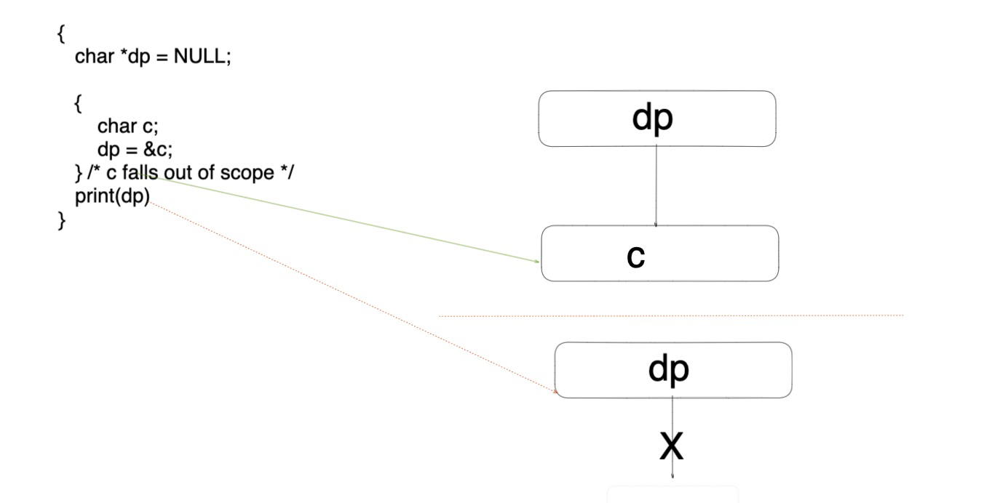
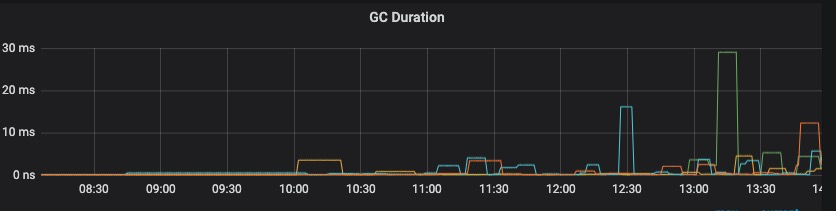
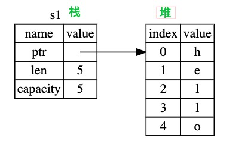
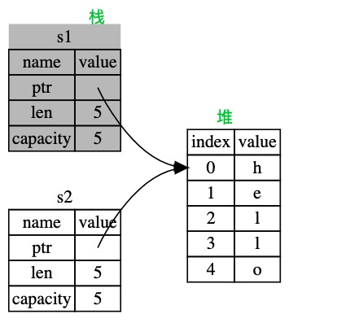
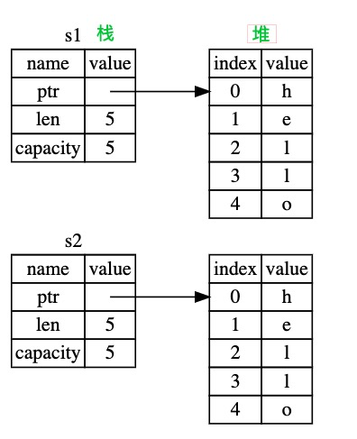
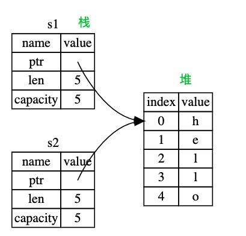
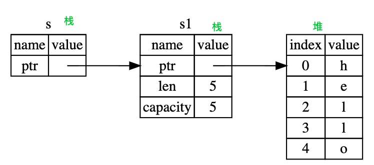

# rust 是怎么做堆内存管理的

最近因为Go的性能在大规模集群上着实堪忧，其中一部分是因为GC（7%～8%）。对于现代语言来说GC已经成了默认选项，如果你用c/c++写过稍微大点项目的话，想必肯定经历过定时任务定时重启（内存泄漏）的局面，如果没见过也一定听说过。

今天我们来谈论下rust是怎么平衡**GC带来的性能损失**和**C/C++难以排查的内存bug**。


## 一、主流语言现状

在rust之前主要分为两个阵营：C/C++系和非C/C++。再抽象一点就是：手动管理内存和自动回收内存。

### 手动管理内存

C语言代表的手动管理内存的方式容易带来两个问题（bug）：

1、 悬挂指针（Dangling pointer）：引用了已经回收的内存



还比如下面的这段代码（Go就不会Dangling pointer，因为专门设计了内存逃逸）：

```c
int *func(void)
{
    int num = 1234;
    /* ... */
    return &num;
}
```

2、 内存泄漏：这是C经常被诟病的，现在已经形成这样的局面

- 程序员：C太不好用了，总是忘记free导致内存泄漏，还找不到在哪
- C语言设计者：？？？你怎么不说你菜呢！
- 程序员：我使用的库也泄漏呀。。。
- 社区热心肠：我们每天业务低峰期重启


### 自动内存管理

以java/go为代表。如果你写java时间长的话肯定经历过在关键时刻给你来个Full GC。Go就不用说了，虽然官网方说P99低于1ms了，那都是有条件的，你要是在线上把GC的指标采集回来你就会发现两个问题：

1、 太频繁了：我看到的时候确实是这么感叹的，高峰期的时候一分钟几十次是有的（不能说我们服务不行哟）

2、 不稳定：20ms+的GC duration经常出现




而且Go的GC参数比较少，目前就两个触发时机：

1、下次内存是上一次GC结束后一倍（可调）的时候触发

2、 距离上一次GC过去2min了，触发一次

<del>美名曰简约。</del>


### 釜底抽薪的rust

我没学习rust之前，觉得不用GC那不就走回C的老路了么。当我学习之后确实被<del>难</del>折服到了。具体说就是**保障一块内存只被一个变量引用，变量死的同时执行下析构函数把内存也干掉**。当看到这段加粗文字的时候，肯定会有如下疑问：

1、 rust是怎么保证的

2、那怎么做到一块内存被两个变量修改呢？


下面我们就来讨论下rust怎么实现的。


## 二、rust是怎么保证的

### 一块堆内存只和一个变量绑定

我们先通过代码看下：

```rust
fn main() {
    let s1 = String::from("hello");
    let s2 = s1;
    println!("{}", s1)
}
```

这段简单的代码会有如下报错：

```shell
error[E0382]: borrow of moved value: `s1`
 --> src/main.rs:4:20
  |
2 |     let s1 = String::from("hello");
  |         -- move occurs because `s1` has type `String`, which does not implement the `Copy` trait
3 |     let _s2 = s1;
  |               -- value moved here
4 |     println!("{}", s1)
  |                    ^^ value borrowed here after move
  |
```

如果你对rust不算了解，那么看到这个报错都会蒙圈：

- ”error[E0382]: borrow of moved value: `s1`“：s1怎么了，什么叫 borrow of moved value
- “does not implement the `Copy` trait”：说s1没实现Copy trait（trait可以理解为方法），什么意思，我要怎么copy
- “value borrowed here after move”： print一下怎么了？

我们一句句来看下

```rust
let s1 = String::from("hello");
```

String和大多数语言一样是存在堆上的，String的底层相当于一个结构体，ptr是指向堆内存的首地址，内存结构如下图：



```rust
let s2 = s1;
```

我们说了一块内存只能有一个所属者，所以这行代码就把上图右边内存所属从s1移动到了s2身上(专业词汇叫**MOVE**)，内存结构如：



```rust
 println!("{}", s1)
```

之后s1就相当于C语言中的悬挂指针了，在编译的时候就会报错。


看到这里你可能有两个疑问：

1、我要是想变量赋值之后，两个变量都能用怎么办呢

2、  你一直在说堆上内存，栈上内存呢，也是一样么？

先来说第二个问题，我们知道所有固定size（编译时能确定多少字节）的变量（可能除数组）都分配在栈上，那我们实验一下呗。

```rust
fn main() {
    let s1 = 32;
    let s2 = s1;
    println!("{}, {}", s1, s2)
}
```

编译一下，竟然没有报错，这是为什么呢？说到这里我们岔开一下回到第一个问题。

既然`s2 = s1`是MOVE，我能不能COPY一份呢（恭喜你，都会抢答了）。我们把先前copy string的代码改为：

```rust
fn main() {
    let s1 = String::from("hello");
    let s2 = s1.clone();
    println!("{}， {}", s1, s2)
}
```

编译之后完美的打印了两个hello，这是为什么呢，我们来看下现在的内存结构：



如果你经常做面试题的话，对**MOVE**和**COPY**就能做如下总结***前者是浅拷贝、后者是深拷贝***。这个回答是没问题的，发offer。

为什么String这类堆上的内存，不实现**COPY**呢？因为堆上的内存可能很大，复制1G的内存消耗比较巨大！


但是你可能还有一个疑问，我写java写习惯了，能不能把内存结构给我变为下面这样的：



你这么问肯定可以呀，我们来讨论下。


### 一块内存只有一个变量能修改

我们将刚才的代码稍作改动：

```rust
fn main() {
    let s1: String = String::from("hello");
    let s: &String = &s1;
    println!("{}， {}", s1, s2)
}
```

这次还把s1和s2的类型给标注出来了。现在内存结构如下：




这样s1和s2都能读这块内存了达到要求了。但是想要s1和s2都能写，那就不行了，同时只能有一个变量写。而且这种情况叫s1把这块内存借给s2，原文叫**Borrowing**，正在进行时用的太恰当了。其实就是把内存地址放在了栈的变量上，放在栈变量上在赋值时候就是COPY了。

**Borrowing**在下面两种情况是允许的：

1、 几个变量都是读

```rust
fn main() {
    let s1= String::from("hello");
    let s2 = &s1;
    let s3 = &s1;
    println!("{}， {}, {}", s1, s2, s3)
}
```


2、 读和写不同时存在

```rust
fn main() {
    let mut s = String::from("hello");
    let r1 = &s; 
    let r3 = &mut s; // 挂掉
    println!("{} and {}", r1, r3);
}
```


## 三、总结

今天我们分析rust的所有权问题，我们能看到rust和传统语言实现路径完全不同，不是在原有基础上修修补补而是另辟蹊径，有点像当初java搞出垃圾回收一样，是具有划时代意义的。但是rust的入门门槛比较高，与其说要和编译器打交道不如说和内存打交道。


今天还有一个问题没有探讨，就是关于如何让两个变量同时修改同一块堆内存，我们下次讨论。