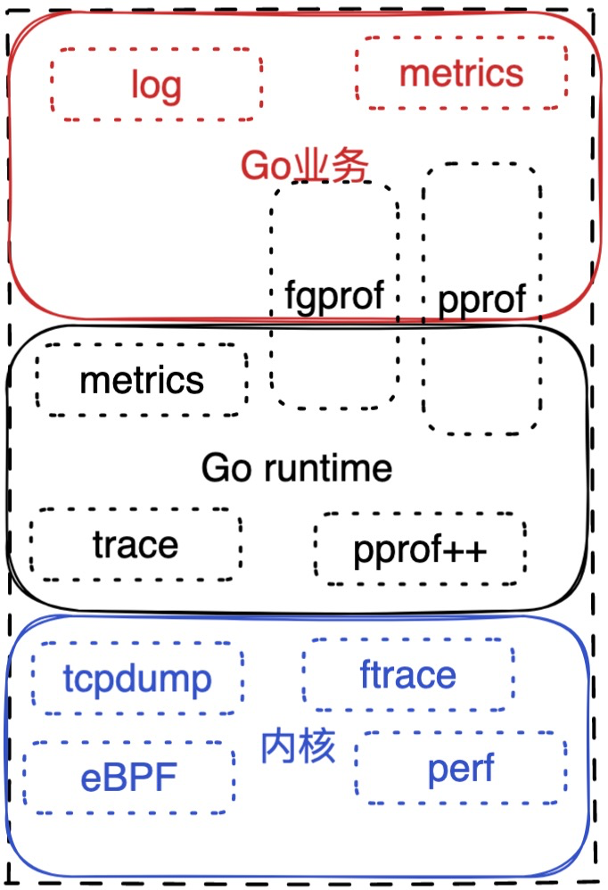

# 监控中的GC延迟是在说什么？

最近大量的时间都在配置监控上面，发现了go_gc_duration_seconds这个指标比较奇怪，说不清楚含义，就细细的了解了一下，并且顺便对Go服务的观测性做了总结，如果你能看到最后一小结，希望对你有帮助。


## go_gc_duration_seconds的含义


Go的prometheus会暴露go_gc_duration_seconds这个Summary指标，内容如下：

```shell
go_gc_duration_seconds{quantile="0"} 7.0477e-05
go_gc_duration_seconds{quantile="0.25"} 7.9669e-05
go_gc_duration_seconds{quantile="0.5"} 8.7761e-05
go_gc_duration_seconds{quantile="0.75"} 0.00010021
go_gc_duration_seconds{quantile="1"} 0.001379607
go_gc_duration_seconds_sum 1.709938142
go_gc_duration_seconds_count 17972
```

1、 有0%的请求小于7.0477e-05s

2、 有25%的请求小于7.9669e-05s

3、 GC总时长是1.709938142s

4、 一共发生了17972次GC

配置出的grafana监控如下(因为100%分位和其他差距比较大我就分两张图了)：


<center>非100%分位</center>


<center>100%分位</center>

你可能疑问， **按理说100分位的应该只增不减的呀，怎么还凹凸不平的呢**。我们就顺着这个问题，来深入了解Go GCStats的实现揭开这个谜题。

我们先来看下如何指标怎么采集上来的 ([go_collector.go#L247](https://github.com/prometheus/client_golang/blob/main/prometheus/go_collector.go#L247))：

```go
func (c *baseGoCollector) Collect(ch chan<- Metric) {
	// ...

	var stats debug.GCStats
	stats.PauseQuantiles = make([]time.Duration, 5)
	debug.ReadGCStats(&stats)

	quantiles := make(map[float64]float64)
	for idx, pq := range stats.PauseQuantiles[1:] {
		quantiles[float64(idx+1)/float64(len(stats.PauseQuantiles)-1)] = pq.Seconds()
	}
	quantiles[0.0] = stats.PauseQuantiles[0].Seconds()
	//...
}


```

奥秘都在`debug.ReadGCStats`中了

```go
func ReadGCStats(stats *GCStats) {

  readGCStats(&stats.Pause)
  n := len(stats.Pause) - 3
  stats.LastGC = time.Unix(0, int64(stats.Pause[n]))
  stats.NumGC = int64(stats.Pause[n+1])
  stats.PauseTotal = stats.Pause[n+2]
  n /= 2 // buffer holds pauses and end times
  stats.Pause = stats.Pause[:n]


  sorted := stats.Pause[n : n+n]
  copy(sorted, stats.Pause)
  sort.Slice(sorted, ...)
  nq := len(stats.PauseQuantiles) - 1
  for i := 0; i < nq; i++ {
    stats.PauseQuantiles[i] = sorted[len(sorted)*i/nq]
  }
  stats.PauseQuantiles[nq] = sorted[len(sorted)-1]
}
```

这里面有两个关键需要去理解：

一、 readGCStats，这个函数的代码在[runtime/mstats.go#L552](https://github.com/golang/go/blob/7c404d59db3591a7c5854b38dc0f05fcb7ac0cff/src/runtime/mstats.go#L552)中，比较容易理解，我就不贴的，做了如下处理：

1、 如果从程序运行起GC的次数超过了256次，那么只取最近的256次，我们称之为n

2、 数组的长度为2*n + 3个

- 前n个是最近n次的GC时间
- 中间n个是最近n次GC的结束时间（暂时用不到）
- 第2*n + 1个是最后一次的GC时间
- 第2*n + 2个是从程序启动之后GC的次数
- 第2*n + 2个是从程序启动之后GC的运行时间总和（纳秒为单位）

看懂了这些规则也就看懂了`debug.ReadGCStats`代码上半部分的含义。算了，为了更加直观一些，我还是把代码贴出来吧：

```go
func readGCStats_m(pauses *[]uint64) {
	p := *pauses

	n := memstats.numgc
	if n > uint32(len(memstats.pause_ns)) {
		n = uint32(len(memstats.pause_ns))
	}

	p = p[:cap(p)]
	for i := uint32(0); i < n; i++ {
    idx := memstats.numgc - 1 - i
		j := idx % uint32(len(memstats.pause_ns))
		p[i] = memstats.pause_ns[j]
		p[n+i] = memstats.pause_end[j]
	}

	p[n+n] = memstats.last_gc_unix
	p[n+n+1] = uint64(memstats.numgc)
	p[n+n+2] = memstats.pause_total_ns
	unlock(&mheap_.lock)
	*pauses = p[:n+n+3]
}
```


二、 计算stats.PauseQuantiles

这就是`debug.ReadGCStats`的下半部分了：

  ```go
sorted := stats.Pause[n : n+n]
copy(sorted, stats.Pause)
sort.Slice(sorted, ...)
nq := len(stats.PauseQuantiles) - 1
for i := 0; i < nq; i++ {
  stats.PauseQuantiles[i] = sorted[len(sorted)*i/nq]
}
stats.PauseQuantiles[nq] = sorted[len(sorted)-1]
  ```

排序之后找百分位，比如我们排序后的GC时间（十个）为*1,2,2,2,3,4,5,6,6,8*，要分为5个，分别为0%、20%、50%、75%、100%。那么：

- 0%：sorted[len(sorted)\*0/nq] -> sorted[10*0/5] -> sorted[0] -> 1
- 50%: sorted[len(sorted)\*2/nq] -> sorted[10*2/5] -> sorted[4] -> 3
- 100%: sorted[len(sorted)-1] -> sorted[9] -> 8


<center>%100分位</center>

所以这个折线图的含义就是**每一次采集出来的是最近256次GC中（如果超过的的话）最大的一次。**


## prometheus的Go SDK最近的变化

如果读者了解Go版本变化的话，就知道在Go1.16的时候提供了[runtime/metrics](https://pkg.go.dev/runtime/metrics),指标拿出来基本就能用了，Go官网的初衷也是比较简单，三方面的收敛：

一、规范收敛：metrics格式；

二、能力收敛：暴露哪些指标不暴露哪些指标；

三、调用收敛：通过哪个包调用（以前混乱分布在debug包和runtime包）。

可以看出Go官网团队不想让memstat/gcstat的被玩坏了（也反映出他们当初设计时候稳糙猛了），这也反映出变成的中一个著名的定理“只要你暴露出来的API用户就会用，不管你想不想暴露”（狗头，竟然忘记这个定理叫啥在哪本书上看见的了，如果有朋友知道辛苦告诉我下）。


如果有兴趣看Go团队和[prometheus/client_golang](https://github.com/prometheus/client_golang)的讨论可以看：[issues#842](https://github.com/prometheus/client_golang/issues/842),在今年的一月份Go团队也提交了PR（[pull#955](https://github.com/prometheus/client_golang/pull/955)）,这也就意味着你用的1.12版本以上的prometheus/client_golang就会使用最新获取metrics的方式，随之而来的就是和Go版本绑定(这一点从项目文件命名上都能看出来了，比如[prometheus/go_collector_go116.go](https://github.com/prometheus/client_golang/blob/v1.12.2/prometheus/go_collector_go116.go))。


## prometheus的Go SDK怎么跑起来的

本小结我会介绍两个点：一、[prometheus/client_golang](https://github.com/prometheus/client_golang)怎么跑起来的；二、如何定义一个自己的metrics。

使用上极其简单：

```go
func main() {
	http.Handle("/metrics", promhttp.Handler())
	log.Fatal(http.ListenAndServe(*addr, nil))
}
```

本来想分析一下代码，结果发现代码确实简约，想看代码的读者可以从这三方面着手：

1、 初始化

SDK默认收集进程和runtime相关信息([prometheus/registry.go#L61](https://github.com/prometheus/client_golang/blob/main/prometheus/registry.go#L61))：

```go
type Registerer interface {
	Register(Collector) error
	MustRegister(...Collector)
	Unregister(Collector) bool
}

var DefaultRegisterer Registerer = NewRegistry()

func init() {
	MustRegister(NewProcessCollector(ProcessCollectorOpts{}))
	MustRegister(NewGoCollector())
}
NewGoCollector -> newBaseGoCollector -> baseGoCollector
```


2、注册指标

```go
type Collector interface {
	Describe(chan<- *Desc)
	Collect(chan<- Metric)
}

func MustRegister(cs ...Collector) {
	DefaultRegisterer.MustRegister(cs...)
}

```

MustRegister中调用Describe方法。

3、 处理请求


```go
func Handler() http.Handler {
	return InstrumentMetricHandler(
		prometheus.DefaultRegisterer, 
    HandlerFor(prometheus.DefaultGatherer, HandlerOpts{}),
	)
}

```

HandlerFor中会调用Collect方法。


## 再谈Go服务的观测性

以前在写[Go程序如何查看一个请求中各个函数的真实占比？之再谈Go程序的分析工具](https://github.com/helios741/myblog/tree/new/learn_go/src/2021/11/fgprof#%E5%86%8D%E8%B0%88go%E7%A8%8B%E5%BA%8F%E7%9A%84%E5%88%86%E6%9E%90%E5%B7%A5%E5%85%B7)中介绍了分析Go性能的工具现状，今天说一下一下Go服务的观测性。

看看我们手头的工具：

1、 pprof适用条件：排查(cpu、mem、block)性能问题，但是不能排查偶发或者业务问题

2、 trace适用条件：检查Go语言本身的bug，一般只在调试测试的时候用

3、 fgprof适用条件：排查io问题，也不能排查偶发问题

.....


这种工具会有很多包括我们今天介绍的runtime metrics都是基于采样的。再想想我们在业务中遇到的是什么问题，大致可以分为两类：

1、资源类：怎么CPU/Mem在那个时间突然高了？

2、 IO类：怎么这个请求失败率突然变高了？

对于资源类，现在业界比较通用的方法是当资源（CPU、mem...）高于某个阈值的时候就开始自动采样，就像蚂蚁开源的[mosn/holmes](https://github.com/mosn/holmes)，实现简单，效果显著。

对于IO类，如果读者排查过**k8s集群中大量ipvs全量更新导致把一个CPU打高，但是整体CPU适用并不高**的经典问题可能会有一些心得体会。当一个接口请求错误率比较高（0.01%变为0.1%）回顾一下排查思路：

1、 通过tcpdump确认问题出现在集群机器上

2、 在内核函数上通过eBPF打点找到哪个函数到哪个函数慢了，发现这些问题都出现在一颗CPU上

3、 perf查看这个CPU的热点函数，发现是软中断比较高

4、 通过ftrace查看哪颗CPU上热点函数的执行时间

5、读相应内核代码

这其实是个特别经典的思路，一点点把问题缩小，业界好多公司开始使用eBPF探索模拟上述过程更高级的监控系统，这一两年我没怎么关注了，不知道搞的咋样了。


到目前为止，一个Go服务可以分为业务、Go runtime以及Linux内核部分，工具分布如下：



现在其实还有一类没有出现过的问题还没解决，如果因为Go runtime导致一个错误率变高应该怎么排查的，换句话我们已经排查完业务和内核没问题，怎么排查runtime呢？

我以前确实遇到了这个问题，因为对p9999要求比较高，所以需要仔细排查，runtime代码都看得懂就不知道是哪里慢的，当时想了两个办法：

1、 改runtime方法打点

2、 ftrace的原理就是通过改汇编代码来做到不用提前埋好点，想过通过monkey patch的方式插进去（[Monkey Patching in Go](https://bou.ke/blog/monkey-patching-in-go/)），改造难度大于方案1。。。

为什么一直没人被这个问题困挠呢？并不是因为这个问题没有，只是大家的容忍度比较高。


## 总结

今天通过go_gc_duration_seconds这个小指标，引出了更大Go服务的观测性，中间穿插了Go指标的变迁，如果你有什么疑问，欢迎一起探讨。