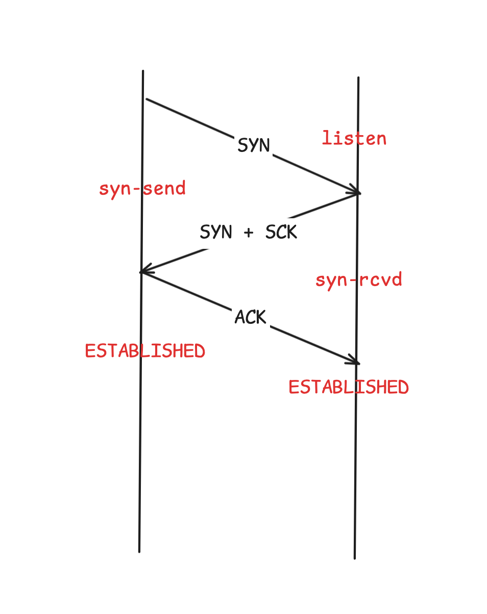
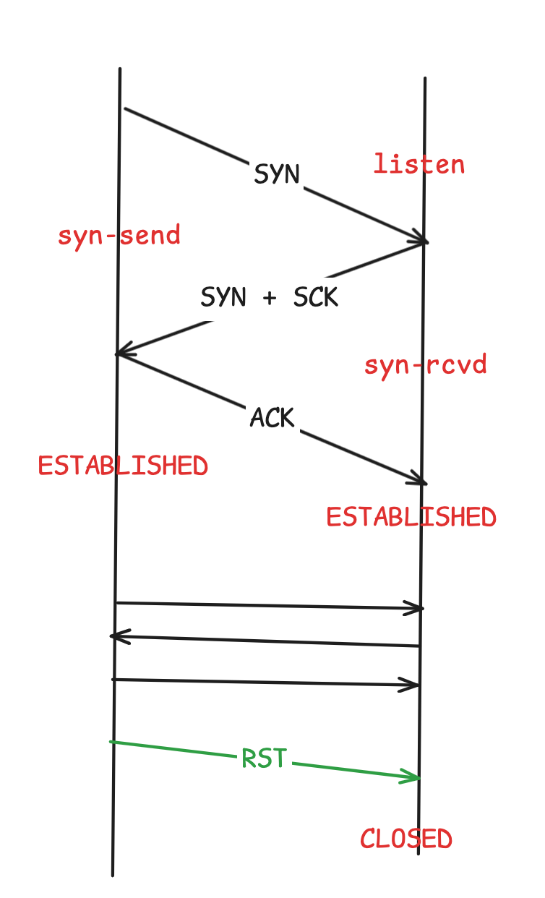

# 针对的TCP的协议的攻击有哪些


最近在做一些安全相关的东西，从另一个维度理解TCP。TCP的建连、可靠性保证在性能方面一直收到诟病，但是由于TCP在这方面做了工作确实太多，以至于给了攻击者很多切入点，不得不在代码中新增很多冗余代码处理各种情况，如果不是用问题的角度去阅读Linux代码，难免会感到困惑。


## 一、TCP 三次握手再理解




还是从老生常谈的TCP三次握手来看，当然这里要补充几个知识点：

- 一个机器能发起连接的个数是收到TCP协议头限制的，是65535个
- 但是一台机器作为接受端，也是收到TCP协议头限制的(`2^16` x `2^32`) 是个很大数值

除此之外，TCP还做了很多屎上雕花的内容，比如，分别对上述的状态的数量进行了限制：

| 内核参数                            | 含义                             |
| ----------------------------------- | -------------------------------- |
| net.ipv4.tcp_max_syn_backlog        | 限制了半连接连接的数量           |
| int listen(int sockfd, int backlog) | 限制了***某个进程***半连接的数量 |
| net.core.somaxconn                  | 限制了ESTABLISHED连接的数量      |

这三者之间的爱恨情仇，这里不做过多解释，如果有兴趣可以看 [What is the difference between tcp_max_syn_backlog and somaxconn?](https://stackoverflow.com/questions/62641621/what-is-the-difference-between-tcp-max-syn-backlog-and-somaxconn)。 


## 一、半连接攻击(SYN Flood)


 客户端发送完前两次请求了，不发送第三次ACK了，这是时候服务端的重试次数收到`net.ipv4.tcp_synack_retries`影响，可能会到分钟级，如果攻击者把半连接队列打满，那么新连接就进不来了。当然内核对这种来源相同的ip也会有惩罚机制。

如果大家有兴趣，可以通过scapy在20行之内搞定 或者通过hping3 一行就能搞定。


还有一种考古的**LAND攻击** 原理是构造特殊的SYN包，源ip和目的ip都是自己，发多了把自身打挂了，比如：

```pythoon
target_ip = "10.117.136.103"
target_port = 8077
ip = IP(src=target_ip, dst=target_ip)
tcp = TCP(sport=target_port, dport=target_port, flags="S", seq=1)
send(ip/tcp)
```


## 二、全连接攻击

上面的SYN Flood 大多数的防火墙/LB都能拦截一部分，但是全连接的攻击就拦截不到了。原理是构造不同的ip和目标主机建连，直到突破net.core.somaxconn上线。其实只需要一条命令就可以搞定：

`hping3 -c 10000 -d 120 -S -w 64 -p 80 --flood --rand-source 172.10.0.12`


## 三、断连攻击

### 3.1 RST报文

除了正常的FIN结束报文，当一方出现问题的时候比如机器崩溃，会发送RST报文告知对方断开连接，另一段收到时候校验合法就立马断开连接，为什么不发送ACK了呢？因为发送了ACK对方也收不到，流程如下图：




复杂流程之下的隐患就来了，如果攻击者随随便便就发送RST呢？那岂不是对服务稳定性造成了影响。所以这就牵涉出另一个问题：***发送了RST一定会断开连接么？***

答案是否定的。因为内核会校验RST报文的seq是不是在待接收窗口内，如果不在就会认为是错误请求丢弃掉。所以这就大大增加了攻击的难度。现在主要针对一些长连接，并且会有一段时间不传输数据的情况下


## 3.2 TIME_WAIT过多

一般服务端不会主动断开连接，除非像http keep-alive哪种，但是即使这样也不会占用过多的资源。如果是机器作为连接的客户端那就麻烦了，会长时间时间（处在time_wait支持2msl）占用端口，如果量大会导致端口杯分配光了。

这种攻击很少见，因为需要引诱服务端作为client去发送请求。更多TCP挥手的内容请看[进阶TCP的四次挥手](https://mp.weixin.qq.com/s/2dFgHN146cBJttrwcNY95A)


### 总结

本次先介绍了基于TCP攻击的常见手段，我们能看出负责的TCP协议给攻击者很大的空间，TCP协议必须加过多的判断去解决这些问题，就存在着协议实现者和攻击者之间的博弈。如果对于简单的协议，比如UDP 攻击者的切入点就更少了。