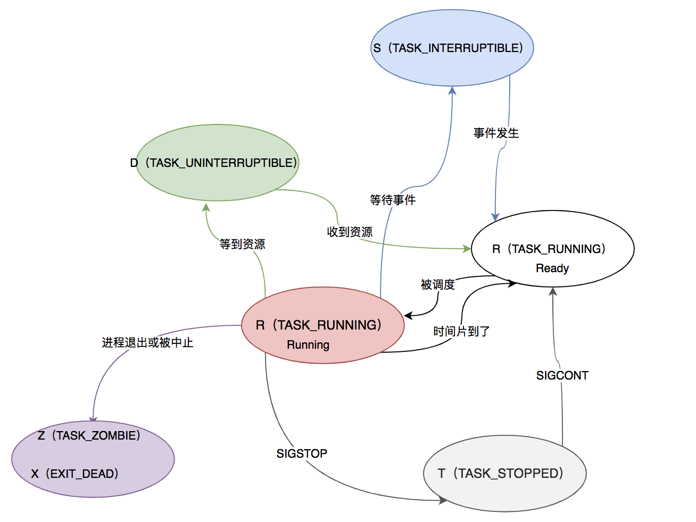

### 学习内容

#### 1. 什么是平均负载

单位时间内，系统处于可运行状态和不可中断状态的平均进程数。即R进程 + D进程，也叫做平均活跃进程数。

#### 2. 平均负载多少比较合理

文章中，老师推荐的是70%，但是没有实际经验，根据老师的经验是超过70%的时候，就算负载过高了，会导致响应变慢，应该排查。

最好的方式不是根据上述的经验值，应该把平均负载监控起来，然后根据负载的变化趋势（比如根据历史情况，double会导致响应变慢）进行报警。

#### 3. 平均负载和CPU使用用率的关系

对于CPU密集型任务，几乎相等
```shell

$ stress --cpu 1 --timeout 600
```

```shell

# -d 参数表示高亮显示变化的区域
$ watch -d uptime
...,  load average: 1.00, 0.75, 0.39
```

```shell

# -P ALL 表示监控所有CPU，后面数字5表示间隔5秒后输出一组数据
$ mpstat -P ALL 5
Linux 4.15.0 (ubuntu) 09/22/18 _x86_64_ (2 CPU)
13:30:06     CPU    %usr   %nice    %sys %iowait    %irq   %soft  %steal  %guest  %gnice   %idle
13:30:11     all   50.05    0.00    0.00    0.00    0.00    0.00    0.00    0.00    0.00   49.95
13:30:11       0    0.00    0.00    0.00    0.00    0.00    0.00    0.00    0.00    0.00  100.00
13:30:11       1  100.00    0.00    0.00    0.00    0.00    0.00    0.00    0.00    0.00    0.00
```

```shell

# 间隔5秒后输出一组数据
$ pidstat -u 5 1
13:37:07      UID       PID    %usr %system  %guest   %wait    %CPU   CPU  Command
13:37:12        0      2962  100.00    0.00    0.00    0.00  100.00     1  stress
```


io密集型任务，几乎不等

```shell

$ stress -i 1 --timeout 600
```

```shell

$ watch -d uptime
...,  load average: 1.06, 0.58, 0.37
```

```shell

# 显示所有CPU的指标，并在间隔5秒输出一组数据
$ mpstat -P ALL 5 1
Linux 4.15.0 (ubuntu)     09/22/18     _x86_64_    (2 CPU)
13:41:28     CPU    %usr   %nice    %sys %iowait    %irq   %soft  %steal  %guest  %gnice   %idle
13:41:33     all    0.21    0.00   12.07   32.67    0.00    0.21    0.00    0.00    0.00   54.84
13:41:33       0    0.43    0.00   23.87   67.53    0.00    0.43    0.00    0.00    0.00    7.74
13:41:33       1    0.00    0.00    0.81    0.20    0.00    0.00    0.00    0.00    0.00   98.99
```

```shell

# 间隔5秒后输出一组数据，-u表示CPU指标
$ pidstat -u 5 1
Linux 4.15.0 (ubuntu)     09/22/18     _x86_64_    (2 CPU)
13:42:08      UID       PID    %usr %system  %guest   %wait    %CPU   CPU  Command
13:42:13        0       104    0.00    3.39    0.00    0.00    3.39     1  kworker/1:1H
13:42:13        0       109    0.00    0.40    0.00    0.00    0.40     0  kworker/0:1H
13:42:13        0      2997    2.00   35.53    0.00    3.99   37.52     1  stress
13:42:13        0      3057    0.00    0.40    0.00    0.00    0.40     0  pidstat
```
待调度的进程太多，会导致CPU使用率增加

```shell

$ stress -c 8 --timeout 600
```

```shell

$ uptime
...,  load average: 7.97, 5.93, 3.02
```

```shell

# 间隔5秒后输出一组数据
$ pidstat -u 5 1
14:23:25      UID       PID    %usr %system  %guest   %wait    %CPU   CPU  Command
14:23:30        0      3190   25.00    0.00    0.00   74.80   25.00     0  stress
14:23:30        0      3191   25.00    0.00    0.00   75.20   25.00     0  stress
14:23:30        0      3192   25.00    0.00    0.00   74.80   25.00     1  stress
14:23:30        0      3193   25.00    0.00    0.00   75.00   25.00     1  stress
14:23:30        0      3194   24.80    0.00    0.00   74.60   24.80     0  stress
14:23:30        0      3195   24.80    0.00    0.00   75.00   24.80     0  stress
14:23:30        0      3196   24.80    0.00    0.00   74.60   24.80     1  stress
14:23:30        0      3197   24.80    0.00    0.00   74.80   24.80     1  stress
14:23:30        0      3200    0.00    0.20    0.00    0.20    0.20     0  pidstat
```
#### 4. 一些工具或者命令

- stresss是一个Linux系统压力测试工具，可以模拟平均负载升高

- sysstat包含了常用的Linux性能工具，用来监控和分析系统性能。
    + mpstat：多核CPU性能分析工具，用来实时查看每个CPU的性能指标，以及CPU的平均指标
    + pidstat：进程性能分析工具，用来实时查看进程的CPU、内存、I/O以及上下文切换等性能指标


查看CPU数量
```shell

# 关于grep和wc的用法请查询它们的手册或者网络搜索
$ grep 'model name' /proc/cpuinfo | wc -l
2
```

pidstat不显示%wait因为sysstat版本太低，要更新为11.5.5以上。centos更新sysstat
```shell
wget https://rpmfind.net/linux/fedora/linux/releases/30/Everything/x86_64/os/Packages/s/sysstat-11.7.3-3.fc30.x86_64.rpm
rpm -Uvh sysstat-11.7.3-3.fc30.x86_64.rpm
```


iowait无法升高的问题，是因为案例中stress使用的是 sync() 系统调用，它的作用是刷新缓冲区内存到磁盘中。对于新安装的虚拟机，缓冲区可能比较小，无法产生大的IO压力，这样大部分就都是系统调用的消耗了。所以，你会看到只有系统CPU使用率升高。解决方法是使用stress的下一代stress-ng，它支持更丰富的选项，比如 stress-ng -i 1 --hdd 1 --timeout 600（--hdd表示读写临时文件）

```shell
yum install -y stress-ng
```


### 延伸内容

#### 1. 为什么要有D进程

内核的中有一些处理流程（一般是和硬件打交道，比如说i/o）不能被打断，也就是说不能相应异步信号。D（TASK_UNINTERRUPTIBLE）的作用就是为了保护这一类进程不被终端。


#### 2. 进程的几种状态

- R（TASK_RUNNING）：等待运行或者正在运行
- S（TASK_INTERRUPTIBLE）：可中断的睡眠状态
- D（TASK_UNINTERRUPTIBLE）：不可中断的睡眠状态
- Z（TASK_DEAD -> TASK_ZOMBIE）： 僵尸进程
    + 进程退出的时候处于TASK_DEAD状态，内核会告诉它的父进程来回收资源（SIGCHLD信号），如果父进程因为某些原因不能回收就变味僵尸进程
- X（TASK_DEAD - EXIT_DEAD）： 正常退出
- T（TASK_STOPPED/TASK_TRACED）：进程处于被挂起的状态
    + 向程序发送SIGSTOP进入TASK_STOPPED，再发送SIGCONT恢复运行（TASK_RUNNING）状态
    + TASK_TRACED不能被SIGCONT信号唤起，得等到ptrace系统调用执行PTRACE_CONT、PTRACE_DETACH等操作或者调试进程推出才能复运行（TASK_RUNNING）状态

总结了个进程转换图：


